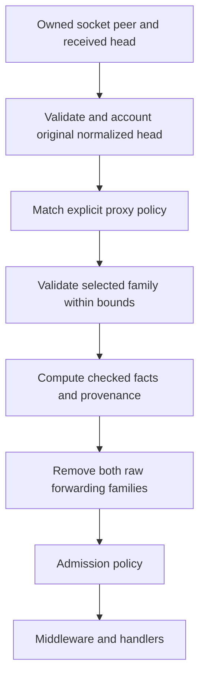

# Axum diagnostics and trusted proxies

The managed native host exposes checked ingress metadata, safe request records, and work
snapshots. Incoming proxy trust is off by default. A forwarding header never establishes
trust by itself.

These APIs belong to `edgezero_adapter_axum`, with the `axum` feature enabled. They apply to
`run_app`, `run_production_app`, the explicit-options runners, and `AxumDevServer`. Other
adapters retain their existing behavior.

## Startup settings

| Setting                                       | Default             | Accepted values                                                        |
| --------------------------------------------- | ------------------- | ---------------------------------------------------------------------- |
| `EDGEZERO__ADAPTER__TRUSTED_PROXY_CIDRS`      | No trusted networks | Comma-separated literal IPv4/IPv6 addresses or CIDRs                   |
| `EDGEZERO__ADAPTER__FORWARDING_HEADER_FAMILY` | No selected family  | `forwarded` or `x-forwarded`, required when the trust list is nonempty |
| `EDGEZERO__LOGGING__REQUEST_RECORDS`          | `true`              | Exactly `true` or `false`                                              |

For example, trust one deployment-owned proxy address and use RFC Forwarded:

```bash
EDGEZERO__ADAPTER__TRUSTED_PROXY_CIDRS=10.20.0.8/32 \
EDGEZERO__ADAPTER__FORWARDING_HEADER_FAMILY=forwarded \
EDGEZERO__LOGGING__REQUEST_RECORDS=true \
./my-app-adapter-axum
```

An unset trust list, an empty string, or a string containing only spaces/tabs means no trust.
The network parser trims spaces/tabs around entries. It rejects empty entries inside a list,
other control characters, invalid literals, DNS names, and tokens such as `private`, `all`, or
provider names. Family names are lowercase, with surrounding spaces/tabs allowed. Unknown
supplied families fail even with an empty trust list. A valid family alone enables nothing.
Request-record booleans accept no case changes or whitespace.

Invalid supplied values, including non-Unicode environment values for these settings, fail
startup before readiness. They do not silently revert to defaults. Both development and
production validate these three settings strictly. Production also validates its other hosting
settings; this does not change unrelated development-setting fallback behavior.

Network entries are truncated to their prefix and deduplicated. IPv4-mapped IPv6 peers and
assertions match their IPv4 equivalents. Mapped networks within `::ffff:0:0/96` become equivalent
IPv4 networks. `/0`, unions covering an entire address family, and IPv6 prefixes that would
trust the entire mapped IPv4 range are rejected. Private, loopback, and container networks
receive no implicit trust. EdgeZero does not discover provider ranges or refresh them.

The trust configuration has a 16,384-byte text budget, including separators, and at most 256
supplied entries. Duplicates count before normalization. Explicit policy iterators have the
same bounds and never silently truncate.

### Explicit hosting

```rust
use edgezero_adapter_axum::dev_server::AxumRunOptions;
use edgezero_adapter_axum::diagnostics::NativeDiagnosticsHandle;
use edgezero_adapter_axum::proxy::{ForwardingHeaderFamily, TrustedProxyPolicy};

let diagnostics = NativeDiagnosticsHandle::new();
let policy = TrustedProxyPolicy::new(
    ForwardingHeaderFamily::Forwarded,
    ["10.20.0.8/32"],
)?;
let options = AxumRunOptions::new("127.0.0.1:8787".parse()?)?
    .with_trusted_proxy_policy(policy)
    .with_diagnostics(diagnostics.clone())
    .with_request_records(false);
```

Pass these options and a caller-owned stop future to
`dev_server::run_app_with_options::<App, _>`. Use
`run_app_with_options_and_initializer` when startup needs application checks. The explicit
runners install no process-wide signal handlers. The corresponding `AxumDevServer` builders
are `with_trusted_proxy_policy`, `with_diagnostics`, and `with_request_records`.

Explicit options/builders do not merge ambient proxy or request-record settings. Use
`AxumRunOptions::from_env()` to capture environment-driven settings deliberately, or
`from_vars` for supplied string pairs. Each run captures its settings once.
`TrustedProxyPolicy::no_trust()` is the explicit no-trust policy.

## What makes a forwarding assertion trustworthy

Protect the proxy-to-application network first. Only deployment-owned proxies should be able
to connect from addresses in the allowlist. A shared private subnet or loopback address is not
proof that every process using it is trustworthy. Trust is neither user authentication nor
permission to use any asserted host as an outbound destination.

The service matches the socket-owned peer, not `Forwarded by=`, a header, URI, or
caller-supplied `ConnectInfo`. Without a matching peer, it does not parse forwarding assertions.
It uses direct facts instead.



Select exactly one family. `forwarded` reads ordered RFC 7239 elements, including repeated
field lines and quoted IPv6 nodes. `x-forwarded` reads an ordered X-Forwarded-For chain and
singleton X-Forwarded-Host and X-Forwarded-Proto values. Repeated or comma-listed host/proto
values are ambiguous and invalidate that family. The unselected family never fills a gap.

All recognized assertions are validated before choosing a client boundary, including entries
that the eventual trust walk will ignore. The service walks predecessors right to left while
the current hop is trusted. The first untrusted numeric predecessor is the effective client
boundary. It never selects the leftmost value unconditionally or skips an unknown hop.

| `ForwardingResult` | Meaning                                                                                                                             |
| ------------------ | ----------------------------------------------------------------------------------------------------------------------------------- |
| `Absent`           | No usable selected assertions                                                                                                       |
| `UntrustedPeer`    | Forwarding fields are present but the direct peer cannot supply trusted assertions                                                  |
| `Accepted`         | Client, host, and scheme assertions were accepted                                                                                   |
| `Partial`          | Some fields were accepted; missing fields use direct facts                                                                          |
| `UnresolvedChain`  | A valid chain has a missing/unknown/obfuscated predecessor or exhausts only trusted addresses; client falls back to the direct peer |
| `Malformed`        | Invalid syntax, recognized values, ambiguity, or bounds invalidate the whole selected assertion                                     |

An unresolved client chain can still supply valid final-proxy host and scheme assertions.
Malformed client text cannot. With malformed optional forwarding metadata, an otherwise valid
request continues using direct facts for every selected field. Existing HTTP head/framing
violations still follow their normal rejection or abort path.

The selected assertion has a 16,384-byte budget, counting conceptual separators between
repeated field values, and at most 64 chain/list slots. Forwarded allows at most 16 parameter
slots per element. Empty slots count against bounds. RFC Forwarded tolerates empty list
members and empty semicolon slots. X-Forwarded-For does not: a present-empty value or empty
member invalidates the complete selected family, including otherwise-valid host/proto.
Absent X-Forwarded-For still permits individual host/proto acceptance.

These bounds cover additional forwarding parsing and retained metadata. They do not cap
Hyper's initial receive allocation, total process memory, or concurrent work. The original
normalized head is validated and counted before stripping, so removed headers cannot evade
head limits. That accounting is normalized head size, not raw wire bytes.

### Host and scheme belong to the final proxy

For Forwarded, only the final, rightmost element can supply host/proto. For X-Forwarded-*, only
the singleton host/proto fields can supply them. Earlier host/proto values and the client-address
chain cannot establish the public origin.

The final trusted ingress must overwrite these fields with values it verified. If another proxy
terminated public TLS, verify that upstream assertion or enforce a known HTTPS-only public
route. The final hop's own connection scheme is not necessarily the visitor's scheme.

Hosts must be valid nonempty authorities with an optional numeric port, without userinfo,
whitespace, path, query, or fragment. Schemes normalize only `http` and `https`. There is no DNS
or IDNA lookup. Missing fields fall back independently. Direct host comes from the
HTTP-authoritative request head; unavailable authority stays unavailable. The native direct
transport scheme is HTTP, even when an absolute request URI says HTTPS.

## Nginx terminating public TLS

This example replaces the chain for a single public ingress. Put the `map` in the existing
Nginx `http` block and add the server alongside your TLS certificate configuration. The map
quotes and brackets IPv6 addresses for Forwarded; IPv4 remains unquoted.

```nginx
map $remote_addr $edgezero_forwarded_for {
    default $remote_addr;
    ~: '"[$remote_addr]"';
}

server {
    listen 443 ssl;
    listen [::]:443 ssl;
    server_name app.example.com;
    # Configure ssl_certificate and ssl_certificate_key here.

    location / {
        proxy_pass http://127.0.0.1:8787;
        proxy_set_header Host app.example.com;
        proxy_set_header Forwarded "for=$edgezero_forwarded_for;host=app.example.com;proto=https";
        proxy_set_header X-Forwarded-For "";
        proxy_set_header X-Forwarded-Host "";
        proxy_set_header X-Forwarded-Proto "";
    }
}
```

Configure EdgeZero with `TRUSTED_PROXY_CIDRS=127.0.0.1/32` and
`FORWARDING_HEADER_FAMILY=forwarded`, using the full environment prefixes above. Bind its
listener to loopback and keep untrusted local processes away from this trusted connection.
If Nginx uses IPv6 for the backend hop, configure that actual peer instead.

The snippet assumes `$remote_addr` is the actual incoming peer, with no header-driven real-IP
rewrite. The HTTPS-only server establishes `proto=https`. It supplies a fixed public host,
not `$http_host`, and replaces visitor-supplied Forwarded values rather than appending them.
Configure your default virtual host to reject unexpected public hosts and handle HTTP
redirects separately. Test both IPv4 and IPv6 visitors in the deployed configuration.
See Nginx's [map](https://nginx.org/en/docs/http/ngx_http_map_module.html) and
[proxy header](https://nginx.org/en/docs/http/ngx_http_proxy_module.html#proxy_set_header)
documentation for directive scope and inheritance.

## Cloudflare plus a load balancer

For `visitor → Cloudflare → load balancer → EdgeZero`, configure the final load balancer to
append its actual incoming Cloudflare peer to the verified predecessor chain. It must replace
X-Forwarded-Host with the allowed public authority and X-Forwarded-Proto with the verified
visitor scheme. Do not merely pass through a visitor-controlled host/proto field.

For illustration, suppose the final peer is `10.20.0.8` and the Cloudflare peer is
`198.51.100.10`. These are example addresses, not provider ranges:

```http
X-Forwarded-For: 203.0.113.7, 198.51.100.10
X-Forwarded-Host: app.example.com
X-Forwarded-Proto: https
```

Select `x-forwarded` and explicitly trust the actual load-balancer addresses and relevant
Cloudflare ranges for your deployment. The walk can then stop at `203.0.113.7`. If only the
load balancer is trusted, it stops at the Cloudflare address. If every represented address is
trusted, it falls back to the direct peer as unresolved.

Restrict origin access to the intended Cloudflare producers, including verification appropriate
to your zone and route. Restrict EdgeZero access to the final load balancer. Provider defaults,
address membership alone, or an HTTPS load-balancer hop do not prove correct visitor metadata.
Maintain the allowlist and inspect your deployed header mode. EdgeZero has no built-in
Cloudflare/AWS trust policy and does not consume `CF-Connecting-IP` automatically.
Cloudflare's [header documentation](https://developers.cloudflare.com/fundamentals/reference/http-request-headers/)
explains how Workers, transforms, and Pseudo IPv4 can change assertions.

### A gateway can replace the chain

If the load balancer cannot produce verified singleton host/proto fields, place a sanitizing
gateway between it and EdgeZero. The gateway must validate its upstream producer and chain,
reject or discard unverified fields, and replace the selected family entirely. For a verified
visitor address, it can emit:

```http
Forwarded: for=203.0.113.7;host=app.example.com;proto=https
```

Trust only that gateway's actual outgoing peer and select `forwarded`. Emit HTTPS only after
verifying the public TLS assertion or enforcing the HTTPS-only public route. If the gateway
cannot establish the client boundary, `for=unknown` is honest; EdgeZero then uses direct client
fallback while retaining valid host/proto. Renaming untouched client input to a new header
does not verify it.

## Migrate applications from raw headers

Before admission, the managed host removes Forwarded and every case-insensitive
X-Forwarded-* header, including accepted fields and extensions. It overwrites incoming checked
metadata extensions with its own results. Host, URI, and
`context::AxumRequestContext::remote_addr` remain unchanged; `remote_addr` is always the direct
peer, not the effective client.

At admission, read `IngressHead::extension::<NativeIngressMetadata>()`. In middleware or a
handler, read the same facts from the request context:

```rust
use edgezero_adapter_axum::diagnostics::NativeIngressMetadata;

if let Some(metadata) = ctx.extensions().get::<NativeIngressMetadata>() {
    let authority = metadata.effective_host().authority();
    let scheme = metadata.effective_scheme().as_str();
    let client_boundary = metadata.effective_client();
    let source = metadata.host_source();
    // Apply application host authorization before using the public origin.
}
```

`request_id`, `direct_peer`, `client_source`, `scheme_source`, `forwarding_result`, and
`received_normalized_head` are also read-only accessors. Per-field sources use
`edgezero_core::ingress::CheckedHostSource`: `Direct`, `TrustedForwarded`,
`TrustedXForwarded`, or `Unavailable`. Read each source independently from the aggregate
forwarding result. Metadata describes original ingress, not later application mutations.

`edgezero_core::ForwardedHost` now reads `CheckedEffectiveHost` first on the managed native
path, including accepted RFC Forwarded host values. Checked-unavailable uses its existing
`localhost` fallback without consulting raw forwarding fields. Prefer the metadata accessor
when you must distinguish absence from that convenience fallback. Without checked metadata,
other adapters and legacy conversions retain the extractor's old behavior.

`request::into_core_request` is a low-level bypass. It does not perform managed admission or
socket-owned proxy checking, and raw `ForwardedHost` behavior can remain there. Supplying
ConnectInfo or setting an environment variable does not turn that converter into a trusted
ingress. Use managed hosting for this policy. The converter still attaches the native JSON
buffering policy, so its framework-generated JSON parse errors also use fixed text; the bypass
is for managed admission and proxy checking. Do not recreate removed headers for automatic
outbound propagation; outbound assertions need their own explicit authorization decision.

## Records and logger ownership

Default facade records use target `edgezero::native`. `request_terminal` describes begun
egress attempts; `request_ingress` describes no-response abort, draining, or abandonment.
`lifecycle` describes runner transitions and fixed failure categories.

Request records contain a generated ID, known method or `other`, registered route template or
`unknown`, optional selected status and total duration, typed outcome/failure/forwarding
categories, and optional egress bytes/body/fallback accounting. Default framework request
records do not contain addresses, hosts, raw paths/queries, headers, payloads, config/secret values,
origin URLs, or source error strings. Route templates are application-owned names; do not
put secrets in them. Default output escapes route text to one line.

Severity follows typed outcomes, not status alone. Ordinary completion, framework route misses,
and expected draining use INFO. Refusal, propagated errors, malformed forwarding, and
failed/abandoned attempts use WARN. Startup/runtime faults and unusable clock/identity state
use ERROR. An application-selected 503 is not automatically a framework failure.

`Hooks::owns_logging()` controls installation only. Set `owns_logging = true` in the `app!`
declaration and install your logger once before entering the runner. For example, in your
Axum entrypoint with your own logger dependency:

```rust
use edgezero_adapter_axum::dev_server::run_production_app;
use my_app_core::App;

fn main() -> anyhow::Result<()> {
    // App declares owns_logging = true.
    simple_logger::SimpleLogger::new()
        .with_level(log::LevelFilter::Info)
        .init()?;
    run_production_app::<App>()
}
```

Keep the `edgezero::native` target enabled in your logger's filters when you want these records.
No competing logger/subscriber is installed when the application owns logging.

`with_request_records(false)`, or `EDGEZERO__LOGGING__REQUEST_RECORDS=false` on an
environment-driven runner, suppresses default request-terminal and request-ingress logs only.
Native and application observers, lifecycle events, counts, and snapshots remain active.

### Request identity

`RequestId` displays 64 hexadecimal characters derived from a process nonce, hosting sequence,
and request sequence. IDs do not repeat within the process; separation between processes is
entropy-based, not a mathematical global uniqueness guarantee. Entropy failure prevents
startup; sequence exhaustion never wraps or reuses an ID.

Incoming IDs are not adopted. There is no automatic response ID header, tracing-header
propagation, or authentication meaning. Applications can expose an ID deliberately.
Changing the public metadata extension cannot change the framework's private correlation ID.
Never use request IDs as metric labels.

## Snapshots and optional metrics

Retain a clone of the handle passed to `with_diagnostics` and sample it from application-owned
management code:

```rust
let snapshot = diagnostics.snapshot();
let active_requests = snapshot.active_requests;
let active_connections = snapshot.active_connections;
let idle_connections = snapshot.idle_connections;
```

Active requests include managed admission, body read, handlers, and egress until completion or
abandonment releases the guard. Active connections count owned connection tasks, including
idle keep-alive tasks; idle connections are their idle subset. Detached application work,
kernel buffers, and external services are not counted.

A snapshot coherently reads the three counters at one moment. It is not atomic with lifecycle
phase or subsequent work. A request used to query counts counts itself while active, and its
connection also contributes. Sample externally or account for the query before asserting zero.
Accounting releases before native logger/observer delivery.

Each runner creates its own handle by default. Explicitly sharing one handle aggregates its
counters across runners; clones of an observer-equipped handle also receive their records.
Each runner still has its own identity namespace and lifecycle. Attach the observer before
cloning the handle for runners: `with_request_observer` configures the returned handle, not
previous clones.

Implement `NativeRequestObserver` for application metrics. This small example keeps fixed
counters and cumulative duration without per-request labels:

```rust
use std::sync::{Arc, Mutex};
use std::time::Duration;
use edgezero_adapter_axum::diagnostics::{
    NativeDiagnosticsHandle, NativeRequestObserver, NativeRequestRecord,
};

#[derive(Default)]
struct Totals {
    observed: u64,
    timed: u64,
    duration: Duration,
}

struct Metrics(Arc<Mutex<Totals>>);

impl NativeRequestObserver for Metrics {
    fn observe(&self, record: &NativeRequestRecord) {
        if let Ok(mut totals) = self.0.lock() {
            totals.observed = totals.observed.saturating_add(1);
            if let Some(duration) = record.duration {
                totals.timed = totals.timed.saturating_add(1);
                totals.duration = totals.duration.saturating_add(duration);
            }
        }
    }
}

let totals = Arc::new(Mutex::new(Totals::default()));
let diagnostics = NativeDiagnosticsHandle::new()
    .with_request_observer(Metrics(Arc::clone(&totals)));
```

Use your metrics library for histograms and bounded method, registered-route, status-class, or
outcome labels. Handle missing status/duration and future enum variants. Never label metrics
with IDs, addresses, raw URLs, payloads, or secrets. The native observer adds no exporter,
queue, metrics server, or public diagnostics endpoint and does not replace application egress
observers/completions. Do not capture an observer-bearing handle in its own observer and
create an ownership cycle.

## Timing, failures, and privacy limits

Native total duration runs from the parsed service boundary to the existing authoritative
terminal observation on the application monotonic clock. It includes pre-egress work but
excludes subsequent completion-callback and logger delay. `ResponseEgressReport::elapsed`
remains egress-only. A backwards clock produces absent duration and a safe clock-fault
category, not a wall-clock substitute. Optional application timing collectors do not replace
this clock or completion owner.

Selected status is not proof that headers reached the wire or that the client received them.
A selected 200 may end with `SourceError`, `DeadlineExceeded`, `ClientDisconnected`, or
`TransportError`. A precommit fallback can select 500/504; a post-commit failure does not send
a second error response. `bytes_written` counts egress-accounted bytes, not delivered TCP
bytes. No-response paths have no invented status or egress report.

On the managed native path, default framework routing 404/405 errors use fixed public text.
Custom renderers retain the original routing errors. Native-managed JSON deserialization
errors return HTTP 400 with the fixed message `invalid JSON payload`, without serde's value,
line, or type detail. Custom renderers also receive this fixed native-generated JSON error;
the serde detail is already discarded. Legacy/unmanaged JSON errors retain their existing
detail. Application-authored `EdgeError` messages and responses are not globally sanitized,
and custom renderers remain responsible for their own output. JSON size overflow still uses
the selected native limit and HTTP 413; it is not a deserialization failure.

Loggers and observers run synchronously. They can block body progress or shutdown, so keep
them short. Unwind-capable targets isolate diagnostic sink panics independently and release
native accounting, but panic-abort, SIGKILL, and process failure have no completion or log-flush
promise. There is no retry, durable delivery guarantee, or added shutdown flush budget.

Deployment acceptance remains downstream. Parser tests and local socket/TLS fixtures do not
prove final-image behavior, proxy configuration, client receipt, signal delivery, or bounded
sink latency. Recheck the accepted prerequisite stack and test the actual image and ingress
before relying on these deployment claims. Packaging and final-image acceptance are separate
from this guide's API contract.
