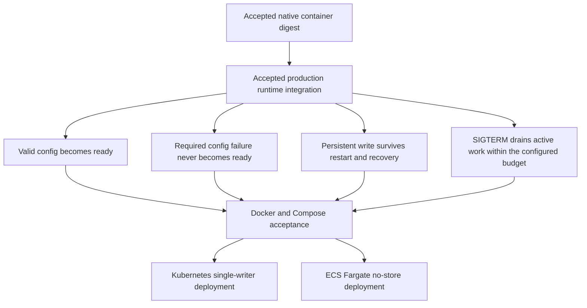

# Deploying Axum containers

Start with a tested, policy-accepted digest from
[the application-owned publisher](./publishing-axum-containers.md). Pin the
multi-platform index for scheduler-selected architecture, or the exact native
child for a known host. Do not rebuild on the deployment host.

The examples here prepare Docker and Compose operations. They do not claim
production readiness, persistent recovery or graceful SIGTERM drain. The current
generated entrypoint is the development `run_app`; `/` is a packaging response,
not readiness. Production runtime work must be accepted before the remaining
[#400](https://github.com/stackpop/edgezero/issues/400) deployment checks.

## No-store Docker and Compose

Use a no-store application first. On a host matching an accepted native variant:

```sh
export AXUM_IMAGE='ghcr.io/OWNER/APP@sha256:ACCEPTED_DIGEST'
docker pull "$AXUM_IMAGE"
docker run --rm --read-only --cap-drop=ALL \
  --security-opt=no-new-privileges:true \
  -e EDGEZERO__ADAPTER__HOST=0.0.0.0 -e EDGEZERO__ADAPTER__PORT=8787 \
  -p 127.0.0.1:8787:8787 "$AXUM_IMAGE"
```

The image runs as UID/GID 10001:10001. The bind address inside the container must
be externally reachable; publishing a port does not fix a localhost-only bind.
The Docker publication above is localhost-only. For external traffic, use an
approved proxy/TLS termination and restrict ingress explicitly.

`examples/axum-deployment/compose.yaml` applies the same user, read-only root,
dropped capabilities, no-new-privileges and bind environment. It publishes to
localhost and deliberately has no healthcheck binary or dependency on in-image
curl/wget. Set `AXUM_PORT` to change the host port. The internal port remains 8787.

```sh
docker compose -f examples/axum-deployment/compose.yaml config
docker compose -f examples/axum-deployment/compose.yaml up -d --no-build
# Inspect host-side HTTP behavior and logs, then:
docker compose -f examples/axum-deployment/compose.yaml down
```

From an EdgeZero checkout, a disposable generated fixture can exercise the
no-store packaging settings against an already loaded digest:

```sh
./scripts/test_axum_container_deployment.sh "$AXUM_IMAGE" container-probe
```

The check verifies HTTP, UID, read-only root, capabilities, no-new-privileges,
stop/start and teardown. It never builds or deletes the supplied image. Plain
stop/start is not durable-state or bounded-drain evidence. The Compose 30-second
stop budget is a placeholder; it must exceed the application's accepted drain
budget before production use.

## External state, configuration and secrets

The generic image does not load an external `edgezero.toml` at runtime. Routing
and logical store declarations are compiled into `App`. Use supported
`EDGEZERO__*` runtime overrides and the app's accepted runtime contract. Do not
invent container-only configuration or secret loaders.

Current embedded Axum stores use `/app/.edgezero`. Provide this directory outside
the image. Provision ownership and restrictive permissions for UID/GID 10001
before startup. Do not add a root startup chown wrapper or world-writable mount.
Mount config-only files read-only where possible. A read-only root must remain
read-only when writable state is attached.

Typed config uses the existing BlobEnvelope contract. Prepare per-id files with
the application's own config CLI, not EdgeZero's generic CLI. Actual secret
values, signing keys and mutable state stay outside image layers and build
contexts. The current environment-backed secret store reads actual process
environment values; merely mounting a secret file does not make it readable via
that API. Any file-based secret or signing-key loader needs an accepted
application/runtime implementation first.

Embedded redb is single-writer state. One persistent volume does not make replicas
safe. Keep one owner/writer and verify shutdown, restart/recovery and backup/
restore against the same backend. A Kubernetes shared-volume example must not
suggest replicated local redb or distributed leases.

## Upgrades, restarts and recovery

Retain the previous accepted image digest and its release evidence before an
upgrade. Pull and verify the new digest, restart with the reviewed external
inputs, then verify actual readiness and traffic through the approved ingress.
Changing environment config, secrets or signing keys requires a controlled
restart unless the accepted application implements reload explicitly.

An old image digest does not undo incompatible data/config/key changes. Check
those compatibility boundaries before rollback and restore the matching external
inputs only under the application's recovery policy.

For redb, stop and confirm the sole writer has exited before a file-level backup.
Keep a tested restore procedure and sufficient free disk for database growth and
backup copies. Deleting keys does not imply the database file shrinks. Do not
claim online snapshots, zero-loss failover or automated repair from these recipes.
Recovery and restore behavior remain acceptance checks, not documentation proof.

## Runtime acceptance before deployment claims



Run these checks in the actual candidate image after the accepted runtime stack
is integrated. Include timeout boundaries and failure status, not just successful
startup. Test readiness through the real service/probe endpoint, missing required
configuration, a persisted value after restart, an in-flight request during
SIGTERM, a request exceeding the drain budget and final process exit behavior.
The orchestrator termination budget must be longer than the configured runtime
drain budget. Preserve logs, configs and artifact identities without secrets.

The production-runtime draft stack is not accepted integration evidence. Changes
to runtime behavior require a fresh candidate and repeat acceptance before
publishing that new digest.

## Kubernetes follow-up

Kubernetes acceptance remains separate. It needs the same index or explicit native
child digest, correct node architecture, non-root/read-only settings and separate
startup/readiness/liveness probes. Use HTTP probes or an already accepted probe
mechanism; do not assume curl exists in the image. Check Service/ingress routing
and termination timing under load.

The persistent example must use single-writer scheduling and storage ownership,
then prove restart/recovery. Private production secrets/configuration must come
from approved resources through the existing runtime contract. No Helm chart,
operator or new deployment CLI is required by this preparation.

## First managed target: ECS/Fargate

The selected first managed example is a no-store ECS/Fargate service. Fargate
provides explicit `X86_64`/`ARM64` task architecture, read-only root settings and a
configurable stop timeout. This fits the native image and avoids pretending a
container's local disk is durable redb storage.

Before an authorized test, an owner must specify the AWS account, region, cluster,
network/security groups, execution/task roles, registry credential path, service
and load-balancer/TLS resources, secret/config inputs, maximum cost and cleanup
ownership. GHCR package publication approval is not AWS deployment approval.
There is no AWS credential or resource-creation step in the publishing recipe.

Then bind task architecture to the accepted child/index, set `readonlyRootFilesystem`,
UID/GID and the runtime bind environment, and choose a stop timeout longer than
the accepted drain budget within Fargate's supported limit. A private GHCR image
needs an approved `repositoryCredentials` secret and execution-role access, or a
separately approved digest-preserving registry copy. Verify its raw manifest
identity after any copy. Do not rebuild into another registry.

Cloud acceptance must prove the approved pull path, traffic routing, actual
readiness, required-config failure and SIGTERM termination behavior, plus final
resource cleanup. Keep the first example stateless. State-backed ECS behavior
would require a separately accepted backend and replication contract.
