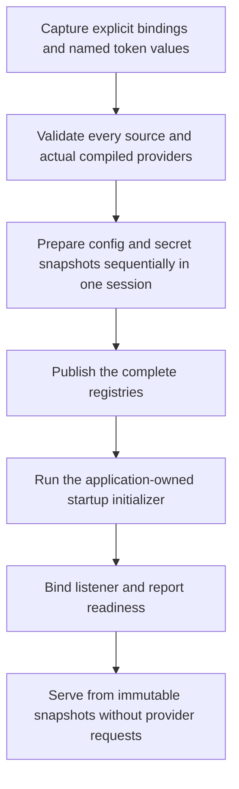

# Native AWS stores

This guide is a draft for the first native implementation. It covers two opt-in providers:
AppConfig Agent for complete configuration documents and Secrets Manager for complete secret
values. They can be selected independently per logical store ID. They do not apply to Fastly,
Cloudflare, or Spin builds, and they do not add write, publish, provision, or rotation commands.

The provider reads at process startup and keeps immutable in-memory snapshots. Restart the
application to adopt a new config document, secret value, or moved version stage. A running
process keeps secrets already loaded even after remote deletion or access revocation.

## Build the providers you use

Generated native targets can opt into either service:

```toml
[adapters.axum.build]
features = ["aws-appconfig-agent", "aws-secrets-manager"]
```

`aws-stores` is a convenience alias for both. Config-only apps need not include the Secrets
Manager SDK. Secret-only apps need not include the AppConfig Agent HTTP client. All features
are off by default. A bindings file cannot enable a service that the application binary did
not compile.

CLI bindings validation is structural and offline:

```sh
edgezero config validate \
  --adapter axum \
  --store-bindings /etc/my-app/native-stores.toml \
  --target-features aws-appconfig-agent,aws-secrets-manager
```

The bindings path must be absolute. Target controls include
`--target-all-features`, `--target-no-default-features`, and `--target <triple>`. If Cargo's
resolved target feature graph is unavailable or ambiguous offline, the command reports
structural validation only and says provider availability is unknown. This check does not
load credentials, contact AWS or the Agent, prove resource access, or validate remote
contents. Runtime startup validates the actual selected inputs again. Set
`EDGEZERO__STORE_BINDINGS_FILE=/etc/my-app/native-stores.toml` before starting the generated
native target. Its entrypoint selects strict startup when this locator is present. Without
it, the generated target keeps its existing local development behavior. An empty or invalid
selected locator fails startup rather than selecting local stores.

## Declare portable stores

Keep provider resources out of `edgezero.toml`. The application declares logical IDs and
defaults, not AWS resources:

```toml
[stores.config]
ids = ["application"]
default = "application"

[stores.secrets]
ids = ["runtime"]
default = "runtime"
```

A deployment selects providers in a separate native file. This example uses fictional
resource names and account `111122223333`:

```toml
version = 1

[config.application]
provider = "aws-appconfig-agent"
default_key = "settings"
endpoint = "http://127.0.0.1:2772"
access_token_env = "APPCONFIG_AGENT_TOKEN"

[config.application.documents.settings]
application = "checkout"
environment = "production"
profile = "checkout-envelope"

[secrets.runtime]
provider = "aws-secrets-manager"
region = "us-east-1"

[secrets.runtime.entries.signing_key]
secret_id = "arn:aws:secretsmanager:us-east-1:111122223333:secret:checkout-signing-AbCdEf"
version_stage = "AWSCURRENT"
```

The schema rejects unknown fields, unsupported provider tags, empty mappings, undeclared IDs,
and conflicting selectors. The names are case-sensitive. Every configured mapping is required
during preparation. A missing mapped document or secret fails startup. There is no fallback to
`.edgezero/` or an environment secret. An unmapped lookup returns a normal miss and never
triggers another AWS request. Runtime errors use closed, fixed categories; they do not retain
SDK/HTTP error chains or raw resource values in EdgeZero-owned diagnostics.

Use exactly one selector for each secret: no selector means `AWSCURRENT`; set `version_stage`
or `version_id` to pin another version. Do not set both. Supply a complete secret ARN and an
explicit region. The file contains identifiers and environment variable names, never
credentials, tokens, or secret values. Protect it as deployment configuration nonetheless.

## Start the AppConfig Agent

EdgeZero talks to a local Agent HTTP endpoint. It does not start or supervise the Agent, poll
AWS AppConfig, or run AppConfig Data session-token logic. The Agent owns its AWS role, region,
AWS polling, and cache. The application makes one GET per distinct mapped profile at startup.

Run the Agent in the same network namespace as the application and configure it to bind to
`127.0.0.1`. The provider accepts only literal loopback IP endpoints, so endpoint hostnames do
not trigger DNS. It rejects redirects, proxy use, and non-identity content encoding. It sends
`Accept-Encoding: identity`. When the binding names a token variable, startup reads it once and
sends `Authorization: Bearer <token>`. A missing or empty configured token fails startup.
Configure the Agent's `ACCESS_TOKEN` to the same value. Never put the token in a URL or the
bindings file.

Pin the operator-reviewed Agent image by digest in deployment configuration, for example
`public.ecr.aws/aws-appconfig/aws-appconfig-agent@sha256:<operator-reviewed-digest>`. The
placeholder is not a usable image reference. Before publishing this guide, the operator must
select the exact Agent release, verify its image digest through the approved artifact process,
and record both in deployment documentation. Do not replace the placeholder with an
unverified or invented digest. Disable Agent disk backup/preload for this setup; this does not
make its in-memory cache fresh or prove that AWS was reachable when the application starts. A
successful read proves only that the Agent supplied acceptable bytes.

Do not expose the Agent endpoint to untrusted processes. If processes share its network
namespace, require token authentication. A token does not isolate the endpoint from a
compromised application process.

## Preserve complete values

An AppConfig mapping returns the profile's entire UTF-8 document. It does not select a JSON
field, parse or reserialize a document, unquote a JSON string, or resolve secret references.
A raw profile containing `hello` returns those exact characters. A profile containing a
serialized EdgeZero `BlobEnvelope` returns that serialization unchanged; core validates the
envelope when the app loads typed config.

For example, a free-form profile can contain one serialized envelope:

```json
{
  "version": 1,
  "generated_at": "2026-10-07T12:00:00Z",
  "sha256": "<computed digest>",
  "data": { "message": "hello", "api_token": "signing_key" }
}
```

The `api_token` field in this example is a secret reference name, not a token value. The
application's typed config must declare the appropriate `#[secret]` field and must explicitly
check required config and secret references during its startup initializer before readiness.
The provider does not know which values the application requires. It does not claim that
startup checks or application-specific validation have run merely because snapshots loaded.

Secrets Manager returns each configured value in full. `SecretString` is kept as its exact
UTF-8 bytes; the SDK's `SecretBinary` is already decoded bytes and is not base64-decoded a
second time. JSON secrets remain whole JSON byte values. Typed string references still need
UTF-8; byte-oriented consumers can retain binary values.

## Startup flow



The generated entrypoint prepares provider snapshots but does not invent application-specific
startup checks. To require typed config and nested secrets before listening, replace its native
main with `run_production_app_with_initializer::<your_core::App, _>(...)`. The callback receives
`&mut App` and `&PreparedStores`; use core `AppConfig::<YourConfig>::from_binding` with the selected
config binding, secret registry, extraction limits and app clock. Insert validated state with
`app.insert_state(...)`. The callback may borrow both arguments and need not be `Send`. The
framework waits for it before binding. The generated-consumer integration test exercises this
public callback, a complete envelope and nested secret resolution against loopback fixtures.

## Limits and lifecycle

The shared AWS preparation session defaults to an 8 MiB cap over unique retained config and
secret payload bytes. The limit is per standard runner preparation session, not process-wide
and not a bound on RSS. Separate sessions, caller-supplied handles, local providers, SDK
response allocations, credential providers, TLS buffers, typed application state, and allocator
overhead are outside this cap. Config documents and secret entries also have per-value and
mapping-count limits. Treat the 8 MiB value as a configurable provisional default, not an AWS
service limit or a measured workload requirement.

Preparation is sequential in the initial implementation. It has finite operation and aggregate
budgets, but dropping a future does not prove that credential discovery, a subprocess, or every
socket operation stopped. A startup failure drops the runner's staged snapshot and stops before
readiness. Use the process supervisor for restart policy and backoff.

Config values are snapshots by mapped document. The snapshots do not promise a coordinated
revision across profiles or across config and secrets. If multiple documents must change
atomically, place them in one envelope or have application-owned release validation reject
mismatched revisions. Restart to adopt changes.

A running process retains loaded secrets until it exits. Remote deletion, rotation, or revoked
access does not erase those bytes. Restart to adopt the selected version or remove a secret.
`Bytes`/`Arc` ownership does not promise memory zeroization. Do not log values, ARNs, tokens,
credential sources, or response bodies.

**Dependency logging limitation.** EdgeZero-owned startup errors and diagnostics use redacted
categories, but the first version does not suppress DEBUG/TRACE events emitted by the AWS SDK
and its dependencies. Those events can expose secret ARNs, credential-source metadata, and,
when `LOG_SENSITIVE_BODIES=true`, response details. Scoped suppression was not adopted because
it can permanently disable an application's tracing-to-log fallback. Keep AWS dependency
`DEBUG`/`TRACE` off in production unless operators have reviewed their logger, sinks, and
sensitive-body settings. This limitation must be called out in reviews of the first version.

## Credentials and permissions

For the application, use the AWS SDK's supported credential chain. In production, prefer the
workload role attached to the service. For local development, use a named authenticated AWS
profile or another supported developer credential source. The bindings file and container
image must not contain static access keys. Secret-only applications initialize the Secrets
Manager client; AppConfig-only applications leave AWS credentials to the Agent.

Grant the Agent role only the AppConfig Data read actions it needs:

- `appconfig:StartConfigurationSession` for the selected application, environment, and profile.
- `appconfig:GetLatestConfiguration` for that configuration session/resource scope.

Grant the application role `secretsmanager:GetSecretValue` for the explicitly mapped secret
ARNs, and `kms:Decrypt` only when a selected customer-managed key requires it. Runtime roles
do not need resource creation, AppConfig deployment, secret mutation, staging-label changes,
or rotation-Lambda management. Review the exact IAM resource scoping for the deployed AWS
service and account before deployment. This guide is not an IAM acceptance result.

AWS charges and service quotas depend on the selected AWS resources, Agent polling, region, and
traffic. Estimate them from the deployment configuration. Keep a named operator responsible
for stopping the Agent and removing disposable AppConfig/Secrets Manager resources after
experiments; the runtime and CLI do not clean them up.

## Push remains local

`edgezero config push --adapter axum` writes local config snapshot files. It does not publish
AppConfig data. The `--store-bindings /absolute/path` push guard rejects a selection
that binds the chosen logical ID to AWS, before diffing, prompting, or writing. Without that
explicit file, a local push is still only a local write; it makes no claim about a separate
AWS deployment. There are no AWS publish, provision, secret-mutation, or cleanup commands in
this feature.
