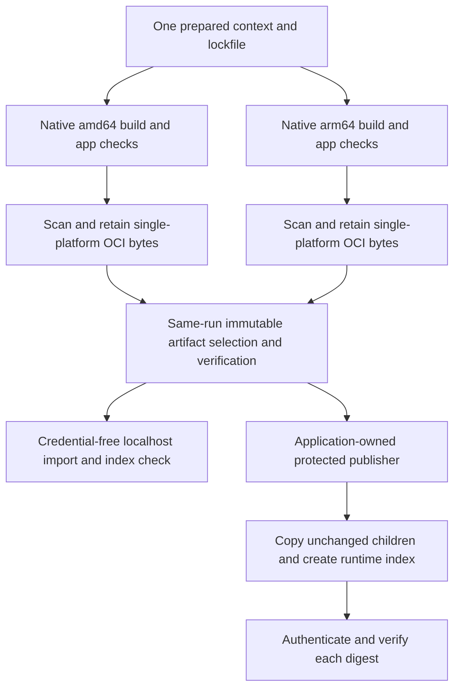

# Publishing Axum containers

Application owners publish application images. EdgeZero does not need a public
application image. This guide adds publishing preparation to the
[Axum packaging recipe](./adapters/axum.md#container-packaging). It does not certify
production readiness, storage recovery or graceful shutdown.

## Build once, test the published bytes

The repository's `.github/workflows/axum-container.yml` prepares one generated
application and one application lockfile. Separate ephemeral Ubuntu amd64 and
arm64 runners build native GNU images. Neither uses QEMU as acceptance evidence.



The exporter disables automatic BuildKit attestation descriptors. The retained
archive has one runnable OCI child, its original config and layers. The handoff
uses a digest-pinned localhost registry and Skopeo's `--preserve-digests`. It checks
raw registry manifest bytes and Docker's pulled reference, filesystem identities
and runtime config. Docker's classic and containerd image stores report different
kinds of `.Id`; that field alone is not the config identity check.

The final runtime index contains exactly the accepted amd64 and arm64 children.
Labels are set before testing. Publication never rebuilds, edits a child manifest
or silently converts its media type. A registry/tool that rewrites the manifest
must fail the gate. OCI attestations attach as separate referrers after publication.
They are not runnable children in the runtime index.

## Reproduce the framework preparation locally

Use a new output directory and a checkout you intend to test:

```sh
./scripts/prepare_generated_axum_container.sh /tmp/axum-context
./scripts/test_axum_container_handoff.sh build \
  /tmp/axum-context/container-probe /tmp/axum-amd64 \
  linux/amd64 "$(git rev-parse HEAD)" local
```

The fixture stages framework sources under `vendor/edgezero`, preserves generated
member dependency features and excludes that nested framework workspace from the
application workspace. It resolves its own lockfile and rejects local packages
outside the application context. This is explicit test preparation, not a new
scaffold dependency-selection option or consumer release recipe.

The build helper uses the existing generated-app HTTP/TLS packaging smoke and the
no-store Compose check. An application-owned `APP_SMOKE_SCRIPT` can replace those
fixture checks in a credential-free build job. It receives `IMAGE_REF PLATFORM`.
It must execute that image, fail on unmet requirements and clean up its containers.
The publisher never executes this script or an application binary.

A successful bundle contains `image.tar`, `receipt.json`, `inputs.json`,
`scan.json`, `scanner.json`, `sbom.json` and `provenance.json`. Import verifies a
transferred bundle without rebuilding or running it:

```sh
./scripts/test_axum_container_handoff.sh import \
  /path/to/transferred-bundle /tmp/axum-import \
  linux/amd64 "$(git rev-parse HEAD)" local
```

`local` permits explicitly dirty local preparation. Trusted release runs require
clean inputs. Local receipts, archive hashes and declared revisions prove
consistency, not producer authenticity. Do not feed an arbitrary PR bundle to a
credentialed publisher merely because its receipt verifies.

## Application-owned GHCR recipe

`examples/container-publishing/release.yml` is an inactive, copyable recipe. It
runs only from `workflow_dispatch` on `refs/heads/main`. Copy it as
`.github/workflows/release.yml` into the application repository, along with:

- `examples/container-publishing/tools.env`
- `examples/container-publishing/verify_artifacts.py`
- `examples/container-publishing/publish.sh`
- `scripts/test_axum_container_handoff.sh`

Keep those relative locations. Commit the app's portable dependency manifests,
`Cargo.lock`, `.tool-versions`, digest-pinned Dockerfile and executable
`.ci/test-container.sh`. The context must contain required assets and workspace
members. This sample uses a committed repository-root context without source
symlinks or submodule-only contents. `fixture-inputs.json` is reserved for the
preparation job. Private build credentials and generated assets need a separate
reviewed application-owned extension, never credentials in COPY, ARG or ENV.

Before enabling the workflow, an owner must:

1. Protect `main` and review changes to the workflow, Dockerfile, tools and tests.
2. Configure the `container-release` environment with required owner-designated
   reviewers, prevent self-review and disable administrator bypass. Restrict its
   deployment branches to `main`. Naming an environment alone does not protect it.
   The publisher checks the required-reviewer settings and protected main via the
   GitHub API and fails closed if they are missing or unreadable.
3. Approve the concrete `ghcr.io/<owner>/<repository>` namespace, package access,
   visibility and retention policy. The recipe derives this name from the app
   repository. Adapt the fixed image name if the repository slug is not a valid
   registry name. Do not use EdgeZero's namespace for a consumer application.
4. Reserve the version-tag namespace to this serialized workflow. The release
   input accepts `vMAJOR.MINOR.PATCH` with an optional prerelease suffix, not
   `latest`, `stable` or `prod`. GHCR tags are mutable. Preflight refuses an
   existing different tag, permits creation only on confirmed registry not-found,
   and checks the tag again after copying. Other writers can still race or move a
   tag later. Deploy by digest, never by that alias.

Build jobs have read-only repository permissions, nonpersistent checkout
credentials and no registry/OIDC authority. The publisher needs both native jobs
and protected-environment approval. Only its job has package-write, attestation
and OIDC permissions. OIDC authority applies to that whole job.

The publisher queries this run's artifact metadata, selects exact immutable IDs
whose names bind platform/run/attempt, checks source SHA and artifact digests, and
uses same-run downloads with digest mismatch treated as an error. Uploads never
overwrite artifacts and missing successful outputs are errors. Failed scan
reports are diagnostic artifacts, never accepted release inputs. No
`pull_request_target`, cross-run latest-artifact discovery or automatic PR
promotion is involved.

The publisher checks out its exact trusted commit. Before login, its verifier
recreates the committed source archive and recomputes context, Cargo.lock,
Dockerfile and toolchain traces. It verifies the OCI bundle, subject-bound scan,
sidecar hashes and policy. Registry credentials then live only in a disposable
publisher HOME so the copy tool and `actions/attest` use the same Docker auth file.
Cleanup removes that HOME even on failure.

The recipe pins the GitHub CLI verifier by archive checksum. It attaches and
verifies separate SLSA publisher provenance for each child and the index, plus
CycloneDX SBOM attestations for each child. Standard publisher provenance does
not authenticate test assertions. Separate app-owned acceptance predicates bind
the independently checked input hashes, immutable artifact IDs/digests, child and
index digests, scanner version/database metadata and report/SBOM hashes. The
publisher generates them from verified inputs, never from an artifact-provided
predicate. They describe the application checks, not a SLSA level or framework
production certification.

Consumer verification must constrain repository, signer workflow, source ref,
source SHA, digest and predicate type. For example, using the recipe's pinned CLI:

```sh
gh attestation verify 'oci://ghcr.io/OWNER/APP@sha256:INDEX_DIGEST' \
  --repo OWNER/APP --signer-workflow OWNER/APP/.github/workflows/release.yml \
  --source-ref refs/heads/main --source-digest SOURCE_SHA \
  --predicate-type https://github.com/OWNER/APP/container-acceptance/v1
```

Repeat for the two child digests. Verify SLSA provenance separately with
`https://slsa.dev/provenance/v1`, and child SBOMs with `https://cyclonedx.org/bom`.
A valid signature from some other workflow/repository is not acceptance.

Keep accepted rollback digests and metadata under an application-owned retention
policy. Security updates require a reviewed source/base change, a fresh build and
the same native test/scan/identity gates before publication. Never relabel an old
accepted child after tests. A failed publication may leave immutable children or
a version alias without all required attestations. Treat that as incomplete,
verify the retained bytes and use an explicit owner-approved recovery path. Do
not rebuild with the same version tag and overwrite the partial release.

Because selection binds the run attempt, rerun all preparation/native jobs for a
new attempt. The recipe does not mix a successful old platform with a new retry
or discover a prior successful run automatically.

## Scanner policy and current blocker

Trivy scans the verified OCI layout, which came directly from the retained
archive. The verifier requires a nonempty supported report with matching image
config identity and a manifest-bound scanner record. High and Critical findings
block acceptance, including findings without a fix. It does not use
`--ignore-unfixed` or an unreviewed ignore file.

Exceptions must come from an independently trusted, owner-reviewed policy file,
not the artifact. Each entry requires `manifest_digest`, `vulnerability`,
`package`, `owner`, `reason` and ISO-date `expires`. Broad wildcards, missing scope
and expired exceptions fail. The standalone verifier/import/publisher helpers
accept `--exceptions` or `SCAN_EXCEPTIONS`; the sample workflow deliberately has
no automatic waiver path. Review the exact existing candidate bytes and an
explicit approval path before adapting the workflow for an exception. Do not
rebuild a waived image and assume the old digest exemption still applies.

The October 7, 2026 local scan of the current Debian recipe reported 55 High and
4 Critical findings. The strict policy blocks that candidate. No exceptions have
been authorized. Image remediation or explicit scoped risk decisions are still
needed. The image scan found no language-specific files; its SBOM is not a claim
that every statically linked Rust dependency was independently analyzed.

Native arm64 runner execution, accepted artifact import/index assembly in hosted
CI and one separately authorized disposable GHCR publish/attestation verification
remain execution gates. Keep [#399](https://github.com/stackpop/edgezero/issues/399)
open until those acceptance checks pass. Production runtime and deployment gates
are described in [Deploying Axum containers](./deploying-axum-containers.md).
