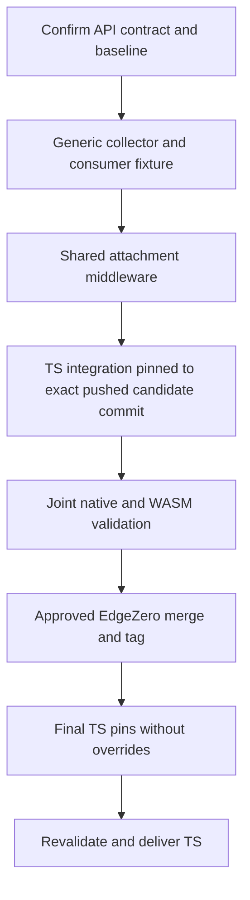

# Shared request timing implementation plan

Date: 2026-09-28
Status: EdgeZero review API revision implemented and locally verified. Renewed
Trusted Server integration, joint validation and release delivery remain pending.
Spec: [Shared request timing collector and middleware](../specs/2026-09-28-request-timing-design.md).

## Outcome and approved scope

Move generic timing collection and insert-if-absent middleware into EdgeZero.
Adopt it in Trusted Server without changing diagnostic wire output, rendering
policy, or adapter measurement boundaries. Ship the two changes together after
joint validation; do not land a temporary TS-only middleware extraction.

The approved scope is typed application phase enums over bounded generic slots,
application-owned payload under the same clock and mutex, one concrete extension
handle, and TS-owned rendering. The spec records the current API contract.

[EdgeZero #389](https://github.com/stackpop/edgezero/pull/389) at
`9c03cc59300363ae5339fc970dded08ede563e98` and
[Trusted Server #1121](https://github.com/IABTechLab/trusted-server/pull/1121) at
`2791ceb46908e6af04ccaae0c10b29d35336a9f4` record completed migration and joint
validation. Historical completion below refers to those exact candidates. The
review API revision needs matching TS facade changes, new candidate pins and
renewed joint validation. Merge/tag and final tag-backed delivery remain gated.

## Repositories and starting state

| Repository | Branch | Initial baseline |
| --- | --- | --- |
| EdgeZero | `feat/shared-request-timing` | `98930917d96cb665c7255f36ca8bbd61fc7539e1` |
| Trusted Server | `feature/ts-console-improvements` | `f951955f537b89392dcb863fca7a01a5f6fa4846` |

The initial TS baseline pinned six EdgeZero dependencies to `v0.0.7`. The migrated
candidate pins all six to `9c03cc59`, with one resolved core identity and no local
overrides. Record exact heads and changed inputs for every later validation;
keep one writer per worktree.

## Delivery dependencies



A usable EdgeZero tag must precede the final TS dependency pin. Joint delivery
means both implementations are verified before releasing EdgeZero, then the
final tag-backed TS change is verified before delivery. It does not mean atomic
publication across repositories.

## Task 1: Pin API details and capture the baseline

Files: spec, this plan, existing EdgeZero core modules and CI definitions,
TS `request_timing.rs`, adapter timing integrations, and dependency manifests.
No production code changes in this task.

- [x] Check repository instructions, status, exact heads, installed toolchain and
      WASM targets. Do not update branches or discard unrelated work implicitly.
- [x] Record baseline `cargo test -p edgezero-core`, TS
      `cargo test -p trusted-server-core request_timing`, and `cargo test-axum`.
      Classify environment failures separately from code failures.
- [x] Pin the operation/result contract in the spec before implementing the API:
      successful updates, unavailable reads/writes on contention, invalid slots
      rejected without mutation, and first-write versus last-write semantics.
- [x] Define snapshot projection and payload updates under one lock. Mutable
      access must not expose the origin or allow a request clock to be replaced.
- [x] Resolve callback failure behavior. Recommended contract to review: callbacks
      are synchronous and non-reentrant; panics propagate normally; there is no
      rollback; payloads must remain valid on unwind; poisoned mutexes recover
      best-effort as TS does today. Do not advertise arbitrary callbacks as
      infallible. If this contract is unsuitable, stop for an API decision.
- [x] Specify invalid-slot behavior for compound updates as well as plain records.
      Validate slot inputs before invoking a payload callback so a rejected phase
      cannot leave the payload changed. Do not introduce general transactions.
- [x] Record the concrete generic extension type and TS facade strategy. Agree on
      names and minimum bounds; avoid requiring `D: Clone` for handle cloning.

Exit: a short API contract in the spec, known baseline results, and no unresolved
safety semantics hidden in a TODO. This is a bounded API review, not another round
of choosing ownership or adding a generic renderer.

Historical verification recorded before the initial candidate was published:

- Implementation started from `98930917d96cb665c7255f36ca8bbd61fc7539e1`.
  The TS baseline was `f951955f537b89392dcb863fca7a01a5f6fa4846`.
- Baseline EdgeZero core tests, TS core timing tests (13) and `cargo test-axum`
  passed. The new consumer fixture initially failed to compile because the new
  module did not exist; that is API red/green evidence, not a preexisting bug.
- Final core run: 484 unit tests, two integration tests, one compile-fail timing
  lifetime doctest passed (13 existing doctests ignored).
- Workspace test, fmt, all-features clippy, feature check, generated-app build,
  Fastly CLI/default gates, nested-config audits and excluded app-demo gates pass.
- Runtime contract suites pass: Cloudflare 8 in headless Chromium using lockfile-
  matched wasm-bindgen 0.2.122, Fastly 7 in Viceroy 0.17.0, Spin 13 in Wasmtime
  44.0.1. Each includes the new portable clock/handle/router smoke test. Fastly's
  WASM library suite passes all 88 tests. Adapter WASM check/clippy matrix passes,
  including Fastly `fastly cli`. These are local runtime harnesses, not deployed
  provider smoke tests or proof of TS migration.
- Rust 1.95.0; the missing `wasm32-wasip2` target was installed with approval.
  Wasmtime and wasm-bindgen runners were installed run-locally, not globally.
  Guide formatting, docs lint/format and VitePress build pass.
- Detailed implementation-stage logs are outside the repository. Independent
  EdgeZero reviews subsequently cleared. Publication-stage core tests, fmt and
  all-features clippy passed again. Later TS migration and joint results are
  recorded by the linked PRs at `9c03cc59`/`2791ceb`; none of this historical
  evidence establishes compatibility with the review API revision.

## Task 2: Implement the generic collector and consumer fixture

Files:

- New `crates/edgezero-core/src/request_timing.rs` with colocated tests.
- `crates/edgezero-core/src/lib.rs` module declaration.
- New `crates/edgezero-core/tests/request_timing_consumer.rs` for public API usage.

Work in small tested slices rather than implementing all methods at once.

- [x] Add the bounded phase storage, application payload, single origin, and one
      shared mutex. Use `web_time::Instant`; add no Tokio or UUID dependency.
- [x] Add construction, clone sharing, elapsed-from-origin access, saturating
      accumulation, and consistent reads. Preserve absent versus recorded zero.
- [x] Add headers-ready/request-complete first-write marks and last-write bytes.
      Do not stamp lifecycle marks automatically on middleware return or drop.
- [x] Add the narrow compound-update operation and its validated slot contract.
      Test that contention prevents both phase and payload mutation.
- [x] Add drop-time phase spans. Cancellation records work so far, not request
      completion; no destructor guarantee is made for panic-abort environments.
- [x] Test overflow, bounds, clone sharing, independent requests, first-write
      marks, byte overwrite, compound snapshots, and the poison/panic behavior
      agreed in task 1. Private test-only origin control is preferable to
      wall-clock sleeps in core tests.
- [x] Compile an external consumer fixture with an application enum, a small
      application payload, and a facade around the installed generic handle.
      Prove extension insertion and handler access use one type and shared origin;
      task 3 will add the middleware path. Use generic example phases, not auction
      definitions, in EdgeZero tests.
- [x] Test public API use with a payload that is not `Clone`; verify the handle
      still satisfies request-extension requirements with the necessary bounds.

Check after each slice: `cargo test -p edgezero-core request_timing`.
Then run `cargo test -p edgezero-core`, including the consumer fixture.
Document that a missing API compilation failure is not runtime regression proof.
For existing behavior, use assertions that can detect incorrect values rather
than tests that merely check whether a field exists.

Exit: public consumer fixture compiles, one-T0 and compound-state contracts pass,
and the TS facade can be expressed without a second clock or independently
installed wrapper extension. If not, return to the API checkpoint before adapters.

## Task 3: Add shared attachment middleware and usage docs

Files:

- `crates/edgezero-core/src/middleware.rs` and its colocated tests.
- `crates/edgezero-core/tests/request_timing_consumer.rs`.
- `docs/guide/middleware.md`.

- [x] Add generic attachment middleware using the collector from task 2.
      Preserve an existing handle; create fresh state only for an eligible
      request without one. Default to no exclusions.
- [x] Support the agreed static exact-path exclusion list. Compare URI paths,
      not the full path/query string. Exclusion never removes an existing handle.
- [x] Verify default behavior, excluded paths, query strings, all methods,
      duplicate registration, preinstalled handles, independent requests,
      handler errors, and short-circuiting downstream middleware.
- [x] Exercise real router dispatch. Pin that unmatched 404/405 routes bypass
      middleware and that an error rendered outside the chain remains outside
      attachment middleware's response-finalization control.
- [x] Add an application-enum usage example based on the compiled fixture.
      Explain opt-in installation, shared T0, payload ownership, and explicit
      lifecycle marks. Add no generic header renderer.
- [x] Correct the guide's existing statement that middleware runs before route
      matching when documenting this behavior. Use `web_time`, not a new
      `std::time::Instant` example for cross-platform timing. Limit other guide
      edits to the timing section and directly contradictory lifecycle wording.

Checks: `cargo test -p edgezero-core`, then documentation formatting and lint for
the changed published guide. Internal spec/plan files are excluded from those
checks and need a direct whitespace/link/structure check.

Exit: EdgeZero owns one reusable implementation with no TS dependency, and docs
show code checked by a real consumer fixture.

## Task 4: Establish TS compatibility evidence before replacing mechanics

Files in Trusted Server:

- `crates/trusted-server-core/src/request_timing.rs`.
- `crates/trusted-server-adapter-axum/src/timing.rs`.
- Existing Cloudflare/Spin middleware tests and Fastly timing tests.

- [x] Capture baseline deterministic header and snapshot fixtures: order, precision,
      missing versus zero, `u32` saturation, row-only phases, and auction fields.
- [x] Add missing focused contract coverage for shared clones, compound wait and
      placement, first-write marks/UUID, last-write bytes, and contention fallback.
      These characterize intended current behavior and should pass before moving it.
- [x] Add an Axum regression that inserts a pre-aged handle with a recorded phase
      in an upstream service. Assert handler and private-response header retain
      the same measurement. Run it before changing production code and capture
      the failure caused by unconditional replacement.
- [x] Pin health method differences: Cloudflare/Spin/Axum exclude every method on
      `/health`; Fastly skips collection for `GET /health` only. Include query
      strings and non-GET requests. Do not normalize these differences.

Focused checks: `cargo test -p trusted-server-core request_timing`,
`cargo test-axum`, `cargo test-cloudflare`, `cargo test-spin`, and the nearest
Fastly health/timing filters through `cargo test-fastly`.

Exit: current contracts are executable and the Axum reset regression has
failing-before evidence. Do not treat that deliberate failure as a baseline defect
to work around by weakening its assertions.

## Task 5: Migrate TS against the candidate EdgeZero revision

Files in Trusted Server:

- `crates/trusted-server-core/src/request_timing.rs`.
- Cloudflare/Spin `src/middleware.rs` and `src/app.rs`.
- Axum `src/timing.rs` and Fastly `src/main.rs`, plus any existing attachment sites
  in their app modules identified by searching `RequestTimings`.
- Core timing consumers only where generic extension lookup requires migration.
- Temporary exact pushed git-revision pins and regenerated lockfile; replace with
  the eventual approved release tag before final TS delivery.

- [x] Record the exact candidate EdgeZero revision and any uncommitted diff used
      for validation. Temporarily pin all six TS dependencies to that pushed git
      commit. Do not publish
      developer-specific paths or local patches.
- [x] Resolve the complete EdgeZero package dependency closure from the same
      candidate git source, including macros/adapter registry.
      Check `cargo tree`/metadata for duplicate EdgeZero core identities. Mixed
      sources giving middleware and handlers different core types are invalid.
- [x] Preserve the TS `Phase` enum and domain method names. Delegate generic
      mechanics to EdgeZero, with auction state in its application payload.
      Keep header rendering, privacy checks and access serialization local.
- [x] Read the installed generic extension through the TS facade at every lookup.
      Audit both initial-document and page-bids paths, telemetry, streaming, and
      adapters. Do not leave an old-wrapper lookup that silently falls back to a
      fresh collector or makes the page-bids missing-collector gate fire.
- [x] Replace both Cloudflare/Spin middleware copies with shared registrations.
      Keep sanitization first, preserve exclusions, and retain adapter integration
      tests even though generic middleware unit tests now live upstream.
- [x] Make Axum retrieve-or-create the same handle for non-excluded requests and
      use it for terminal rendering. Run the task 4 regression and show it passes.
- [x] Keep Fastly's clock creation and streaming/finalization boundaries unchanged.
      Reuse its existing handle through every core-request conversion path.
- [x] Preserve both diagnostic clock labels and browser payloads. Do not add the
      separate initial-document missing-collector follow-up in this migration.
- [x] Remove superseded collector mechanics and middleware tests only when their
      replacement coverage exists. No parallel old/new collector at runtime.

Checks after each adapter slice: its target-matched tests. Re-run core timing,
page-bids, initial-document diagnostic tests, and the Axum regression at the end.
Compare against task 4 fixtures; explain any intentional difference before
continuing. Only Axum's preinstalled-handle preservation is planned to improve.

Exit: TS uses the candidate implementation on all four adapters with unchanged
wire/privacy behavior and no circular dependency or duplicate timing clock.

## Task 6: Joint validation and independent review

Run commands from their respective repository roots. Record exact revisions,
temporary git-revision pins, results, skipped checks, and environment blockers. A native pass
is not evidence of a WASM runtime pass.

EdgeZero native and build gates:

```sh
cargo test -p edgezero-core
cargo test -p edgezero-core --doc
cargo test --workspace --all-targets
cargo fmt --all -- --check
cargo clippy --workspace --all-targets --all-features -- -D warnings
cargo check --workspace --all-targets --features "fastly cloudflare spin"
cargo test -p edgezero-cli --test generated_project_builds -- --ignored
```

Run the current `.github/workflows/test.yml` and `format.yml` gates, including
feature-specific Fastly tests/clippy, the separately excluded app-demo workspace,
and WASM adapter contract tests/checks/clippy. Target mapping:

| Adapter | EdgeZero target | Runtime runner |
| --- | --- | --- |
| Cloudflare | `wasm32-unknown-unknown` | Lockfile-matched `wasm-bindgen-test-runner` |
| Fastly | `wasm32-wasip1` | Pinned Viceroy |
| Spin | `wasm32-wasip2` | Pinned Wasmtime |

For example, the Spin check is
`cargo check -p edgezero-adapter-spin --target wasm32-wasip2 --features spin`.
Adapter test/check command shapes and runner setup come from those workflows.
Run the shared clock/handle scenario natively and in each adapter contract suite.
Separate advancement tests use native sleep or bounded polling only in the local
Viceroy, Wasmtime and Chromium harnesses. Polling has an independent wall-clock
deadline and an iteration cap. Deployed Cloudflare CPU-only timings may be zero;
a local pass is not deployed-provider proof. Keep native-only sleep/thread/poison
tests out of unsupported WASM test paths.

Trusted Server gates:

```sh
cargo test-fastly
cargo test-axum
cargo test-cloudflare
cargo test-spin
./scripts/test-cli.sh
cargo test --manifest-path crates/trusted-server-integration-tests/Cargo.toml --test parity
cargo fmt --all -- --check
cargo clippy-fastly
cargo clippy-axum
cargo clippy-cloudflare
cargo clippy-cloudflare-wasm
cargo clippy-spin-native
cargo clippy-spin-wasm
```

TS Spin targets `wasm32-wasip1`, unlike EdgeZero's `wasm32-wasip2` matrix. Preserve
and validate both supported configurations; do not copy one repository's target
assumptions into the other.

Run TS JavaScript diagnostics regressions and the full Vitest suite from
`crates/trusted-server-js/lib` with `npx vitest run`. Build browser artifacts and
bring up the existing Next.js integration environment using that suite's setup,
then run `npm run test:nextjs -- tests/nextjs/gpt-diagnostics.spec.ts` from
`crates/trusted-server-integration-tests/browser`. Run the applicable full browser
and integration CI jobs before PR handoff. No JS behavior change is planned.

- [x] Fresh read-only review of collector API and synchronization contracts.
- [x] Fresh read-only review of TS extension identity, timing origins, privacy,
      and temporary pin compatibility at `2791ceb`. No concurrent writers during fixes.
- [x] Implement EdgeZero review fixes and verify the local revision.
- [ ] Revalidate TS against the revised candidate after updating its facade and pins.

Exit: both repositories pass applicable gates against the same candidate;
remaining risks are explicit. Release is blocked on unverified consumer adoption.

## Review follow-up

- [x] Move immutable T0 outside the state mutex and make `elapsed()` infallible.
      The cross-thread regression fails before the change and passes afterward.
- [x] Make errors/snapshots non-exhaustive, add payload-independent handle Debug,
      default snapshot payload and neutral lifecycle names.
- [x] Add const middleware configuration and real manifest registration coverage,
      documenting replacement semantics and preserving attachment behavior.
- [x] Add native shared-scenario coverage, separate local-harness advancement tests
      and the core doctest CI step. Strengthen successful-response assertions.
- [x] Correct guides and refresh this record and the spec. Keep optional counters,
      owned exclusions, outer propagation/services, span control and extractors
      deferred as documented in the spec.
- [x] Complete affected native/WASM, docs and workspace verification for this revision.
- [ ] Update six TS facade accesses, refresh all six candidate pins and jointly
      revalidate before approving an EdgeZero release.

### Review revision verification

Validated the uncommitted revision based on `9c03cc59`. Non-Markdown validation
inputs have SHA256 `6f4da4b53c95794adab3b48658830c499c173cc223f8414d048d8e2cc7b46bc3`.
Native evidence was reused only where subsequent changes were confined to
WASM-only test bodies; generated-project evidence predates equivalent private
field ordering and test-only lint fixes, with generator inputs unchanged.

| Check | Result |
| --- | --- |
| Core, macro fixture and compile-fail doctest | 486 core unit tests, four integration tests and one compile-fail test passed; 13 existing doctests ignored |
| Workspace tests, fmt, strict all-features clippy and feature check | Passed |
| Three WASM target checks and strict all-targets clippy | Passed |
| Viceroy 0.17.0 contract and Fastly library suites | Eight contract tests and 88 library tests passed |
| Wasmtime 44.0.1 contract suite | 14 tests passed |
| Chromium 152, wasm-bindgen 0.2.122 contract suite | Nine tests passed |
| Generated app, excluded app-demo and CLI/checker gates | Passed |
| Docs lint, formatting/build, internal links/fences and diff whitespace | Passed |

All four clock advancement entrypoints and the shared attachment scenario ran.
These are local harness results, not deployed-provider smoke tests or refreshed
TS integration evidence.

An extra `cargo build --workspace --all-targets --all-features` native build fails
linking Fastly's WASM-only hostcalls. The same failure was reproduced from an
untouched archive of `9c03cc59`. It is a pre-existing native-link limitation,
not a passing check or a configured CI gate; target-matched Fastly builds pass.

## Task 7: Publish and finish coordinated adoption

The linked PRs are open for review. The temporary TS git-revision pin is for
joint validation, not final release-backed delivery. Publication, merge/tag,
GitHub replies and resolution remain subject to separate authorization.

- [x] Record linked EdgeZero and TS PRs and their initial tested commits above.
- [ ] Record refreshed candidates and confirm that joint evidence covers them
      before approving the upstream release.
- [ ] Merge/tag EdgeZero through its normal release process. Select the tag then;
      do not invent a tag or assume crates.io publication.
- [ ] Point all six TS EdgeZero dependencies at the released tag. Remove every
      local override, regenerate `Cargo.lock`, and inspect the full dependency diff.
- [ ] Verify the released source matches the candidate tested jointly. If merge
      changes alter it, re-run joint checks rather than relying on stale results.
- [ ] Re-run TS gates without overrides. From the TS root, run
      `cargo metadata --locked --format-version 1` and inspect the resolved
      EdgeZero package IDs and git sources against the released tag and commit.
      Confirm the lockfile uses the released git source, no local paths,
      and one intended EdgeZero core identity.
- [ ] Deliver TS only after final tag-backed validation and approval. Reply to
      Aram with evidence, including the deliberate choice to keep rendering local.
      Resolve review threads only with separate authorization.

Completion: one shared EdgeZero middleware, generic collection used by all TS
adapters, no duplicate clocks, unchanged TS output/privacy contracts, and final
release-backed dependency pins. The other middleware duplication and the
initial-document missing-collector guard remain separate follow-ups.
