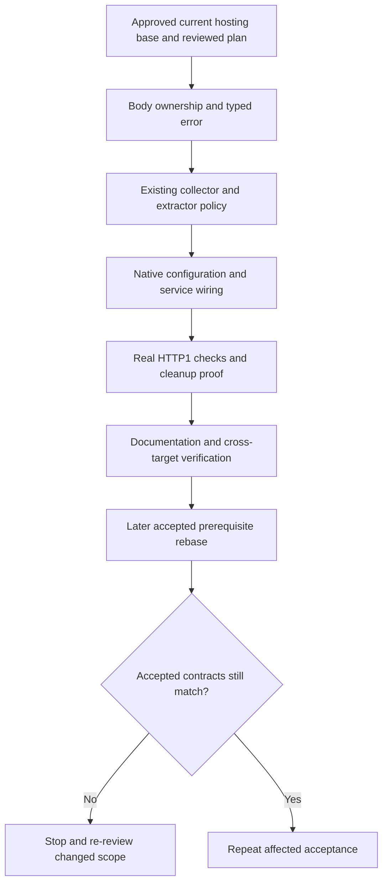

# Axum buffered JSON request-body limit implementation plan

Date: 2026-10-06
Status: implementation present on the user-approved current hosting base. Native wire, workspace, docs, and WASM checks passed. Accepted #275 integration/re-audit remains deferred until the later rebase; provider runtime certification is not claimed.

Issue: [#393](https://github.com/stackpop/edgezero/issues/393).
Spec: [Axum configurable buffered JSON request-body limits](../specs/2026-10-06-axum-buffered-json-body-limit-design.md).

## Outcome and boundaries

Through the standard Axum service, framework-managed JSON buffering defaults to exactly 2,097,152 bytes. Valid JSON exactly at the effective cap succeeds; one byte over returns typed HTTP 413. The existing collector checks actual bytes before append, stops polling rejected sources, and retains the existing cache, poison, deadline, and response-completion contracts.

The configured ceiling also governs JSON helpers without a matching Content-Type, and generic buffered reads with captured JSON/+json ingress classification. Explicit application caps can tighten it. Ordinary JSON uses the native default instead of the portable 8 MiB fallback. Ordinary Form retains its 1 MiB caller cap. Other adapters retain their current defaults and overflow behavior.

Taken streams, proxy forwarding, fallback discard reads, and application-owned manual buffering do not acquire a native JSON total-size cap. Do not add concurrency, queues, deadlines, handler cancellation, a new runner, a second collector, Tokio in core, or blanket Send bounds. The cap bounds logical collector/cache bytes, not process memory, allocations already made by the host, parsed JSON, or concurrent requests.

## Inspected baseline and evidence limits

| Item | Inspected state |
| --- | --- |
| Worktree | `/home/pav/worktrees/issue-393-buffered-body-limit-spec` |
| HEAD / parent hosting integration | `3ab22096fd117f7506cf437b5ba128e0789e059c` |
| Parent branch | `issue-392-396-production-hosting-spec` |
| Inherited #275 revision | `5527b58e2a7cb6307d5c7a8926cd5dfc6f4f8b4a` |
| GitHub #275 on 2026-10-06 | Open, head `950cb81d406d0dc269baf94314547329a4c1cef0`; not treated as accepted or integrated |
| Governing spec SHA256 | `6fb96ceead6002d3b85a1615e14fac43a51510e0294803912d83ad31748bf4a6` |

`body.rs`, `http.rs`, `context.rs`, and Axum `request.rs` are unchanged between inspected HEAD and that #275 head. They establish the ownership constraint below. Other differences are not an integration prescription. In particular, the inspected #275 head prepares Axum response egress asynchronously, whereas this hosting base uses synchronous preparation. Preserve the parent startup/shutdown work when integrating the accepted prerequisite.

The task checklists below retain the reviewed implementation sequence. Current results are recorded in the execution section, not inferred from those original unchecked items. Re-pin file locations, signatures, tests, and this plan after integration or any governing-spec change.

Core file paths below are under `crates/edgezero-core/`; Axum paths are under `crates/edgezero-adapter-axum/`. The other adapter roots are `crates/edgezero-adapter-cloudflare/`, `crates/edgezero-adapter-fastly/`, and `crates/edgezero-adapter-spin/`.

## Deferred gate 1: accept and integrate the prerequisite

After final plan review, the user explicitly authorized implementation on this current hosting base without waiting for #275 acceptance or integration. Rebase later. The following accepted-baseline checks remain open; they no longer block provisional implementation.

- [ ] Record the accepted #275 commit and the resulting hosting integration commit. Obtain approval for any branch integration operation; preserve the untracked spec and plan.
- [ ] Re-audit admitted request conversion, context collection/cache, error rendering, fallback discard, response egress, and native hosting entrypoints. Identify checks already satisfied by the accepted prerequisite and remove redundant implementation tasks.
- [ ] Verify head checks and admission still precede native body polling. Verify refusals, aborts, and ordinary 404/405 remain no-read paths.
- [ ] Run the baseline focused suites and record revision, features, result, elapsed time, and log:

```sh
cargo test -p edgezero-core --all-targets
cargo test -p edgezero-adapter-axum --all-targets --all-features
```

Do not implement against the retired eager `to_bytes(..., usize::MAX)` path. Do not claim acceptance from an open PR head or from a direct tree comparison. Unrelated baseline failures must be reproduced and recorded separately; exclusions remain coverage gaps.

## Gate 2: confirm the approved body API against the prerequisite

On 2026-10-06, the user approved the body-owned carrier refactor, making public `Body` non-exhaustive, and the bounded shared-body consumer migration. Record that approval separately from prerequisite acceptance or implementation evidence. The contract below must still be checked against the accepted integration revision.

### Why a carrier is necessary

At the inspected base:

- `crates/edgezero-core/src/http.rs:33` makes `Request` an alias for `http::Request<Body>`.
- `body.rs:15` exposes an exhaustive `Body::Once(Bytes) | Body::Stream(BodyStream)` enum, without a private metadata slot.
- `context.rs:374` reconstructs a request using only request parts and body. Its constructors at `437` and `452` create fresh context state.
- Public request/context headers and extensions can be changed or replaced. Router app-state extensions are applied before context construction at `router.rs:399`.

A context field alone disappears during reconstruction. An extension alone can be cleared. Wrapping the stream with a byte limiter would violate the streaming exclusion and would not survive cached reconstruction.

### Approved API contract

Add a metadata-only opaque body variant and `#[non_exhaustive]` to public `Body`, keeping the existing `Request` alias, builders, parts API, and plain `Body` variants. Use the following planned names unless the accepted prerequisite already supplies equivalent APIs:

```text
Body, public #[non_exhaustive] enum:
    Once(Bytes)
    Stream(BodyStream)
    Managed(ManagedBody)

ManagedBody, opaque public payload:
    private policy
    private transfer

Policy, private:
    native ceiling: NonZeroUsize
    original ingress-is-JSON: bool

Transfer, private:
    Initial(BodyContent)
    Cached(Bytes)

BodyContent, public exhaustive enum:
    Once(Bytes)
    Stream(BodyStream)

Body::with_buffered_json_policy(
    self, native_ceiling: NonZeroUsize, ingress_is_json: bool
) -> Body
Body::into_content(self) -> BodyContent
```

`BodyContent` cannot contain `Managed`, so nested wrappers are structurally impossible. The ordinary JSON default derives from the ceiling; do not store a second numeric default. The adapter-facing attachment method receives the already-validated positive ceiling and captured classification; it does not parse configuration or poll/copy body content. Initial attachment records Initial provenance. Reattaching policy to an already managed body must retain the original policy and provenance, not replace them.

Context construction consumes the carrier into private policy and the existing `BodyState`. Successful `into_request` restores the carrier. Only core reassembly creates cached transfer provenance. Initial bodies remain initial, including low-level initial `Once` bodies. Managed cached reconstruction restores `Cached(Bytes)` so a stricter cached check remains stateless and a permitted retry still succeeds. Bare unmanaged requests keep their existing reconstruction behavior.

`take_body` returns plain content and discards policy/provenance. No grant, clock, deadline, request-start timestamp, route metadata, or response completion is added to the carrier. Existing native deadline wrappers remain owned by their streams.

`Body::into_content` is the consuming raw-content handoff. It removes policy/provenance without polling, collecting, copying bytes, or adding a size cap. It is deliberately not used for context reconstruction; that path uses core-private transfer to preserve policy and cache state. Direct low-level collection, outbound construction, and response egress must not resolve the ingress JSON policy. Borrowing accessors retain logical buffered/streamed behavior.

All adapter transport branches use the exhaustive `BodyContent` view, not wildcard matches on raw `Body`. Core maps every raw `Body` variant exhaustively to that view, so future variants require deliberate core normalization. Ordinary consumers should prefer existing accessors. No borrowed view enum, new Request wrapper, or BodyStream alias migration is proposed.

### Compatibility cost and recorded approval

Both adding `Managed` and marking the currently exhaustive `Body` enum non-exhaustive are source-breaking. External raw-Body matches require a wildcard even when they name every current variant; matches inside edgezero-core can remain exhaustive. Document both breaks together and recommend accessors or `Body::into_content`/`BodyContent` rather than treating wildcard fallbacks as transport normalization.

The content view deliberately remains exhaustive because its two cases describe logical buffered/streamed ownership, not provider wrappers or policy states. Adapters handle both cases without a wildcard. Do not make `BodyContent` non-exhaustive or silently drop unknown raw bodies.

- [x] User approved the carrier/non-exhaustive refactor, exhaustive content view, cached provenance, and the bounded compatibility scope on 2026-10-06.
- [x] Governing spec affected surfaces aligned with core body/API changes and all four adapters' shared-body consumers.
- [ ] Confirm the accepted prerequisite has not supplied a smaller equivalent mechanism or changed this contract.

A protected `Request` wrapper would also preserve policy, but changes type identity, raw builder results, request parts/conversions, and more application consumers. Do not choose it here. Context/extension-only policy is smaller but would require explicit approval to narrow the reconstruction guarantee in the spec. Do not silently substitute it.

If the carrier migration grows beyond the approved file set or requires new lifecycle machinery, stop and re-review scope. Final pre-implementation review completed without verified findings. The user separately authorized execution on the provisional base; accepted-prerequisite contract confirmation and affected acceptance must still be repeated after the deferred rebase.



## Task 1: implement non-exhaustive Body, durable ownership, and typed 413

Files:

- Core `src/body.rs`, `src/context.rs`, `src/error.rs`.
- Core `src/outbound.rs`, `src/response.rs`, `src/response_egress_framing.rs`.
- Each adapter's `src/outbound.rs` and `src/response.rs`, only for shared-body compatibility.
- Axum `src/request.rs` shape-sensitive tests.
- Core `src/lib.rs` to re-export public `BodyContent` alongside `Body` and `BodyStream`.

- [ ] Add failing colocated ownership tests first. Cover initial and cached reconstruction through fresh and routed contexts after header mutation and extension clearing/replacement, including router app-state injection.
- [ ] Add `#[non_exhaustive]` to `Body`, the opaque `Managed` payload, exhaustive `BodyContent`, and `Body::into_content`. Implement private policy-preserving context transfer. Restore `Initial` versus `Cached` on managed reconstruction. Retain original policy on repeated attachment.
- [ ] Add downstream-boundary compile-fail/pass rustdoc fixtures. The negative raw-Body match must name all current variants, including Managed, and omit only the wildcard. Its otherwise identical wildcard version must compile. A `BodyContent` match handling Once and Stream without a wildcard must compile. Core unit tests alone cannot prove external non-exhaustiveness.
- [ ] Prove initial attachment/reconstruction polls nothing. Prove cached reconstruction keeps the same byte allocation, restores `BodyKind::Cached`, and does not reread a source.
- [ ] Test reattachment to both managed initial and managed cached bodies using a larger replacement ceiling and opposite ingress classification. The original policy and cached provenance survive, and attachment does not poll the body.
- [ ] Make `as_bytes`, `into_bytes`, `into_stream`, `is_stream`, `to_json`, and debug output describe underlying content. Keep direct `Body::into_bytes_bounded` on its existing caller-cap/400 contract, even for managed content.
- [ ] Add `EdgeError::PayloadTooLarge` following the accepted error conventions. Supply a semantic constructor, status 413, stable kind, fixed non-sensitive default wire message, and total `StoredError` capture/replay. Update every exhaustive core error match, including egress source-error classification. Do not translate arbitrary 400/500 errors by message text.
- [ ] Normalize ingress metadata away at outbound body-accepting constructors/setters, inbound-to-outbound forwarding, response helpers, and arbitrary-response egress preparation. Raw response builders and `body_mut` must not bypass this normalization.
- [ ] Adapt transport consumers through `BodyContent` and existing logical-shape accessors, with no wildcard on the exhaustive content view and no generic wildcard handling of raw `Body`. Preserve buffered/streamed upload selection, GET/HEAD emptiness checks, buffered-response JSON access, response length/type inference, Fastly buffered batch eligibility, and the accepted Axum zero-length stream EOF check.
- [ ] Add focused managed-input tests for outbound constructors/setters, inbound forwarding, and arbitrary raw-response egress. Assert their output is unmanaged, not merely that they ignore the ceiling. With managed input, `Body::into_bytes_bounded` must succeed above the native ceiling when its supplied cap permits, and return the existing 400 when that supplied cap is exceeded.

No other provider starts enforcing the Axum ceiling. No request alias, builder, or provider ingress migration is proposed. Do not duplicate source collection in compatibility branches.

Focused proof:

```sh
cargo test -p edgezero-core --all-targets
cargo test -p edgezero-core --doc
cargo test -p edgezero-adapter-axum --all-targets --all-features
cargo check --workspace --all-targets --features "fastly cloudflare spin"
```

Run targeted compile checks for provider feature/target combinations touched by the carrier before building further. A native feature-disabled adapter check is not enough to verify provider-only match arms. The full matrix is in Task 7.

## Task 2: enforce one resolved policy in the existing collector

Files: core `src/context.rs` and `src/extractor.rs`; extend colocated tests in those modules.

- [ ] Introduce a private JSON-versus-generic read kind and a resolved policy containing the effective cap and overflow category. Resolve it before both initial collection and cached rechecks.
- [ ] Keep `body_bytes(max)` generic. Make `json_within(max)` select JSON collection explicitly. Keep `form_within` and the Form family on the generic path.
- [ ] Change ordinary `Json` fallback selection to native ceiling when present, otherwise the existing portable 8 MiB. `ValidatedJson` continues delegating; explicit JSON helpers/Within retain their caller cap and take the minimum with the ceiling.
- [ ] For generic reads, clamp only when original ingress classification is JSON/+json. Retain ordinary Form's 1 MiB caller cap and non-JSON generic overflow 400.
- [ ] Generate typed overflow directly at cached-length, checked-add, and pre-append checks. Keep one collector and byte-accounting pass. Retain source-error-before-size handling and existing deadline precedence.
- [ ] Retain `DrainGuard` cancellation poison, sticky first-drain errors, non-poisoning cached rechecks, and existing `take_body`/`into_request` failure behavior.
- [ ] Ensure fallback discard ignores the new policy and retains the application's byte cap and exact overflow/timeout responses.

Required core regressions:

| Case | Observation |
| --- | --- |
| Exact cap / one byte over | Exact succeeds; first rejected chunk is never appended; overflow is typed 413 |
| Explicit cap below/above ceiling | Effective minimum; retry cannot loosen an initial overflow |
| Ordinary JSON ceiling above 8 MiB | Portable fallback does not silently cap it |
| Cached stricter check, before/after managed reconstruction | 413 without poison; permitted retry succeeds with the same bytes |
| Initial stream and initial `Once` overflow | Sticky poison; no subsequent source polls |
| Source error, dropped drain future, deadline tie | Existing error/cancellation/408 semantics; source and partial read ownership drop once |
| Generic JSON/+json buffering | `body_bytes`, `form_within`, `Form`, `ValidatedForm`, `ValidatedFormWithin` use the selected policy |
| Non-JSON generic and policy-free portable request | Existing cap/default/400 behavior |
| Taken/forwarded stream larger than ceiling | Remains incremental; no native JSON size rejection |
| Manual low-level collection | Only its supplied cap applies; old 400 behavior remains |

Use helper-appropriate fixtures. Form-family policy tests may use valid form data with a JSON header to exercise existing header-independent form parsing; do not introduce a new media-type rejection.

Existing tests to retain include `body_bytes_drains_once_and_rechecks_each_callers_cap`, `initial_drain_overflow_is_sticky_and_never_retries_source`, `source_error_replays_typed_fields_without_repolling`, `cancelled_drain_poison_is_sticky`, `injected_clock_controls_read_deadline_and_sticky_poison`, and the take/reassembly tests.

Use `futures::executor::block_on`, scripted polls, explicit drop counters, and an injected clock in core. Do not use Tokio tests or wall-clock sleeps there.

Focused proof: `cargo test -p edgezero-core --all-targets`.

## Task 3: validate native configuration once

Files: Axum `src/run_options.rs` and `src/dev_server.rs`; colocated validation tests and startup fixture tests as needed.

- [ ] Add one adapter-owned validated limit value with omission default 2,097,152 bytes. Add private fields to `AxumRunOptions` and `AxumDevServer`; do not add a required field to public `AxumDevServerConfig` literals.
- [ ] Add fallible `with_json_body_limit_bytes(limit: usize)` builders to both public owners. Explicit constructors/builders do not read ambient configuration.
- [ ] Parse `EDGEZERO__ADAPTER__JSON_BODY_LIMIT_BYTES` as ASCII decimal integer bytes. Reject empty, signed, fractional, whitespace/suffix, zero, overflowing, and unrepresentable input. No clamp, fallback, or unlimited/disable interpretation.
- [ ] Derive the upper representability bound from the accepted collector. If it remains `Vec<u8>`, use its `isize::MAX` capacity bound rather than inventing a workload maximum. Keep explicit portable helper-cap semantics unchanged.
- [ ] Extend strict `from_env` fixed-setting handling so non-Unicode supplied values produce safe `JSON_BODY_LIMIT_BYTES` category diagnostics before readiness.
- [ ] Add a native development capture boundary using `vars_os` and `EnvConfig::from_vars`. Validate the new setting before loss of OS-string information. Preserve existing Unicode bind/logging/store fallback rules; do not globally change portable `EnvConfig` or call strict production options from `run_app`.
- [ ] Capture the selected value once per run. No environment reads during requests and no silent ambient merge into explicit options.

The development boundary is necessary because current `EnvConfig::from_env` uses `std::env::vars`, which can panic on non-Unicode values before the new setting is parsed. Development capture skips undecodable unrelated keys/values, including non-Unicode HOST/store values, so their existing omission defaults apply. A recognized `JSON_BODY_LIMIT_BYTES` key with an undecodable value is an error, never an omission. Preserve existing Unicode bind/store/logging fallback rules and leave strict production non-Unicode validation unchanged.

Test omission; builders; valid smaller/larger limits; upper representation boundaries; malformed and non-Unicode supplied values; explicit options under invalid ambient configuration; development invalid-bind fallback; fixed category and single-level redacted diagnostics. Add development capture cases for an unrelated binary key/value and non-Unicode HOST/store values, alongside the recognized JSON-setting failure. Use explicit OS-string iterators or subprocess environments, not unsafe mutation of process-global environment in concurrent tests.

Focused proof:

```sh
cargo test -p edgezero-adapter-axum --all-targets --all-features
```

## Task 4: thread the selected limit through every native entrypoint

Files: Axum `src/dev_server.rs`, `src/service.rs`, and `src/request.rs`.

- [ ] Carry the validated limit through the existing prepared startup result to `AxumServiceState` construction. Extend the current result/parameters; do not build a parallel runner or change signal/shutdown ownership.
- [ ] Cover `run_app`, standalone production with/without initializer, explicit embedding, `AxumDevServer::new`/`with_config`, and prebound test paths. Do not accidentally reset an explicit override in a helper.
- [ ] Store the selected limit in private service state cloned per connection. Test-only default service constructors also select 2 MiB.
- [ ] In lazy request conversion after admission, classify original ingress media type and attach body-owned policy before core dispatch. Capture non-JSON classification too, so later JSON helper use still has the ceiling.
- [ ] Classify `application/json` and structured `application/*+json` case-insensitively with parameters handled. Reuse a suitable parser/classifier if present; otherwise add a small adapter-local classifier and syntax tests. Unrelated/malformed types remain non-JSON for generic reads. No new 415 policy.
- [ ] Preserve existing deadline wrappers, no-read outcomes, and application-selected fallback drain behavior.
- [ ] Document/test the public low-level converter's finite default without ambient lookup. Do not add a low-level override API unless a supported consumer need is identified and approved.

Direct service tests must prove default/override selection, missing/wrong Content-Type JSON helpers, generic JSON-media reads after header/extension mutation, malformed JSON 400, custom renderer status restoration, and preservation of refusal/abort/fallback behavior. A source `BadRequest` containing `request body too large` must remain 400.

Focused proof: `cargo test -p edgezero-adapter-axum --all-targets --all-features`.

## Task 5: prove cleanup and error lifecycle through the service

Files: Axum `src/service.rs` and `src/request.rs` tests; core regressions from Task 2 where necessary.

- [ ] Reuse the existing tracked source, `DropSignal`, admission grant, and egress observer fixtures. Add a distinct trailing source item that must never be polled after overflow/error/interruption.
- [ ] Prove oversized collection stops at the first over-cap chunk, drops source/read-owned resources once, and returns 413 through `dispatch_request`, not a converter-only helper.
- [ ] Prove sticky typed 413 through later accessors, larger-cap retry, `take_body`, and failing `into_request` without new source polls.
- [ ] Cover source failure, cancellation after partial read, expired deadline, and deadline/body/error/EOF ties. Preserve existing categories and 408 precedence.
- [ ] Drain the generated error response through the existing egress path. Verify the custom renderer cannot replace the mandatory status and completion fires once when an attempt terminates. Preserve abandonment-before-attempt distinctions.
- [ ] Retain exact application fallback responses and no-read refusal/abort behavior. Do not mistake an existing fallback 413 test for JSON-limit acceptance.

Retain `configured_admission_refuses_before_native_body_poll`, `admission_abort_skips_body_handler_middleware_and_egress`, `admitted_deadline_reaches_body_cell_as_request_timeout`, existing fallback tests, and unfinished-response completion tests.

Focused proof: `cargo test -p edgezero-adapter-axum --all-targets --all-features`.

## Task 6: prove the real HTTP/1 and hosting paths

Files: Axum `tests/production_hosting.rs`, `tests/fixtures/production_host.rs`, and colocated router-only runner tests. Add no new server harness unless integration removes the existing fixture.

- [ ] Add `#[action]` fixture routes for ordinary JSON, explicit-cap JSON, generic buffered reads, and taken streams. Return a small success summary rather than echoing the large request. Add extraction-success/handler-entry counters or bounded IPC markers.
- [ ] Extend the existing raw socket helper with POST Content-Length and terminal chunked framing. Use multiple data chunks and no Content-Length for the chunked cases.
- [ ] Exercise exactly 2,097,152 bytes and one byte over through owned native connections for both framings. Use valid exact-byte JSON fixtures whose delimiters count toward the cap.
- [ ] Repeat smaller override boundaries and an ordinary JSON override above 8 MiB. Include stricter application caps and attempted caps above the native ceiling.
- [ ] Cover JSON/vendor +json, parameters, mixed case, missing/wrong Content-Type JSON helpers, and malformed JSON within cap. Observe complete usable 413 response bytes, not only a server-side error or socket close.
- [ ] Cover development, standalone production, explicit embedding, and router-only default/override propagation. Explicit embedding under invalid ambient settings must use its own valid value.
- [ ] Extend startup-failure fixtures for invalid decimal and non-Unicode limit values. Add a bounded hook-entry marker to the fixture and confirm a valid startup emits it. Invalid environment-driven development/production starts must emit neither that marker nor readiness, and must fail with safe setting/category diagnostics, no leaked sentinel, and no accepting listener. Absence of the existing initializer-only `INITIALIZED` marker is not sufficient for bare development/production modes.
- [ ] Verify non-JSON and untouched JSON streams larger than the ceiling remain incremental. Keep test admission deadlines sufficiently long for valid uploads without changing shipped deadline policy.

Reuse the bounded `Server` readiness/socket/wait helpers and Drop cleanup. Set read/write and whole-case timeouts. Separate writer and response-reader progress when testing rejection during an unfinished upload; do not deadlock by synchronously sending the entire rejected body before reading the response. Tolerate transport write failure only after observing the expected response/status. Make no keep-alive-reuse promise.

Proposed required native test sentinel: `json_body_limit_wire_content_length_and_chunked`. It must not be ignored. The existing script verifies listing, not execution of an individual sentinel, so filter to the qualified test and require its passed result as well:

```sh
set -o pipefail
wire_log=$(mktemp "${TMPDIR:-/tmp}/edgezero-393-wire.XXXXXX")
scripts/run_test_nonzero.sh json_body_limit_wire_content_length_and_chunked \
  cargo test -p edgezero-adapter-axum --features "axum test-utils" \
  --test production_hosting tests::json_body_limit_wire_content_length_and_chunked \
  --color never | tee "$wire_log"
grep -Fx 'test tests::json_body_limit_wire_content_length_and_chunked ... ok' "$wire_log"
```

Record the individual pass, nonzero executed count, tested state, and log. A listed or ignored sentinel is not acceptance evidence.

The existing subprocess suite is Unix-gated. On other hosts, report that gap and run portable/core plus direct-service evidence; require the real subprocess/wire acceptance on a supported Unix CI host before completion. `tests/contract.rs` outbound origin servers bypass this ingress path and cannot substitute for these tests.

## Task 7: documentation and stable integration verification

Documentation files:

- `docs/guide/adapters/axum.md`: default, decimal bytes, validation, standalone environment, explicit builders, and hosting parity.
- `docs/guide/handlers.md`: Axum exception to portable JSON buffering, explicit-cap precedence, generic JSON-media coverage, reconstruction, and unrestricted taken streams.
- `CHANGELOG.md`: deliberate native 2 MiB behavior change, override, both public Body source breaks, and migration to accessors or exhaustive `BodyContent`.
- `docs/superpowers/specs/2026-08-22-inbound-body-design.md`: narrow native policy/carrier addendum; preserve portable 8 MiB/400 defaults and historical context.
- Governing #393 spec/this plan: approved API/scope, accepted revisions, acceptance evidence, and unresolved gaps.

- [ ] Explain logical buffering versus allocation/process-memory limits and host/client delivery limitations. Preserve Unsupported/BestEffort distinctions.
- [ ] Confirm generated entrypoints, CLI launch, and app-demo inherit the selected behavior. Current no-argument `run_app` signatures and inherited child environment need no generator or CLI flag migration. Change consumers only if the approved API actually requires it.
- [ ] Do not change the outbound `max_request_body_bytes` 8 MiB default in the capability matrix; it is unrelated.
- [ ] Run focused suites after each code change as required by `CLAUDE.md`. Serialize Cargo commands sharing a target directory; the coordinator owns final integration checks.
- [ ] At the stable combined checkpoint, run all repository gates:

```sh
cargo test -p edgezero-core --all-targets
cargo test -p edgezero-core --doc
cargo test -p edgezero-adapter-axum --all-targets --all-features
cargo test --workspace --all-targets
cargo fmt --all -- --check
cargo clippy --workspace --all-targets --all-features -- -D warnings
cargo check --workspace --all-targets --features "fastly cloudflare spin"
cargo check -p edgezero-adapter-spin --target wasm32-wasip2 --features spin
```

Because the approved carrier touches shared provider code, run the native and WASM feature matrices:

```sh
bash scripts/check_adapter_feature_matrix.sh axum native
bash scripts/check_adapter_feature_matrix.sh cloudflare native
bash scripts/check_adapter_feature_matrix.sh fastly native
bash scripts/check_adapter_feature_matrix.sh spin native
bash scripts/check_adapter_feature_matrix.sh cloudflare wasm32-unknown-unknown
bash scripts/check_adapter_feature_matrix.sh fastly wasm32-wasip1
bash scripts/check_adapter_feature_matrix.sh spin wasm32-wasip2
```

These scripts use `--offline --locked`; missing cached dependencies are an environment blocker, not a pass. Add targeted transport compatibility regressions for the affected provider match sites using their existing runners. WASM compilation is not provider runtime proof.

Run core rustdoc tests explicitly. `cargo test --workspace --all-targets` does not substitute for the external compile-fail/pass API fixtures. Audit repository raw-Body match sites so no migration merely adds a catch-all that skips normalization or masks a buffered/streamed case.

After published documentation changes:

```sh
cd docs
npm ci
npm run format
npm run lint
npm run build
```

Internal `docs/superpowers` files are excluded from published-site formatting/build checks. Inspect their Markdown and links separately. Run `node scripts/check_outbound_docs_contract.mjs` if the inbound addendum or relevant contract wording changes. Do not weaken guards to accept a cross-provider semantic change.

If demo/generated/CLI source changed, also run affected CLI generator tests and the excluded demo workspace's tests/builds. Do not add unrelated migrations merely to make those commands relevant.

## Completion and handoff

- [ ] Have an independent verifier inspect the final accepted integration revision, carrier consumers, effective-cap selection, and native evidence. Verify source locations and logs rather than accepting a worker summary alone.
- [ ] Record `Check | tested revision/working fingerprint | features/target | result | elapsed | log` in the implementation handoff. Reuse evidence only when its inputs still match.
- [ ] Match every #393 done-when item and every governing-spec acceptance row to a named executed test or explicit remaining gap. Do not close the issue while prerequisite acceptance, real wire 413, cleanup, or configured override evidence is missing.
- [ ] Record unavailable targets/provider runners and unrelated baseline failures separately. No whole-workspace or provider-runtime claim from partial checks.
- [ ] Obtain approval before any commit or publication operation. No implementation approval is implied by this planning document.

## Decision log

Two read-only investigators mapped ownership/public API constraints and native startup/wire-test boundaries, then independently proposed solutions. Both recommended a body-owned carrier over a new Request wrapper. The ownership proposal also identified cached reconstruction provenance as necessary to retain stateless cached rechecks for managed requests. The native proposal identified the development `vars_os` capture boundary and reusable subprocess fixture.

On 2026-10-06, the user approved this body-owned carrier refactor and making `Body` non-exhaustive. The selected path keeps the HTTP request representation, existing BodyStream alias, and one collector. It adds an exhaustive content view so adapters do not need wildcard guesses. Both public source breaks and the shared consumer migration are within the approved scope. The user then authorized implementation on the current base and deferred #275 integration. The coordinator made all source edits and ran Cargo serially; workers remained read-only.

Independent core/consumer and native/startup/wire verifiers inspected frozen source hashes. They found no runtime defect. Their stale 400 API-doc finding was corrected. Additional regressions address managed partial cancellation/drop-once, injected-clock deadline/overflow tie 408, routed initial/cache reconstruction after head mutation, exhaustive response-framing content handling, and actual router-only default-boundary requests. Both verifiers checked the final delta and source hashes. The router-only test awaits outer cancellation, not an explicit inner blocking-worker join; do not treat it as new shutdown certification.

## Provisional execution record

All Rust checks below used HEAD `3ab22096fd117f7506cf437b5ba128e0789e059c` plus the same 25 changed Rust/manifest/lock inputs. The source digest is `02ee920bb130bf3e6a55096cc02b09c5ea19c4d905fde355ad05395006dc1014`. `/tmp/393-final-source-fingerprint.json` records individual hashes. The coordinator verified them before and after every final command and wrote the command, HEAD, and digest into each log. Logs and manifests under `/tmp` are local artifacts, not durable CI evidence.

| Check | Result | Elapsed | Log |
| --- | --- | --- | --- |
| Format check | passed | 2.18 s | `/tmp/393-final-fmt.log` |
| Core all targets | 724 unit plus 2 integration passed | 0.68 s | `/tmp/393-final-core.log` |
| Core rustdoc | 2 regular and 4 compile-fail passed; 13 existing examples ignored | 1.78 s | `/tmp/393-final-doc.log` |
| Axum all targets/all features | 192 unit, 13 contract, 16 subprocess passed | 7.29 s | `/tmp/393-final-axum.log` |
| Native wire sentinel suite | 16 passed; required individual sentinel reports `ok` | 6.53 s | `/tmp/393-final-wire-sentinel.log` |
| Qualified wire sentinel alone | 1 passed, 15 filtered; exact individual `ok` confirmed | 5.48 s | `/tmp/393-final-wire-individual.log` |
| Workspace all targets | passed | 18.41 s | `/tmp/393-final-workspace.log` |
| Workspace all-target/all-feature strict Clippy | passed | 0.58 s | `/tmp/393-final-clippy.log` |
| Workspace fastly/cloudflare/spin feature check | passed | 4.89 s | `/tmp/393-final-features.log` |
| Core wasm32-unknown-unknown | passed | 2.03 s | `/tmp/393-final-core-wasm.log` |
| Cloudflare all-target SDK WASM check | passed | 2.49 s | `/tmp/393-final-cloudflare-wasm.log` |
| Fastly all-target SDK WASM check | passed | 2.28 s | `/tmp/393-final-fastly-wasm.log` |
| Spin all-target SDK WASM check | passed | 2.08 s | `/tmp/393-final-spin-wasm.log` |
| Axum native feature matrix | all 8 combinations passed | 15.56 s | `/tmp/393-final-matrix-axum-native.log` |
| Cloudflare native feature matrix | all 8 combinations passed | 29.49 s | `/tmp/393-final-matrix-cloudflare-native.log` |
| Fastly native feature matrix | all 8 combinations passed | 35.01 s | `/tmp/393-final-matrix-fastly-native.log` |
| Spin native feature matrix | all 8 combinations passed | 26.57 s | `/tmp/393-final-matrix-spin-native.log` |
| Cloudflare wasm32-unknown-unknown matrix | all 8 combinations passed | 12.9 s | `/tmp/393-final-matrix-cloudflare-wasm32-unknown-unknown.log` |
| Fastly wasm32-wasip1 matrix | all 8 combinations passed | 14.04 s | `/tmp/393-final-matrix-fastly-wasm32-wasip1.log` |
| Spin wasm32-wasip2 matrix | all 8 combinations passed | 21.55 s | `/tmp/393-final-matrix-spin-wasm32-wasip2.log` |

Published docs passed `npm ci`, `npm run format`, `npm run lint`, and `npm run build`. Only the two changed guide files were formatted; internal superpowers documents stay excluded. Logs are `/tmp/393-docs-{install,format,lint,build}.log`. No JS dependency changes or audit remediation were included. `node scripts/check_outbound_docs_contract.mjs` passed without weakening guards; log is `/tmp/393-outbound-docs-contract.log`.

### Acceptance mapping and limits

| Spec evidence | Named proof or remaining gap |
| --- | --- |
| Default and both HTTP/1 framings | `tests::json_body_limit_wire_content_length_and_chunked`, exact 2,097,152/+1 and complete typed 413 payload; handler-entry counts |
| Configuration overrides, media, explicit caps, generic mutation, streams | `tests::json_limit_overrides_helpers_generic_reads_and_taken_streams`, 64-byte boundaries and ordinary 9 MiB/+1 override; fresh reconstruction after clearing head/extensions |
| Validation and pre-hook startup failure | parser/builder/development capture tests; `tests::invalid_json_limits_fail_before_application_hooks_in_dev_and_production`; explicit embedding ignores invalid ambient setting |
| Initial/cache ownership and reattachment | `managed_initial_reconstruction_preserves_policy_without_polling`, `managed_cached_reconstruction_reuses_allocation_and_stateless_rechecks`, `managed_routed_reconstruction_restores_initial_and_cache_after_head_mutation` |
| JSON helpers and Form-family coverage | `managed_json_helpers_cap_non_json_ingress_but_generic_reads_do_not`, `managed_form_family_keeps_caller_caps_and_typed_json_overflow`; portable tests remain green |
| Manual reads, raw API, output normalization | `managed_content_accessors_and_manual_collection_ignore_ingress_ceiling`, external Body/BodyContent rustdoc fixtures, managed outbound/response/framing regressions |
| Sticky typed overflow and usable lifecycle | `managed_initial_once_overflow_is_sticky_and_taken_content_is_unmanaged`; `managed_json_overflow_drops_source_once_stops_polling_and_keeps_error_egress` proves no trailing poll, one drop, custom-renderer 413, and terminal completion |
| Source errors and interruption | `managed_source_bad_request_is_not_translated_by_message`, `managed_partial_cancellation_drops_source_once_and_poisons`, `managed_deadline_tie_wins_over_overflow_without_repolling`; existing shared collector/ingress deadline and failure tests passed |
| Admission/no-read/fallback and hosting lifecycle | existing Axum refusal/abort/fallback and production-hosting tests passed; no capability or lifecycle policy expanded |
| Router-only default | `router_only_default_json_boundary_for_both_constructors`, actual 2 MiB/+1 HTTP requests for new/with_config; selected-override property/preparation test |
| Shared provider compilation | all 56 feature-matrix combinations and SDK-target checks passed; not provider runtime proof |
| Accepted prerequisite integration | deferred by explicit user direction; rebase/re-audit and rerun affected acceptance later |

Known limits remain. No dedicated large ordinary-JSON reconstruction case above 8 MiB, actual router app-state replacement dispatch case, or router-only override wire case was added; shared transfer/propagation tests support these paths. Media variants are exercised at the 64-byte configured boundary, not repeated at every 2 MiB framing boundary. Provider runtime suites were not run. Fastly all-feature native tests failed to link provider host ABI imports; portable Fastly tests passed 94. The installed standalone Viceroy is 0.17.0 rather than pinned 0.21.0, and no wasmtime or wasm-bindgen-test-runner is available. No provider-runtime acceptance is inferred from compilation.

An inherited storage subprocess assertion on `selected-greeting` failed once during development, then passed individually and in subsequent whole suites, including the final runs. It remains an unresolved transient, not a reproduced clean-baseline failure. No exclusions were used in final native/workspace tests. At this verification checkpoint, no commit, PR write, prerequisite integration, or issue closure had occurred. The user subsequently authorized committing this work and opening a draft PR stacked above the hosting parent using `gh stack`; prerequisite integration and issue closure remain deferred.

## Links

- Spec: [Axum configurable buffered JSON request-body limits](../specs/2026-10-06-axum-buffered-json-body-limit-design.md)
- Parent: [Axum production startup and lifecycle design](../specs/2026-10-05-axum-production-startup-lifecycle-design.md)
- Issue: [#393](https://github.com/stackpop/edgezero/issues/393)
- Prerequisite: [PR #275](https://github.com/stackpop/edgezero/pull/275)
