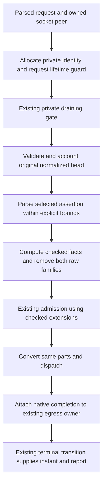

# Axum diagnostics and trusted incoming proxies implementation plan

Date: 2026-10-06
Status: local implementation and integration verification complete after plan approval, an authorized open-stack exception, and the approved native JSON privacy extension. Draft stacked PR preparation is authorized. Accepted-stack and final-image acceptance remain deferred.

Issue: [#397](https://github.com/stackpop/edgezero/issues/397), under [#391](https://github.com/stackpop/edgezero/issues/391).

Specification: [Axum safe diagnostics and trusted incoming proxies](../specs/2026-10-06-axum-diagnostics-trusted-proxy-design.md).

## Goal and approval boundary

Implement the approved native proxy-trust and safe diagnostic policy using #275's ingress clock and response-owned terminal transition. Keep network parsing, native records, request identity, snapshots, and lifecycle integration in Axum. Add only the portable hooks required by existing consumers and completion ownership.

The user approved planning after a read-only specification review. Approving this plan will authorize its described implementation only after the prerequisite gate below is resolved. No Git rebase, commit, GitHub action, prerequisite exception, or experiment bypass is implied by plan approval alone.

The user subsequently authorized the open-stack exception and requested a draft PR using `gh stack`: "yes open a draft pr stacked with `gh stack` when your done." Implementation therefore proceeds above open #393 PR #407. The branch was fast-forwarded, without rebasing or discarding the untracked specification/plan, from the planning HEAD to `3308041b910b648af746c15e809ee86b96adc2e9`. This does not satisfy the accepted-stack gate, authorize the #394/#395 upload experiment, or authorize closing #397.

- [ ] Confirm the approved integration base and obtain permission for any checkout/rebase operation. Re-audit the accepted #275 revision and completed hosting stack before production implementation. #275 is still open; this gate is not satisfied.
- [ ] Reconcile applicable #393 and #394/#395 work at that base. Observe their accepted failures and lifetimes, not new buffering, transport, deadline, overload, or upload mechanisms. Do not require their entire historical backlog to close before planning #397.
- [ ] Refresh the file/call-site inventory and tests after integration. If hooks materially differ, revise the plan before code. Working on an unaccepted stack requires a separately recorded user decision.
- [x] Obtain approval of this plan's API and compatibility choices, including removal of raw forwarding headers on the managed path.

Keep #389 optional. Do not add a metrics exporter, HTTP diagnostics endpoint, tracing propagation, vendor integration, generic field-selection framework, request registry, second server, second response finalizer, or portable Send migration. Packaging preparation remains independent.

## Audited planning baseline

Repository HEAD is `3ab22096fd117f7506cf437b5ba128e0789e059c`, including the committed #392/#396 hosting implementation. The governing untracked specification has SHA256 `d44dc2a89f44b2e2a2b13843516f8b570c40c9123d9fd6b57142d9663cc8b797`.

Remote source state inspected during planning:

- #275 is open at `950cb81d406d0dc269baf94314547329a4c1cef0`.
- #389 is open at `ab444946fcacb1d44c020c6079abb6ba29231402`.
- #393 PR #407 is open at `3308041b910b648af746c15e809ee86b96adc2e9`; its changes are not in this checkout.
- #394/#395's untracked documents remain in their owning worktree. This plan neither copies them nor approves their upload experiment.

These are source/path observations, not runtime acceptance evidence. A follow-up plan review resolved the callback-fault logging and early fallback-status gaps, made idle/task/callback ownership explicit, hid ipnet from the public constructor, and pinned strict XFF empty-member handling separately from Forwarded's RFC list tolerance. No runtime proof was claimed by that review.

| Existing boundary | Source and planning consequence |
| --- | --- |
| Owned transport peer | `crates/edgezero-adapter-axum/src/dev_server.rs:593-603` and `service.rs:235-268`. Match only the socket-owned argument, never ConnectInfo supplied by a caller. |
| Managed admission | `service.rs:255-321`. Validate the original head, normalize and strip forwarding fields, then create the admission view and convert the same parts. |
| Existing host consumer | `crates/edgezero-core/src/extractor.rs:228-259`. ForwardedHost currently prefers raw X-Forwarded-Host. It needs a checked-value path; other adapters retain the existing fallback. |
| Completion ownership | `crates/edgezero-core/src/response_egress.rs:445-462,576-690,917-963`. Join callbacks and use transition's existing observed_at. Report elapsed remains egress-only. |
| Error information loss | `crates/edgezero-core/src/app.rs:230-249,341-349`. Capture a bounded category before error rendering consumes EdgeError. |
| Configured fallback responses | `crates/edgezero-core/src/router.rs:599-628`. Body overflow/deadline can return ordinary application-configured responses. Preserve the owning reason separately from status. |
| Residual route-error reflection | `router.rs:513-528` and `error.rs:512-530`. Default framework 404/405 bodies can reflect a raw path or method. Fix the native default presentation, not arbitrary application errors. |
| Lifecycle owner | `dev_server.rs:492-656`. Reuse Starting/Ready/Draining/Stopped, connection tasks, drain budget, and cancellation. |
| Logger ownership | `dev_server.rs:709-712`. owns_logging controls installation only. Facade records and the request-record opt-out remain separate. |

## Chosen implementation shape

Two read-only workers investigated proxy ingress and diagnostics independently, then compared solution proposals. The coordinator inspected their cited code and selected the following shapes.

| Decision | Selected approach | Rejected alternative and reason |
| --- | --- | --- |
| Proxy metadata | Axum policy/parser and native metadata, plus one portable CheckedEffectiveHost value | A generic provider trait adds indirection for one extractor and cannot improve transport provenance. |
| Terminal time | Add a timestamp-aware completion constructor; pass the existing transition instant through join | Sampling in a callback includes earlier callback delay. Adding a public report field unnecessarily breaks downstream report literals. |
| Request records | Attach a native completion to the envelope, with private status/category/identity | Replacing the app observer or installing another finalizer loses ownership and abandonment semantics. |
| Public route errors | Explicit default/custom renderer ownership and native-only framework route detail | New EdgeError variants, fabricated methods, or response-body sanitizers enlarge the contract or bypass custom rendering. |
| Active work | Fixed counters with request/connection lifetime guards | A request map or independent work registry duplicates ownership and is unnecessary for counts. |

### Proposed API surface

These names/signatures are the choices submitted for plan approval, not existing APIs.

Axum exposes public types in `proxy` and `diagnostics` modules; parser functions and accounting guards stay private. Existing AxumRunOptions remains available through dev_server.

```rust
// Axum proxy module
pub enum ForwardingHeaderFamily { Forwarded, XForwarded }
pub struct TrustedProxyPolicy { /* immutable normalized networks and family */ }
impl TrustedProxyPolicy {
    pub fn no_trust() -> Self;
    pub fn new<I, S>(family: ForwardingHeaderFamily, networks: I)
        -> Result<Self, ProxyTrustConfigError>
    where I: IntoIterator<Item = S>, S: AsRef<str>;
}

// Axum hosting options, also provide the matching AxumDevServer builders
pub fn with_trusted_proxy_policy(self, policy: TrustedProxyPolicy) -> Self;
pub fn with_request_records(self, enabled: bool) -> Self;
pub fn with_diagnostics(self, diagnostics: NativeDiagnosticsHandle) -> Self;

// Axum diagnostics module
pub struct NativeDiagnosticsHandle { /* cloneable fixed-counter handle */ }
impl NativeDiagnosticsHandle {
    pub fn new() -> Self;
    pub fn with_request_observer<O>(self, observer: O) -> Self
    where O: NativeRequestObserver;
    pub fn snapshot(&self) -> NativeDiagnosticsSnapshot;
}
pub struct NativeDiagnosticsSnapshot {
    pub active_requests: u64,
    pub active_connections: u64,
    pub idle_connections: u64,
}
pub trait NativeRequestObserver: Send + Sync + 'static {
    fn observe(&self, record: &NativeRequestRecord);
}
```

The native ingress metadata accessor is `IngressHead::extension::<NativeIngressMetadata>()` at admission and `RequestContext::extensions().get::<NativeIngressMetadata>()` later. NativeIngressMetadata has read-only methods for request_id, direct_peer, effective_client, effective_host, effective_scheme, per-field provenance, forwarding_result, and received_normalized_head. Its fields are private. RequestId is opaque and has bounded Display output; it is not an authentication or distributed-tracing token.

Core adds:

- `CheckedEffectiveHost`, containing an optional validated core Authority and host provenance. Its hidden adapter constructor is `from_ingress(authority: Option<Authority>, source: CheckedHostSource) -> Self`; accessors are `authority() -> Option<&str>` and `source() -> CheckedHostSource`. The source enum is Direct, TrustedForwarded, TrustedXForwarded, or Unavailable. Construction is descriptive metadata, not authorization. ForwardedHost reads it first. Checked-unavailable returns the existing localhost fallback without consulting raw forwarding fields. Absence of this type preserves the legacy extractor path.
- `ResponseEgressCompletion::new_with_terminal_time(callback)`, accepting `FnOnce(&ResponseEgressReport, MonotonicInstant) + Send + 'static`. Existing new, report fields, observer signatures, elapsed meaning, and completion ownership remain unchanged.
- `ResponseEgressEnvelope::with_completion(self, completion) -> Self`, joining existing application completion first and native completion second.
- `ResponseEgressEnvelope::failure_classification(&self) -> Option<ResponseEgressFailureClassification>`. The private-field, copyable classification exposes a fixed kind of PropagatedError, FallbackBodyExceeded, or FallbackReadTimedOut, and an optional static `error_kind()` populated only from EdgeError::kind. Only core/owning boundaries construct it; it holds no EdgeError/source/message. The read-only `is_framework_route_error()` bit distinguishes actual router 404/405 from handler errors of the same kind, so native severity does not confuse their provenance.
- Hidden `App::dispatch_admitted_with_framework_error_detail(&self, prepared: PreparedIngress, request: Request, detail: FrameworkErrorDetail) -> ResponseEgressEnvelope`, an async adapter seam. FrameworkErrorDetail has Default and CategoryOnly variants. Existing dispatch_admitted delegates to the same implementation with Default. No duplicated dispatch pipeline.
- `validate_normalized_ingress_parts_with_summary(&RequestParts, IngressHeadLimits) -> Result<NormalizedIngressHeadSummary, EdgeError>`, returning normalized target bytes, header bytes, and field count computed by the existing validator. Existing validation entrypoints retain their signatures and discard that summary. Summary accessors are read-only.

Use workspace dependency declarations for `ipnet = "2.12"` and `getrandom = "0.4.2"`, matching packages already in Cargo.lock. Only Axum's existing axum feature enables these dependencies. Core and other adapters do not depend on either. Do not install/upgrade unrelated packages or change the toolchain.

### Configuration choices

| Setting | Behavior |
| --- | --- |
| `EDGEZERO__ADAPTER__TRUSTED_PROXY_CIDRS` | Comma-separated literal IP/CIDR entries. Unset or empty after trimming spaces/tabs means no trust. Empty interior entries, controls, names, DNS/provider/private/all tokens, invalid CIDRs, and exceeded bounds fail startup. |
| `EDGEZERO__ADAPTER__FORWARDING_HEADER_FAMILY` | `forwarded` or `x-forwarded`. Required for a nonempty trust list. Unknown supplied values fail even when trust is empty. A valid family without networks is inert. |
| `EDGEZERO__LOGGING__REQUEST_RECORDS` | Strict `true` or `false`; omitted means true. Invalid or non-Unicode input fails startup. Controls only default native per-request facade records. |

Production from_env/from_vars uses the captured configuration once. The development run_app path validates these same new settings strictly while retaining its documented behavior for unrelated development settings. It must capture relevant OsString values once so non-Unicode inputs cannot disappear into omission defaults. Explicit options/builders never merge ambient proxy or record settings.

Policy construction accepts literal IP/CIDR strings, keeping ipnet private rather than committing its type to the public API. It consumes at most 256 supplied entries, including duplicates before normalization, and at most 16,384 aggregate text bytes including conceptual separators. Environment network text is checked against that limit before allocating the entry vector. Bound explicit iterators too, and never silently truncate. Empty explicit policy is no trust. Error Display/Debug contain fixed setting/category names only.

The default native diagnostics handle is created per managed runner. Explicitly sharing a handle between runners aggregates its counters and observer records; document that scope. Each runner still owns a separate identity namespace and lifecycle. Snapshot carries no duplicated lifecycle state; lifecycle phase remains owned by the existing runner/reader.

## Proxy parser and trust invariants

### Normalization and matching

1. Canonicalize IPv4-mapped IPv6 socket peers and asserted numeric nodes to IPv4.
2. Truncate networks to their prefix, deduplicate, and project mapped IPv6 networks inside `::ffff:0:0/96` to equivalent IPv4 prefixes. For example, mapped /120 becomes IPv4 /24.
3. A mapped /96 becomes IPv4 /0 and is rejected. A shorter IPv6 prefix intersecting the mapped block contains the entire mapped IPv4 range; reject it rather than silently drop or broaden its IPv4 meaning. Ordinary disjoint IPv6 networks remain IPv6.
4. Check the normalized IPv4 and IPv6 unions separately for complete-family coverage. Reject explicit /0 and equivalent unions. Use bounded numeric interval merging with checked end-point handling, including u128::MAX; do not enumerate addresses.
5. Never infer trust from private/loopback/container ranges. Walk predecessors right-to-left only while the current hop is trusted. Stop at the first untrusted numeric predecessor. A missing/unknown/obfuscated node or all-trusted exhaustion means unresolved direct-client fallback, not leftmost selection.

### Bounds and grammar

The parser is an ordered byte scanner over received field values, not a concatenated string, serde tree, DNS lookup, or provider detector.

- Maximum selected assertion input is 16,384 bytes, counting a conceptual delimiter between repeated fields. Preflight this sum with checked arithmetic before retaining parse data.
- Maximum chain/list resource slots is 64. Each value has one initial slot plus one per comma outside quoting, including tolerated empty members. Summing those slots across repeated field lines gives the bound; a repeated-field boundary is a conceptual comma joining its two neighboring members, not an extra empty member. Thus 32 two-member lines use exactly 64 slots. Maximum parameter slots per Forwarded element is 16, one initial slot plus one per unquoted semicolon, including empty slots. The first exceeded bound invalidates the whole selected assertion.
- Retain at most 64 fixed-size predecessor descriptions, one final host, one scheme, and bounded duplicate-name scratch. Quoted-value decoding and retained host text are each constrained by the same assertion byte budget. Unknown extension payloads are never retained. Scan duplicate parameter names case-insensitively with at most 16 names per element, not an unbounded set.
- Forwarded follows RFC 7239 token/quoted-string grammar, repeated-field order, escapes, duplicate-parameter rules, and its permitted empty semicolon slots. Tolerate empty HTTP list members under the HTTP list rule; they are not invented proxy hops. A substantive element lacking for remains a predecessor gap. Empty-only assertions yield no effective asserted facts. Test these cases explicitly.
- Numeric nodes support RFC IPv4 and quoted bracketed IPv6 with optional numeric or valid obfuscated node ports. Numeric ports are ASCII decimal u16 values. Valid obfuscated ports do not hide the accompanying numeric IP and never affect trust matching. Valid unknown/obfuscated nodes have no usable client IP.
- XFF supports bare IPv4/IPv6, IPv4:port, bracketed IPv6 with optional port, and unknown/obfuscated unresolved nodes. Numeric ports follow the same bounds; accept valid obfuscated node ports as unresolved port detail attached to a numeric node. No hostnames or zone identifiers. Iterate repeated XFF lines in received order. Unlike Forwarded's RFC list tolerance, an empty XFF value/member is malformed and invalidates the entire selected assertion; never skip an empty predecessor slot.
- Scan raw bytes. Do not reject an otherwise valid unknown quoted extension merely because it contains RFC-permitted obs-text; do not use HeaderValue::to_str on an entire Forwarded field. Recognized assertions must satisfy their own node/authority/scheme grammar.
- XFH and XFP are singleton assertions. Repetition or comma-list ambiguity invalidates the selected assertion. Forwarded host/proto may come only from its final element; do not borrow earlier values or another family.
- Validate all recognized assertions before the chain walk, including prefixes that will not be selected. Invalid node syntax, duplicates, host authority, scheme, or parser bounds cause whole-set direct fallback. Unknown/missing nodes are unresolved, not malformed, and may coexist with valid final-proxy host/scheme assertions.
- Host is a nonempty authority without userinfo, whitespace, path, query, or fragment, with a valid optional numeric port. Schemes normalize only http/https. There are no DNS or IDNA lookups. Direct host facts use the HTTP-authoritative head authority, parsing them without inferring scheme from an absolute URI; unavailable direct authority stays unavailable. Direct transport scheme remains HTTP.

The 16KiB/64/16 bounds constrain additional forwarding parsing and retained metadata only. Current locked Hyper 1.10.1 has `DEFAULT_MAX_BUFFER_SIZE = 8192 + 4096 * 100`, or 417,792 bytes, in dependency `src/proto/h1/io.rs:23`. Reconfirm its effective use at the accepted revision. Do not alter the transport parser under #397 or claim the forwarding bound controls Hyper's initial receive allocation, total process memory, or raw parser accounting.

### Managed order and compatibility



The gate still aborts before admission/body work. Moving identity/start capture ahead of it does not normalize or admit a draining request. Head-validation failures retain their existing detached send/abort policy.

With a missing, nonmatching, or disabled trusted-peer policy, do not parse forwarding assertions. Use direct facts and a bounded absent/untrusted-peer result, then strip both families. Only a matching socket peer enables selected-family parsing. This does not let any ignored family escape original-head accounting.

Keep IngressHeadAccounting::HostManaged. The original normalized size summary is captured by the same validation loop before stripping and carried separately; do not call it raw wire bytes or upgrade capabilities. Admission sees checked headers and can read that original normalized summary. Head limits cannot be bypassed by stripping.

Remove Forwarded and every case-insensitive X-Forwarded-* header, trusted or untrusted, before admission. Preserve Host, URI, direct AxumRequestContext.remote_addr, and other adapters. Overwrite any incoming checked metadata extension with the service-owned result. The public low-level into_core_request converter remains a documented bypass, not a policy-aware trust entrypoint.

Document per-field fallback/provenance independently from the aggregate forwarding result. Incomplete client information must not discard valid final-proxy host/proto as though it were malformed; conversely malformed client text must discard all selected assertions. No raw invalid value enters a reason or record.

## Diagnostics ownership and privacy

### Identity and lifetime

Generate a process nonce using getrandom once, before Ready. Pair it with a process-wide checked hosting sequence and a checked per-host request sequence. RequestId is the fixed-width concatenation of 128 nonce bits, 64 hosting-sequence bits, and 64 request-sequence bits, rendered as 64 hex characters.

This gives deterministic non-reuse within a process, including concurrent hosting instances, and entropy-based separation between processes. It is not a mathematical global uniqueness guarantee or a security credential. No caller-selected namespace or incoming request ID participates. Entropy failure fails startup with a safe category; hosting-sequence exhaustion fails startup; request-sequence exhaustion emits a safe runtime fault and aborts without reusing an ID or inventing status. Inject entropy/sequence sources only in tests. No predictable fallback, wraparound, response header, or propagation is added.

Keep the authoritative ID and method in the private request guard. Publish only a copy in NativeIngressMetadata. Use the existing app monotonic clock/start for both ingress and diagnostics; capture it once at the parsed service boundary, including drain-gate exits.

A request guard is non-clone. It counts admission, body read, handler execution, and egress. On response paths it moves into the joined native completion; completion or abandonment releases it. On no-response Abort/draining/cancellation, release it through the actual ingress/drop path and emit a separately named, status-less record. Unbegun envelope abandonment invokes no fabricated egress callback/report; do not log its merely prepared status as a transmitted response.

Use fixed counters, not a work map. active_connections is the total runner-owned connection-task count, including idle keep-alive tasks; idle_connections is its idle subset. Store a small connection-local activity count with the existing connection task. First active request makes that connection busy; the last released request makes it idle. Construct and increment the task guard before submitting the future to JoinSet, then move it into that future. It tracks connection lifetime and releases on return, cancellation, or panic, including an unpolled aborted task. The request guard and its counter/activity links use Arc/Mutex state satisfying the existing completion Send bound; EgressConnection and portable body streams keep their current non-Send ownership. Updates use short synchronous locks in a fixed connection-then-counter order; snapshot takes only the counter lock. No lock is held through a callback, logger, await, or body poll. Closed connection state prevents a late request release from recreating idle connections.

Snapshot reads the three counters coherently under one short lock. It is a momentary observation, not an atomic combination with lifecycle phase, kernel buffers, detached application work, or external services. Sharing a diagnostics handle explicitly aggregates these counts without creating a registry.

### Terminal time, selected status, and categories

- Store one private timestamp-aware callback signature. Existing new adapts a report-only callback by ignoring the supplied time; new_with_terminal_time stores its callback directly. No callback-kind enum or duplicated completion path is needed. transition supplies its existing observed_at after storing terminal state and before invoking callbacks. join forwards the same instant through every nested child and retains independent unwind boundaries. Existing application completion runs before native completion; existing application observer still runs afterward. Guard the existing core callback/observer/policy panic-report log attempt with its own catch_unwind. Attempt that fixed-category report once, suppress a logger panic, and never retry/log that logging failure. The current unguarded log after catching a callback panic can otherwise skip the next joined child or recurse; add a focused regression for that exact path.
- Do not change ResponseEgressReport or elapsed. Native total duration uses terminal_instant.checked_duration_since(request_start). Preserve backwards-clock classification and report a safe clock fault rather than falling back to wall time.
- Attach native completion on every response envelope, including refusal, detached errors, conversion failure, dispatch errors, fallback, and ordinary success. A private selected-status slot captures the envelope's initial selected status before begin and is updated at the actual prepared/fallback selection before any terminal call. Set fallback 500/504 even on failed fallback registration/preparation before settling the attempt. In prepare_fallback's fail-closed begin_fallback == false branch, store the returned detached 500 before terminating any still-live attempt. An already-terminal attempt cannot emit another record or have its previous record rewritten; prove the managed path reaches fallback only with an Initial, unterminalized attempt and include defensive-state tests. The slot is never a public response extension or another finalizer.
- Preserve typed failure provenance before rendering. A private router dispatch result marks only router-owned NotFound/MethodNotAllowed and configured fallback-body exceeded/timed-out branches. Existing public router dispatch APIs unwrap that result; App uses its classification. Propagated EdgeError captures only a bounded kind/reason, never Display/Debug/message/source. Admission refusal is classified at its owning outcome; deliberate application 413/503 statuses alone carry no framework rejection.
- NativeRequestRecord is a fixed allowlist: event, ID, known-method/other category, route template or fixed unmatched/unknown, optional selected status, total duration, typed terminal/ingress outcome, bounded failure/forwarding category, and optional egress byte/body/fallback accounting. No full report copy containing arbitrary route class, no addresses, hostnames, raw target/query, headers, payload, config/secret values, origin URLs, or source strings.
- A selected 200 and SourceError/DeadlineExceeded/TransportError remain separate facts. Egress-accounted bytes are not delivered TCP bytes; selected status is not wire commitment or receipt. Wire fixtures observe those separately.
- Release request accounting before native sinks. Default request facade output and the optional native observer are isolated individually on unwind-capable targets, including Drop paths. A broken logger must not be called recursively to report its own panic. Existing app panic-abort limitations remain.

Default events use target `edgezero::native`: `request_terminal` for begun attempts, `request_ingress` for no-response/abandonment, and `lifecycle` for owner transitions/failures. Escape application-owned route-template text for one-line output without logging raw paths. Known HTTP methods are fixed names; every extension method becomes `other`.

Ordinary completion/canonical route miss and expected draining events use INFO. Typed refusal, malformed forwarding, propagated request errors, and failing/abandoned attempts use WARN. Startup/runner faults and unusable identity/clock state use ERROR. Status alone never selects a level. Malformed-forwarding reason is included in the eventual request record, not a second per-request terminal record.

Request-record opt-out suppresses default request_terminal/request_ingress logs only. Native/app observers, lifecycle records, counts, and snapshots remain active. Hooks::owns_logging is unchanged: use log facade without installing a competing logger/subscriber. A synchronous logger/observer can block; add no queue, retry, flush wait, timer, or shutdown budget. Process abort/SIGKILL has no completion or flush promise.

### Residual default public route errors

Keep one error serializer. Internally represent renderer ownership as `Default | Custom(callback)`, replacing the current always-callback representation, not adding a synchronized boolean.

Managed native dispatch requests CategoryOnly detail. Router-owned 404/405 errors get explicit private provenance tags at their construction branches. Only the default renderer uses a fixed public message for those tags while the same serializer keeps status/kind/required headers, including Allow. Custom renderers receive the unchanged original error and retain control as today. Legacy dispatch on other adapters retains existing text. Handler-generated NotFound/MethodNotAllowed and application validation messages are not silently treated as framework routing errors.

Audit other framework call sites for source-bearing messages in categories that #275 intentionally leaves application-controlled. Fix only demonstrated native framework boundaries with safe fixed messages or the established renderer, preserving custom response ownership. Do not add a sanitizer, regex masking, source-string logging, or universal application-response redaction. Any wider change discovered here returns to plan review.

## Delivery checklist

### Task 0: Refresh the accepted base and acceptance inventory

Files to inspect: core app/ingress/router/error/response_egress; Axum service/request/response/connection/dev_server/run_options; accepted #393 body policy; existing hosting/contract fixtures.

- [ ] Resolve the approval/prerequisite gate without discarding untracked documents.
- [ ] Inventory existing versus missing cases from the specification's acceptance table. Retain Unsupported/BestEffort classifications.
- [ ] Record exact base SHA, relevant uncommitted inputs, dependency/tool versions, and fixture/logging environment. Confirm any shared-build command owner.
- [x] Establish focused baseline using `cargo test -p edgezero-core` and `cargo test -p edgezero-adapter-axum --all-targets --all-features`. Both passed at the open #407 head before implementation. Logs: `/tmp/edgezero-impl-397/baseline-core.log` and `baseline-axum.log`.

### Task 1: Add minimal portable completion, provenance, and renderer hooks

Modify: `crates/edgezero-core/src/{response_egress,app,router,error}.rs`; re-export only required adapter-facing types in lib.rs.

- [x] Add red tests for timestamp-aware completion, nested joins, exact supplied terminal instant, app/native/observer ordering, left/right panic isolation, repeated terminal signals, and unbegun abandonment with resource release but no report.
- [x] Implement the additive timestamp-aware constructor and envelope composition. Keep report shape, report-only callbacks, elapsed, sole transition, and observer API unchanged. Contain the existing core callback/observer/policy panic-report log attempt independently, without retry or recursive logging; test that a left callback plus its logger can panic without suppressing the right timed child or the app observer. Extend the same focused matrix to policy/observer panic-report logging so those newly guarded paths are exercised too. Use an isolated logger fixture or thread-scoped test logger, not competing process-global logger initialization.
- [x] Add private dispatch-result provenance and immutable envelope classification before rendering. Tag configured fallback overflow/deadline responses at their owner, without altering their selected body/status or public router signature.
- [x] Add the default/custom renderer distinction and native dispatch detail seam. Factor message selection into the existing serializer. Test default native fixed 404/405, required Allow, unchanged legacy output, unchanged custom renderer inputs, and no tag on handler-selected errors.
- [x] Run `cargo test -p edgezero-core --lib response_egress`, `cargo test -p edgezero-core --lib app`, `cargo test -p edgezero-core --lib router`, `cargo test -p edgezero-core --lib error`, and `cargo test -p edgezero-core --doc`.

### Task 2: Implement native trust configuration and bounded parsing

Create: `crates/edgezero-adapter-axum/src/proxy.rs`. Modify: root/Axum Cargo manifests and Cargo.lock only as needed for direct gated dependencies; Axum run_options.rs/lib.rs.

- [x] Add pure red tests for no-trust defaults, strict env/family parsing, safe error formatting, raw entry/byte caps, CIDR truncation/deduplication, mapped equivalence, entire-family unions, and trust-all rejection.
- [x] Implement validated immutable policy using ipnet. Bound explicit iterators as well as environment input; no DNS or provider discovery.
- [x] Add parser tables for repeated fields/order, quotes/escapes/obs-text extensions, case-insensitive duplicates, valid empty slots, IPv4/IPv6/node ports, unknown/obfuscated gaps, host/scheme validation, selected-family isolation, and singleton XFH/XFP.
- [x] Prove exactly 16KiB/64 slots/16 parameters succeeds when semantically valid and each next unit yields whole-set direct fallback. Include mixed good host/proto plus malformed client and unknown-but-valid client cases.
- [x] Cover right-to-left spoofed prefixes, partial trust, gaps, and all-trusted exhaustion with pure tests. Pin strict XFF empty-value/member handling: present-empty or mixed-empty XFF invalidates the complete family, including otherwise-valid XFH/XFP, while absent XFF permits individual host/proto acceptance. Forwarded's RFC empty-list tolerance remains separate.
- [x] Run `cargo test -p edgezero-adapter-axum --lib proxy` and `cargo test -p edgezero-adapter-axum --lib run_options` after each coherent change.

### Task 3: Integrate checked metadata before managed consumers

Modify: core ingress.rs/extractor.rs/lib.rs; Axum service.rs/dev_server.rs/run_options.rs/proxy.rs. Request conversion remains unchanged except documented bypass.

- [x] Add CheckedEffectiveHost and accounted normalized-head helper using the existing validator's loop. Preserve old signatures and HostManaged markers.
- [x] Carry native metadata through existing extensions. Normalize/strip after original-head validation and before IngressHead construction. Match the private peer argument even if a test supplies fake ConnectInfo/metadata.
- [x] Wire the same policy into standalone production, development, explicit-options hosting, and AxumDevServer builders, validating before Ready. Explicit APIs ignore ambient policy settings.
- [x] Add service tests proving admission/middleware/handler/ForwardedHost agree, received normalized summary still includes removed fields, pre-strip overages still reject, Host/URI/direct peer stay unchanged, and raw fields are absent even when trusted.
- [x] Retain legacy extractor tests without checked metadata, including nonnative/default/local fallback. Test checked-unavailable cannot fall through to raw forwarding text.
- [x] Run `cargo test -p edgezero-core --lib ingress`, `cargo test -p edgezero-core --lib extractor`, `cargo test -p edgezero-adapter-axum --lib service`, and `cargo test -p edgezero-adapter-axum --lib dev_server`.

### Task 4: Add native identity, lifetime accounting, and safe observer data

Create: `crates/edgezero-adapter-axum/src/diagnostics.rs`. Modify: Axum lib.rs/run_options.rs/dev_server.rs/service.rs/proxy.rs. Add getrandom gated dependency if not added in Task 2.

- [x] Add red tests for deterministic hosting/request non-reuse, independent nonce sources, entropy failure, sequence exhaustion without wrap, incoming-ID/public-metadata mutation, and no automatic response header.
- [x] Implement native session initialization before Ready and generated ID/start capture before the private gate. Public metadata copies cannot change private correlation.
- [x] Implement Send-safe request/task counter links and fixed counter snapshots, including idle/busy connection transitions, two pipelined request lifetimes on one connection, and closed-connection late cleanup. Construct the connection guard before JoinSet submission. Prove an idle owned task contributes one active_connection and one idle_connection but no active_requests.
- [x] Prove release on completion, explicit Abort, pending-admission/body/handler cancellation, unbegun envelope drop, task aborted before polling, and observer/logger panic. No fabricated report/status on those no-response paths.
- [x] Add the one typed native observer and strict request-record setting. Opt-out must not disable counts or either application observer.
- [x] Run `cargo test -p edgezero-adapter-axum --lib diagnostics`, `cargo test -p edgezero-adapter-axum --lib run_options`, and affected service/dev_server tests.

### Task 5: Attach correlated terminal records at the existing owner

Modify: Axum service.rs/response.rs/diagnostics.rs/dev_server.rs. Use Task 1's shared hooks; do not replace App policies or observers.

- [x] Attach native completion to all envelopes and classify status-less explicit branches separately. Ensure abandonment Drop cannot duplicate an explicit record.
- [x] Capture selected status privately before begin; update it at prepared/fallback selection before any settlement, including the early begin_fallback == false detached-500 branch and fallback preparation/registration failure. Prove the managed precommit fallback entry invariant and test defensive live/already-terminal states without a second record. Post-commit failures keep the original selected status.
- [x] Add deterministic clock tests with distinct pre-egress, egress, application-callback, and logger delays. Total duration must exclude callback/logger delay and differ from egress-only elapsed.
- [x] Add record/level/cardinality tests for propagated errors, configured fallback reasons, custom 413/503, source/deadline/disconnect failures, malformed forwarding, refusal, cancellation, and opt-out. Use existing clock fixtures and no source-message matching.
- [x] Audit existing per-request Axum warnings. The old source-failure warning was removed; native records remain the sole request-terminal record and opt-out controls that sink. Preserve core callback-fault diagnostics. A dedicated source-error-under-optout socket combination remains untested, as recorded below.
- [x] Add safe lifecycle events at the actual runner transitions and startup/runner/grace-exhaustion/forced-stop returns, retaining safe returned startup errors when a logger has not yet been installed. Do not change signals, readiness, acceptance, drain budget, or teardown.
- [x] Run `cargo test -p edgezero-adapter-axum --lib response`, `cargo test -p edgezero-adapter-axum --lib service`, `cargo test -p edgezero-adapter-axum --lib connection`, and `cargo test -p edgezero-adapter-axum --lib dev_server`.

### Task 6: Prove the managed production path with existing sockets/fixtures

Modify: `crates/edgezero-adapter-axum/tests/production_hosting.rs`, `tests/fixtures/production_host.rs`, and nearby service tests. Add a test-only `tests/fixtures/native_proxy.rs` helper and static local TLS certificate/key fixtures. Reuse outbound contract origins where relevant; no new runtime server.

For the local TLS fixture, declare the already-locked rustls 0.23.40 and tokio-rustls 0.26.4 families through workspace dependencies and Axum dev-dependencies only. Match the accepted reqwest crypto backend; add no competing crypto provider or production incoming-TLS dependency. The test client trusts only the fixture CA and verifies the fixture server name; never disable TLS verification. Fixture private keys are test-only, not application secrets.

- [x] Extend the existing subprocess fixture with test-only metadata observation and a captured application-owned log implementation installed once per process. Include a mode whose logger panics while reporting an app completion panic; the timed native child and app observer must still run, counters must release, and logging must not recurse. Keep fixture diagnostics routes test-only. Assert no competing logger/subscriber initialization and original app hook counts/order.
- [x] Exercise default spoofed input, matching/nonmatching peers, both selected families, conflicting/missing/malformed assertions, head overages, and explicitly trusted mapped/CIDR cases. Missing private peer is a managed-service fixture case, not falsely claimed as a real accepted socket condition.
- [x] Add local forwarding fixtures with actual accepted socket peers for single/multi-proxy chains, partial trust, spoofed prefixes, gaps, and a sanitizing gateway. Bind outgoing proxy sockets to distinct loopback addresses with TcpSocket, so each hop's actual predecessor differs from the visitor. Configure only those proxy /32 entries as trusted. Pure fabricated header chains alone do not prove proxy peer ownership. Observe admission, middleware, handler, and ForwardedHost. Keep proxy-head buffering finite and use a bounded duplex relay, not a collected response.
- [x] Use a controlled local TLS-terminating ingress fixture for HTTPS public assertions over an HTTP native hop. Keep that TLS fixture test-only; do not add native incoming TLS. Prove overwrite obligations and that client/earlier-hop host/proto cannot win.
- [x] Inject sentinel secrets into unmatched path, query, extension method, headers, payload, configuration, conversion/dispatch/internal/upstream errors, and failing response sources. Assert absence in default client errors and all ordinary framework logs, including DEBUG paths; application/custom-renderer output remains explicitly outside that default guarantee.
- [x] Observe actual wire head/prefix before source/deadline/disconnect failure. Assert one native terminal record, selected status plus failure, preserved app callbacks, and no second response. Reuse existing zero-read/deadline/disconnect fixtures rather than re-proving #394 transport claims here.
- [x] Exercise #393 413 and cleanup on the authorized open base through managed hosting, not just error construction. Preserve its configured ceiling and body semantics.
- [x] Hold body/handler/egress work and idle keep-alive sockets, accounting for the query itself, and verify graceful or budget-forced cleanup. Admission cancellation and unpolled task ownership are separately executed service/unit tests, not a held asynchronous-admission socket witness.
- [x] Run `cargo test -p edgezero-adapter-axum --all-features --test production_hosting`, `cargo test -p edgezero-adapter-axum --all-targets --all-features`, and the focused affected outbound contract cases. Do not label local socket results final-image acceptance; #398/#399 reuse them later.

### Task 7: Publish operator and compatibility guidance

Create: `docs/guide/axum-diagnostics.md`. Modify only related sections/links in `docs/guide/adapters/axum.md` and the documentation navigation if required.

- [x] Document settings/defaults/bounds, all-or-nothing versus unresolved fallback, network isolation, explicitly trusted chains, final-proxy overwrite/verification, and no automatic provider-range discovery.
- [x] Include Nginx, Cloudflare-plus-load-balancer, and gateway-replacement examples. Explain which operator configuration supplies verified assertions; do not promise every provider default fits the policy.
- [x] Document raw-header application migration to NativeIngressMetadata/ForwardedHost, direct peer preservation, unavailable authority, and low-level converter bypass. No raw outbound propagation recipe without a separate decision.
- [x] Show custom logging initialization, request-record opt-out, snapshot access, and safe native-observer metric counters/durations. IDs, addresses, payloads, and secret values are not metric labels. Ship no exporter or public endpoint.
- [x] Explain timestamp/status/byte guarantees, synchronous logger blocking, panic-abort/SIGKILL, identity scope, and shared snapshot-handle scope. Keep #389 optional and label final-image validation downstream.
- [x] Do not fix unrelated stale Docker/storage/CLI documentation under this task; record those with their owners if encountered.
- [x] Run `cd docs && npm run lint && npm run format && npm run build` for published docs changes. Internal superpowers plans/specs are excluded from Prettier; formatting is not acceptance evidence.

### Task 8: Verify integrated state and prepare acceptance evidence

Run one command owner per shared Cargo target directory. Reuse checks only when their tested state and affected inputs remain current.

- [x] `cargo fmt --all -- --check`
- [x] `cargo clippy --workspace --all-targets --all-features -- -D warnings`
- [x] `cargo test --workspace --all-targets`
- [x] `cargo check --workspace --all-targets --features "fastly cloudflare spin"`
- [x] `cargo check -p edgezero-adapter-fastly --target wasm32-wasip1 --features fastly`
- [x] `cargo check -p edgezero-adapter-cloudflare --target wasm32-unknown-unknown --features cloudflare`
- [x] `cargo check -p edgezero-adapter-spin --target wasm32-wasip2 --features spin`
- [x] Published docs checks from Task 7 and a compiled API/options/snapshot smoke. The existing ignored generated-workspace compile smoke remains excluded; no CLI template change was made.
- [x] Hand integrated verification to a read-only build/acceptance worker and independently inspect its evidence. Record unavailable SDK/target/tool checks as gaps, not passes.
- [x] Record each specification acceptance row as covered-by-existing-test, newly-proved, or explicitly outstanding, with command, exact tested revision/untracked inputs, environment, elapsed time, result, and log/wire artifact.

## Acceptance ownership and stop conditions

Task 1 proves portable clock/composition/provenance and native default route privacy. Tasks 2-3 prove configuration, syntax, trust, consumer order, and extractor compatibility. Tasks 4-5 prove identity, counts, safe fields, correlation, levels, observer ownership, and lifecycle diagnostics. Task 6 is the production/managed socket evidence required by every applicable specification row. Tasks 7-8 document and verify the integrated result.

The two highest-risk assumptions are now proven at the local Runtime boundary, not at accepted-stack or final-image acceptance:

1. Socket-peer-gated checked facts reach admission, middleware, handlers, and ForwardedHost. The production-hosting tests use actual source-bound .2/.3 proxy sockets, direct and nonmatching controls, both header families, and verified TLS with a wrong-name negative control.
2. Native observations preserve the sole terminal owner and application hooks. The production-hosting tests observe actual head/prefix before source/deadline/disconnect failures and assert selected status, exact record/callback counts, order, and released work. Precise terminal-time duration and callback-delay exclusion are separately Executed with injected Core/service clocks.

Stop and return to plan review if the accepted stack requires another finalizer/clock, blanket Send changes, transport/parser changes to satisfy a new memory guarantee, a generic observability registry, broader application-message redaction, or a new policy-aware low-level converter. Do not select new workload concurrency/deadline defaults to finish diagnostics.

Planning verification was read-only source/issue inspection and document consistency. No runtime proof was claimed at plan approval. Implementation checks are recorded below; they do not discharge deferred gates. #397 must not close until its accepted-stack and runtime evidence gates are actually satisfied.

## Intermediate implementation evidence

The coordinator owns shared Cargo commands and global formatting. Proxy and diagnostics workers edit exclusive new modules, return ownership before integration, and run no shared Cargo commands. Their investigations/proposals and plan reviews are retained in `/tmp/edgezero-plan-397/`; module handoffs are in `/tmp/edgezero-impl-397/`.

Environment: Rust/Cargo 1.95.0, Node 24.12.0, native `x86_64-unknown-linux-gnu`; all three planned WASM targets are installed. Native dependencies enable only already-locked ipnet 2.12.0 and getrandom 0.4.2. The two direct lockfile edges are the only dependency changes so far.

Current local evidence, on uncommitted implementation above `3308041`:

- Core library checkpoint passed 727 tests before adding the isolated fault-logger regression, log `core-integrated.log`, test execution 0.21s.
- Portable completion suite passes after formatting and the new isolated subprocess regression. The fixture proves completion, policy, and observer fault reporting remains contained when the installed facade logger panics. It also proves the native child receives the original terminal instant after the application callback advances the clock. Log `core-completion-formatted.log`.
- Axum library checkpoint passed 198 tests, including 24 proxy and 21 diagnostics cases. Log `native-formatted.log`, test execution 0.72s.
- `cargo clippy -p edgezero-core -p edgezero-adapter-axum --all-targets --all-features -- -D warnings` passed, log `clippy-formatted.log`, 4.56s.
- Shared formatting has run. Final formatting, workspace/WASM checks, managed socket evidence, operator docs, independent verification, and PR submission are not yet complete.

The summary-helper name was clarified during integration to `validate_normalized_ingress_parts_with_summary`. Failure classification gained only a read-only router-origin bit, keeping its original bounded kind and existing report shape. Neither change adds another validator, clock, finalizer, or native registry.

### Approved additional native JSON privacy boundary

A direct executable reproduction of the existing native-budgeted JSON reader found that `RequestContext::json_within::<u64>` maps serde's wrong-type error into an application-controlled BadRequest message. Input `"PAYLOAD_SENTINEL"` yields HTTP 400 with `invalid JSON payload: invalid type: string "PAYLOAD_SENTINEL", expected u64 ...` in the default serializer. Source: `crates/edgezero-core/src/context.rs`, JSON deserialization error mapping. Reproduction and output are `/tmp/edgezero-impl-397/repro-json-privacy.rs` and `repro-json-privacy.log`.

This is a pre-existing framework-owned payload disclosure, not a native record/log disclosure or a regression introduced by these hooks. The user explicitly approved native-only fixed JSON parse text after clarification of the compatibility change. `json_within` now maps deserialization errors to `invalid JSON payload` when the request carries the existing managed body policy. It preserves HTTP 400, nonnative serde detail, and body-drain or application-authored EdgeErrors. Custom renderers retain response ownership but receive fixed text for these native deserialization failures. No message/status matching, universal sanitizer, or new provenance flag was added.

The new wrong-type/payload sentinel regression failed before the fix, log `json-privacy-red.log`, and passed afterward with all 731 Core library tests and doctests, log `core-json-privacy-green.log`. Managed wire coverage uses a fixture-only POST `/native-json-number` handler. The native TLS test dependencies use already-locked rustls 0.23.40 and tokio-rustls 0.26.4 as Axum dev-dependencies only; no provider package was upgraded.

The new service test handoff also exposed two incorrect test assumptions: refusal intentionally has no application egress observer, and a terminal-error private body is checked with `is_end_stream`/drop rather than repolling a pending source. Corrections are confined to those assertions, preserving the prerequisite's production lifetime behavior. The first service run timed out after 600s; its output is retained as a failed check, not runtime proof.

After those assertion corrections and scoped fixture lint fixes, all 42 service cases passed in 0.55s (`service-managed-lint-fixed.log`), all 16 existing production-hosting socket scenarios passed in 3.13s (`hosting-fixture-lint-fixed.log`), and the Core/Axum all-target/all-feature Clippy command passed in 1.84s (`clippy-fixtures-fixed.log`). The 16 hosting cases establish regression coverage for the extended fixture; they do not yet exercise the new proxy/TLS scenarios. The test-only proxy helper and certificate assets exist but are not wired into a test module or dependency manifest yet. The user subsequently approved the JSON compatibility decision and its focused Core regression passed. The following final local checkpoint supersedes these intermediate results.

## Final local integration checkpoint

Date: 2026-10-07. Base: `3308041b910b648af746c15e809ee86b96adc2e9`, the still-open #407 head, rechecked before PR preparation. #275 also remains open at `950cb81d406d0dc269baf94314547329a4c1cef0`. No accepted-stack or final-image evidence is claimed.

Environment: Rust/Cargo 1.95.0, Node 24.12.0, Linux `x86_64-unknown-linux-gnu`, local subprocess and loopback HTTP/1/TLS fixtures. Test keys are explicitly public fixtures, not deployment credentials. Dependency changes are four direct Axum edges to already-locked ipnet 2.12.0, getrandom 0.4.2, rustls 0.23.40 and tokio-rustls 0.26.4. The last two are dev-only. No package version changed.

The final runtime-input manifest covers modified Rust/Cargo/published docs and new parser/diagnostics/proxy/TLS files, excluding the changing internal plan and immutable specification. Its SHA256 is `ac40934b17bb6c521951f15090e2accf3059abcb4d386c6da74a69d95de8c9d7`, stored at `/tmp/edgezero-impl-397/final-runtime-inputs.sha256`. Bind these tests to the resulting implementation commit; no runtime input changed after this checkpoint.

All logs below are under `/tmp/edgezero-impl-397/`. Broader passing suites supersede the checklist's narrower filters; those checkboxes describe covered test groups, not an assertion that every listed filter was run separately.

| Check | Result | Time | Log |
| --- | --- | --- | --- |
| `cargo fmt --all -- --check`; `git diff --check` | Pass | Check-only | `fmt-final.log` |
| `cargo clippy --workspace --all-targets --all-features -- -D warnings` | Pass | 4.35s real | `workspace-clippy-final.log` |
| `cargo test --workspace --all-targets` | Pass; 1,938 tests across 27 suites, one existing ignored compile smoke | 51.85s real | `workspace-tests-final.log` |
| `cargo test -p edgezero-adapter-axum --all-targets --all-features` | Pass; 255 all-feature library, 13 standalone contract and 32 hosting tests | 12.84s real; hosting 6.54s | `axum-all-final.log` |
| `cargo test -p edgezero-core` | Pass; 731 library, two integration cases, two ordinary and four compile-fail doctests; 13 existing ignored examples | Unit and doctest times in log | `core-final.log` |
| `cargo check --workspace --all-targets --features "fastly cloudflare spin"` | Pass | 5.66s real | `workspace-check-final.log` |
| Fastly `wasm32-wasip1` check | Pass | 0.66s real | `wasm-fastly-final.log` |
| Cloudflare `wasm32-unknown-unknown` check | Pass | 0.67s real | `wasm-cloudflare-final.log` |
| Spin `wasm32-wasip2` check | Pass | 0.75s real | `wasm-spin-final.log` |
| Locked `npm ci`, docs lint, format and build | Pass | Build 3.13s | `docs-{install,lint,format,build}.log` |
| Compiled guide APIs, explicit options and empty snapshot smoke | Pass | Local executable | `docs-api-smoke.log` |

Final fixture hashes: hosting test `5c9d6e6170289933d064e49a9280428c01fb9bf6d1e3a955577acf599d952368`, host executable source `4e7e11d6b04d16992ec34642ad914e80b714454ea8a402605b595d5bced5b6fe`, relay helper `0dc5d7a839a1e47cde609cd73158c981517f8ca9f052c71d165f30b5ab791adc`. All are covered by `axum-all-final.log` after final formatting. The three defensive response tests retained their handoff hash `bad0422ea9e9daf24e7729ad3c6826a340f396fc6c5dd948c78f596ef3e79b93`; global formatting did not change that file.

### Independent inspection and corrections

Four read-only lanes inspected the stable 20-file production/API/doc target at manifest `0f6c234f6506f0f541dc4b78017b1485bb66c2bead136e02b8a3fe0d76aeb6c3`. The changing executable/socket/helper fixtures were excluded from that source target and inspected separately by the acceptance worker and runtime tests. Architecture found no defects. Correctness found C1, a lost rejection category on detached Abort. A real-socket regression failed with `failure=None`, then passed after retaining only `error.kind()` in the private native guard before core consumed the error. It still emits one status-less record with no bytes/body report and releases work. A focused post-format review confirmed C1 resolved. Style T1 was resolved by global formatting and its final passing check. Maintenance-only S1 notes duplicated IPv6 bracket splitting in node/authority parsers. It remains unchanged to avoid a parsing refactor unrelated to behavior; their port grammars intentionally differ.

The acceptance worker mapped all 22 specification rows, inspected concrete assertions and actual parent logs, and exposed the unused config/secret sentinel and defensive-status gaps. The fixture now captures actual environment-derived configuration/secret values into immutable state, composes them into internal/upstream errors, and proves consumption with exactly two nonsecret markers. Default wire errors and framework facade logs exclude those values. This is not declared-store/backend or actual outbound-origin proof. Three added private response tests execute live duplicate fallback, already-terminal no-rewrite, and failed fallback registration for selected 500/504 with one callback/record and zero work. Static fixed fallback framing is valid by construction; its unreachable preparation-failure branch was not artificially injected.

### Acceptance row inventory

All named native socket tests are in `tests/production_hosting.rs`; the 32-test suite contains 16 existing hosting cases and 16 new cases. The following abbreviated W keys identify those new tests:

| Key | Test name after `native_` |
| --- | --- |
| W01 | `direct_boundary_strips_spoofs_and_accounts_the_original_head` |
| W02 | `source_bound_single_proxy_and_mapped_cidr_match_only_owned_peers` |
| W03 | `two_proxy_chain_stops_at_untrusted_hop_and_gateway_replaces_prefix` |
| W04 | `selected_families_conflicts_malformed_sets_gaps_and_exhaustion` |
| W05 | `verified_tls_ingress_overwrites_public_assertions_and_rejects_wrong_name` |
| W06 | `default_errors_json_cap_and_logs_keep_sentinels_private` |
| W07 | `custom_renderer_keeps_ownership_but_framework_json_parse_text_stays_fixed` |
| W08 | `original_head_overage_cannot_be_hidden_by_raw_header_stripping` |
| W09 | `ids_remain_private_under_mutation_and_concurrent_hosting_requests` |
| W10 | `logger_panic_preserves_order_cardinality_and_resource_release` |
| W11 | `actual_wire_prefix_precedes_source_and_deadline_failure_without_second_response` |
| W12 | `actual_wire_disconnect_keeps_selected_status_and_one_terminal_owner` |
| W13 | `refusal_and_no_response_abort_keep_separate_observer_contracts` |
| W14 | `idle_and_held_work_snapshots_drain_to_zero_with_request_records_opted_out` |
| W15 | `invalid_proxy_and_record_settings_fail_before_ready_without_input_disclosure` |
| W16 | `non_unicode_proxy_and_record_settings_fail_instead_of_defaulting` |

| Specification row | Local coverage and boundary |
| --- | --- |
| Default no trust | Runtime W01; managed forged-extension matrix separately executed. |
| Explicit trusted peer | Runtime W02-W04 with actual .2/.3 sources and nonmatching control; mapped CIDRs on IPv4 sockets are not IPv6 transport proof. |
| Peer unavailable | Executed managed service/private-peer-none matrix; an accepted TCP socket cannot provide a real missing-peer case. Converter bypass is documented. |
| Family selection | Runtime W04, both families and missing/conflicting assertions without borrowing. |
| Parsing | Runtime representative W04/W08 plus 24 parser cases. Exact byte/slot/parameter bounds, obs-text, escapes and exhaustive IPv6/port grammar are pure parser evidence. |
| Spoofed prefix | Runtime W02-W04, actual multi-hop/partial trust/gaps/exhaustion and replacing gateway. Gateway client is operator supplied, not discovered/authenticated by EdgeZero. |
| Malformed whole-set fallback | Runtime W04 verifies bad client text discards otherwise-valid final host/HTTPS and emits no raw reason. |
| Missing/unknown values | Runtime W04 distinguishes independent fallback/unresolved client from malformed whole-set rejection. |
| Host/HTTPS provenance | Runtime W03/W05, verified fixture CA/name and wrong-name negative control, final proxy versus visitor/earlier-hop assertions. Not deployed Nginx/Cloudflare/LB proof. |
| Configuration | Runtime W15/W16 production `from_env` failures before Hooks/Ready/bind, including each new non-Unicode setting. Exhaustive bounds/unions and explicit options are unit evidence. New-key development capture remains source-reviewed, not a dedicated process witness. |
| Consumer order/compatibility | Runtime W01-W05/W08 compares admission/middleware/handler/ForwardedHost and original normalized head accounting. Legacy/unavailable extractor behavior is Core test evidence. |
| Safe errors/records | Runtime W01/W06-W08/W11 with private path/query/method/header/payload/config/secret/error/source values; custom/application output deliberately remains owned by the application. Constructed BadGateway is not actual outbound-origin proof. |
| Correlation/levels | Runtime W01/W06, typed levels versus deliberate status. Parameterized `/native/{id}` template and escaped one-line route text are service/unit evidence. |
| Identity ownership | Runtime W09 concurrent requests/two processes/mutation/no auto headers. Same-process namespace/entropy/exhaustion is deterministic unit evidence; sample noncollision is not global uniqueness proof. |
| Rejection/Abort | Runtime W06/W08/W13 plus the real-socket C1 regression retains `uri_too_long` without invented status/report. Drain-gate semantics have managed service coverage. |
| Failure after headers | Runtime W11/W12 observes actual 200 head/prefix before failure, one response/record and selected status. Disconnect preserves existing TransportError classification. |
| Fallback/abandonment | Runtime W06/W14 plus Executed service/Core drops and three private defensive response tests. Unbegun envelopes have no egress report; prepared native responses have begun. |
| Application logging | Runtime W10-W13 one owned logger, app-completion/logger panic, ordering and exact counts. Native-observer panic is executed service/unit evidence. |
| Request-record opt-out | Runtime W14 paired workloads keeps observers/lifecycle/counts while suppressing request records. Dedicated source-error-under-optout socket combination remains untested; legacy warning removal is source-reviewed. |
| Active work/shutdown | Runtime W14 idle/body/handler/stream and graceful/grace-forced final zeros. Admission/unpolled ownership is executed service/unit. Convenience second-signal behavior is existing socket proof, not combined native snapshot proof. |
| Total duration | Executed injected Core/service clocks prove pre-egress plus egress timing and exclude callback/logger delay. Wire records prove correlation/presence, not deterministic elapsed equality. |
| Optional timing/other adapters | #389 remains optional; Core legacy tests and three WASM compilation checks pass. No provider runtime or portable Tokio/Send claim was added. |

### Failed checks, exclusions and downstream gates

Retain the initial 600s service failure, fixture compile failure, 39 test-lint failures, pre-format failure, JSON and C1 red regressions, and first combined socket suite failure as historical checks, not acceptance passes. The first socket suite passed 30 cases and failed the unsupported second-signal/custom-stop assertion. Explicit-options runners do not own convenience second-signal handling. That case was removed with the limitation disclosed, not by weakening its timing threshold or changing production behavior. The supported convenience second-signal test remains, while native counters are proven under graceful/budget-forced cleanup.

The existing generated-workspace compile smoke and 13 Core doc examples remain ignored. The excluded example-app workspace was not tested. Docs installation reports seven existing dependency audit vulnerabilities, two moderate and five high; no docs package was changed or upgraded. Initial docs checking lacked installed packages and an early ad hoc Rust smoke used mismatched compiled dependencies; installing locked packages and correcting the smoke scaffold resolved those harness failures, not production defects.

Accepted prerequisite integration, #394/#395 upload experiments, final image, deployed ingress/operator configuration, provider-origin/store-backend experiments, panic-abort/SIGKILL and durable log delivery remain outside this local checkpoint. No log-flush or bounded synchronous-sink latency guarantee is claimed. Keep #397 open. Prepare a draft PR stacked above #407 using `gh stack`, without an auto-closing issue keyword.
