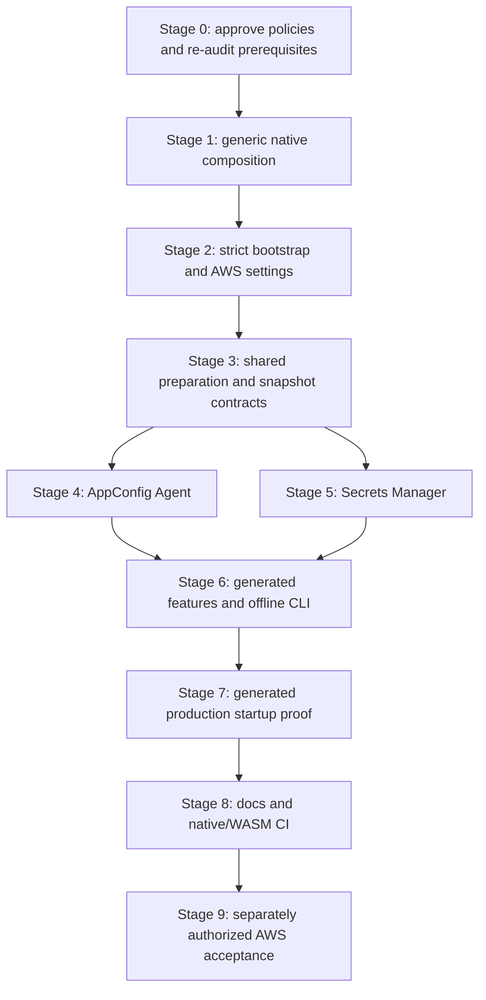

# Native store providers implementation plan

- Status: Implementation complete through offline Stages 1-8. Native provider combinations, generated-consumer startup, workspace/native/WASM gates and documentation checks passed. Draft [PR #414](https://github.com/stackpop/edgezero/pull/414) was published via `gh stack` after rebasing and rerunning gates. Provider availability validation deliberately remains structural-only/unknown. Real AWS acceptance is declined and excluded.
- Date: 2026-10-07.
- Owning issue: [EdgeZero #410](https://github.com/stackpop/edgezero/issues/410).
- Governing design: [Native store providers independent of HTTP adapters](../specs/2026-10-07-native-store-providers-design.md), including the R1 Cargo feature-resolution correction.
- Inspected main: `683202c66948146ec360f490126f1d60f920288b`.
- Prerequisite evidence: PR #275 at `d1a81579afb96f200e7fe8fd294600f0b446b080`; PR #406 at `3ab22096fd117f7506cf437b5ba128e0789e059c`. Both remain open at planning time. Their inspected APIs are not APIs available on main.
- Evidence level: Executed combined-prerequisite tests, native service feature combinations, real SDK literal-loopback fixtures and actual CLI-generated consumer startup. No real AWS, IAM, image or deployment acceptance.

## 1. Goal and scope

Allow native applications to bind KV, configuration, and secrets independently of their HTTP runtime and independently for each logical store ID. Ship AppConfig Agent whole-document configuration and Secrets Manager whole-value secrets as optional native providers. Keep ordinary local providers, portable declarations, typed envelopes, nested secret references, and per-ID registries.

Success means a generated native application can start with mixed local, custom, and AWS bindings, validate required typed application inputs before readiness, serve requests from the same completed registries, and adopt remote changes only on restart. A failed mapped remote fetch must stop startup without falling back to files or environment values.

Do not implement DynamoDB, live reload, secret refresh, publishing, provisioning, a provider plugin registry, a new HTTP runtime, or application-specific schemas. Do not extract existing local providers into new crates. Do not change portable trait future bounds, store declarations, macro metadata, or core errors to expose AWS details.

The user's subsequent instruction to implement authorizes execution of this plan and rebasing onto the open prerequisites. Stage proof gates remain; do not skip verification between stages. Real AWS acceptance is excluded. Subsequent approval authorizes #410 commits and a draft via `gh stack`, but not merging, deployment, or changes to existing prerequisite PRs. Rewriting the prerequisite commit as part of the expressly authorized rebase is recorded below.

## 2. Decisions and approval status

The configurable 8 MiB default, shared-session quota scope, and caller-owned preparation boundary were approved in conversation on 2026-10-07. After the initial Stage 0 audit, the user explicitly instructed: "Those pull requests are not blockers. Go ahead and implement. If you need changes from those pull requests, rebase on top of them." This authorizes implementation of the proposed design and stages, including use of open prerequisite heads. Remaining policy proposals are the implementation contract unless the user changes them. This original instruction did not authorize AWS service access or publishing. Later approval authorizes draft publication; real AWS acceptance remains excluded.

The implementation follows these choices:

1. Use a move-only `NativeStoreOverrides` argument separate from cloneable `AxumRunOptions`. Each supplied ID has either an existing handle or a deferred, owned, non-`Send` future. Validate the complete source plan before polling futures. Require deferred future construction to be side-effect-free, with provider work inside its async body. The runner guarantees no polling before validation; it cannot undo caller-side work during future construction.
2. Keep a cloneable `NativeStoreBindingsInput` selection inside `AxumRunOptions`: local defaults, an absolute bindings-file path, or an inline typed `NativeStoreBindings` value. File and inline settings are mutually exclusive; selection methods reject a second explicit source rather than overwriting it. Both normalize into the same validator and preparation path. Noncolliding supplied handles/futures may coexist as the separate overrides argument; same-ID collisions are errors.
3. Use one explicit `AwsPreparation` session for all built-in AWS bindings prepared by a runner invocation. It owns budgets, successful target deduplication, and client reuse. Do not provide convenience constructors that silently create an independent budget per binding.
4. Apply declared native build features to both standard native build and serve commands. Normalize manifest and explicit feature inputs once; use the same selection when offline validation can resolve the actual target.
5. Add a bindings-only mode to `config validate` when `--adapter axum --store-bindings <absolute path>` is supplied. It does not require a local app-config TOML file or claim to validate remote contents. Preserve the existing validation mode without these arguments.
6. Use a Cargo-resolution parity spike before shipping provider-availability verdicts. A failed or ambiguous offline resolution produces an explicit structural-only result, never an inferred enabled/disabled result.
7. Keep provider failures as closed, sanitized native categories. The coordinator attaches only the baked store kind and logical ID. Do not retain or format SDK, HTTP, TOML, credential, or arbitrary custom-provider error chains.

Approved accounting and ordering policy:

- The standard runner uses one shared session to enforce combined quotas across all its built-in AWS bindings. Prebuilt opaque handles, local providers, and separately created sessions remain caller-owned and are not included. Independent sessions may together exceed 8 MiB; this is not a process-wide limit.
- Validate sources before opening runner-created providers or polling deferred supplied futures. Require side-effect-free deferred construction. A caller can already have opened a `Ready` handle or done other work before supplying it; the runner cannot undo that work.

Do not introduce process-global accounting or mandatory introspection of portable handles. The former accepted-only prerequisite gate is superseded by the user's authorization to use open PRs. Re-audit and test the exact combined stack; never claim those contracts are accepted on main. Runtime proof, feature isolation, and separate AWS acceptance gates remain.

## 3. Delivery order



Stages 4 and 5 may be investigated in parallel. Keep edits to shared settings, session state, Cargo manifests, and lockfiles under one owner. Serialize Cargo commands sharing a target directory. Stage 6's Cargo-resolution spike can be investigated earlier, but do not publish a capability verdict until it passes.

## 4. File map and ownership

Existing files to change narrowly:

| Area                        | Files                                                                                   | Intended change                                                                                          |
| --------------------------- | --------------------------------------------------------------------------------------- | -------------------------------------------------------------------------------------------------------- |
| Workspace                   | `Cargo.toml`, `Cargo.lock`                                                              | Add optional native provider member/dependencies and coherent SDK pins                                   |
| Native runtime              | `crates/edgezero-adapter-axum/src/dev_server.rs`                                        | Source planning, sequential setup, completed registry publication, additive runner API                   |
| Accepted production options | `crates/edgezero-adapter-axum/src/run_options.rs`                                       | Bootstrap selection and local-root validation after source selection; exists at inspected #406, not main |
| Axum features               | `crates/edgezero-adapter-axum/{Cargo.toml,src/lib.rs}`                                  | Native-bindings/settings support and independent AWS feature forwarding                                  |
| Axum CLI/scaffolding        | `crates/edgezero-adapter-axum/src/cli.rs`, `src/templates/Cargo.toml.hbs`               | Standard native Cargo invocation and generated service features                                          |
| CLI inputs                  | `crates/edgezero-cli/src/args.rs`                                                       | Bindings path, selected adapter, target feature/default/all controls, push guard input                   |
| CLI validation/push         | `crates/edgezero-cli/src/config.rs`                                                     | Bindings-only validation and explicit remote publication refusal                                         |
| CLI build routing           | `crates/edgezero-cli/src/{lib,adapter}.rs`                                              | Normalize standard Axum feature selection before both generated-command and fallback dispatch            |
| Generator                   | `crates/edgezero-cli/src/generator.rs`                                                  | Structural assertions and any needed dependency/feature template context                                 |
| Generated integration       | `crates/edgezero-cli/tests/generated_project_builds.rs`                                 | Native provider combinations and preserved generated WASM builds                                         |
| CI                          | `.github/workflows/{test,format}.yml`                                                   | Enabled-native tests, isolated feature lint, generated proof, dependency-graph assertions                |
| Guides                      | `docs/guide/adapters/{overview,axum}.md`, `docs/guide/{configuration,cli-reference}.md` | Setup, support matrix, CLI modes, bounds, restart and stale-value policies                               |

New files, names proposed:

```text
crates/edgezero-adapter-axum/src/
  native_bindings.rs        # SDK-free parsing, source validation, local-root needs
  native_build.rs           # SDK-free standard native Cargo selection, if extraction is needed

crates/edgezero-store-aws/
  Cargo.toml
  src/
    lib.rs
    settings.rs             # Strict types, selectors, endpoint/ARN validation
    preparation.rs          # Shared session, budgets, dedup, sanitized errors
    appconfig_agent.rs      # Restricted HTTP reader and immutable config provider
    secrets_manager.rs      # SDK boundary and immutable secret provider

crates/edgezero-cli/tests/
  native_target_features.rs # Cargo-resolution versus compiled-fixture parity

scripts/
  check_native_store_dependency_graph.sh
  smoke_test_native_stores.sh
  accept_native_aws_stores.sh  # Only if an opt-in harness is useful; never default CI
```

Keep unit tests colocated. Add standalone fixture files only when the real generated/runtime path needs them. Prefer generating a temporary application through the existing scaffold over maintaining a second hand-written application. Keep fixture lockfiles current where fixtures are committed separately.

Core and macro production changes are not expected after prerequisites are accepted. If new work appears necessary there, stop and explain the missing contract instead of expanding this plan silently.

## 5. Stage 0: prerequisites, policy approval, and baseline

### Work

- [x] Read current `CLAUDE.md`, governing spec, #410/#324, and exact selected #275/#406 revisions.
- [x] Record selected stack commit IDs and integration differences. Open-PR use is explicitly authorized; do not label them accepted on main or implement an alternate bounded-read API.
- [x] Confirm `ConfigValue`, `BoundedStoreRead`, required bounded config/secret methods, application monotonic clock, fallible `App::build`, `PreparedStores`, initializer state insertion, and readiness/shutdown behavior on the combined stack.
- [x] Record the approved configurable 8 MiB session quota and caller-owned preparation boundary in both spec and plan.
- [x] Record the user's authorization to implement the plan and use open prerequisites, superseding the original accepted-only gate. Separate AWS acceptance remains unapproved.
- [x] Inventory and reuse the selected prerequisites' tests. Add only missing native composition/provider behavior.
- [x] Record a baseline for relevant native tests, existing workspace gates, and installed WASM targets. Classify pre-existing failures separately. All eight Stage 0 main checks passed; see the execution record below.
- [ ] Select exact compatible `aws-config` and `aws-sdk-secretsmanager` versions for the repository Rust toolchain. Add direct Smithy dependencies only when a shipped API or test connector needs them. Record the SDK behavior version, TLS/runtime feature choices, and Agent image/version to use later.

### Exit gate

The implementation plan is authorized. Use the exact user-approved prerequisite stack, source/test inventory, and passing combined-contract tests. Both PRs remain open; they are not a blocker under the user's instruction. Do not modify main or claim these contracts have landed. SDK graph/image selection still needs evidence before the corresponding provider stages.

## 6. Stage 1: generic per-ID native composition

### API shape

Use the existing `KvHandle`, `ConfigStoreBinding`, and `BoundSecretStore` output types. A proposed native-only builder owns maps keyed by logical ID:

```rust,ignore
// Exact exported names are settled after the accepted prerequisite re-audit.
// No Send bound on this future. Existing provider objects remain Send + Sync.
pub type NativeStoreFuture<H> = Pin<Box<
    dyn Future<Output = Result<H, NativeStorePreparationError>> + 'static
>>;

enum NativeStoreSource<H> {
    Ready(H),
    Prepare(NativeStoreFuture<H>),
}

pub struct NativeStoreOverrides {
    // private keyed maps for KV, config, and secrets
}
```

Expose small typed insertion methods for each kind and for ready/deferred inputs. Insertions reject duplicates instead of overwriting a map entry. Keep map/source internals private. Require all deferred provider opening to happen inside the future body when polled, not during construction; this is a caller contract, not something the type system can prove. Tests establish zero polls and zero runner-owned opens on validation failure, not absence of earlier caller-side side effects. Do not require another public provider-factory trait.

Add one runner entrypoint accepting options, overrides, stop, and the accepted app initializer. The options carry `NativeStoreBindingsInput`; Stage 1 starts with its local-default case, and Stage 2 adds file/inline normalization. The validator compares the selected settings IDs with the separate override maps before any preparation. Existing public entrypoints delegate with empty overrides. Keep `AxumRunOptions` cloneable; do not put futures into it. Owned deferred futures can capture `Rc` and bootstrap data. They cannot borrow options or the app initializer's higher-ranked inputs.

The validated source plan has separate local, supplied-ready, supplied-deferred, and built-in-settings variants. `NativeStoreFuture` is only for opaque custom providers. File or inline settings become built-in variants, not stored futures: the runner matches each typed settings variant and directly awaits the matching method on its one mutable `AwsPreparation` session. This avoids trying to borrow that session into a stored `'static` future. For secrets, pass the baked logical namespace into snapshot construction and wrap the returned `SecretHandle` in `BoundSecretStore` with the same namespace. Config construction returns a `ConfigStoreHandle` paired with the validated settings default key. File and inline inputs cannot coexist; either selected input can coexist with noncolliding custom overrides. Custom-provider quota enforcement belongs to that provider, not to introspection of its eventual handle.

### Work

- [x] Compile-probe the proposed API with an `Rc`-capturing setup future that returns a valid handle on the existing current-thread `LocalSet`.
- [x] Preserve the initializer's accepted higher-ranked borrowing signature. Prove it still permits borrowing stores across await and capturing non-`Send` application state during setup.
- [x] Separate options/scalar validation from local-root requirements. Determine required roots from the resolved per-ID sources, not just declared store kinds.
- [x] Build one source plan for all kinds. Validate defaults, declared IDs, duplicate supplied inputs, explicit scalar-overlay conflicts, and local-root needs before preparing any runner-owned provider. Stage 2 adds file/inline settings and cross-source collision coverage.
- [x] Preserve config default keys, secret bound namespaces, and local KV NAME-derived paths. Explicit sources retain supplied semantics; implicit local sources keep existing env behavior.
- [x] Assemble the app in the selected prerequisite order, then sequentially prepare sources under the existing runtime. No additional runtime or initializer-side provider selection.
- [x] Stage every handle, finalize registries once after all sources succeed, preserve declared defaults, and share the completed `PreparedStores` between initializer and request service.
- [x] Drop staged handles and preparation futures on failure or startup stop. No initializer, readiness, or listener after incomplete preparation.

### Proof

Add colocated tests for:

- ready and deferred custom providers, mixed same-kind bindings, and the default ID;
- config default-key preservation and wrong-secret-namespace isolation;
- undeclared IDs, duplicate supplied IDs, and explicit NAME/KEY conflicts; supplied/file and supplied/inline collision tests follow in Stage 2;
- zero deferred polls and zero runner-owned provider opens on every source-validation failure;
- remote/custom-only config without CONFIG_DIR, custom-only KV without DATA_DIR, and roots required only for remaining local IDs;
- sequential preparation, failure of a later binding, partial-state drop, and no initializer/readiness on failure;
- initializer and request service observing the same prepared handles;
- existing local development and strict production defaults with empty overrides;
- stop during a pending preparation without claiming all external work is forcibly canceled.

Run scoped Axum tests after each code increment. Exit when fake providers prove generic composition without importing AWS.

## 7. Stage 2: strict bootstrap parsing and settings-only AWS crate

### Ownership and feature shape

Native `native_bindings.rs` owns the top-level versioned schema, kinds/IDs, tagged dispatch, source collisions, overlays, local-root needs, and file limits. `edgezero-store-aws::settings` owns AWS settings and resource-shape validation. Never put provider fields into portable declarations or generated metadata.

Add a settings-only dependency on the provider crate to the native bindings feature. This does not enable either service. The runtime and CLI can both use native-bindings without enabling each other's runtime/registry features.

Provider features:

```text
edgezero-store-aws
  default = []
  appconfig-agent     -> HTTP client, streaming support, native timers
  secrets-manager    -> AWS config/service SDK and native runtime support

edgezero-adapter-axum
  native-bindings    -> native parser + SDK-free AWS settings
  axum              -> existing runtime + native-bindings
  cli               -> existing CLI + native-bindings
  aws-appconfig-agent -> provider appconfig-agent
  aws-secrets-manager -> provider secrets-manager
  aws-stores          -> both explicit service features
```

Use native target dependency declarations and module gates. Do not add another Tokio dependency to an adapter or any AWS/native dependency to portable core or WASM adapters. Service-disabled settings parsing must work without the service clients. All-feature builds must not conceal missing single-feature cfgs.

### Work

- [x] Add the provider workspace member, `lib.rs`, strict settings structs, version selector enum, limits, and closed redacted preparation error categories.
- [x] Add native-only version 1 tagged parsing with unknown/irrelevant fields, unsupported KV/provider tags, duplicate tables, empty mappings and undeclared IDs rejected.
- [x] Require mapped config defaults and case-sensitive IDs/lookup keys, without parsing/projecting remote values.
- [x] Validate complete Secrets Manager ARNs, supported partition/region-family relationships, explicit matching region, exclusive selectors and API length bounds. Full cross-account ARNs remain explicit.
- [x] Validate literal-loopback HTTP endpoints and original authority/path spelling; construct escaped segments and independently test decoded round-trip equality.
- [x] Add mutually exclusive absolute file and typed inline selection. Explicit APIs use only supplied bootstrap values; `from_env` alone resolves ambient locator/token variables.
- [x] Read selected regular files once with cap+1 probing, redacted fixed errors and Unix nonblocking FIFO rejection.
- [x] Capture locator/scalar inputs once, reject relevant normalized duplicates, capture named tokens once per name, and redact Debug/errors. Preserve unrelated EnvConfig duplicate semantics; ambiguous explicitly supplied token values fail closed.
- [x] Reject disabled providers before deferred polling/local provider construction. Services are not implemented/enabled at this settings-only checkpoint; actual compiled capabilities are added with Stages 3-5.

### Limits schema

Use a trusted bootstrap `NativeBindingsLimits` policy for the file byte cap and total explicit-ID cap. Defaults are 256 KiB and 128 IDs. A bindings file cannot raise its own pre-parse byte limit. Programmatic overrides of bootstrap limits are explicit; offline validation reports the policy it used.

Propose an optional `[limits.aws]` table for remote preparation settings:

| Field                       | Default                                                       |
| --------------------------- | ------------------------------------------------------------- |
| `max_remote_values`         | 1,024 mapped config documents plus secret entries             |
| `max_config_document_bytes` | 1 MiB                                                         |
| `max_secret_value_bytes`    | 64 KiB                                                        |
| `max_snapshot_bytes`        | 8 MiB combined unique retained AWS payload per shared session |
| `preparation_timeout_ms`    | 30,000                                                        |
| `operation_timeout_ms`      | 5,000                                                         |
| `connect_timeout_ms`        | 1,000                                                         |
| `attempt_timeout_ms`        | 2,000                                                         |

The approved 8 MiB default is provisional and not derived from AWS limits or workload measurements. Keep an aggregate cap because many values can each satisfy per-value limits while collectively retaining excessive payload. Document its rationale and scope; revisit the default with representative application payload sizes plus headroom. Explicitly raising or lowering it must remain possible.

These are configurable defaults, not immutable hard ceilings. Explicit file/typed policies may change service limits subject to finite/nonzero checks, checked conversions/arithmetic, and consistency of per-operation/aggregate and per-value/combined limits. The file-byte/explicit-ID limits change only through trusted native bootstrap options. Keep retry count and concurrency fixed initially. Count mappings before deduplication; deduplication must not let unlimited aliases bypass entry limits. Reject simultaneous explicit bootstrap-supplied and file-supplied AWS limit policies. Otherwise use the one supplied policy, filling omitted fields from documented defaults, or use all defaults when both policies are omitted. Do not fieldwise merge two supplied policies. The selected policy applies to built-in settings prepared through the shared session, not opaque custom handles/futures or separately prepared AWS handles.

### Proof

Settings-only tests cover every rejection rule, blank/non-Unicode bootstrap inputs, token absence/emptiness, env versus explicit options, file overflow, unsupported features, selectors, limits, and source conflicts. Verify parser errors do not contain sentinel ARNs, tokens, credentials, or raw TOML values.

Run settings-only provider tests and Axum parser tests in runtime-only and CLI-only configurations. Inspect reachable normal dependencies to confirm the SDK and HTTP client are absent from settings-only builds.

## 8. Stage 3: shared AWS preparation and bounded snapshot reads

### Work

- [ ] Implement an explicit, per-startup `AwsPreparation` session with sequential `&mut self` preparation methods. No process-global client/cache/session.
- [ ] Start one aggregate deadline before credential/client initialization. Derive operation, attempt, and connect budgets from remaining aggregate time and configured caps. Credential/setup elapsed time consumes this budget; check expiry before and after awaits and discard results completed after expiry. Classify credential/blocking-work cancellation as best-effort or unsupported under the accepted capability contract. Do not promise a 30-second wall-clock completion bound or that dropping a future stops a credential process or socket. Audit whether the pinned SDK operation timeout includes each supported credential provider; do not assume it does.
- [ ] Track mapping counts, unique retained payload bytes, metadata, and transient staging separately. Use checked accounting and reject overflow before retaining the next payload.
- [ ] Cache only successful targets. Reuse immutable payload allocations between identical targets while retaining separate logical-key and namespace mappings.
- [ ] Include normalized endpoint, application/environment/profile, and authorization policy identity in AppConfig dedup keys. Different token policies must not merge. Keep token identity internal and redacted.
- [ ] Include region/client-policy identity, full ARN, and exact normalized selector in secret dedup keys. Normalize omitted/current selection consistently; never collapse pinned versions or distinct stages.
- [ ] Reuse one Secrets Manager client per region/policy in the shared session. Config-only sessions must not initialize credentials or an SDK client.
- [ ] Implement immutable config and secret snapshot providers under accepted #275 methods. They do not keep cloud clients or issue request-time cloud calls.
- [ ] Ordinary config reads return shared `ConfigValue`; secret reads return exact `Bytes`. Unknown keys or wrong secret namespaces return successful misses without probing a service.
- [ ] Bounded reads reject an expired deadline before lookup, honor independent backend/value caps, report hit payload bytes and zero bytes on misses, and recheck deadline precedence before returning. Reuse accepted finishing helpers where suitable.
- [ ] Preserve accepted conservative deadline/allocation classification. Document that SDK parsing, credential work, allocator overhead, and the Agent are outside retained-payload accounting.

### Proof

Use a deterministic injected monotonic clock and production accounting paths. Test exact limits and limit+1, explicit higher/lower quota settings, aggregate bytes across both services and IDs, mapping-count limits before dedup, checked overflow, auth/selector-sensitive dedup, preparation deadline exhaustion, sanitized Debug/display, and independent sessions without global state. Prove one runner shares the same quota across all built-in AWS bindings and that a quota breach drops staged state before readiness without eviction or local fallback. Independently prepared opaque handles are not included in that accounting. Add a delayed credential-provider fixture that completes after the aggregate deadline and prove no value is retained or published. Separately test a pending credential future under supported timers. Neither fixture proves forcible cancellation of a real credential process or blocking provider; keep that fact unproven with best-effort wording.

Run existing core config/secret contract macros against preseeded snapshot providers. Add bounded-read tests for both ordinary hits and misses, empty values, namespace isolation, backend/value allowances, and deadline precedence. These tests are separate from startup transfer tests.

Atomic publication is the native coordinator's responsibility. A programmatic caller that retains a handle returned by one successful preparation cannot expect the session to erase that handle after a later failure. The standard runner drops all staged handles on failure; prove that path in Stages 1 and 7.

## 9. Stage 4: AppConfig Agent whole-document preparation

### Work

- [ ] Build a dedicated native HTTP client. Disable ambient proxies, redirects, and transparent decompression. Do not reuse the generic outbound proxy client.
- [ ] Construct GET `/applications/{application}/environments/{environment}/configurations/{profile}` using validated, escaped segments.
- [ ] Send `Accept-Encoding: identity`. Send `Authorization: Bearer <token>` only when explicitly configured. Do not enable request/header/body diagnostics that reveal bootstrap data.
- [ ] Perform one bounded request per distinct complete target, including streamed body consumption. Reject non-success/protocol responses and non-identity content encoding.
- [ ] Reject oversize declared content lengths early when available; always enforce actual streamed bytes before accumulation exceeds the allowed limit. Detect truncated/erroring streams.
- [ ] Validate UTF-8 and retain the exact text, including whitespace, JSON quoting, empty documents, and serialized envelopes. Do not parse, unquote, reserialize, or resolve secret references.
- [ ] Make every mapped profile mandatory during preparation. A missing/unavailable mapped profile is a startup error, never a snapshot miss or local fallback.
- [ ] Drop response bodies and source errors before producing categorized diagnostics. Publish no partial binding.

### Proof

Use authorized loopback-only fixtures with bounded lifetimes and isolated ports. Cover IPv4/IPv6 validation, exact escaped paths, auth/no-auth, absent/empty tokens, proxy/redirect refusal, encoding rejection, status errors, malformed UTF-8, empty/raw/envelope fidelity, content-length and streamed cap edges, truncation, connect/body deadline behavior, dedup across IDs, auth-policy separation, and immutable reads after the fixture changes.

Test generated envelope extraction and nested secret resolution later through the app initializer. A fake Agent proves reader behavior, not AWS reachability, deployment freshness, or warm-cache policy.

Run AppConfig-only provider tests. Exit with no Secrets Manager SDK in the config-only normal dependency graph.

## 10. Stage 5: Secrets Manager preparation and real SDK behavior

### Work

- [ ] Load the pinned SDK using explicit region, fixed behavior defaults, supported credential discovery, capped standard retries, and explicit operation/attempt/connect budgets.
- [ ] Count credential/client initialization against the shared aggregate budget. Use workload roles in documented production setup and a documented authenticated developer path. Do not require static keys in bindings or images.
- [ ] Make exact `GetSecretValue` requests for mapped ARNs/selectors only. Load every mapped entry before completing that binding.
- [ ] Accept exactly one value field. Return `SecretString` UTF-8 bytes or the Rust SDK's already-decoded `SecretBinary` bytes. Preserve empty/binary values where allowed. Do not extract JSON fields or base64-decode a Blob again.
- [ ] Check payload size after SDK materialization and before retaining it. Describe this as a retained-value cap, not a bound on every SDK allocation.
- [ ] Classify service/credential/transport failures before dropping source details. Keep missing resource/version, denied, decryption, throttled, deadline, malformed, and size categories where exposed.
- [ ] Let the SDK own transient retries, at most three total attempts and bounded by remaining budgets. Add no outer retry loop. Verify denied/decryption/validation errors are not repeatedly retried under the pinned policy.
- [ ] Spike the real generated-child test path against the pinned SDK now: child-only dummy credentials, metadata disabled, and supported service endpoint override to a loopback scripted HTTP fixture. Verify client configuration honors that override without a production bindings field or public mock API before Stage 7 depends on it.
- [ ] Drop clients/session staging after preparation; snapshot handles contain only successful mapped payloads. Never persist snapshots to disk or claim zeroization.

### Test layers

1. A narrow private service-call seam exercises production snapshot building, mappings, selectors, payload fidelity, errors, and cleanup with deterministic responses. Do not expose a public mock/factory hierarchy.
2. The pinned SDK with a scripted connector exercises real serialization, error classification, retry attempts, and timeout settings. Supply fixture credentials explicitly to avoid ambient discovery or IMDS. A fake service-call method cannot prove SDK retry behavior.
3. Separately authorized AWS acceptance proves deployed credentials, IAM, and service version behavior.

Cover binary data that resembles base64 text, neither/both fields, empty values, default/current versus pinned versions, selectors, wrong namespaces, unknown keys without calls, ARN/policy-sensitive dedup, missing version, expired credentials, denied/decryption/throttle/transport errors, capped attempts, exhausted budgets, and partial-startup cleanup.

Capture EdgeZero-owned logs and returned errors with sentinel values. Assert they contain no secrets, ARNs, token/credential sources, response bodies, or raw SDK messages. Dependency DEBUG/TRACE output is outside that guarantee; the executed diagnostic spike documents its disclosure risk. For the approved first version, retain redacted EdgeZero-owned diagnostics and explicitly disclose dependency DEBUG/TRACE output to operators and draft reviewers. Do not install global or scoped subscribers to silence dependency events. The user approved this limitation after the diagnostic spike; hardening dependency diagnostics remains a review item. The separately operated Agent's own logging policy remains operator-owned.

Run Secrets Manager-only and combined provider tests. Exit with actual SDK retry/classification evidence, not just fake-seam assertions.

## 11. Stage 6: generated features, Cargo selection, offline validation, and push guard

### Generated/native feature enablement

- [ ] Add generated native `[features]` entries for `aws-appconfig-agent`, `aws-secrets-manager`, and the proposed `aws-stores` alias. Use `default = []` for these target service choices and forward each to the matching adapter feature.
- [ ] Keep default native and generated Fastly/Cloudflare/Spin targets AWS-free. Keep CLI service capabilities independent from the binary being validated.
- [ ] Introduce one standard native Cargo selection helper shared by build/serve and offline resolution. Requested names combine declared build features and explicit additions; provider availability comes from resolved capabilities, not those names.
- [ ] Handle both real dispatch paths. Generated Axum manifests currently use shell `cargo build -p <crate>` / `cargo run -p <crate>` commands through `edgezero-cli::adapter::execute`; the registered Axum `run_cargo` fallback is not the sole build path.
- [ ] Route the exact standard generated Cargo command forms and registered fallback through the shared normalization. Do not parse or rewrite arbitrary operator shell programs as Cargo commands. Preserve custom-command ownership and mark capability selection unknown when its build behavior cannot be represented.
- [ ] Normalize repeated/comma/space `--features`, `--features=...`, `--all-features`, and `--no-default-features` before the Cargo/run `--` separator. Runtime args after that separator must not affect compile features. Preserve unrelated passthrough arguments.
- [ ] Identify the exact native package/manifest and target. Treat manifest target `native` as host selection, not literal `cargo --target native`. Do not silently override operator package/target selections.
- [ ] Recognize equivalent supported target flags in bindings validation, proposed `--target-features`, `--target-all-features`, `--target-no-default-features`, and `--target`. Document defaults and reject target-control flags outside bindings validation.

### Cargo-resolution correctness spike

Candidate resolution is `cargo tree --offline --locked` for the exact native package, normal/build edges, the same target and feature controls, and narrowly parsed package/feature records. Use metadata for package identity/topology only when it can be obtained offline without changing the lockfile. Do not assume metadata's workspace-wide graph or tree's "pretty close" build view is exact.

- [ ] Build local-only resolver-2 fixtures and compare predicted provider availability with the same-selection compiled fixture's cfg result.
- [ ] Cover default/no-default/all/explicit/alias selection and dependency feature propagation.
- [ ] Cover sibling workspace members, own/sibling dev dependencies, build dependencies, target-specific edges, renamed/duplicate package identities, and host versus explicitly selected native targets.
- [ ] Prove an unrelated member or dev dependency cannot falsely enable a normal-runtime provider. Check the Axum adapter service feature and reachable provider feature, not just a same-named feature on another crate.
- [ ] Classify unsupported package overrides, custom shell commands, `--all-targets`, `--workspace`, `--config`, ambiguous contexts, unexpected Cargo output, missing lock/cache, or failed offline resolution as unknown unless a parity test proves support.
- [ ] Emit structural-only when resolution is unknown. Never edit the lockfile, fetch dependencies, build application code, execute build scripts, or discover credentials during the user-facing offline check. Fixture compilation belongs to tests, not validation.

Exit this spike with a documented supported invocation subset and tests. If the candidate cannot prove a case, keep that case structural-only rather than building a second approximate feature resolver.

### Bindings-only validation

- [ ] Add `--adapter` and `--store-bindings` inputs plus target controls to `ConfigValidateArgs` and its defaults/parser tests.
- [ ] Branch before `load_validation_context` for the new bindings-only mode. Load portable manifest declarations and explicit native bindings; do not require `<app_name>.toml` or run typed remote-content checks.
- [ ] Require Axum selection and an absolute explicit bindings path. Reject irrelevant adapter/target combinations. Preserve existing raw/typed validation paths without the new mode.
- [ ] Use the SDK-free native source validator with only supplied deployment inputs. Never read ambient NAME/KEY overrides, the ambient bindings locator, or Agent token/credential values here. Startup validates actual deployment inputs again.
- [ ] Report either structural validation plus known target-provider compatibility, or structural validation only with provider availability unknown. Neither result proves resource existence, token availability, local-root availability, IAM, typed config validity, or build success.
- [ ] Permit programmatic validation to supply explicit overlay/override information through the same pure validator; CLI file validation does not invent future supplied handles.

### Local publication guard

- [ ] Add explicit `--store-bindings` to downstream typed `ConfigPushArgs` and its parser/default construction sites.
- [ ] Resolve the selected logical config ID, then parse and check the explicit bindings file before remote read-back/diff, prompts, adapter publication, or local writes.
- [ ] Reject an AWS-bound selected ID with a fixed unsupported-publication message, including dry-run and `--local`. Unrelated AWS IDs do not block a local selected ID.
- [ ] Do not consult the ambient deployment locator or claim a bindings-free local push updates an AWS-bound deployment. Keep the adapter trait unchanged and the local writer intact.
- [ ] Preserve ordinary local push, sibling-key retention, dry-run no-write, and all other adapters' behavior. Do not add AWS diff/gc/publication/mutation workflows.

### Proof

Extend generator structural tests and the real generated-project integration test. Test CLI/target feature mismatches in both directions, structural-only degradation without local app TOML, flags/aliases/default suppression, generated-command versus fallback feature forwarding, custom-command preservation, no lockfile mutation/network, and explicit push refusal with no file writes or provider calls.

## 12. Stage 7: production startup and generated consumer proof

### Work

- [ ] Generate a native fixture through the actual CLI. Configure portable IDs, native binding settings, provider features, and an app-owned initializer under accepted lifecycle contracts.
- [ ] Use `#[action]` handlers and `edgezero_core` HTTP types. Load a real serialized envelope through accepted `AppConfig::from_binding` or its accepted equivalent, resolve nested secret references, validate typed configuration, and insert typed handler state before readiness.
- [ ] Exercise these combinations: AWS config plus environment secrets; local config plus AWS secrets; both AWS providers plus redb; same-kind local/custom/AWS bindings; remote-only config and injected KV without local roots.
- [ ] Use loopback Agent and scripted Secrets Manager HTTP fixtures through the real pinned SDK in the generated child process. Stage 5 must prove a supported SDK endpoint override plus explicit fixture credentials can select that loopback fixture in child-only bootstrap without ambient discovery or external calls. Clear inherited child bootstrap, supply only required fixture settings and dummy credentials/region, disable metadata credential lookup, and select only the loopback Secrets Manager endpoint. Keep this endpoint out of the production bindings schema. Assert request targets, bodies, selectors, and attempts without logging Authorization/signatures or payload values; unexpected destinations fail the test. A downstream binary cannot use a dependency's private `cfg(test)` service/connector seam; reserve that seam for provider unit tests. If the pinned SDK cannot support the generated fixture this way, stop and approve another test strategy rather than adding a public mock registry. Run real AWS through the same generated runtime only in Stage 9.
- [ ] Make a downstream fake KV use only generic handle injection. It must not import AWS or depend on a built-in tag.
- [ ] Change fixture versions while the process runs. Prove snapshot reads and retained typed state do not change; restart and prove new values are adopted. Test pinned/current secret selection separately.
- [ ] Fail a mapped profile, secret fetch, envelope validation, nested required secret lookup, and app initializer. Prove no readiness/listener acceptance and no fallback in each case.
- [ ] Stop while AWS preparation is pending. Reuse accepted shutdown semantics and observe staged handle drop without overstating credential/socket cancellation.
- [ ] Capture child process output and returned startup diagnostics. Assert sentinel secrets, tokens, ARNs, raw bindings, config documents, response bodies, and SDK chains never appear.

### Exit gate

A generated native application proves the preparation -> shared registries -> app initializer -> typed handler path. Record commit, feature set, fixture policy, commands, and results. Mock evidence is not IAM/Agent freshness evidence.

## 13. Stage 8: docs, feature isolation, and CI

### Documentation

- [ ] Update existing local-only claims in the Axum guide. Document native binding selection, local defaults, strict production roots, explicit options versus env loading, generic supplied handles/deferred setup, and SDK-free CLI validation.
- [ ] Document Agent process/network ownership, literal loopback setup, explicit loopback bind, bearer token policy, pinned Agent version, backup/preload disabled, and warm-cache staleness.
- [ ] Document exact raw/envelope and string/binary semantics, required mappings, startup-only adoption, non-atomic cross-document snapshots, secret retention after remote deletion/revocation, and no zeroization guarantee.
- [ ] Document bounds and their scope, sequential startup costs, best-effort cancellation, service/credential failure categories, and supervisor-owned restart backoff.
- [ ] Document generated opt-in features, supported Cargo-resolution subset, structural-only results, and local-only `config push`. No publication/provisioning claims.
- [ ] Include fictional bindings, role permissions, developer authentication, native-only support, costs, and named cleanup ownership. Keep application schemas/required secret names out of framework examples.

### Required repository checks

Run these against a stable combined state after scoped tests have passed:

```sh
cargo test --workspace --all-targets
cargo fmt --all -- --check
cargo clippy --workspace --all-targets --all-features -- -D warnings
cargo check --workspace --all-targets --features "fastly cloudflare spin"
cargo check -p edgezero-adapter-fastly --target wasm32-wasip1 --features fastly
cargo check -p edgezero-adapter-cloudflare --target wasm32-unknown-unknown --features cloudflare
cargo check -p edgezero-adapter-spin --target wasm32-wasip2 --features spin
```

Add isolated native-provider gates, proposed commands:

```sh
cargo test -p edgezero-store-aws --no-default-features
cargo test -p edgezero-store-aws --no-default-features --features appconfig-agent
cargo test -p edgezero-store-aws --no-default-features --features secrets-manager
cargo test -p edgezero-store-aws --no-default-features --features "appconfig-agent secrets-manager"
cargo test -p edgezero-adapter-axum --no-default-features --features cli
cargo test -p edgezero-adapter-axum --no-default-features --features axum
cargo test -p edgezero-adapter-axum --no-default-features --features "axum aws-stores"
cargo test -p edgezero-cli --test native_target_features
cargo test -p edgezero-cli --test generated_project_builds -- --ignored
```

Also lint settings-only, AppConfig-only, Secrets-only, Axum runtime-only, and CLI-only modes so all-feature unification cannot hide cfg mistakes. Tests needing the native runtime stay in native crates. Keep portable contract suites on `futures::executor::block_on`.

- [ ] Wire enabled native provider tests and resolver/generated fixture checks into CI. Default provider tests require no credentials and no external network.
- [ ] Add target-filtered reachable normal/build graph assertions for all three generated WASM adapters and the existing Fastly `fastly cli` combination. Assert no `edgezero-store-aws`, AWS service SDK/config/credential crates, or AWS Smithy runtime dependencies are reachable there. Match actual SDK package identities, not a blanket `aws-*` prefix that would also ban unrelated TLS cryptography such as `aws-lc-rs`.
- [ ] Assert default native has no service clients; config-only has no Secrets Manager SDK; secret-only has no Agent HTTP-client dependency introduced by the provider feature. Compare dependency causes rather than banning unrelated existing HTTP dependencies.
- [ ] Inspect the selected graph, not every package listed in Cargo metadata, the lockfile, or host workspace all-feature builds. Optional AWS packages in Cargo.lock are not evidence of WASM reachability.
- [ ] Preserve existing adapter WASM contract/runtime tests, generated target checks, and docs gates. Run excluded app-demo/fixture checks when their manifests or lockfiles change.
- [ ] Run `npm run format`, `npm run lint`, and `npm run build` in `docs` after approved guide changes. Internal `docs/superpowers` documents are excluded from Prettier/site inputs; do not reformat them globally.

### Exit gate

All applicable host, generated-native, isolated-feature, docs, and WASM gates pass, or each unavailable/pre-existing failure has explicit evidence and a named blocker. Do not call unrun targets passing.

## 14. Stage 9: disposable AWS acceptance, separately authorized

Before any AWS action, obtain approval naming account/region, temporary workload/developer identity, maximum cost/request count, finite runtime, resources, and cleanup owner. Do not put this into ordinary CI or launch it merely because local tests passed.

### Work

- [ ] Pin and record commit, Rust/SDK behavior version, Agent version/image, native feature set, deployment environment, and bindings policy.
- [ ] Have the authorized operator create/review disposable AppConfig application/environment/free-form profiles and Secrets Manager string/binary versions. Runtime code creates nothing.
- [ ] Use an Agent role limited to AppConfig Data `StartConfigurationSession` and `GetLatestConfiguration`, and an application role limited to exact secret `GetSecretValue` plus required customer-managed-key `kms:Decrypt`.
- [ ] Start a cold Agent without disk backups. Retrieve exact raw/envelope documents through the generated application and complete required typed/secret checks before readiness.
- [ ] Verify denied cold-Agent access fails startup; separately observe and record documented warm-cache behavior without presenting it as fail-on-revocation or latest-deployment proof.
- [ ] Verify current/pinned secret versions, binary fidelity, restart adoption, missing resources/versions, denied secret access, and denial/no-fallback startup diagnostics.
- [ ] Change config/secret versions and stage labels. Prove the running process retains its snapshots and a new process adopts the selected new values.
- [ ] Stop the application and Agent, remove disposable resources through operator tooling, and verify cleanup. Record incomplete cleanup and owner explicitly.

Record resource identifiers only in an authorized private acceptance record. Public/runtime logs and checked-in examples remain redacted. Acceptance failure blocks claims about the deployed behavior it exercised; local fixtures cannot substitute for it.

## 15. Evidence, review, rollout, and rollback

For each stage record `check | exact revision or relevant file hashes | environment/features | result | evidence location`. Run scoped tests after every code change as required by the repository. Run broad checks at stable integration checkpoints. Reuse only evidence whose relevant inputs still match.

Review two high-risk facts before release:

1. Provider/bootstrap/service errors cannot expose values through EdgeZero-controlled output. Push from source/path inspection to captured generated-process output in Stage 7, including failure and diagnostic levels.
2. Required AWS values and app-owned typed checks finish before listener acceptance/readiness, with no local fallback. Push from source order to failing and successful generated startup tests, then authorized AWS acceptance.

Source-only claims remain unproven. Timeout observation does not prove credential-process/socket cancellation; payload accounting does not certify RSS; warmed Agent reads do not certify AWS freshness.

Roll out additively. Existing applications without bindings inputs keep current defaults and AWS-free builds. Compile provider features before selecting a remote binding. Migrate one ID at a time with operator-reviewed resource mappings and app-owned startup validation. No framework data migration or remote write is included.

Rollback means select a reviewed local/custom binding and restart with the needed local inputs, or deploy the previous reviewed binary/bindings pair. Never automate fallback after a selected AWS binding fails. Restart-based rollback may still require app-owned config/secret version coordination.

## 16. Planning investigation and chosen approach

Three read-only workers investigated native composition, AWS providers, and CLI/build/CI. Each then proposed a minimal approach; no worker edited code or ran Cargo/AWS checks.

- Native composition confirmed existing handles and registries suffice. Choose keyed ready/deferred inputs instead of a general factory registry or an async initializer that selects stores too late.
- AWS investigation confirmed an explicit shared preparation session can own quotas, dedup, and clients without globals. Choose it over independent hidden per-binding sessions; retain caller responsibility for opaque prebuilt handles.
- CLI investigation found generated manifest commands bypass the Axum fallback and that metadata alone cannot be assumed equivalent to selected-package compilation. Cover both standard dispatch paths and gate offline verdicts on Cargo parity fixtures, with explicit structural-only degradation.

The chosen plan limits production changes to native composition, one optional provider crate, and necessary generated/CLI integration. Existing local implementations remain in place; core/macros and unrelated adapter behavior stay unchanged.

## 17. Stage 0 execution record

### Gate result

Historical initial audit on 2026-10-07, before the user's subsequent implementation/rebase authorization. At that point the original accepted-only exit gate was not satisfied and no runtime implementation had started. The later authorization and execution record below supersede that gate result.

Read `CLAUDE.md`, the handoff completely, this worktree's complete spec and plan, the referenced reusable lifecycle design, and current #410/#324 issue bodies. Both issues remain open. Read-only GitHub queries confirmed:

| Prerequisite | Exact current head                         | Status                               | Accepted revision     |
| ------------ | ------------------------------------------ | ------------------------------------ | --------------------- |
| #275         | `d1a81579afb96f200e7fe8fd294600f0b446b080` | OPEN, draft; unchanged from planning | None; no merge commit |
| #406         | `3ab22096fd117f7506cf437b5ba128e0789e059c` | OPEN, draft; unchanged from planning | None; no merge commit |

#406's current PR body also records outstanding integration with newer #275 contracts. The #406 head is not a descendant of this worktree's main revision. Therefore there are no accepted revisions to re-audit or accepted-head API differences to record. Do not transplant either draft or implement against main's old contracts. Repeat the audit against the exact accepted commits after prerequisite acceptance and an approved worktree integration step.

The remaining approvals are still pending: Agent staleness, startup-only secret retention after deletion/revocation, whole-document mappings, initial service set, external bindings and generic injection choices, remaining limits, generated feature enablement, and the Stage 1 implementation plan. The approved configurable 8 MiB shared-session quota and caller-owned boundary remain settled. AWS acceptance still requires its separate authorization.

### Contract and test inventory

These are source observations, not executed draft-contract proof:

- Main `crates/edgezero-core/src/config_store.rs:214-220` still returns `Option<String>`. Main has ordinary secret reads, no core `time.rs`, and infallible `Hooks::build_app`. Main Axum `dev_server.rs:333-383` has development startup only, binds before building registries, and has no production `PreparedStores` initializer.
- Draft #275 adds shared `ConfigValue`, `BoundedStoreRead<T>`, mandatory `get_bounded` and `get_bytes_bounded` methods with injected `MonotonicClock`, absolute `Deadline`, and independent backend/value caps. See draft core `config_store.rs:295-412`, `secret_store.rs:385-402`, `time.rs:27-130`, and fallible `App::build` in `app.rs:143-168`.
- Draft #406 exposes borrowed registries through `PreparedStores`, with the initializer `for<'startup> FnOnce(&'startup mut App, &'startup PreparedStores) -> LocalStartupFuture<'startup>`. The boxed future has no `Send` bound. See draft Axum `dev_server.rs:63-94, 782-834`; `initializer_borrows_inputs_across_await_and_captures_rc` at `1111-1145`.
- Draft #406 `App::insert_state` retains `Clone + Send + Sync + 'static` handler state and uses router copy-on-write. See draft core `app.rs:285-297`, `router.rs:532-538`, and `startup_state_forks_router_and_invalidates_old_admission` at `app.rs:2459-2505`. Non-`Send` setup does not imply non-`Send` retained handler state.
- Draft #406 prepares stores and runs the initializer before binding/readiness. Its stop/drain path gates dispatch and releases service/registry ownership. Existing `production_hosting.rs` tests cover signals, finite/forced drain, startup stop without readiness, redacted failures, typed startup validation, embedding, persistence, aliases and restart snapshots. Reuse them after acceptance; they were not run in this worktree.
- Draft root validation remains kind-wide at `run_options.rs:144-189`. Stage 1 must derive required roots from resolved per-ID local sources, without replacing accepted lifecycle behavior.
- Exported `config_store_contract_tests!` and `secret_store_contract_tests!` exercise ordinary reads and are reusable downstream. The separate `ready_*_bounded_read!` helpers are private `cfg(test)` fixtures, not exported bounded contracts. Snapshot providers need their own bounded-read tests in addition to the exported ordinary suites.

Full exact-head source/test inventories and conditional proposals are local artifacts at `/tmp/native-store-stage0-core/{report,proposal}.md` and `/tmp/native-store-stage0-startup/{report,proposal}.md`. Draft #275 text was retrieved through the read-only contents API because its Git object is absent locally; draft #406 text came from the existing Git object. All extracts remained under `/tmp`; no branches were copied.

### Executed main baseline

Tested code revision: `683202c66948146ec360f490126f1d60f920288b`, with no tracked code changes. Environment: Rust/Cargo 1.95.0, native `x86_64-unknown-linux-gnu`, `CARGO_NET_OFFLINE=true`, `CARGO_BUILD_JOBS=2`, worktree-local target directory. All three WASM targets were already installed. No dependencies or toolchains were installed. Cargo manifest and lockfile SHA-256 values were identical before and after:

```text
Cargo.toml acbdefe5e403b9faa1c09b095811927cb4c16faa549ec287a43f2e307d9df844
Cargo.lock ccc5cbeda40fab3f2334b9846c565ea6699753162c508998a891f6037a4cee6d
```

All Cargo commands sharing the target directory ran sequentially. Evidence directory: `/tmp/native-store-stage0-baseline/`, with exact `.command` files, full `.log` files, `results.txt`, environment, revision, and before/after hashes.

| Check                                                                                                                 | Result                       | Seconds | Log                      |
| --------------------------------------------------------------------------------------------------------------------- | ---------------------------- | ------- | ------------------------ |
| `cargo test --offline --locked -p edgezero-adapter-axum --all-targets --all-features`                                 | PASS, 149 tests              | 64      | `axum-tests.log`         |
| `cargo test --offline --locked --workspace --all-targets`                                                             | PASS, 1,440 tests; 1 ignored | 118     | `workspace-tests.log`    |
| `cargo fmt --all -- --check`                                                                                          | PASS                         | 1       | `format.log`             |
| `cargo clippy --offline --locked --workspace --all-targets --all-features -- -D warnings`                             | PASS                         | 90      | `clippy.log`             |
| `cargo check --offline --locked --workspace --all-targets --features "fastly cloudflare spin"`                        | PASS                         | 8       | `workspace-features.log` |
| `cargo check --offline --locked -p edgezero-adapter-fastly --target wasm32-wasip1 --features fastly`                  | PASS                         | 28      | `fastly-wasm.log`        |
| `cargo check --offline --locked -p edgezero-adapter-cloudflare --target wasm32-unknown-unknown --features cloudflare` | PASS                         | 19      | `cloudflare-wasm.log`    |
| `cargo check --offline --locked -p edgezero-adapter-spin --target wasm32-wasip2 --features spin`                      | PASS                         | 19      | `spin-wasm.log`          |

No baseline failures were observed. The existing ignored `generated_workspace_compiles` test was not forced because it may fetch dependencies. WASM results are compilation evidence, not hosted execution. These baseline checks prove no new AWS provider behavior and do not validate the draft PR combination.

### Dependency investigation and pending work

Read-only registry evidence identifies candidate direct pins `aws-config = "=1.12.0"` and `aws-sdk-secretsmanager = "=1.120.0"`; both declare Rust 1.94.1 and are non-yanked. Their declared direct MSRVs fit installed Rust 1.95.0, but no complete transitive graph was resolved or compiled. Candidate fixed behavior is `BehaviorVersion::v2026_01_12()`, with explicit native runtime/current HTTPS-client features and reviewed developer credential features rather than `behavior-version-latest`. The documented default connect timeout is 3.1 seconds, so the provider must configure its selected budget explicitly.

Final coherent SDK pins/features, transitive MSRV proof, diagnostic/timeout/retry audits, and the exact Agent image/version pin remain unfinished Stage 0 work. No container was pulled. Do not treat a floating Agent `2.x` tag or a Lambda-extension release as an exact acceptance pin. Research sources and limitations are recorded in `/tmp/native-store-stage0-baseline/sdk-research.md`.

### Worker decisions and next step

Two read-only repository explorers audited core contracts and production startup separately. Two read-only architecture workers then compared minimal conditional Stage 1 approaches. A read-only build validator checked the eight command/log/results artifacts, revision, environment, and unchanged hashes; its report is `/tmp/native-store-stage0-baseline/verification.md`. The coordinator inspected the source excerpts and actual logs directly. The chosen approach remains the existing plan: private per-ID ready/deferred overrides, full source validation, sequential temporary staging, and one complete registry publication. Complete-prebuilt-registry injection would shift mixed-source preparation onto callers; direct mutation of published registries would complicate failure cleanup. No production edits were needed or authorized for this audit.

The initial audit recommended waiting for acceptance/approval. The user's later instruction superseded that recommendation; the current execution record follows.

## 18. Authorized prerequisite integration and Stage 1

The user explicitly authorized implementation and rebasing onto the open PRs. No GitHub state changed. A local backup branch `backup/issue-410-main-stage0` retains the original main base.

Selected #275 head: `d1a81579afb96f200e7fe8fd294600f0b446b080`. Selected #406 head: `3ab22096fd117f7506cf437b5ba128e0789e059c`, one unique commit after shared ancestor `5527b58e2a7cb6307d5c7a8926cd5dfc6f4f8b4a`. The #406 commit was rebased onto #275, producing combined base `1499062`. Both source PRs remain open; this is a local implementation stack, not an accepted main revision.

Two read-only workers investigated and proposed integration choices, recorded at `/tmp/native-store-integration/{native,contracts}-proposal.md`. Central resolution preserved #275's required serde dependency, bounded local config snapshot parser/residency, HTTP head/deadline limits, connection capacity and panic isolation, logging/preflight ordering, and asynchronous egress. It added #406's HRTB initializer, state insertion, readiness/stop/signals and bounded production drain. The production fixture was migrated from String to shared ConfigValue. A bounded required-file loader replaces #406's older unbounded loader.

Scoped integration tests passed: core all-targets, Axum all-targets/all-features, including 13 production-hosting subprocess tests. Initial integration runs exposed fixture value-type and category mismatches, plus regressions in connection panic/cancellation tests; these were fixed before the rebase completed. The combined owner keeps #275's bounded FuturesUnordered connection ownership and adds phase-aware graceful drain, rather than using #406's older parser or spawning unbounded tasks.

Stage 1 adds `native_stores.rs`, private per-kind source maps, closed preparation categories, move-only ready/deferred overrides, and `run_app_with_native_stores`. Hosting options remain cloneable with local-default bootstrap selection. Complete source validation precedes local provider construction and deferred polling. Roots are required only for IDs still resolved locally. Sources are prepared sequentially, then all registries are finalized once before the initializer and request service.

New colocated tests exercise non-Send Rc setup on the real runner, default/key preservation, mixed local/custom roots, ready/deferred KV and secrets, namespace misses, duplicates and redacted Debug, undeclared sources/overlay/root/metadata errors with zero deferred polls and no database files, later failure dropping staged handles and unpolled futures, startup stop without binding, and the initializer/request path using the same provider and inserted state. Existing dev and strict-production regression suites remain passing.

Stage 1 exit gate passed. Evidence is `/tmp/native-store-integration/stage1-tests.log` and `stage1-clippy.log`, plus all twelve serialized workspace/native/WASM/isolation checks passing in `check-results.txt`. Runtime-only non-test `cargo check --offline --locked -p edgezero-adapter-axum --no-default-features --features axum --lib` also passed, closing the build review's dev-dependency-unification proof gap. Exact commands/logs and before/after hashes are retained there; current relevant source hashes still match `stage1-inputs.sha256`.

Read-only runtime and build reviewers reported no confirmed findings in `stage1-{runtime,build}-review.md`. Their source conclusions were checked against executed logs and unchanged input fingerprints. The reviewer noted that cross-kind behavior was tested in separate fixtures rather than one combined invocation; later production/provider tests will exercise the combined path. Review workers and the broader check runner have finished and were released. Baseline main evidence is kept separate from this combined-stack proof.

Stage 2 read-only investigations/proposals are `stage2-{bootstrap,aws-settings}-proposal.md`. Chosen approach is the shared native parser feature plus SDK-free AWS settings crate, with typed source decisions rather than unvalidated option bags. AWS resource/URL validation belongs in the provider crate; schema/collisions/bootstrap ownership stay native-side. Public API docs confirm Secrets Manager selector lengths and complete-ARN/name constraints. No AWS resource or credential access is needed for this unit.

No #410 commit was created. No deployment, publishing, image pull, credential discovery, or AWS service call was performed. Further implementation is authorized. The user has since explicitly declined real AWS acceptance, so Stage 9 is excluded from the currently authorized task and will not be run or requested.

## 19. Stage 2 execution and proof

Added `edgezero-store-aws` as a default-off, settings-only member. Its normal graph has only serde, URL/percent encoding, and closed error formatting. The shared Axum `native-bindings` feature supports parser use without either runtime or CLI registration. AWS service feature bodies are intentionally empty until their provider stages; the native runner currently rejects all built-in AWS selections before setup. Do not describe this checkpoint as operational AWS support.

The pure source validator now owns declarations/defaults, supplied/file/inline collisions, raw NAME/KEY conflicts and target capability checks. The runtime translates those decisions to its existing sources, checks local-root needs and retains Stage 1 failure/drop ordering. File contents are captured during selection into cloneable options, not reopened during preparation. Explicit constructors retain only supplied bootstrap values. `from_env` captures the locator and scalar inputs and resolves each selected token name once. Relevant normalized duplicate settings fail; unrelated core environment semantics remain unchanged. Ambiguous explicitly supplied token values cannot be used by a provider.

ARN validation supports `aws`, `aws-cn`, and `aws-us-gov` region families, matching explicit region, full account/resource shape, names of 1-512 documented CreateSecret characters and the six-character ARN suffix. This is shape validation, not a served-region/resource existence claim. Selectors retain non-control Unicode and embedded spaces under the API's character-count lengths, with all-whitespace/control values rejected. Agent identifiers support escaped spaces/Unicode and other safe segment characters up to 128 bytes, while slash/backslash/percent/query/fragment/control and standalone dot segments fail. Endpoint validation rejects normalized integer/octal IPv4 and other path/authority ambiguities.

Both Stage 2 reviewers found no confirmed defect. Their concrete test gaps were addressed: malformed UTF-8 and duplicate tables, independent decoded path assertions, selector/ARN boundaries, exact file/explicit policy selection, plus a real isolated subprocess through `AxumRunOptions::from_env` for named token capture and missing/empty/non-Unicode token/locator errors. File and inline failures run through the real runner and assert zero future polls, no initializer/database files, dropped supplied state and redacted output.

Evidence is `/tmp/native-store-integration/stage2-check-results.txt`, exact command files and logs, and before/after hashes. Provider settings: 9 passed. Axum all features: 260 unit, 13 outbound, 13 production-hosting passed. CLI-only: 55 passed; runtime-only: 219 passed. Workspace tests, fmt, native feature check, three WASM builds, normal non-test CLI/runtime builds and SDK/HTTP-free settings/parser dependency assertions passed. One initial workspace Clippy run found two new test-only style errors; these were fixed and scoped settings tests plus full workspace strict Clippy and formatting passed. Final hashes differ from the broad-check hashes only in those test-only changes to `settings.rs`; `stage2-final-inputs.sha256` records the final state. Runtime/CLI sources and production settings validation remained unchanged.

The shared-session and SDK diagnostic audits are the next read-only proposals. No AWS resource access, credential discovery, image pull, deployment, mutation or publishing occurred. Real AWS acceptance remains excluded by the user's instruction.

## 20. Follow-up validation and diagnostic approval gate

Stage 2 follow-up made source decisions borrow declaration IDs. The same validator now consumes macro-baked static metadata or strings owned by a CLI manifest, without leaking strings or changing core. Manifest adapters reject legacy fields and an omitted multi-ID default. Secret lookup keys and selected non-opaque namespaces are checked against core's 512-byte bound before preparation; supplied opaque namespace semantics remain caller-owned. Omitted/current and explicit `AWSCURRENT` selectors normalize to the same target identity.

Executed evidence is `/tmp/native-store-integration/stage2-boundaries-*.log`: settings 10 passed, Axum all-features library 262 passed, workspace tests, strict workspace Clippy, formatting and combined native feature checks passed. Initial Clippy issues in the follow-up were corrected before the final successful run. The only subsequent source delta is comments, followed by settings tests and formatting again. No #410 commit was created.

The isolated SDK spike is outside the repository. It resolves/builds Secrets Manager 1.120.0 with runtime 1.16.0 / HTTP client 1.5.0 on Rust 1.95.0; it does **not** establish the complete aws-config developer-chain graph. Explicit fictional credentials and literal-loopback fixtures were used with cleared process environments. Scoped full client construction/send suppresses sentinel ARN/value/provider metadata under a process-global TRACE collector, even with `LOG_SENSITIVE_BODIES=true`. Two non-sensitive throughput events escape on HTTP success. Source-only pooled-driver findings must be qualified by the selected path/features; that driver path was not active in the tested configuration.

A separate executed tracing/log fixture establishes a policy blocker. With no global tracing subscriber, `WithSubscriber(NoSubscriber)` suppresses its inner event but permanently disables unrelated application tracing-to-log fallback after the scope (`before=true hidden=false after=false facade_after=true`). With additive `tracing/log-always`, it does not suppress the mirrored inner event (`hidden=true`). A scoped mute is therefore not a logging-preserving, feature-independent SDK diagnostic strategy.

**Historical pause, superseded by explicit first-version approval.** The user authorized continuing with redacted/dropped EdgeZero diagnostics and a disclosed dependency DEBUG/TRACE limitation before reviews. Do not use scoped NoSubscriber or change global application logging. Keep EdgeZero-owned errors closed and payload-free; dependency diagnostic output remains caller/operator-owned and must be called out in docs and the draft PR. The user also authorized commits/publication to open a draft with `gh stack` after implementation and checks. Stages 3-8 are now in progress; Stage 9 remains declined/excluded and is not requested. Detailed sources, fixture boundaries and logs: `/tmp/native-store-integration/sdk-diagnostics-{proposal,execution}.md`.

## 21. Offline implementation and verification checkpoint

The coordinator integrated the common session, private snapshots, literal-loopback Agent transport and pinned Secrets Manager SDK. Config remains arbitrary whole UTF-8, including empty and quoted values. Secret payloads preserve SDK-decoded bytes, require exactly one payload field and deduplicate successful targets across namespaces. The native runner uses one shared session and completes all registries before the application initializer/listener.

CLI build/serve dispatch shares SDK-free Cargo argument normalization. Only exact generated Axum commands are intercepted as direct argv; custom shell commands remain unchanged. Pinned dispatch reads selected manifest features, not a rediscovered manifest. Bindings-only validation normalizes manifest/explicit target controls and reports structural-only validity with provider availability unknown. The unproven Cargo feature resolver is deliberately not shipped. The public typed push API rejects selected AWS config bindings before app TOML, prompts or writes, including local/dry-run flags.

Generated Axum entrypoints now use `run_generated_app`: no locator preserves existing local development behavior; any selected locator enters strict native startup and compiled-out providers fail closed. The ignored generated-consumer test invokes real `edgezero new` and `edgezero build`, compiles default-off/Agent-only/Secrets-only/both, rejects a compiled-out selection, then exercises a generated app's public HRTB initializer with gated provider responses, a serialized envelope, nested secret resolution and repeated snapshot-backed requests. This is separate from the five static production-consumer tests.

Executed coordinator gates: `/tmp/native-store-integration/final-checks.sh`, exact commands/results/logs and stable before/after source fingerprint under `/tmp/native-store-integration/final-checks/`. All 24 gates passed. Workspace tests: 1,988 passed, two ignored generated tests; both ignored tests were separately executed successfully. Agent-only: 25; Secrets-only: 25; both providers: 40. Axum all-feature tests including subprocesses/contracts: 299. Demo tests: 54; lifecycle fixture tests: 31. Strict workspace and isolated Clippy, combined native features, all three WASM adapters, SDK-free normal graphs and strict rustdoc passed. The existing generated workspace test also passed its host/strict-Clippy/core-tests/typed-CLI/three-WASM checks (`generated-full-final.log`). Docs lint, full formatting and site build passed.

A machine-local `/tmp` quota caused one interrupted test run. Checks use a disk-backed `TMPDIR=/home/pav/.cache/native-store-checks/tmp`; no unrelated temporary files were removed. CLI unit tests with every adapter disabled assume registered adapters and are not a supported test scope; CLI-only compilation/strict Clippy passes, and the default registered CLI suite passes 227 tests.

Read-only final provider and CLI reviews found no confirmed boundary defects (`/tmp/native-store-final-review-{provider,cli}.md`). These reviews did not execute Cargo and do not replace coordinator gates. Generated `serve` CLI end-to-end behavior is not separately demonstrated; shared argument selection/action gating is source/unit-tested, and generated build plus production startup is executed. Remaining review items are dependency DEBUG/TRACE disclosure, operator-reviewed Agent release/digest and explicitly excluded real AWS acceptance.

Publication completed with one draft stack member, [PR #414](https://github.com/stackpop/edgezero/pull/414), assigned to ChristianPavilonis. Trunk is `docs/outbound-http-spec` / #275 at `ea66eff045512cccc60646d6ec339e83ff44fed7`. The compatible lifecycle bridge is `a08f54c`; tested implementation checkpoint is `ab402f4fbdaa5c7c244ec16c11cfacec65123064`, tree `d6097c9c8947e8828338b3340287d6df0650380e`. Existing #275/#406 were not modified. The clean rebase required one lockfile dependency disambiguation (`wasm-streams 0.6.0`), followed by all 24 gates passing again and a successful existing generated workspace/WASM test. Exact commands, fingerprints and logs remain under `final-checks/`; `generated-full-rebased.log` records the additional consumer gate. The subsequent publication-record commit changes only documentation. No merge or deployment was performed.

## Links

- [Governing design](../specs/2026-10-07-native-store-providers-design.md).
- [Owning issue #410](https://github.com/stackpop/edgezero/issues/410).
- [Bounded config and lifecycle prerequisite PR #275](https://github.com/stackpop/edgezero/pull/275).
- [Production startup prerequisite PR #406](https://github.com/stackpop/edgezero/pull/406).
- [Raw configuration semantics #324](https://github.com/stackpop/edgezero/issues/324).
- [AWS Agent configuration](https://docs.aws.amazon.com/appconfig/latest/userguide/appconfig-integration-containers-agent-configuring.html).
- [Secrets Manager GetSecretValue](https://docs.aws.amazon.com/secretsmanager/latest/apireference/API_GetSecretValue.html).
- [Rust SDK timeouts](https://docs.aws.amazon.com/sdk-for-rust/latest/dg/timeouts.html) and [retries](https://docs.aws.amazon.com/sdk-for-rust/latest/dg/retries.html).
- [Cargo features](https://doc.rust-lang.org/cargo/reference/features.html), [metadata](https://doc.rust-lang.org/cargo/commands/cargo-metadata.html), and [tree](https://doc.rust-lang.org/cargo/commands/cargo-tree.html).
