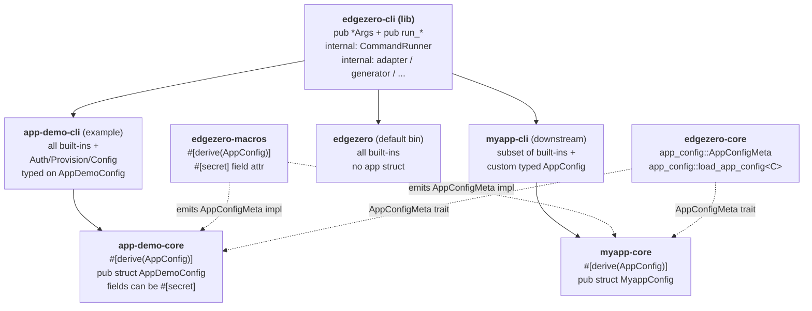

# EdgeZero CLI Extensions — Full Design

**Date:** 2026-05-19
**Status:** Approved design (single-spec form), pending implementation plan
**Branch:** `docs/extensible-cli-library-spec`

This single spec covers the full effort: turning `edgezero-cli` into an
extensible library, defining a per-service app-config file with a typed
Rust schema and `#[secret]` field annotations, adding four new commands
(`auth`, `provision`, `config validate`, `config push`), extending the
project generator to scaffold the new pieces, and updating `app-demo` to
exercise everything end-to-end.

The work is organised into seven sub-projects so it can ship in seven
incremental PRs, but the design decisions live here together so reviewers
see the full picture in one place.

---

## 1. Goal

Let downstream projects (e.g. a future `myapp` created by `edgezero new
myapp`) build their own CLI binary that:

- Reuses any subset of edgezero's built-in commands (today: `build`,
  `deploy`, `dev`, `new`, `serve`; after this effort: also `auth`,
  `provision`, `config validate`, `config push`).
- Adds their own subcommands.
- Owns the binary name, `about` text, and top-level help.

Alongside the extensibility substrate, ship:

- A typed per-service app-config file (e.g. `myapp.toml`) whose schema is
  defined by the downstream app as a Rust struct, validated at lint time
  by `config validate`, and uploaded to the platform config store by
  `config push`. Fields annotated `#[secret]` in the struct are recognised
  by the CLI: they are skipped during push (their values live in the
  secret store) and their bindings are cross-checked during validate.
- Platform credential and resource management (`auth`, `provision`) that
  shells out to each platform's official CLI tool, with all shell-out
  calls wrapped in a mockable `CommandRunner` trait so CI stays hermetic.
- A generator that scaffolds a new project complete with its own
  `<name>-cli` crate (using the lib substrate) and a stub `<name>.toml`
  app-config file.
- An `app-demo` overhaul that demonstrates the finished system:
  `app-demo.toml` with typed `AppDemoConfig` (including a `#[secret]`
  field), `app-demo-cli` exposing every built-in plus the new commands,
  and one `app-demo-core` handler that reads a config value from the
  config store at runtime (proving the push-then-read flow).

The default `edgezero` binary remains backwards-compatible: every existing
subcommand keeps the same name, flags, and behaviour. New subcommands
(`auth`, `provision`, `config`) become additionally available.

## 2. Non-goals

- No runtime command registry (`inventory` / `linkme`-style); no
  PATH-based external subcommand discovery.
- No edgezero-managed credentials. `auth` delegates entirely to
  `wrangler` / `fastly` / `spin`; we store nothing.
- No direct REST API calls to platforms. All platform interactions go
  through the platform's official CLI tool.
- No environment-sectioned app-config (`[config.production]`,
  `[config.staging]`). Single `[config]` table per file; multi-environment
  workflows are deferred until a real need surfaces.
- No live-platform CI smoke tests. All tests run against a mock
  `CommandRunner`.
- No `app-demo` overhaul beyond what is needed to demonstrate the new
  features. Existing handlers, the `app!` macro, and the manifest
  schema stay as they are except for the additive changes called out
  below (notably extending `[stores.*.adapters.<x>]` to carry
  provisioned IDs, and removing the deprecated `[stores.config.defaults]`).
- No Spin-side implementation of `provision` or `config push` in this
  effort. A separate in-flight PR adds Spin support for the
  `[stores.*]` schema; once that lands, the CLI's Spin path will be a
  small follow-up because it uses the same manifest schema. Until then,
  `--adapter spin` for these two commands logs a clear "not yet
  supported" message and exits non-zero.

## 3. Architecture overview



Key contracts:

- **Substrate**: each built-in command is a `(pub *Args, pub run_*)` pair
  in `edgezero-cli`. Downstream `Subcommand` enums opt in by listing the
  variants they want. Opt-out is omission.
- **Typed app-config + secrets**: downstream defines a struct with
  `#[derive(Deserialize, Validate, AppConfig)]`. Fields the runtime
  should read from the secret store are annotated `#[secret]`; their
  value in the toml file is the **secret binding name** (a string).
  The `AppConfig` derive (from `edgezero-macros`) emits an
  `impl AppConfigMeta for MyConfig` that exposes
  `SECRET_FIELDS: &'static [&'static str]`. Downstream CLIs call the
  generic `run_config_validate_typed::<C>` and `run_config_push_typed::<C>`
  bound on `C: DeserializeOwned + Validate + Serialize + AppConfigMeta`.
- **Shell-out isolation**: every subprocess call goes through a private
  `CommandRunner` trait that takes a `CommandSpec` (program, args, cwd,
  stdin, env). Tests inject a `MockCommandRunner` that records
  invocations and returns scripted outputs. CI never touches a real
  platform.
- **Provisioned IDs**: when `provision` creates a platform resource, the
  resulting ID is written back to
  `[stores.<kind>.adapters.<adapter>] id = "..."` in `edgezero.toml`.
  This is the canonical source for `config push` and other commands.
  Where the platform's own manifest also needs the ID (e.g.
  `wrangler.toml [[kv_namespaces]] id = "..."`), `provision` writes
  that too so deploys work, but `edgezero.toml` is the single source
  the CLI reads from.
- **Generator**: `edgezero new <name>` produces a workspace with
  `crates/<name>-core` (using `#[derive(AppConfig)]`),
  `crates/<name>-cli`, per-adapter crates, `<name>.toml` app-config
  stub, and `edgezero.toml`. The new `<name>-cli` uses the lib
  substrate verbatim.

## 4. End-state public API surface

Final shape after all seven sub-projects ship:

```rust
// crates/edgezero-cli/src/lib.rs  (feature = "cli")

// Re-exports of arg structs (all #[non_exhaustive] for forward-compat)
pub use args::{
    AuthArgs, AuthSub, BuildArgs, ConfigPushArgs, ConfigValidateArgs,
    DeployArgs, NewArgs, ProvisionArgs, ServeArgs,
};

pub fn init_cli_logger();

// Built-in commands from the original CLI
pub fn run_build(args: &BuildArgs) -> Result<(), String>;
pub fn run_deploy(args: &DeployArgs) -> Result<(), String>;
pub fn run_new(args: &NewArgs) -> Result<(), String>;
pub fn run_serve(args: &ServeArgs) -> Result<(), String>;
#[cfg(feature = "edgezero-adapter-axum")]
pub fn run_dev() -> !;

// New commands
pub fn run_auth(args: &AuthArgs) -> Result<(), String>;
pub fn run_provision(args: &ProvisionArgs) -> Result<(), String>;

// Config commands: untyped (default edgezero binary) and typed (downstream).
// Both bounds include AppConfigMeta so secret-field handling is uniform.
pub fn run_config_validate(args: &ConfigValidateArgs) -> Result<(), String>;
pub fn run_config_validate_typed<C>(args: &ConfigValidateArgs) -> Result<(), String>
where
    C: serde::de::DeserializeOwned + validator::Validate
       + ::edgezero_core::app_config::AppConfigMeta;

pub fn run_config_push(args: &ConfigPushArgs) -> Result<(), String>;
pub fn run_config_push_typed<C>(args: &ConfigPushArgs) -> Result<(), String>
where
    C: serde::de::DeserializeOwned + validator::Validate + serde::Serialize
       + ::edgezero_core::app_config::AppConfigMeta;
```

Public API from `edgezero-core` (additive):

```rust
// crates/edgezero-core/src/app_config.rs

pub trait AppConfigMeta {
    /// Field names whose runtime value comes from the secret store, not
    /// the config store. Emitted by `#[derive(AppConfig)]`.
    const SECRET_FIELDS: &'static [&'static str];
}

pub fn load_app_config<C>(path: &std::path::Path) -> Result<C, AppConfigError>
where C: serde::de::DeserializeOwned + validator::Validate + AppConfigMeta;

pub fn load_app_config_raw(path: &std::path::Path)
    -> Result<std::collections::BTreeMap<String, toml::Value>, AppConfigError>;
```

Public derive from `edgezero-macros`:

```rust
// crates/edgezero-macros/src/lib.rs (re-export)
pub use edgezero_macros_impl::AppConfig;     // procedural derive
```

Internal modules (`adapter`, `generator`, `scaffold`, `dev_server`,
`runner`, `provision`, `auth`, `config`) all stay private to
`edgezero-cli`. Only the symbols above are public.

## 5. End-state file layout

```
crates/edgezero-cli/
  Cargo.toml                  # lib + bin
  src/
    lib.rs                    # public API; declares private modules
    main.rs                   # thin wrapper for the default edgezero bin
    args.rs                   # all pub *Args structs + private Args/Command
    adapter.rs                # (unchanged, private)
    generator.rs              # extended: also scaffolds <name>-cli + <name>.toml + <name>-core/src/config.rs
    scaffold.rs               # (unchanged-ish, private)
    dev_server.rs             # (unchanged, private; feature-gated)
    runner.rs                 # NEW: CommandSpec + CommandRunner trait + Real/Mock impls
    auth.rs                   # NEW: auth subcommand impl (uses runner)
    provision.rs              # NEW: provision impl (uses runner + manifest writeback)
    config.rs                 # NEW: validate + push impl (uses runner + secret handling)
    templates/
      core/                   # (existing; src/config.rs.hbs added in sub-project 2)
      root/                   # (existing; edgezero.toml.hbs updated)
      cli/                    # NEW: templates for <name>-cli
        Cargo.toml.hbs
        src/main.rs.hbs
      app/                    # NEW: <name>.toml.hbs stub app-config
  tests/
    lib_consumer.rs           # NEW: external-consumer compile test

crates/edgezero-core/src/
  app_config.rs               # NEW: AppConfigMeta trait + load_app_config<C> + raw loader
  manifest.rs                 # UPDATED: [stores.*.adapters.<x>].id field, drop [stores.config.defaults]

crates/edgezero-macros/
  Cargo.toml                  # adds the new proc-macro symbol
  src/
    lib.rs                    # NEW exports: AppConfig derive
    app_config.rs             # NEW: AppConfig derive impl

examples/app-demo/
  Cargo.toml                  # adds crates/app-demo-cli to members
  app-demo.toml               # NEW: typed app config with one #[secret] field
  edgezero.toml               # UPDATED: remove [stores.config.defaults]; add [stores.config.adapters.<x>] id slots
  crates/
    app-demo-core/
      src/config.rs           # NEW: pub struct AppDemoConfig with #[derive(AppConfig)] and #[secret]
      src/handlers.rs         # one handler reads from config store
    app-demo-cli/             # NEW
      Cargo.toml
      src/main.rs             # full Cmd enum: all built-ins + Auth/Provision/Config
      tests/help.rs           # smoke test
    app-demo-adapter-*/       # (unchanged)

docs/guide/
  cli-walkthrough.md          # NEW: full myapp loop (linked from .vitepress/config.ts sidebar)
.vitepress/config.ts          # UPDATED: sidebar entry for cli-walkthrough
```

## 6. Cross-cutting designs

### 6.1 `CommandSpec` + `CommandRunner` (sub-project #4 introduces; #5 and #6 reuse)

```rust
// crates/edgezero-cli/src/runner.rs (private to the crate)

pub(crate) struct CommandSpec<'a> {
    pub program: &'a str,
    pub args:    &'a [&'a str],
    pub cwd:     Option<&'a std::path::Path>,
    pub stdin:   Option<&'a [u8]>,
    pub env:     &'a [(&'a str, &'a str)],
}

pub(crate) trait CommandRunner: Send + Sync {
    fn run(&self, spec: &CommandSpec<'_>) -> std::io::Result<CommandOutput>;
}

pub(crate) struct CommandOutput {
    pub status: i32,
    pub stdout: String,
    pub stderr: String,
}

pub(crate) struct RealCommandRunner;
impl CommandRunner for RealCommandRunner { /* std::process::Command */ }

#[cfg(test)]
pub(crate) struct MockCommandRunner { /* recorded expectations */ }
```

Why a struct (not a positional-args method): provisioned commands need
`cwd` (per-adapter manifest directories), `stdin` (Fastly `--stdin` for
large payloads), and `env` overrides (token isolation in tests).
Defining `CommandSpec` up front avoids churning every command-site when
those needs surface.

Public command functions use a private `*_with` inner function:

```rust
pub fn run_auth(args: &AuthArgs) -> Result<(), String> {
    run_auth_with(&RealCommandRunner, args)
}

fn run_auth_with<R: CommandRunner>(runner: &R, args: &AuthArgs) -> Result<(), String> {
    // construct CommandSpec, invoke runner
}

#[cfg(test)]
mod tests {
    fn it_logs_into_cloudflare() {
        let mock = MockCommandRunner::expect("wrangler", &["login"]);
        run_auth_with(&mock, &AuthArgs { sub: AuthSub::Login { adapter: "cloudflare".into() } }).unwrap();
    }
}
```

Public surface stays clean (`run_auth(&args)`); tests bypass to inject
the mock. No public trait, no semver risk.

### 6.2 Error model

All public `run_*` functions return `Result<(), String>`. This matches
the existing pattern in `edgezero-cli` today. Error formatting is the
function's responsibility; callers (binaries) log and exit.

### 6.3 Feature gates (consumer-facing)

For downstream `edgezero-cli` consumers:

```toml
[dependencies]
edgezero-cli = { version = "...", default-features = false, features = ["cli"] }
# Plus the adapters the downstream wants:
# - edgezero-adapter-axum (only this for non-WASM, native, dev use)
# - edgezero-adapter-cloudflare
# - edgezero-adapter-fastly
# - edgezero-adapter-spin
```

- `cli` (default) — gates clap and the whole public API. Required.
- `edgezero-adapter-{axum,fastly,cloudflare,spin}` (all four default) —
  each gates that adapter's dispatch path in build / deploy / serve /
  provision / auth / config push. Disabling an adapter feature removes
  that adapter from the `--adapter` matrix and causes the CLI to surface
  a clear "adapter not compiled in" error if invoked.
- The new `auth`, `provision`, and `config-push` paths do not introduce
  new feature flags. They are part of `cli`. Per-adapter logic inside
  them is gated on the existing adapter features.

Default-features-on remains the easiest mode for downstream — opting
out of adapters is for size-sensitive builds.

### 6.4 Typed vs raw config serialization

The two `config validate` / `config push` flavours share the same
serialization rules but differ in schema awareness:

**Both flavours:**

- Top-level value of the toml file must be a `[config]` table.
- Each field is serialized to a string for storage in the config store:
  - `String` → as-is.
  - `bool`, integer, float → `to_string()`.
  - Compound types (arrays, maps, nested structs) → `serde_json::to_string`.
  - `Option::None` / `Value::Null` → field skipped entirely.
- Fields whose name is in `AppConfigMeta::SECRET_FIELDS` are excluded
  from push (their value is the secret-store binding name; the actual
  secret material lives in the secret store).

**Typed flavour (`run_config_*_typed::<C>`):**

- Requires `C: DeserializeOwned + Validate + Serialize + AppConfigMeta`.
- Validates: `serde_json::to_value(&c)` must produce `Value::Object`;
  any other shape errors out before the runner is touched.
- Honors serde attributes on `C`:
  - `#[serde(rename = "k")]` — the renamed name is the storage key.
  - `#[serde(flatten)]` — nested fields are merged into the top-level
    map after the typed serialize step.
  - `#[serde(skip_serializing, skip_serializing_if = ...)]` — honored;
    such fields never reach the runner.
- Runs `C::validate()` before serialization.

**Raw flavour (`run_config_*`):**

- Loads `BTreeMap<String, toml::Value>` from the `[config]` table.
- Same scalar/compound serialization rules.
- No `Validate` (the default `edgezero` binary doesn't know the schema).
- Secret-field exclusion is skipped (no `AppConfigMeta` available) —
  the raw flavour pushes every field present in the toml. Operators
  using the raw flavour must put secret references in a separate part
  of their workflow or use the typed flavour instead.

`config validate` and `config push` apply the same rules; push is just
validate + upload, with `push` running validate's strict checks as a
pre-flight before invoking any runner.

### 6.5 Test strategy summary

- Existing CLI tests move alongside their handlers.
- New tests are added per sub-project for that sub-project's surface.
- Every test that would touch a platform uses `MockCommandRunner`.
- One external-consumer integration test (`tests/lib_consumer.rs`)
  exercises the public API as a downstream binary would.
- `examples/app-demo/crates/app-demo-cli/tests/help.rs` smoke-tests the
  generated/handwritten downstream pattern.

### 6.6 Secret annotation via `#[derive(AppConfig)]`

**Goal:** let app-config structs declare which fields are secret-backed
without inventing a new toml grammar. The Rust struct is the source of
truth; the toml just contains the secret-store binding names.

**Syntax:**

```rust
use serde::{Deserialize, Serialize};
use validator::Validate;
use edgezero_macros::AppConfig;

#[derive(Debug, Deserialize, Serialize, Validate, AppConfig)]
pub struct AppDemoConfig {
    #[validate(length(min = 1))]
    pub greeting: String,

    pub timeout_ms: u32,

    pub feature_new_checkout: bool,

    /// Runtime value comes from the secret store. The `String` here is the
    /// secret-store binding name written in app-demo.toml.
    #[secret]
    pub api_token: String,
}
```

**Toml shape (no new syntax):**

```toml
[config]
greeting = "hello from app-demo"
timeout_ms = 1500
feature_new_checkout = false
api_token = "APP_DEMO_API_TOKEN"   # secret-store binding name
```

**What the derive emits:**

```rust
impl ::edgezero_core::app_config::AppConfigMeta for AppDemoConfig {
    const SECRET_FIELDS: &'static [&'static str] = &["api_token"];
}
```

Field names match the on-the-wire key (so `#[serde(rename = "...")]` is
honored — the derive reads the serde rename and uses the renamed name in
`SECRET_FIELDS`).

**CLI behaviour:**

- `config validate --typed`: for each name in `SECRET_FIELDS`, looks up
  the corresponding toml value (must be a non-empty string) and asserts
  it appears in `[stores.secrets]` (either directly as the store name
  or as a per-adapter override). Failure: "field `api_token` is marked
  `#[secret]` but its binding `APP_DEMO_API_TOKEN` is not declared in
  `[stores.secrets]`".
- `config push --typed`: skips every `SECRET_FIELDS` entry. The secret
  material is never written to the config store. (Seeding the secret
  store itself is out of scope; users do that via `wrangler secret put`,
  `fastly secret-store-entry create`, or env vars for axum.)

**Runtime usage in service code:**

```rust
// Inside a handler
let binding = &config.api_token;                  // "APP_DEMO_API_TOKEN"
let token   = ctx.secrets().get(binding).await?;  // actual secret value
```

The service code is explicit about reading from the secret store; the
struct's String field just carries the binding name.

**`Validate` interaction:** `#[secret]` and `#[validate(...)]` compose
freely. `Validate` runs against the binding name (the string in the
struct), so e.g. `#[validate(length(min = 1))]` on a `#[secret]` field
enforces the binding-name is non-empty.

---

## 7. Sub-project 1 — Extensible `edgezero-cli` library + generator + `app-demo-cli` skeleton

**Goal:** establish the substrate. After this ships, downstream projects
can build their own CLI against the lib using only the existing five
built-ins. Default `edgezero` is backwards-compatible (no new commands,
no flag changes).

**Source changes:**

- `crates/edgezero-cli/src/args.rs` — promote each `Command` variant's
  inline fields into a standalone `#[derive(clap::Args)]` struct
  (`#[non_exhaustive]`). `NewArgs` already exists. The internal
  `Command` enum becomes:

  ```rust
  pub enum Command {
      Build(BuildArgs),
      Deploy(DeployArgs),
      Dev,
      New(NewArgs),
      Serve(ServeArgs),
  }
  ```

- `crates/edgezero-cli/src/lib.rs` (new) — declares the private modules,
  moves `init_cli_logger`, `load_manifest_optional`,
  `ensure_adapter_defined`, `store_bindings_message`, `log_store_bindings`,
  and the five handlers (renamed `handle_*` → `run_*`).
- `crates/edgezero-cli/src/main.rs` — shrinks to ~20 lines, dispatches
  to the public `run_*` functions.
- Existing CLI tests move from `main.rs` to `lib.rs`. No assertion
  changes.
- **Generator update**: `generator.rs` and `templates/` extended so that
  `edgezero new <name>` also produces:
  - `crates/<name>-cli/Cargo.toml` (depends on `edgezero-cli` with
    default features + clap + log)
  - `crates/<name>-cli/src/main.rs` (uses all five built-ins via the lib
    substrate; same shape as the canonical downstream example in §3)
  - Root `Cargo.toml.hbs` updated to include `crates/<name>-cli` in
    workspace members.
  - `templates/cli/` directory created to hold the new Handlebars
    templates.
  - **No app-config file yet, no derive yet** — `<name>.toml` and the
    `#[derive(AppConfig)]` plumbing arrive in sub-project #2.
- `examples/app-demo/crates/app-demo-cli` (new crate, handwritten —
  parallel to what the generator will produce):
  - Added to `examples/app-demo/Cargo.toml` `members` list.
  - `edgezero-cli = { path = "../../../../crates/edgezero-cli" }` added
    to that workspace's `[workspace.dependencies]` (mirroring the
    existing `edgezero-core` pattern in that file).
  - `src/main.rs` mirrors the canonical downstream pattern, all five
    built-ins, no custom subcommands yet.

**Migration note:** projects created by sub-project #1's generator do
not auto-update when sub-project #2 lands. The generator is the source
of truth for new scaffolds; existing projects follow the documented
manual migration (add `app-config.rs`, add `<name>.toml`).

**Tests:**

- All existing CLI tests pass after relocation.
- New `crates/edgezero-cli/tests/lib_consumer.rs`: external-consumer
  integration test constructing `BuildArgs` and invoking `run_build`
  against a temp-dir manifest.
- New `examples/app-demo/crates/app-demo-cli/tests/help.rs`:
  `Args::try_parse_from(["app-demo-cli", "--help"])` exits with help
  output and no panic.
- New generator test verifies `generate_new("test-app", ...)` produces
  `crates/test-app-cli/Cargo.toml` and `src/main.rs` referencing the
  right names.

**CI:** all four existing gates (`fmt`, `clippy -D warnings`,
`cargo test`, feature `cargo check`). Spin wasm32 gate unaffected.

**Ship gate:** `edgezero --help` lists the same five subcommands as
before with identical flags; `app-demo-cli --help` prints the same five
built-ins; `edgezero new throwaway-app && cd throwaway-app && cargo
check --workspace` succeeds.

## 8. Sub-project 2 — App-config schema, derive macro, generic loader

**Goal:** define the file format for per-service app config, the
`#[derive(AppConfig)]` macro that produces secret-field metadata, and
the generic loader the CLI uses.

**Source changes:**

- `crates/edgezero-core/src/app_config.rs` (new):

  ```rust
  use serde::de::DeserializeOwned;
  use validator::Validate;

  pub trait AppConfigMeta {
      const SECRET_FIELDS: &'static [&'static str];
  }

  #[derive(Debug)]
  pub struct AppConfigError(String);
  // Display + Error impls

  pub fn load_app_config<C>(path: &std::path::Path) -> Result<C, AppConfigError>
  where
      C: DeserializeOwned + Validate + AppConfigMeta,
  {
      // 1. Read file.
      // 2. Parse TOML into a wrapper { config: C }.
      // 3. Run C::validate().
      // 4. Return C.
  }

  pub fn load_app_config_raw(path: &std::path::Path)
      -> Result<std::collections::BTreeMap<String, toml::Value>, AppConfigError>;
  ```

  `app_config` is `pub use`d from `edgezero-core`'s `lib.rs`. No new
  workspace deps (serde, validator, toml are already there).

- `crates/edgezero-macros/src/app_config.rs` (new): the `AppConfig`
  derive. Parses the input struct, scans each field for the `#[secret]`
  attribute, honors `#[serde(rename = "...")]`, and emits a single
  `impl ::edgezero_core::app_config::AppConfigMeta` block with
  `SECRET_FIELDS`. No other code is generated; the user's `Deserialize`,
  `Validate`, etc., come from their own derives.

  Errors at compile time on:
  - Non-struct inputs.
  - Tuple structs.
  - Unknown attributes nested inside `#[secret(...)]` (the attribute is
    a marker; `#[secret]` is accepted, `#[secret(name = "x")]` is not in
    this version).

- `crates/edgezero-macros/src/lib.rs`: re-export the new derive
  alongside the existing `action` / `app` proc macros.

- `crates/edgezero-cli/src/templates/app/<name>.toml.hbs` (new):

  ```toml
  # {{name}} app runtime config.
  # Values are pushed to the active config store via `edgezero config push`.
  # Service code reads them at runtime via the config store binding.
  # Secret-annotated fields are skipped by push; their values are the
  # secret-store binding names and the actual secrets live in the secret store.

  [config]
  greeting = "hello from {{name}}"
  ```

- `crates/edgezero-cli/src/templates/core/src/config.rs.hbs` (new):
  a `<NameUpperCamel>Config` struct with `#[derive(Deserialize, Serialize,
  Validate, AppConfig)]` and a `greeting: String` field as the default
  template.

- `examples/app-demo/app-demo.toml` (new, handwritten parallel):

  ```toml
  [config]
  greeting = "hello from app-demo"
  timeout_ms = 1500
  feature_new_checkout = false
  api_token = "APP_DEMO_API_TOKEN"
  ```

- `examples/app-demo/crates/app-demo-core/src/config.rs` (new):

  ```rust
  use serde::{Deserialize, Serialize};
  use validator::Validate;
  use edgezero_macros::AppConfig;

  #[derive(Debug, Deserialize, Serialize, Validate, AppConfig)]
  pub struct AppDemoConfig {
      #[validate(length(min = 1))]
      pub greeting: String,
      #[validate(range(min = 100, max = 60000))]
      pub timeout_ms: u32,
      pub feature_new_checkout: bool,
      #[secret]
      #[validate(length(min = 1))]
      pub api_token: String,
  }
  ```

- Generator extension (continuation from sub-project #1's generator
  work): also emit `<name>-core/src/config.rs` from the new template,
  and emit `<name>.toml` at the project root.

**Tests:**

- Unit tests for `load_app_config`: valid file, missing file, bad TOML,
  validator failure, missing `[config]` table, missing-required-field.
- Round-trip test in `app-demo-core` that the example `app-demo.toml`
  parses into `AppDemoConfig` and passes validation.
- Macro tests (`crates/edgezero-macros/tests/app_config_derive.rs`):
  - Struct with no `#[secret]` fields emits empty `SECRET_FIELDS`.
  - Struct with one `#[secret]` field emits `&["that_field"]`.
  - `#[serde(rename = "k")]` is honored; the renamed key appears in
    `SECRET_FIELDS`.
  - Non-struct input fails with a clear `compile_error!`.

**Ship gate:**
`AppDemoConfig::SECRET_FIELDS == ["api_token"]` is asserted in a unit
test; `edgezero_core::app_config::load_app_config::<AppDemoConfig>(Path::new("examples/app-demo/app-demo.toml"))`
succeeds.

## 9. Sub-project 3 — `config validate` command

**Goal:** lint the project's TOML files locally with zero platform calls.

**Public API additions:**

```rust
pub use args::ConfigValidateArgs;
pub fn run_config_validate(args: &ConfigValidateArgs) -> Result<(), String>;
pub fn run_config_validate_typed<C>(args: &ConfigValidateArgs) -> Result<(), String>
where
    C: DeserializeOwned + Validate + AppConfigMeta;
```

`ConfigValidateArgs`:

```rust
#[derive(clap::Args, Debug)]
#[non_exhaustive]
pub struct ConfigValidateArgs {
    #[arg(long, default_value = "edgezero.toml")]
    pub manifest: PathBuf,
    /// <name>.toml; auto-detected from [app].name if None.
    #[arg(long)]
    pub app_config: Option<PathBuf>,
    /// Also check cross-references (handlers, adapter consistency, secret bindings).
    #[arg(long)]
    pub strict: bool,
}
```

**Validation steps (in order):**

1. Parse `edgezero.toml` at `args.manifest` via the existing
   `ManifestLoader`. Report TOML syntax errors with file/line.
2. If an app-config file is provided or auto-detected, parse it:
   - Non-typed path: `load_app_config_raw` — confirms structure.
   - Typed path: `load_app_config::<C>` — also runs `Validate`.
3. If `--strict`:
   - Every adapter referenced in `[adapters.*]` has a matching set of
     `[stores.*.adapters.*]` entries when bindings are overridden.
   - Every handler path in `[[triggers.http]]` is well-formed.
   - **Typed path only:** for each field in `C::SECRET_FIELDS`, look up
     its value in the parsed toml (must be a non-empty string) and
     assert that string appears as a `[stores.secrets]` binding (either
     `stores.secrets.name` or a per-adapter override).
   - (Full check list pinned in the implementation plan.)

**Output:** human-readable diagnostics; exits 0 on success, 1 on failure.

**Tests:**

- Valid manifest passes.
- Each kind of failure (syntax, schema, validator failure, missing
  cross-reference, missing secret binding) produces a distinct error
  message.
- Typed and non-typed paths covered.
- `app-demo-cli config validate --strict` is the canonical typed
  integration test.

**Ship gate:** `app-demo-cli config validate --strict` exits 0 against
the example workspace; deliberately corrupted fixtures (bad syntax,
unbound secret) each fail with the expected error.

## 10. Sub-project 4 — `auth` command

**Goal:** delegate per-adapter authentication to the native tool. No
edgezero-stored credentials. Introduces the `runner` module that
sub-projects 5 and 6 reuse.

**Public API additions:**

```rust
pub use args::{AuthArgs, AuthSub};
pub fn run_auth(args: &AuthArgs) -> Result<(), String>;
```

**Clap shape:** `--adapter` lives on each subcommand, not the parent,
so the UX is `auth login --adapter cloudflare` (not `auth --adapter
cloudflare login`):

```rust
#[derive(clap::Args, Debug)]
#[non_exhaustive]
pub struct AuthArgs {
    #[command(subcommand)]
    pub sub: AuthSub,
}

#[derive(clap::Subcommand, Debug)]
pub enum AuthSub {
    Login  { #[arg(long)] adapter: String },
    Logout { #[arg(long)] adapter: String },
    Status { #[arg(long)] adapter: String },
}
```

**Per-adapter behaviour:**

| Adapter    | Login                   | Logout                  | Status                |
|------------|-------------------------|-------------------------|-----------------------|
| axum       | no-op (log message)     | no-op                   | always "ok"           |
| cloudflare | `wrangler login`        | `wrangler logout`       | `wrangler whoami`     |
| fastly     | `fastly profile create` | `fastly profile delete` | `fastly profile list` |
| spin       | `spin cloud login`      | `spin cloud logout`     | `spin cloud info`     |

All invocations go through `CommandRunner` using `CommandSpec` with
`cwd: None` and inherited env. The `runner` module (§6.1) lands here.

**Tests:**

- For each (adapter, sub) pair: `MockCommandRunner` expectation. The
  mock records the exact `CommandSpec` (program, args, cwd, env);
  the test asserts them.
- Error cases: tool not found (program returns ENOENT), tool returns
  non-zero exit.

**Ship gate:** with the mock runner, `run_auth` produces the exact
expected subprocess invocation for every (adapter, sub) pair.

## 11. Sub-project 5 — `provision` command

**Goal:** create the underlying platform resources (KV namespace, secret
store, config store) declared in `[stores.*]` of `edgezero.toml`, and
write the resulting IDs back to `edgezero.toml` and (where the platform
requires) to the per-adapter manifest.

**Public API additions:**

```rust
pub use args::ProvisionArgs;
pub fn run_provision(args: &ProvisionArgs) -> Result<(), String>;
```

```rust
#[derive(clap::Args, Debug)]
#[non_exhaustive]
pub struct ProvisionArgs {
    #[arg(long, default_value = "edgezero.toml")]
    pub manifest: PathBuf,
    #[arg(long)]
    pub adapter: String,
    #[arg(long)]
    pub dry_run: bool,
}
```

**Behaviour:**

For the named adapter, iterate over `[stores.kv]`, `[stores.secrets]`,
`[stores.config]` in `args.manifest`. For each enabled store, shell out
to create the resource (using the current platform-CLI syntax):

| Adapter    | KV                                          | Secrets                                       | Config                                       |
|------------|---------------------------------------------|-----------------------------------------------|----------------------------------------------|
| axum       | no-op (local; env-backed)                   | no-op                                         | no-op                                        |
| cloudflare | `wrangler kv namespace create <NAME>`       | (no-op; wrangler-managed at runtime via `wrangler secret put`) | `wrangler kv namespace create <NAME>` (config store is a separate KV namespace) |
| fastly     | `fastly kv-store create --name <NAME>`      | `fastly secret-store create --name <NAME>`    | `fastly config-store create --name <NAME>`   |
| spin       | **not yet supported** — error out with a clear message pointing at the in-flight stores PR | same | same |

(Spin behaviour: log "spin provision is not yet supported; a separate
PR is in flight to add `[stores.*]` support for the Spin adapter. Until
that lands, configure Spin variables manually." Exit non-zero.)

`--dry-run` prints the would-be `CommandSpec`s without running them.

**Writeback to `edgezero.toml`:** after each successful create, parse
the tool's stdout to extract the resource ID, then update the manifest
in place by writing:

```toml
[stores.kv.adapters.cloudflare]
id = "<extracted-id>"
```

The ID lives in `[stores.<kind>.adapters.<adapter>] id`. This is the
single source of truth for `config push` and other ID-consuming
commands. The `id` field is added to `ManifestLoader`'s schema as an
optional string.

**Writeback to per-adapter manifest:** for adapters whose own tooling
also needs the ID at deploy time:

- **Cloudflare:** also patch `wrangler.toml` to add the namespace ID to
  the matching `[[kv_namespaces]]` block. (Standard wrangler binding
  pattern; needed for `wrangler deploy` to bind the namespace.)
- **Fastly:** no per-adapter manifest writeback needed; the Fastly
  service references the store by ID at API call time, not at deploy
  time.

**Tests:**

- For each (adapter, store-kind) tuple, `MockCommandRunner`
  expectations including the exact `CommandSpec` and a scripted stdout
  that includes a sample ID.
- ID extraction: golden-file tests over recorded sample outputs from
  `wrangler kv namespace create` and Fastly's create commands.
- Manifest writeback: temp-dir fixture provisions, then `edgezero.toml`
  is re-read and contains the expected `[stores.<kind>.adapters.<x>] id`.
- `--dry-run` produces a list of would-be `CommandSpec`s without
  invoking the runner; no manifest writeback either.

**Ship gate:** `app-demo-cli provision --adapter cloudflare --dry-run`
prints the expected `wrangler kv namespace create` invocations (one per
store kind that applies); a non-dry-run against the mock writes the IDs
back into the temp-fixture manifest.

## 12. Sub-project 6 — `config push` command

**Goal:** upload `<name>.toml`'s `[config]` values to the live config
store on a given adapter, skipping `#[secret]` fields.

**Public API additions:**

```rust
pub use args::ConfigPushArgs;
pub fn run_config_push(args: &ConfigPushArgs) -> Result<(), String>;
pub fn run_config_push_typed<C>(args: &ConfigPushArgs) -> Result<(), String>
where
    C: DeserializeOwned + Validate + Serialize + AppConfigMeta;
```

```rust
#[derive(clap::Args, Debug)]
#[non_exhaustive]
pub struct ConfigPushArgs {
    #[arg(long, default_value = "edgezero.toml")]
    pub manifest: PathBuf,
    #[arg(long)]
    pub adapter: String,
    /// Auto-detect <name>.toml from [app].name if None.
    #[arg(long)]
    pub app_config: Option<PathBuf>,
    #[arg(long)]
    pub dry_run: bool,
}
```

**Behaviour:**

1. **Pre-flight validation** — internally run the same checks as
   `run_config_validate_typed` (typed path) or `run_config_validate`
   (raw path) with `--strict` semantics. Abort before any runner call
   if validation fails. No separate `--strict` flag on push; it is
   always strict.
2. Load app-config (raw map or typed struct).
3. Apply §6.4 serialization rules:
   - Skip fields in `AppConfigMeta::SECRET_FIELDS` (typed path only).
   - `Option::None` / `Value::Null` skipped.
   - Scalars `to_string`, compounds `serde_json::to_string`.
   - Typed path: assert `serde_json::to_value(&c)` is `Value::Object`;
     error otherwise.
4. Read the resource ID from `[stores.config.adapters.<adapter>].id`
   in `args.manifest`. Error with "did you run `provision` first?" if
   missing for a platform that needs it.
5. Shell out to the platform tool for bulk upload:

| Adapter    | Push                                                                                          |
|------------|-----------------------------------------------------------------------------------------------|
| axum       | Write to `.edgezero/local-config.env` (gitignored). No runner call.                           |
| cloudflare | `wrangler kv bulk put <tempfile.json> --namespace-id=<id>` (Wrangler 3.60+ syntax, space-form)|
| fastly     | Per key: `fastly config-store-entry create --store-id=<id> --key=<k> --value=<v>` via stdin where the value is large |
| spin       | **not yet supported** — error message pointing at the in-flight stores PR; exit non-zero      |

**Tests:**

- Typed and non-typed paths.
- For each supported adapter, `MockCommandRunner` expectations
  including the exact serialised payload (golden-file the JSON tempfile
  contents for Cloudflare, golden-file each Fastly per-key spec).
- `#[secret]` field in `AppDemoConfig` confirmed to be **absent** from
  the pushed payload.
- Missing `[stores.config.adapters.<adapter>].id` → clear error.
- `--dry-run` prints the serialised payload and would-be `CommandSpec`s;
  does not invoke the runner.

**Ship gate:** `app-demo-cli config push --adapter cloudflare --dry-run`
shows the expected `wrangler kv bulk put` invocation, the JSON payload
omits `api_token`, and the namespace ID matches the fixture manifest's
`[stores.config.adapters.cloudflare] id`.

## 13. Sub-project 7 — `app-demo` integration polish

**Goal:** prove the full system works end-to-end via the example.

**Source changes (all in `examples/app-demo/`):**

- `edgezero.toml`:
  - Remove `[stores.config.defaults]` entirely. Add a comment explaining
    that `app-demo.toml` is now the source of truth.
  - Leave `[stores.config]`, `[stores.kv]`, `[stores.secrets]` blocks;
    `[stores.<kind>.adapters.<x>].id` slots will populate when
    `provision` runs.
- `crates/app-demo-cli/src/main.rs`: extend `Cmd` enum to include the
  new variants:

  ```rust
  #[derive(Subcommand)]
  enum Cmd {
      // Built-ins (same as sub-project #1):
      Build(BuildArgs), Deploy(DeployArgs), Dev, New(NewArgs), Serve(ServeArgs),
      // New commands:
      Auth(AuthArgs),
      Provision(ProvisionArgs),
      #[command(subcommand)]
      Config(ConfigCmd),
  }

  #[derive(Subcommand)]
  enum ConfigCmd {
      Validate(ConfigValidateArgs),
      Push(ConfigPushArgs),
  }
  ```

  Dispatch for `Config::Validate` and `Config::Push` calls the **typed**
  variants with `AppDemoConfig` as the type parameter.

- `crates/app-demo-core/src/handlers.rs`: extend one existing handler
  (e.g. `config_get`) so it reads a key via the config store binding.
  Verify the integration after `config push` pushes real data to the
  local axum config store.

**Documentation:**

- New `docs/guide/cli-walkthrough.md` page (not `docs/cli/...` — the
  VitePress sidebar groups everything under `docs/guide/`) showing the
  full loop:

  1. `edgezero new myapp`
  2. `cd myapp && cargo build`
  3. `myapp-cli auth login --adapter cloudflare`
  4. `myapp-cli provision --adapter cloudflare`
  5. `myapp-cli config validate --strict`
  6. `myapp-cli config push --adapter cloudflare`
  7. `myapp-cli deploy --adapter cloudflare`
  8. `curl https://myapp.example/config/greeting`

- `.vitepress/config.ts` sidebar updated to include the new page under
  the existing guide group. Without this, the page exists but is not
  navigable.

**Tests:**

- `app-demo-cli config validate --strict` exits 0 against `app-demo.toml`.
- `app-demo-cli config push --adapter axum` writes a local-config file;
  the running axum dev server reads `greeting` from the config store
  and returns it on `/config/greeting`.
- The `--help` smoke test from sub-project #1 is extended to assert all
  subcommands are listed.

**Ship gate:** end-to-end demo of the full loop in CI, using
`--adapter axum` and the local file-backed config store. No live
external calls; the `axum` adapter is the substrate for verifying real
push-then-read behaviour. The Cloudflare/Fastly paths are exercised in
mock-runner tests but not against real platforms in CI.

---

## 14. Implementation order and milestones

Each sub-project ships as one PR. Order is the §7–§13 order. Each PR
must keep all four CI gates green; no skipping (`-D warnings` stays).

| # | Title                            | Net new public symbols                                                                                                            | Risk |
|---|----------------------------------|------------------------------------------------------------------------------------------------------------------------------------|------|
| 1 | Extensible lib + scaffold        | `BuildArgs`, `DeployArgs`, `NewArgs`, `ServeArgs`, `run_build`, `run_deploy`, `run_new`, `run_serve`, `run_dev`, `init_cli_logger` | M    |
| 2 | App-config schema + derive       | `edgezero_core::app_config::*`, `edgezero_macros::AppConfig`                                                                       | M    |
| 3 | `config validate`                | `ConfigValidateArgs`, `run_config_validate`, `run_config_validate_typed`                                                           | L    |
| 4 | `auth` (+ `CommandRunner`)       | `AuthArgs`, `AuthSub`, `run_auth`                                                                                                  | M    |
| 5 | `provision`                      | `ProvisionArgs`, `run_provision`                                                                                                   | H    |
| 6 | `config push`                    | `ConfigPushArgs`, `run_config_push`, `run_config_push_typed`                                                                       | M    |
| 7 | `app-demo` polish + walk-through | (none) — uses everything above                                                                                                     | L    |

**Risk notes:**

- Sub-project #1 is the substrate; getting the `*Args` shape wrong here
  forces churn later. Mitigated by `#[non_exhaustive]` on every Args
  struct and the external-consumer integration test.
- Sub-project #2 now includes the `AppConfig` proc macro; macro testing
  uses `trybuild`-style fixtures (or the project's existing macro test
  pattern in `edgezero-macros`).
- Sub-project #5 (`provision`) is the highest risk: it shells out,
  parses stdout to extract IDs, and writes back to both `edgezero.toml`
  and per-adapter manifest files. We constrain blast radius by treating
  manifest writeback as a separate step with golden-file tests on
  recorded stdout samples and by supporting `--dry-run`.

## 15. Risks and trade-offs

- **API stability:** every public `*Args` struct is `#[non_exhaustive]`
  so adding fields is non-breaking. New `run_*` functions are additive.
  The `_typed::<C>` / non-typed split adds two names per `config`
  command, which is the deliberate trade — see §6.4.
- **Shell-out fragility:** platform CLI surfaces change over time
  (Wrangler 3.60+ moved from `kv:bulk` to `kv bulk`, etc.). We pin to
  the current syntax at spec time, surface clear errors when tools are
  missing or fail, and rely on tool versions already pinned via the
  project's `.tool-versions`. Adapting to future syntax changes is one
  edit per command in the relevant private module.
- **ID writeback brittleness:** parsing tool stdout to extract IDs is
  inherently version-sensitive. Mitigation: per-tool parser functions
  with golden-file tests over recorded sample outputs; `--dry-run`
  available for safe inspection.
- **Generator drift:** the generator produces a `<name>-cli` whose
  shape must stay in sync with the canonical pattern used by
  `app-demo-cli`. Sub-project #1 introduces a generator test that
  compares structural expectations (file existence + key tokens).
  Sub-project #2 extends the test to cover `<name>-core/src/config.rs`
  and `<name>.toml`.
- **Proc macro coupling:** the `AppConfig` derive lives in
  `edgezero-macros` but emits a path referencing `edgezero_core`. This
  is the same pattern the existing `#[action]` macro uses; downstream
  consumers must depend on both crates (already the workspace norm).
- **Multi-environment app-config:** explicitly out of scope (§2). When
  needed, a follow-up spec will add `[config.<env>]` support and a
  `--env` flag on `config push`/`validate`.
- **Spin support gap:** `provision` and `config push` do not work for
  `--adapter spin` in this effort; both error out with a pointer to
  the in-flight stores PR. Sub-project ship gates work around this by
  only smoke-testing the axum / mock paths.
- **Test relocation in sub-project #1:** ~10 tests move from `main.rs`
  to `lib.rs`. Diff looks large but is mechanical; reviewers will be
  warned in the PR description.

## 16. What this spec does not cover

- Anthropic credentials, edge-network DNS / TLS, observability /
  metrics: separate concerns.
- Per-environment config (`production` vs. `staging`): explicit follow-up.
- Replacing or restructuring existing handlers in `app-demo-core` beyond
  the single one that demonstrates push-then-read.
- Any change to `edgezero-core` beyond adding the `app_config` module
  and the `[stores.*.adapters.<x>].id` field on `ManifestLoader`.
- Removal of `[stores.config.defaults]` from anywhere except
  `examples/app-demo/edgezero.toml`. Other consumers (if any in this
  repo) that rely on `defaults` are unaffected for now; full deprecation
  is a follow-up.
- Spin-side store provisioning and config push: deferred until the
  separate in-flight Spin stores PR lands. The CLI's Spin code paths
  return a clear "not yet supported" error in the meantime.

When all seven sub-projects ship, the system supports:

- `edgezero new myapp` produces a workspace ready to build with
  `myapp-cli`, a typed `MyappConfig` (using `#[derive(AppConfig)]` and
  optional `#[secret]` fields), and a `myapp.toml`.
- The developer logs into their platforms (`myapp-cli auth login
  --adapter X`), provisions stores (`myapp-cli provision --adapter X`),
  validates and pushes their app config (`myapp-cli config validate
  --strict && myapp-cli config push --adapter X`), and deploys
  (`myapp-cli deploy --adapter X`).
- Resource IDs flow `provision` → `edgezero.toml [stores.*.adapters.*]
  .id` → `config push`. Per-adapter manifests (e.g. `wrangler.toml`)
  also get the IDs they need for deploy-time binding.
- At runtime, the deployed service reads its config from the platform
  config store via the existing edgezero store binding, and reads
  secret-annotated fields from the secret store using the binding name
  the struct carries.
- The default `edgezero` binary remains backwards-compatible for
  everyone not building their own CLI, with the new commands additionally
  available.
