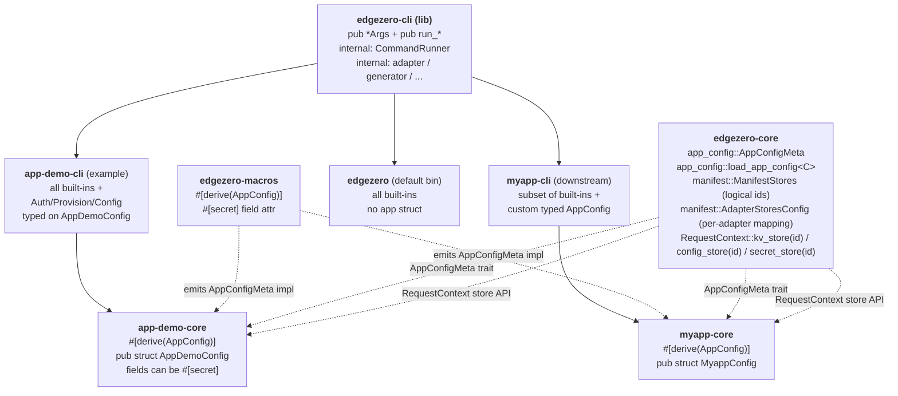

# EdgeZero CLI Extensions — Full Design

**Date:** 2026-05-19
**Status:** Approved design (single-spec form), pending implementation plan
**Branch:** `docs/extensible-cli-library-spec`

This single spec covers the full effort: a manifest schema rewrite that
introduces a logical-store / per-adapter-mapping model for KV / secrets /
config, a runtime API rewrite that supports multiple stores per kind,
turning `edgezero-cli` into an extensible library, defining a per-service
app-config file with a typed Rust schema and `#[secret]` field
annotations, adding four new commands (`auth`, `provision`, `config
validate`, `config push`), extending the project generator to scaffold
the new pieces, and updating `app-demo` to exercise everything
end-to-end.

The work is organised into nine sub-projects so it can ship in nine
incremental PRs, but the design decisions live here together so reviewers
see the full picture in one place.

---

## 1. Goal

Let downstream projects (e.g. a future `myapp` created by `edgezero new
myapp`) build their own CLI binary that:

- Reuses any subset of edgezero's built-in commands (today: `build`,
  `deploy`, `dev`, `new`, `serve`; after this effort: also `auth`,
  `provision`, `config validate`, `config push`).
- Adds their own subcommands.
- Owns the binary name, `about` text, and top-level help.

Alongside the extensibility substrate, ship:

- A **multi-store manifest model**. The app declares logical stores it
  uses (`[stores.kv] ids = ["foo", "bar"]`) and each adapter declares the
  platform-specific name for each logical id, with room for
  adapter-specific tuning. Stores are addressed in code by their logical
  id (`ctx.kv_store("foo")`).
- A **typed per-service app-config file** (e.g. `myapp.toml`) whose
  schema is defined by the downstream app as a Rust struct, validated at
  lint time by `config validate`, and uploaded to the platform config
  store by `config push`. Fields annotated `#[secret]` in the struct are
  recognised by the CLI: they are skipped during push (their values live
  in the secret store) and their references are sanity-checked during
  validate.
- Platform credential and resource management (`auth`, `provision`) that
  shells out to each platform's official CLI tool, with all shell-out
  calls wrapped in a mockable `CommandRunner` trait so CI stays hermetic.
- A generator that scaffolds a new project complete with its own
  `<name>-cli` crate (using the lib substrate) and a stub `<name>.toml`
  app-config file.
- An `app-demo` overhaul that demonstrates the finished system:
  multiple KV stores, typed `AppDemoConfig` (including a `#[secret]`
  field), `app-demo-cli` exposing every built-in plus the new commands,
  and one `app-demo-core` handler that reads a config value from the
  config store at runtime (proving the push-then-read flow).

The default `edgezero` binary remains backwards-compatible in spirit:
every existing subcommand keeps the same name and flag shape. The
manifest schema rewrite is a **breaking change** to the on-disk format —
the in-tree `examples/app-demo/edgezero.toml` is migrated as part of the
work. New subcommands (`auth`, `provision`, `config`) become additionally
available.

## 2. Non-goals

- No runtime command registry (`inventory` / `linkme`-style); no
  PATH-based external subcommand discovery.
- No edgezero-managed credentials. `auth` delegates entirely to
  `wrangler` / `fastly` / `spin`; we store nothing.
- No direct REST API calls to platforms. All platform interactions go
  through the platform's official CLI tool.
- No environment-sectioned app-config (`[config.production]`,
  `[config.staging]`). Single `[config]` table per file; multi-environment
  workflows are deferred until a real need surfaces.
- No live-platform CI smoke tests. All tests run against a mock
  `CommandRunner`.
- No on-disk migration helper for older `edgezero.toml` files using the
  pre-rewrite store schema. The in-tree `examples/app-demo/edgezero.toml`
  is the only file we migrate; external users follow the migration
  guide in the new docs page.
- No Spin-side implementation of `provision` or `config push` in this
  effort. A separate in-flight PR adds Spin support for the
  `[stores.*]` schema (which will adopt the new logical-id model);
  once that lands, the CLI's Spin path will be a small follow-up
  because it uses the same manifest schema. Until then,
  `--adapter spin` for these two commands logs a clear "not yet
  supported" message and exits non-zero.

## 3. Architecture overview



Key contracts:

- **Substrate**: each built-in command is a `(pub *Args, pub run_*)` pair
  in `edgezero-cli`. Downstream `Subcommand` enums opt in by listing the
  variants they want. Opt-out is omission.
- **Multi-store manifest model**: the app declares logical store ids in
  `[stores.<kind>]`; each adapter maps every logical id to a
  platform-specific `name` in `[adapters.<X>.stores.<kind>.<id>]`,
  optionally with adapter-specific tuning fields. Provisioned platform
  resource IDs (Cloudflare namespace IDs, Fastly store IDs) live in the
  adapter's native manifest (`wrangler.toml`, `fastly.toml`), not in
  `edgezero.toml`. See §6.6 for the full schema.
- **Multi-store runtime API**: `ctx.<kind>_store(logical_id) ->
  Option<Handle>` and `ctx.<kind>_store_default() -> Option<Handle>`.
  Each adapter's setup builds a `BTreeMap<logical_id, Handle>` keyed by
  the ids the manifest declares.
- **Typed app-config + secrets**: downstream defines a struct with
  `#[derive(Deserialize, Validate, AppConfig)]`. Fields the runtime
  should read from the secret store are annotated `#[secret]`; their
  value in the toml file is the **secret reference** (an app-defined
  string — see §6.7 for the two valid runtime patterns).
  The `AppConfig` derive (from `edgezero-macros`) emits an
  `impl AppConfigMeta for MyConfig` that exposes
  `SECRET_FIELDS: &'static [&'static str]`. Downstream CLIs call the
  generic `run_config_validate_typed::<C>` and `run_config_push_typed::<C>`
  bound on `C: DeserializeOwned + Validate + Serialize + AppConfigMeta`.
- **Shell-out isolation**: every subprocess call goes through a private
  `CommandRunner` trait that takes a `CommandSpec` (program, args, cwd,
  stdin, env). Tests inject a `MockCommandRunner` that records
  invocations and returns scripted outputs. CI never touches a real
  platform.
- **Generator**: `edgezero new <name>` produces a workspace with
  `crates/<name>-core` (using `#[derive(AppConfig)]`),
  `crates/<name>-cli`, per-adapter crates, `<name>.toml` app-config
  stub, and `edgezero.toml` using the new logical-id store model.

## 4. End-state public API surface

After all nine sub-projects ship:

```rust
// crates/edgezero-cli/src/lib.rs  (feature = "cli")

pub use args::{
    AuthArgs, AuthSub, BuildArgs, ConfigPushArgs, ConfigValidateArgs,
    DeployArgs, NewArgs, ProvisionArgs, ServeArgs,
};

pub fn init_cli_logger();

pub fn run_build(args: &BuildArgs) -> Result<(), String>;
pub fn run_deploy(args: &DeployArgs) -> Result<(), String>;
pub fn run_new(args: &NewArgs) -> Result<(), String>;
pub fn run_serve(args: &ServeArgs) -> Result<(), String>;
#[cfg(feature = "edgezero-adapter-axum")]
pub fn run_dev() -> !;

pub fn run_auth(args: &AuthArgs) -> Result<(), String>;
pub fn run_provision(args: &ProvisionArgs) -> Result<(), String>;

pub fn run_config_validate(args: &ConfigValidateArgs) -> Result<(), String>;
pub fn run_config_validate_typed<C>(args: &ConfigValidateArgs) -> Result<(), String>
where
    C: serde::de::DeserializeOwned + validator::Validate
       + ::edgezero_core::app_config::AppConfigMeta;

pub fn run_config_push(args: &ConfigPushArgs) -> Result<(), String>;
pub fn run_config_push_typed<C>(args: &ConfigPushArgs) -> Result<(), String>
where
    C: serde::de::DeserializeOwned + validator::Validate + serde::Serialize
       + ::edgezero_core::app_config::AppConfigMeta;
```

From `edgezero-core`:

```rust
// app_config module (new in sub-project #4)
pub trait AppConfigMeta {
    const SECRET_FIELDS: &'static [&'static str];
}
pub fn load_app_config<C>(path: &std::path::Path) -> Result<C, AppConfigError>
where C: serde::de::DeserializeOwned + validator::Validate + AppConfigMeta;
pub fn load_app_config_raw(path: &std::path::Path)
    -> Result<std::collections::BTreeMap<String, toml::Value>, AppConfigError>;

// RequestContext store API (rewritten in sub-project #3)
impl RequestContext {
    pub fn kv_store(&self, id: &str) -> Option<KeyValueStoreHandle>;
    pub fn kv_store_default(&self) -> Option<KeyValueStoreHandle>;
    pub fn config_store(&self, id: &str) -> Option<ConfigStoreHandle>;
    pub fn config_store_default(&self) -> Option<ConfigStoreHandle>;
    pub fn secret_store(&self, id: &str) -> Option<SecretHandle>;
    pub fn secret_store_default(&self) -> Option<SecretHandle>;
}
```

From `edgezero-macros`:

```rust
pub use edgezero_macros_impl::AppConfig;     // procedural derive
```

Internal modules in `edgezero-cli` (`adapter`, `generator`, `scaffold`,
`dev_server`, `runner`, `provision`, `auth`, `config`) stay private.

## 5. End-state file layout

```
crates/edgezero-cli/
  Cargo.toml                  # lib + bin
  src/
    lib.rs                    # public API; declares private modules
    main.rs                   # thin wrapper for the default edgezero bin
    args.rs                   # all pub *Args structs + private Args/Command
    adapter.rs                # (unchanged, private)
    generator.rs              # extended: also scaffolds <name>-cli + <name>.toml + <name>-core/src/config.rs
    scaffold.rs               # (unchanged-ish, private)
    dev_server.rs             # (unchanged, private; feature-gated)
    runner.rs                 # NEW: CommandSpec + CommandRunner trait + Real/Mock impls
    auth.rs                   # NEW: auth subcommand impl
    provision.rs              # NEW: provision impl (writes IDs to native manifests)
    config.rs                 # NEW: validate + push impl (secret handling, store targeting)
    templates/
      core/                   # (existing; src/config.rs.hbs added in sub-project #4)
      root/                   # (existing; edgezero.toml.hbs rewritten for new schema)
      cli/                    # NEW: templates for <name>-cli
        Cargo.toml.hbs
        src/main.rs.hbs
      app/                    # NEW: <name>.toml.hbs stub app-config
  tests/
    lib_consumer.rs           # NEW: external-consumer compile test

crates/edgezero-core/src/
  manifest.rs                 # REWRITTEN store schema (logical ids + per-adapter name map)
  context.rs                  # REWRITTEN store accessors (id-keyed; *_default helpers)
  app_config.rs               # NEW: AppConfigMeta trait + load_app_config<C> + raw loader
  config_store.rs             # (unchanged trait; contract macro takes id-keyed factory)
  key_value_store.rs          # (unchanged trait)
  secret_store.rs             # (unchanged trait)

crates/edgezero-core/   # adapter store impls rewritten:
crates/edgezero-adapter-axum/src/{config_store,key_value_store,secret_store}.rs
crates/edgezero-adapter-cloudflare/src/{config_store,key_value_store,secret_store}.rs
crates/edgezero-adapter-fastly/src/{config_store,key_value_store,secret_store}.rs

crates/edgezero-macros/
  Cargo.toml
  src/
    lib.rs                    # NEW export: AppConfig derive
    app_config.rs             # NEW: AppConfig derive impl

examples/app-demo/
  Cargo.toml                  # adds crates/app-demo-cli to members
  app-demo.toml               # NEW: typed app config with one #[secret] field
  edgezero.toml               # REWRITTEN to new logical-id store schema
  crates/
    app-demo-core/
      src/config.rs           # NEW: pub struct AppDemoConfig with #[derive(AppConfig)]
      src/handlers.rs         # one handler reads from config store via id
    app-demo-cli/             # NEW
      Cargo.toml
      src/main.rs             # full Cmd enum: all built-ins + Auth/Provision/Config
      tests/help.rs           # smoke test
    app-demo-adapter-*/       # store setup updates only (read manifest, build registry)

docs/guide/
  cli-walkthrough.md          # NEW
  manifest-store-migration.md # NEW: migrate pre-rewrite stores schemas
.vitepress/config.ts          # UPDATED: sidebar entries for the new pages
```

## 6. Cross-cutting designs

### 6.1 `CommandSpec` + `CommandRunner` (sub-project #6 introduces; #7 and #8 reuse)

```rust
// crates/edgezero-cli/src/runner.rs (private to the crate)

pub(crate) struct CommandSpec<'a> {
    pub program: &'a str,
    pub args:    &'a [&'a str],
    pub cwd:     Option<&'a std::path::Path>,
    pub stdin:   Option<&'a [u8]>,
    pub env:     &'a [(&'a str, &'a str)],
}

pub(crate) trait CommandRunner: Send + Sync {
    fn run(&self, spec: &CommandSpec<'_>) -> std::io::Result<CommandOutput>;
}

pub(crate) struct CommandOutput {
    pub status: i32,
    pub stdout: String,
    pub stderr: String,
}

pub(crate) struct RealCommandRunner;
impl CommandRunner for RealCommandRunner { /* std::process::Command */ }

#[cfg(test)]
pub(crate) struct MockCommandRunner { /* recorded expectations */ }
```

Defining the spec up front avoids churning every command-site when
`cwd` (per-adapter manifest directories), `stdin` (Fastly `--stdin`),
or `env` overrides (token isolation in tests) become necessary.

Public command functions use a private `*_with` inner function so tests
inject the mock:

```rust
pub fn run_auth(args: &AuthArgs) -> Result<(), String> {
    run_auth_with(&RealCommandRunner, args)
}
fn run_auth_with<R: CommandRunner>(runner: &R, args: &AuthArgs) -> Result<(), String> { ... }
```

### 6.2 Error model

All public `run_*` functions return `Result<(), String>`. Matches the
existing pattern in `edgezero-cli` today. Error formatting is the
function's responsibility; callers (binaries) log and exit.

### 6.3 Feature gates (consumer-facing)

For downstream `edgezero-cli` consumers:

```toml
[dependencies]
edgezero-cli = { version = "...", default-features = false, features = ["cli"] }
# Plus the adapters the downstream wants:
# - edgezero-adapter-axum
# - edgezero-adapter-cloudflare
# - edgezero-adapter-fastly
# - edgezero-adapter-spin
```

- `cli` (default) — gates clap and the whole public API. Required.
- `edgezero-adapter-{axum,fastly,cloudflare,spin}` (all four default) —
  each gates that adapter's dispatch path. Disabling one removes the
  adapter from the `--adapter` matrix and produces a clear
  "adapter not compiled in" error.
- The new commands (`auth`, `provision`, `config-*`) don't introduce
  new feature flags. Per-adapter logic inside them is gated on the
  existing adapter features.

### 6.4 Typed vs raw config serialization

The two `config validate` / `config push` flavours share the same
serialization rules but differ in schema awareness.

**Both flavours:**

- Top-level value of the toml file must be a `[config]` table.
- Each field is serialised to a string for storage in the config store:
  - `String` → as-is.
  - `bool`, integer, float → `to_string()`.
  - Compound types (arrays, maps, nested structs) → `serde_json::to_string`.
  - `Option::None` / `Value::Null` → field skipped entirely.
- Fields whose name is in `AppConfigMeta::SECRET_FIELDS` are excluded
  from push (their value is the secret reference; the actual secret
  material lives in the secret store).

**Typed flavour (`run_config_*_typed::<C>`):**

- Requires `C: DeserializeOwned + Validate + Serialize + AppConfigMeta`.
- Validates: `serde_json::to_value(&c)` must produce `Value::Object`;
  any other shape errors out before the runner is touched.
- Honors serde attributes on `C`:
  - `#[serde(rename = "k")]` — renamed name is the storage key.
  - `#[serde(flatten)]` — nested fields merge into the top-level map
    after the typed serialize step.
  - `#[serde(skip_serializing, skip_serializing_if = ...)]` — honored;
    such fields never reach the runner.
- Runs `C::validate()` before serialization.

**Raw flavour (`run_config_*`):**

- Loads `BTreeMap<String, toml::Value>` from the `[config]` table.
- Same scalar/compound serialization rules.
- No `Validate` (the default `edgezero` binary doesn't know the schema).
- Secret-field exclusion is skipped (no `AppConfigMeta` available) —
  the raw flavour pushes every field present in the toml. Operators
  using the raw flavour must put secret references in a separate part
  of their workflow or use the typed flavour instead.

`config validate` and `config push` apply the same rules; push is
validate + upload, with `push` running validate's strict checks as a
pre-flight before invoking any runner.

### 6.5 Test strategy summary

- Existing CLI tests move alongside their handlers.
- New tests are added per sub-project for that sub-project's surface.
- Every test that would touch a platform uses `MockCommandRunner`.
- One external-consumer integration test (`tests/lib_consumer.rs`)
  exercises the public API as a downstream binary would.
- `examples/app-demo/crates/app-demo-cli/tests/help.rs` smoke-tests the
  generated/handwritten downstream pattern.
- Manifest contract tests grow to cover multi-store schemas, default
  resolution, and unknown-id rejection.

### 6.6 Multi-store manifest schema

This is the cornerstone of sub-projects #2 and #3.

**App-level (logical) declaration in `edgezero.toml`:**

```toml
[stores.kv]
ids     = ["foo", "bar"]
default = "foo"          # optional when ids has exactly one entry

[stores.config]
ids     = ["app_config"]
default = "app_config"

[stores.secrets]
ids     = ["default"]
default = "default"
```

**Per-adapter mapping + optional tuning in `edgezero.toml`:**

```toml
[adapters.cloudflare.stores.kv.foo]
name = "FOO_CLOUDFLARE"               # the platform-specific name

[adapters.cloudflare.stores.kv.bar]
name = "BAR_CLOUDFLARE"

[adapters.fastly.stores.kv.foo]
name      = "FOO_FASTLY"
max_value = "1MB"                      # adapter-specific tuning, free-form

[adapters.cloudflare.stores.config.app_config]
name = "APP_CONFIG_JSON"

[adapters.cloudflare.stores.secrets.default]
name = "EDGEZERO_SECRETS"
```

**Field reference:**

| Field | Where | Role |
|---|---|---|
| `[stores.<kind>].ids` | top level | logical ids the app's code uses (`Vec<String>`). Must be non-empty. |
| `[stores.<kind>].default` | top level | which id is used when none is specified. Optional if `ids.len() == 1` (defaults to that one); required otherwise. Must appear in `ids`. |
| `[adapters.<X>.stores.<kind>.<id>].name` | per-adapter | the platform-specific name for that logical store on adapter X. Required. |
| any other field in that block | per-adapter | adapter-specific tuning. Stored as a `BTreeMap<String, toml::Value>`; opaque to core; each adapter parses its own slice. |

**Provisioned platform resource IDs (Cloudflare namespace IDs, Fastly
store IDs) do NOT live in `edgezero.toml`.** They live in each
platform's native manifest:

- `wrangler.toml` for Cloudflare:
  ```toml
  [[kv_namespaces]]
  binding = "FOO_CLOUDFLARE"   # wrangler's term for what we call `name` in edgezero.toml
  id      = "abc123def456"
  ```
- `fastly.toml` for Fastly (each store kind has its own section).

`provision` writes IDs into the native manifest. `config push` parses
the native manifest to find the ID it needs (e.g. `wrangler kv bulk
put --namespace-id=…`).

**Validation rules (enforced by `ManifestLoader` and by `config validate`):**

- `[stores.<kind>].ids` is non-empty.
- `[stores.<kind>].default` is in `ids`, or absent (then defaults to
  `ids[0]`).
- For every adapter declared in `[adapters.*]` and every id in
  `[stores.<kind>].ids`, there must be a corresponding
  `[adapters.<X>.stores.<kind>.<id>]` block with a `name` field.
  Missing mappings are errors.
- `name` strings are platform-syntax-validated where possible
  (Cloudflare wrangler bindings must match JavaScript identifier
  syntax — at least a warning if they don't).

**Runtime resolution at adapter init:**

The adapter walks `[adapters.<self>.stores.<kind>.*]` and builds:

```rust
struct StoreRegistry<H> {
    by_id: BTreeMap<String, H>,
    default_id: String,
}
```

`ctx.kv_store("foo")` returns `Some(registry.by_id["foo"])` or `None` if
unknown. `ctx.kv_store_default()` returns
`Some(registry.by_id[&registry.default_id])`.

### 6.7 Secret annotation via `#[derive(AppConfig)]`

**Goal:** let app-config structs declare which fields are secret-backed
without inventing a new toml grammar. The Rust struct is the source of
truth; the toml field carries a string the app uses to look up the
actual secret value at runtime.

**Syntax:**

```rust
use serde::{Deserialize, Serialize};
use validator::Validate;
use edgezero_macros::AppConfig;

#[derive(Debug, Deserialize, Serialize, Validate, AppConfig)]
pub struct AppDemoConfig {
    #[validate(length(min = 1))]
    pub greeting: String,

    pub timeout_ms: u32,

    pub feature_new_checkout: bool,

    /// Runtime value comes from the secret store. The string in
    /// app-demo.toml is the lookup key the app passes to its secret
    /// store at runtime (either as a logical store id when calling
    /// `ctx.secret_store(...)`, or as a key inside the default store
    /// when calling `ctx.secret_store_default()?.get(...)` — the app
    /// chooses).
    #[secret]
    pub api_token: String,
}
```

**Toml shape (no new syntax):**

```toml
[config]
greeting = "hello from app-demo"
timeout_ms = 1500
feature_new_checkout = false
api_token = "APP_DEMO_API_TOKEN"   # secret reference (app-defined semantics)
```

**What the derive emits:**

```rust
impl ::edgezero_core::app_config::AppConfigMeta for AppDemoConfig {
    const SECRET_FIELDS: &'static [&'static str] = &["api_token"];
}
```

Field names match the on-the-wire key (so `#[serde(rename = "...")]` is
honored — the derive reads the serde rename and uses the renamed name in
`SECRET_FIELDS`).

**CLI behaviour:**

- `config validate --typed`: for each name in `SECRET_FIELDS`, asserts
  the corresponding toml value is a non-empty string and that
  `[stores.secrets]` is declared in the manifest (i.e. the app has *a*
  secret store available at runtime). We do not cross-check the value
  against `[stores.secrets].ids` because the semantics of the string
  (store id vs. key within the default store) are app-defined.
- `config push --typed`: skips every `SECRET_FIELDS` entry. The secret
  material is never written to the config store.

**Runtime usage in service code (two valid patterns):**

```rust
// Pattern A: treat the value as a logical store id (multi-store secrets).
let store_id = &config.api_token;                              // "APP_DEMO_API_TOKEN"
let token    = ctx.secret_store(store_id)?.get("value").await?;

// Pattern B: treat the value as a key within the default secret store.
let key   = &config.api_token;                                  // "APP_DEMO_API_TOKEN"
let token = ctx.secret_store_default()?.get(key).await?;
```

---

## 7. Sub-project 1 — Extensible `edgezero-cli` library + generator + `app-demo-cli` skeleton

**Goal:** establish the substrate. After this ships, downstream projects
can build their own CLI against the lib using only the existing five
built-ins. Default `edgezero` is backwards-compatible.

**Source changes:**

- `crates/edgezero-cli/src/args.rs` — promote each `Command` variant's
  inline fields into a standalone `#[derive(clap::Args)]` struct
  (`#[non_exhaustive]`). `NewArgs` already exists.
- `crates/edgezero-cli/src/lib.rs` (new) — declares the private modules,
  moves `init_cli_logger`, `load_manifest_optional`,
  `ensure_adapter_defined`, `store_bindings_message`, `log_store_bindings`,
  and the five handlers (renamed `handle_*` → `run_*`).
- `crates/edgezero-cli/src/main.rs` — shrinks to ~20 lines.
- Existing CLI tests move from `main.rs` to `lib.rs`.
- **Generator update**: `edgezero new <name>` produces a
  `crates/<name>-cli` crate that uses all five built-ins via the lib
  substrate. Root `Cargo.toml.hbs` updated to include the new crate.
  **No app-config file yet, no derive yet, no new manifest schema yet**
  — those arrive in sub-projects #2 and #4.
- `examples/app-demo/crates/app-demo-cli` (new crate, handwritten —
  parallel to what the generator produces).

**Migration note:** projects created by sub-project #1's generator do
not auto-update when later sub-projects land. The generator is the
source of truth for new scaffolds; existing projects follow the
documented manual migration.

**Tests:**

- All existing CLI tests pass after relocation.
- New `crates/edgezero-cli/tests/lib_consumer.rs`.
- New `examples/app-demo/crates/app-demo-cli/tests/help.rs`.
- Generator test verifies `generate_new("test-app", ...)` produces the
  right crate and main file.

**Ship gate:** `edgezero --help` lists the same five subcommands with
identical flags; `app-demo-cli --help` prints the same five built-ins;
`edgezero new throwaway-app && cd throwaway-app && cargo check
--workspace` succeeds.

## 8. Sub-project 2 — Manifest schema rewrite (logical stores + per-adapter mapping)

**Goal:** replace the single-store-per-kind manifest schema with the
logical-id + per-adapter-mapping model described in §6.6.

**Source changes:**

- `crates/edgezero-core/src/manifest.rs`:
  - Replace `ManifestStores`, `ManifestKvConfig`,
    `ManifestSecretsConfig`, `ManifestConfigStoreConfig` with new types
    matching §6.6. Each `ManifestStoresKind` carries `ids: Vec<String>`
    and `default: Option<String>` (resolves to `ids[0]` when absent).
  - Add `ManifestAdapter.stores: AdapterStoresConfig` — a nested map of
    kind → id → `AdapterStoreMapping { name: String, extras:
    BTreeMap<String, toml::Value> }`.
  - Drop the old per-adapter override types (`ManifestKvAdapterConfig`,
    `ManifestConfigAdapterConfig`, etc.) — superseded.
  - Drop `[stores.config.defaults]` (was a fallback table; replaced by
    `<name>.toml` `[config]` once sub-project #9 lands; see §15
    note on the temporary axum-allowlist gap).
  - Validation: enforce that `default` is in `ids`; enforce that every
    adapter listed in `[adapters.*]` has a mapping block for every id
    in every store kind; warn on platform-syntax-invalid `name` values.
- `crates/edgezero-core/src/manifest.rs` tests:
  - Replace existing single-store contract tests with multi-store
    versions.
  - Add tests for default resolution, missing per-adapter mapping
    errors, `extras` round-trip.

- `examples/app-demo/edgezero.toml` migrated to the new schema. The
  example introduces **two** KV ids (`session`, `cache`) and one each
  for `config` and `secrets`, so the multi-store behaviour is
  exercised end-to-end (downstream sub-projects #5, #7, #8 lean on
  this).

- New `docs/guide/manifest-store-migration.md` page documenting how to
  migrate from the old single-store schema (referenced by `.vitepress`
  sidebar).

**No CLI or runtime changes in this sub-project** — only the manifest
schema and its validation. The runtime adapter code keeps compiling
because we update `examples/app-demo`'s manifest in lock-step, but the
runtime is still single-store-by-accident until sub-project #3
rewrites the context API.

To bridge: in this sub-project, the adapter store setup reads the new
schema and constructs only the `default` id's store (single-store
behaviour at runtime). Sub-project #3 replaces that placeholder with
true multi-store registries.

**Tests:**

- Manifest deserialization round-trips for the new schema.
- Default-resolution tests: omitted default with single id; omitted
  default with multiple ids (error); explicit default not in ids
  (error).
- Per-adapter mapping completeness test: missing `name` for a declared
  id on a declared adapter → error.
- `extras` map captures unknown fields.

**Ship gate:** the example workspace builds and all existing handlers
keep working against the rewritten manifest, with the temporary
"single-default-id" runtime behaviour.

## 9. Sub-project 3 — `RequestContext` store API rewrite + adapter store registries

**Goal:** rewrite `RequestContext`'s store accessors to be
id-keyed, and update every adapter's store setup to build a registry
of stores keyed by logical id.

**Source changes:**

- `crates/edgezero-core/src/context.rs`:
  - Replace single-instance store accessors with id-keyed ones (§4
    excerpt). Existing handles inserted via `Extensions` are replaced
    by a `StoreRegistry<H>` type that holds the `BTreeMap<id, H>` plus
    the resolved `default_id`.
  - Add `_default()` helpers that look up `default_id`.
  - Existing tests for store accessors are rewritten for the new shape.

- `crates/edgezero-adapter-axum/src/{config,key_value,secret}_store.rs`,
  `crates/edgezero-adapter-cloudflare/src/{...}_store.rs`,
  `crates/edgezero-adapter-fastly/src/{...}_store.rs`:
  - Each `*Setup` (the code that builds the store handles during
    request setup) walks `[adapters.<self>.stores.<kind>.*]`, instantiates
    one store per id using the per-adapter `name`, and inserts the
    resulting `StoreRegistry<H>` into the context's `Extensions`.
  - Each individual `*Store` impl stays the same shape (`AxumConfigStore`,
    `CloudflareConfigStore`, etc.) — they're still single-store types.
    Only the *number of them per request* changes.
  - For Cloudflare config: the platform model is one JSON binding per
    store, so multi-config means multiple JSON bindings.
  - Adapter-specific extras (the `extras` map on each mapping) are
    parsed by the adapter when building the registry; current
    adapters use none, but the extension point is in place.

- `examples/app-demo` handlers: any handler reaching for `kv_store()`,
  `config_store()`, or `secret_store()` is updated to pass an explicit
  id (or call `_default()`). For app-demo's two KV ids, the demo
  handlers use both to prove the registry works.

**Tests:**

- Contract test macros gain an id-keyed factory variant. The old
  factory shape (returns a single store) is reused for single-id
  scenarios via `*_default()`.
- New cross-adapter test in `examples/app-demo`: a handler that reads
  from a specific KV id works on every adapter that has a mapping
  declared.

**Ship gate:** multi-store handlers in `app-demo` work on at least the
axum adapter (the fully wired adapter in CI); contract tests pass on
all adapters.

## 10. Sub-project 4 — App-config schema, derive macro, generic loader

**Goal:** define the file format for per-service app config, the
`#[derive(AppConfig)]` macro that produces secret-field metadata, and
the generic loader the CLI uses.

**Source changes:**

- `crates/edgezero-core/src/app_config.rs` (new): `AppConfigMeta` trait,
  `load_app_config<C: ... + AppConfigMeta>(path)`,
  `load_app_config_raw(path) -> BTreeMap<String, toml::Value>`.
- `crates/edgezero-macros/src/app_config.rs` (new): the `AppConfig`
  derive. Parses the input struct, scans for `#[secret]`, honors
  `#[serde(rename = "...")]`, emits `AppConfigMeta` impl with
  `SECRET_FIELDS`. Compile errors on non-struct / tuple-struct input
  and on unknown nested attributes inside `#[secret(...)]`.
- `crates/edgezero-macros/src/lib.rs`: re-export `AppConfig` alongside
  existing `action` / `app`.
- `crates/edgezero-cli/src/templates/app/<name>.toml.hbs` (new): stub
  app-config; greeting only.
- `crates/edgezero-cli/src/templates/core/src/config.rs.hbs` (new):
  `<NameUpperCamel>Config` with the derives.
- `examples/app-demo/app-demo.toml` (new) — typed values including the
  `#[secret]` example.
- `examples/app-demo/crates/app-demo-core/src/config.rs` (new) —
  `AppDemoConfig` struct.
- Generator extension: emit `<name>.toml` and `<name>-core/src/config.rs`.

**Tests:**

- `load_app_config` unit tests (valid, missing file, bad TOML, validator
  failure, missing `[config]` table).
- Round-trip test for `AppDemoConfig` against `app-demo.toml`.
- Macro tests (`crates/edgezero-macros/tests/app_config_derive.rs`).

**Ship gate:** `AppDemoConfig::SECRET_FIELDS == ["api_token"]` asserted
in a unit test; `load_app_config::<AppDemoConfig>` succeeds against
the example.

## 11. Sub-project 5 — `config validate` command

**Goal:** lint the project's TOML files locally with zero platform calls.

**Public API additions:**

```rust
pub use args::ConfigValidateArgs;
pub fn run_config_validate(args: &ConfigValidateArgs) -> Result<(), String>;
pub fn run_config_validate_typed<C>(args: &ConfigValidateArgs) -> Result<(), String>
where C: DeserializeOwned + Validate + AppConfigMeta;
```

```rust
#[derive(clap::Args, Debug)]
#[non_exhaustive]
pub struct ConfigValidateArgs {
    #[arg(long, default_value = "edgezero.toml")]
    pub manifest: PathBuf,
    #[arg(long)]
    pub app_config: Option<PathBuf>,
    #[arg(long)]
    pub strict: bool,
}
```

**Validation steps:**

1. Parse `edgezero.toml`. Report syntax errors with file/line.
2. Parse `<name>.toml` (raw or typed).
3. If `--strict`:
   - Every adapter in `[adapters.*]` has a `name` mapping block for
     every id in every `[stores.<kind>].ids`.
   - Every handler path in `[[triggers.http]]` is well-formed.
   - **Typed path only:** for each name in `C::SECRET_FIELDS`, the
     corresponding toml value is a non-empty string and
     `[stores.secrets]` is declared (the app has a secret store
     available at runtime).

### What "validate the app config" means concretely

The app-config file (`<name>.toml`) is **validated in its own right**,
not just as a source of cross-references for the manifest. Concretely:

| Check                              | Raw flavour | Typed flavour |
|------------------------------------|-------------|----------------|
| TOML syntax                        | yes         | yes            |
| Top-level `[config]` table exists  | yes         | yes            |
| All entries are scalar/array/table | yes         | yes            |
| Deserialises into `C`              | n/a         | yes            |
| Required fields present, types match `C` | n/a   | yes (via serde) |
| Unknown fields rejected            | n/a         | yes (`#[serde(deny_unknown_fields)]` on `C` is the recommended pattern) |
| `C::validate()` business rules     | n/a         | yes (via `validator`) |
| `#[secret]` field values non-empty | n/a         | yes (via `--strict`) |

The typed flavour is the canonical one; downstream CLIs always wire it
up because they own the struct. The raw flavour exists for the default
`edgezero` binary, which doesn't know the struct.

**Output:** human-readable diagnostics; exit 0 on success, 1 on failure.
Errors point at the file path and line where possible (`toml::de` carries
spans for most cases).

**Tests:** valid manifest + valid app-config passes; each failure mode
above (TOML syntax, missing `[config]`, unknown field, type mismatch,
validator rule failure, missing required field, empty secret reference,
missing per-adapter store mapping, default-id not in ids) has a
dedicated fixture and produces a distinct error. `app-demo-cli config
validate --strict` is the canonical typed integration test.

**Ship gate:** `app-demo-cli config validate --strict` exits 0 against
the example workspace; corrupted fixtures fail with expected messages.

## 12. Sub-project 6 — `auth` command (+ `CommandRunner` infrastructure)

**Goal:** delegate per-adapter authentication to the native tool; no
edgezero-stored credentials. Introduces the `runner` module reused by
later sub-projects.

**Public API additions:**

```rust
pub use args::{AuthArgs, AuthSub};
pub fn run_auth(args: &AuthArgs) -> Result<(), String>;
```

**Clap shape:** `--adapter` lives on each subcommand, not the parent:

```rust
pub struct AuthArgs { #[command(subcommand)] pub sub: AuthSub }
pub enum AuthSub {
    Login  { #[arg(long)] adapter: String },
    Logout { #[arg(long)] adapter: String },
    Status { #[arg(long)] adapter: String },
}
```

UX: `auth login --adapter cloudflare`.

**Per-adapter behaviour:** unchanged from the previous spec.

| Adapter    | Login                   | Logout                  | Status                |
|------------|-------------------------|-------------------------|-----------------------|
| axum       | no-op                   | no-op                   | always "ok"           |
| cloudflare | `wrangler login`        | `wrangler logout`       | `wrangler whoami`     |
| fastly     | `fastly profile create` | `fastly profile delete` | `fastly profile list` |
| spin       | `spin cloud login`      | `spin cloud logout`     | `spin cloud info`     |

All invocations through `CommandRunner` using `CommandSpec`.

**Tests:** for each (adapter, sub) pair, `MockCommandRunner` expectation
asserting exact `CommandSpec`; error cases (ENOENT, non-zero exit).

**Ship gate:** mock-runner verification across the full matrix.

## 13. Sub-project 7 — `provision` command

**Goal:** create the underlying platform resources for every logical
id in `[stores.<kind>].ids` on the named adapter, writing resulting
platform resource IDs to the **per-adapter native manifest**.

**Public API additions:**

```rust
pub use args::ProvisionArgs;
pub fn run_provision(args: &ProvisionArgs) -> Result<(), String>;
```

```rust
#[derive(clap::Args, Debug)]
#[non_exhaustive]
pub struct ProvisionArgs {
    #[arg(long, default_value = "edgezero.toml")]
    pub manifest: PathBuf,
    #[arg(long)]
    pub adapter: String,
    #[arg(long)]
    pub dry_run: bool,
}
```

**Behaviour:**

For the named adapter, iterate over every id in
`[stores.<kind>].ids` for kind ∈ {kv, secrets, config}. For each, look
up `[adapters.<X>.stores.<kind>.<id>].name` and shell out:

| Adapter    | KV per id                                    | Secrets per id                              | Config per id                               |
|------------|----------------------------------------------|---------------------------------------------|---------------------------------------------|
| axum       | no-op (local; env-backed)                    | no-op                                       | no-op                                       |
| cloudflare | `wrangler kv namespace create <name>`        | (no-op; secrets are runtime-managed)        | `wrangler kv namespace create <name>`       |
| fastly     | `fastly kv-store create --name <name>`       | `fastly secret-store create --name <name>`  | `fastly config-store create --name <name>`  |
| spin       | **not yet supported** — error with pointer to the in-flight stores PR | same | same                          |

`--dry-run` prints the would-be `CommandSpec`s without running them.

**Writeback to per-adapter native manifest:**

- **Cloudflare:** after each create, extract the namespace ID from the
  tool's stdout and patch `wrangler.toml`:

  ```toml
  [[kv_namespaces]]
  binding = "<name from edgezero.toml>"
  id      = "<extracted-id>"
  ```

  (Wrangler's `binding` field is the same string as our
  `[adapters.cloudflare.stores.kv.<id>].name`.)

- **Fastly:** patch `fastly.toml` with the resulting store ID under the
  appropriate section.

`edgezero.toml` is not modified by `provision`. The CLI parses
`wrangler.toml` / `fastly.toml` at `config push` time to find IDs.

**Tests:** per-(adapter, store-kind) `MockCommandRunner` with scripted
stdout; ID-extraction parsers tested with golden recordings;
temp-fixture writeback verified; `--dry-run` produces commands without
invoking the runner or writing files.

**Ship gate:** `app-demo-cli provision --adapter cloudflare --dry-run`
prints the expected create invocations for every id; non-dry-run
against the mock writes IDs to the fixture `wrangler.toml`.

## 14. Sub-project 8 — `config push` command

**Goal:** upload `<name>.toml`'s `[config]` values to the live config
store on a given adapter, skipping `#[secret]` fields. Targets the
default config store unless `--store` selects another.

**Public API additions:**

```rust
pub use args::ConfigPushArgs;
pub fn run_config_push(args: &ConfigPushArgs) -> Result<(), String>;
pub fn run_config_push_typed<C>(args: &ConfigPushArgs) -> Result<(), String>
where C: DeserializeOwned + Validate + Serialize + AppConfigMeta;
```

```rust
#[derive(clap::Args, Debug)]
#[non_exhaustive]
pub struct ConfigPushArgs {
    #[arg(long, default_value = "edgezero.toml")]
    pub manifest: PathBuf,
    #[arg(long)]
    pub adapter: String,
    /// Logical id of the config store to push to.
    /// Defaults to `[stores.config].default`.
    #[arg(long)]
    pub store: Option<String>,
    #[arg(long)]
    pub app_config: Option<PathBuf>,
    #[arg(long)]
    pub dry_run: bool,
}
```

**Behaviour:**

1. **Pre-flight strict validation.** Internally run the same checks as
   `config validate --strict`. Abort before any runner call if it
   fails. No separate `--strict` flag on push; it's always strict.
2. Load app-config (raw or typed) per §6.4.
3. Serialise per §6.4 (skipping `SECRET_FIELDS` in typed mode).
4. Resolve the target config id: `args.store.unwrap_or_else(||
   stores.config.default_id)`. Error if not in `[stores.config].ids`.
5. Look up `[adapters.<X>.stores.config.<id>].name`.
6. For platforms that need a resource ID for the push command, parse
   the adapter's native manifest (`wrangler.toml`, `fastly.toml`) to
   find the ID matching that name. Error with "did you run `provision`
   first?" if missing.
7. Shell out:

| Adapter    | Push                                                                                              |
|------------|---------------------------------------------------------------------------------------------------|
| axum       | Write to `.edgezero/local-config-<id>.env` (gitignored). No runner call.                          |
| cloudflare | `wrangler kv bulk put <tempfile.json> --namespace-id=<id>` (Wrangler 3.60+ syntax, space-form)    |
| fastly     | Per key: `fastly config-store-entry create --store-id=<id> --key=<k> --value=<v>` (large values via stdin) |
| spin       | **not yet supported** — error with pointer to the in-flight stores PR                              |

**Tests:**

- Typed and non-typed paths.
- Per-adapter `MockCommandRunner` with golden JSON payloads.
- `#[secret]` field absent from pushed payload.
- Missing native-manifest ID → clear error.
- `--store` selects the named config store; default used when omitted.
- `--dry-run` prints payload + commands; no runner invocation.

**Ship gate:** `app-demo-cli config push --adapter cloudflare
--dry-run` shows the expected invocation; `api_token` is omitted;
namespace ID comes from the fixture `wrangler.toml`.

## 15. Sub-project 9 — `app-demo` integration polish

**Goal:** prove the full system works end-to-end via the example.

**Source changes (all in `examples/app-demo/`):**

- `edgezero.toml` already migrated in sub-project #2. Sub-project #9
  adds the realistic multi-store demo data and removes the temporary
  workarounds from sub-project #2 (none expected).
- `crates/app-demo-cli/src/main.rs`: extend `Cmd` enum to include the
  new variants (`Auth`, `Provision`, `Config(ConfigCmd)`); dispatch
  the `Config` arm to the **typed** variants with `AppDemoConfig`.
- `crates/app-demo-core/src/handlers.rs`: extend at least one handler
  to read a key via `ctx.config_store_default()` so the
  push-then-read flow is exercised end-to-end against the axum
  adapter's file-backed store.
- **Axum allowlist gap from §6.6 / sub-project #2:** the old
  `AxumConfigStore::from_env` used `[stores.config.defaults]` keys as
  the env-var allowlist; that's now gone. Sub-project #9 wires the
  axum config store init to read **app-config keys** (the loaded
  `<name>.toml` `[config]` table) as the allowlist instead. Same
  ergonomic behaviour, one source.

**Documentation:**

- New `docs/guide/cli-walkthrough.md` showing the full myapp loop
  (`new`, `auth`, `provision`, `validate`, `push`, `deploy`,
  curl-verify).
- New `docs/guide/manifest-store-migration.md` (introduced in
  sub-project #2 but finalised here once the full feature set is
  reachable from docs).
- `.vitepress/config.ts` sidebar updated for both pages.

**Tests:**

- `app-demo-cli config validate --strict` exits 0.
- `app-demo-cli config push --adapter axum` writes the local file; a
  running axum dev server reads `greeting` via `config_store_default()`
  and returns it on `/config/greeting`.
- `--help` smoke test asserts all top-level subcommands.

**Ship gate:** end-to-end demo of the full loop in CI using the axum
adapter. Cloudflare / Fastly paths exercised via mock-runner tests; no
real platform calls in CI.

---

## 16. Implementation order and milestones

Each sub-project ships as one PR. Order is §7–§15. Each PR must keep
all four CI gates green; no skipping (`-D warnings` stays).

| # | Title                                          | Risk |
|---|------------------------------------------------|------|
| 1 | Extensible lib + scaffold                      | M    |
| 2 | Manifest schema rewrite                        | H    |
| 3 | RequestContext store API + adapter registries  | H    |
| 4 | App-config schema + derive macro               | M    |
| 5 | `config validate`                              | L    |
| 6 | `auth` + `CommandRunner`                       | M    |
| 7 | `provision`                                    | H    |
| 8 | `config push`                                  | M    |
| 9 | `app-demo` integration polish                  | L    |

**Highest-risk sub-projects:**

- **#2 (manifest schema rewrite):** breaking change to on-disk format;
  ripples to every test that constructs a `ManifestStores`. Mitigated
  by migrating in-tree only and shipping the migration guide.
- **#3 (RequestContext API):** every existing handler reading a store
  needs an explicit id or `_default()` call. The `app-demo` handlers
  are the only in-tree consumers; they get updated alongside the API.
- **#7 (`provision`):** shells out and writes to multiple native
  manifest files. Manifest write-back is a separate step with golden
  parser tests and `--dry-run` available.

## 17. Risks and trade-offs

- **Manifest breaking change:** every external user editing
  `edgezero.toml` will need to update their store sections. Mitigation:
  the `manifest-store-migration.md` guide is published with sub-project
  #2; the validator emits a useful error pointing at the guide if it
  sees the old shape.
- **API stability of new types:** every public `*Args` struct is
  `#[non_exhaustive]`. New `run_*` functions and `RequestContext`
  methods are additive within this effort.
- **Shell-out fragility:** platform CLI surfaces change over time. We
  pin to current syntax (Wrangler 3.60+ space-form), surface clear
  errors when tools are missing or fail, and rely on `.tool-versions`.
  Adapting to future syntax changes is one edit per command in the
  relevant private module.
- **ID writeback brittleness:** parsing tool stdout to extract IDs is
  inherently version-sensitive. Mitigation: per-tool parser functions
  with golden-file tests; `--dry-run` available for safe inspection.
- **Generator drift:** the generator produces a `<name>-cli` whose
  shape must stay in sync with the canonical pattern used by
  `app-demo-cli`. Sub-projects #1 and #4 introduce generator tests
  comparing structural expectations.
- **Proc macro coupling:** `AppConfig` derive emits a path referencing
  `edgezero_core`. Same pattern as `#[action]`; downstream depends on
  both crates already.
- **Cross-adapter name-syntax validity:** `[adapters.cloudflare.
  stores.<kind>.<id>].name` must match JS identifier syntax (Cloudflare
  worker binding constraint); `[adapters.fastly.stores.<kind>.<id>].name`
  is freer. The validator warns on Cloudflare names that wouldn't work,
  but does not block.
- **Multi-environment app-config:** explicitly out of scope. Follow-up
  spec will add `[config.<env>]` and `--env`.
- **Spin support gap:** `provision` and `config push` error out
  for Spin until the separate stores PR lands and the CLI's small
  follow-up is shipped.
- **Test relocation in sub-project #1:** ~10 tests move; mechanical diff.

## 18. What this spec does not cover

- Anthropic credentials, edge-network DNS / TLS, observability /
  metrics: separate concerns.
- Per-environment config: explicit follow-up.
- Replacing or restructuring existing handlers in `app-demo-core`
  beyond the one demonstrating push-then-read and the multi-store KV
  demo handler in sub-project #3.
- Any change to `edgezero-core` beyond `app_config`, the rewritten
  `manifest` store schema, and the rewritten `RequestContext` store
  API.
- An on-disk migration tool for the old manifest schema. Manual
  migration via the published guide.
- Spin-side store provisioning and config push: deferred until the
  separate Spin stores PR lands.

When all nine sub-projects ship:

- `edgezero new myapp` produces a workspace with `myapp-cli`, a typed
  `MyappConfig` (using `#[derive(AppConfig)]` and optional `#[secret]`
  fields), a `myapp.toml`, and an `edgezero.toml` using the new
  logical-store schema.
- App code addresses stores by logical id:
  `ctx.kv_store("sessions")`, `ctx.config_store_default()`,
  `ctx.secret_store("default")`.
- The developer logs into their platforms (`myapp-cli auth login
  --adapter X`), provisions stores (`myapp-cli provision --adapter X`
  — creates every id declared, writes IDs to native manifests),
  validates and pushes their app config (`myapp-cli config validate
  --strict && myapp-cli config push --adapter X`), and deploys
  (`myapp-cli deploy --adapter X`).
- At runtime, the deployed service reads its config from the platform
  config store via `ctx.config_store_default()` / `ctx.config_store(id)`,
  and reads secret-annotated fields from the secret store using the
  reference string the struct carries.
- The default `edgezero` binary remains backwards-compatible (existing
  commands stay; new subcommands are additionally available).
