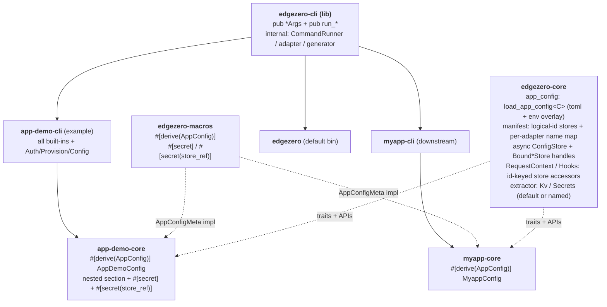

# EdgeZero CLI Extensions — Full Design

**Date:** 2026-05-19
**Status:** Approved design (single-spec form), pending implementation plan
**Branch:** `docs/extensible-cli-library-spec`

This single spec covers the full effort:

- a manifest schema rewrite introducing a logical-store /
  per-adapter-mapping model for KV / secrets / config,
- a runtime API rewrite supporting multiple stores per kind — including
  making `ConfigStore` async, rewriting the Cloudflare config backend
  from `[vars]` to KV, introducing bound store handles, refactoring the
  `Kv` / `Secrets` extractors to support named stores, and updating
  `Hooks`, `ConfigStoreMetadata`, and the `app!` macro,
- turning `edgezero-cli` into an extensible library,
- a per-service typed app-config file with `#[derive(AppConfig)]`,
  `#[secret]` / `#[secret(store_ref)]` annotations, and environment
  variable override resolution,
- four new commands (`auth`, `provision`, `config validate`, `config push`),
- generator extensions to scaffold the new pieces,
- and an `app-demo` overhaul that exercises **every** new capability
  end-to-end.

The work is organised into nine sub-projects so it can ship in nine
incremental PRs, but the design decisions live here together.

---

## 1. Goal

Let downstream projects (e.g. a future `myapp` created by `edgezero new
myapp`) build their own CLI binary that:

- Reuses any subset of edgezero's built-in commands (`build`, `deploy`,
  `dev`, `new`, `serve`; after this effort also `auth`, `provision`,
  `config validate`, `config push`).
- Adds their own subcommands.
- Owns the binary name, `about` text, and top-level help.

Alongside the extensibility substrate, ship:

- A **multi-store manifest model**: the app declares logical stores it
  uses (`[stores.kv] ids = ["foo", "bar"]`) and each adapter declares the
  platform-specific `name` for each logical id, with room for
  adapter-specific tuning. Stores are addressed in code by logical id.
- A **typed per-service app-config file** (e.g. `myapp.toml`) with a
  Rust-defined schema, validated by `config validate`, uploaded by
  `config push`. `#[secret]` / `#[secret(store_ref)]` fields are skipped
  during push.
- **Environment-variable override resolution** for app config: values
  in `<name>.toml` can be overridden by env vars, with `__` separating
  nesting levels (§6.10).
- **`ConfigStore` becomes async**, and the **Cloudflare config backend
  moves from `[vars]` to KV** so `config push` reaches the runtime
  without redeploying.
- **Bound store handles** (`BoundKvStore` / `BoundConfigStore` /
  `BoundSecretStore`) so callers don't pass store names around.
- **Refactored `Kv` / `Secrets` extractors** that resolve either the
  default store or a named store (§6.8).
- Platform credential and resource management (`auth`, `provision`)
  that shells out to each platform's native CLI, wrapped in a mockable
  `CommandRunner` so CI stays hermetic.
- A generator that scaffolds a new project complete with `<name>-cli`,
  `<name>.toml`, `<name>-core/src/config.rs`, and an `edgezero.toml`
  using the new schema.
- An `app-demo` overhaul that exercises all of the above end-to-end.

The default `edgezero` binary keeps existing subcommands
backwards-compatible. The manifest schema rewrite is a **breaking
change** to the on-disk format; in-tree `examples/app-demo` is migrated,
and a published guide covers external users.

## 2. Non-goals

- No runtime command registry; no PATH-based external subcommand
  discovery.
- No edgezero-managed credentials. `auth` delegates to `wrangler` /
  `fastly` / `spin`.
- No direct REST API calls; everything goes through the platform's
  native CLI.
- No environment-sectioned app-config (`[config.production]` etc.).
  Single `[config]` table per file. (Env-var *override* is in scope;
  per-environment *files* are not.)
- No live-platform CI smoke tests. Mock `CommandRunner` only.
- No on-disk migration helper for old manifests. The migration guide
  covers external users.
- No Spin-side `provision` / `config push`. Spin's stores schema lands
  via a separate in-flight PR; `[adapters.spin]` omits the `stores`
  section until then.

## 3. Architecture overview



Key contracts:

- **Substrate**: each built-in command is a `(pub *Args, pub run_*)`
  pair. Downstream `Subcommand` enums opt in by listing variants.
  Non-subcommand `*Args` derive `Default` (for external construction
  despite `#[non_exhaustive]`); subcommand-wrapping `*Args` (e.g.
  `AuthArgs`) do **not** derive `Default` (§6.11).
- **Multi-store manifest model**: §6.6.
- **Async `ConfigStore`**: `ConfigStore::get` becomes
  `async fn get(...)` (via `#[async_trait(?Send)]`, matching the
  project's WASM-compat rule). KV and secret stores are already async.
- **Bound store handles**: `RequestContext` / `Hooks` accessors return
  `BoundKvStore` / `BoundConfigStore` / `BoundSecretStore` — each wraps
  the provider handle plus the resolved platform name, so callers just
  do `.get(key).await`.
- **Cloudflare config moves to KV**: `CloudflareConfigStore` reads from
  a KV namespace (one per logical config id). With the now-async
  trait, reads are real async KV gets; `config push` updates KV
  without a redeploy.
- **Extractors**: `Kv` / `Secrets` are refactored to resolve the
  default store or a named one (§6.8).
- **Typed app-config + secrets**: §6.7.
- **Env-var override**: §6.10.
- **Shell-out isolation**: private `CommandRunner` + `CommandSpec`;
  `MockCommandRunner` in tests.

## 4. End-state public API surface

```rust
// crates/edgezero-cli/src/lib.rs  (feature = "cli")

pub use args::{
    AuthArgs, AuthSub, BuildArgs, ConfigPushArgs, ConfigValidateArgs,
    DeployArgs, NewArgs, ProvisionArgs, ServeArgs,
};

pub fn init_cli_logger();

pub fn run_build(args: &BuildArgs) -> Result<(), String>;
pub fn run_deploy(args: &DeployArgs) -> Result<(), String>;
pub fn run_new(args: &NewArgs) -> Result<(), String>;
pub fn run_serve(args: &ServeArgs) -> Result<(), String>;
#[cfg(feature = "edgezero-adapter-axum")]
pub fn run_dev() -> !;

pub fn run_auth(args: &AuthArgs) -> Result<(), String>;
pub fn run_provision(args: &ProvisionArgs) -> Result<(), String>;

// validate bound: no Serialize.
pub fn run_config_validate(args: &ConfigValidateArgs) -> Result<(), String>;
pub fn run_config_validate_typed<C>(args: &ConfigValidateArgs) -> Result<(), String>
where
    C: serde::de::DeserializeOwned + validator::Validate
       + ::edgezero_core::app_config::AppConfigMeta;

// push bound: adds Serialize.
pub fn run_config_push(args: &ConfigPushArgs) -> Result<(), String>;
pub fn run_config_push_typed<C>(args: &ConfigPushArgs) -> Result<(), String>
where
    C: serde::de::DeserializeOwned + validator::Validate + serde::Serialize
       + ::edgezero_core::app_config::AppConfigMeta;
```

From `edgezero-core`:

```rust
// app_config module (new in sub-project #4)
pub trait AppConfigMeta {
    const SECRET_FIELDS: &'static [SecretField];
}
pub struct SecretField { pub name: &'static str, pub kind: SecretKind }
pub enum SecretKind { KeyInDefault, StoreRef }

/// Loads <name>.toml, overlays environment variables (§6.10), then
/// deserializes + validates into C.
pub fn load_app_config<C>(path: &std::path::Path, app_name: &str)
    -> Result<C, AppConfigError>
where C: serde::de::DeserializeOwned + validator::Validate + AppConfigMeta;

/// Same env overlay, untyped — returns the merged tree.
pub fn load_app_config_raw(path: &std::path::Path, app_name: &str)
    -> Result<toml::Value, AppConfigError>;

// async config store trait (sub-project #3)
#[async_trait(?Send)]
pub trait ConfigStore {
    async fn get(&self, key: &str) -> Result<Option<String>, ConfigStoreError>;
}

// Bound store handles — wrap provider handle + resolved platform name.
pub struct BoundKvStore { /* ... */ }
pub struct BoundConfigStore { /* ... */ }
pub struct BoundSecretStore { /* ... */ }
impl BoundConfigStore { pub async fn get(&self, key: &str) -> Result<Option<String>, ConfigStoreError>; }
impl BoundKvStore     { /* async CRUD */ }
impl BoundSecretStore { pub async fn get(&self, key: &str) -> Result<Option<Vec<u8>>, SecretStoreError>; }

// RequestContext store API (rewritten in sub-project #3)
impl RequestContext {
    pub fn kv_store(&self, id: &str) -> Option<BoundKvStore>;
    pub fn kv_store_default(&self) -> Option<BoundKvStore>;
    pub fn config_store(&self, id: &str) -> Option<BoundConfigStore>;
    pub fn config_store_default(&self) -> Option<BoundConfigStore>;
    pub fn secret_store(&self, id: &str) -> Option<BoundSecretStore>;
    pub fn secret_store_default(&self) -> Option<BoundSecretStore>;
}

// Hooks gains the same id-keyed accessors returning Bound*Store.

// Extractors (refactored in sub-project #3): see §6.8.
pub struct Kv(/* per-request KV registry */);
pub struct Secrets(/* per-request secret registry */);
impl Kv {
    pub fn default(&self) -> Option<BoundKvStore>;
    pub fn named(&self, id: &str) -> Option<BoundKvStore>;
}
impl Secrets {
    pub fn default(&self) -> Option<BoundSecretStore>;
    pub fn named(&self, id: &str) -> Option<BoundSecretStore>;
}
```

From `edgezero-macros` (it IS the proc-macro crate):

```rust
// crates/edgezero-macros/src/lib.rs
#[proc_macro_derive(AppConfig, attributes(secret))]
pub fn derive_app_config(input: TokenStream) -> TokenStream { /* ... */ }
```

## 5. End-state file layout

```
crates/edgezero-cli/
  Cargo.toml
  src/
    lib.rs                    # public API; declares private modules
    main.rs                   # thin wrapper for the default edgezero bin
    args.rs                   # *Args structs (#[non_exhaustive]; Default only where meaningful)
    adapter.rs                # (unchanged, private)
    generator.rs              # extended: scaffolds <name>-cli + <name>.toml + <name>-core/src/config.rs
    scaffold.rs               # (unchanged-ish, private)
    dev_server.rs             # (unchanged, private; feature-gated)
    runner.rs                 # NEW: CommandSpec + CommandRunner + Real/Mock
    auth.rs / provision.rs / config.rs   # NEW command impls
    templates/{core,root,cli,app}/       # cli/ + app/ new; root edgezero.toml.hbs rewritten
  tests/lib_consumer.rs       # NEW

crates/edgezero-core/src/
  manifest.rs                 # REWRITTEN store schema (Option<LogicalStoreConfig> + per-adapter map)
  context.rs                  # REWRITTEN store accessors (id-keyed; return Bound*Store)
  app_config.rs               # NEW: AppConfigMeta + SecretField/Kind + loaders w/ env overlay
  config_store.rs             # ConfigStore trait becomes async
  key_value_store.rs          # (already async)
  secret_store.rs             # bound-handle wrapper added
  extractor.rs                # Kv / Secrets refactored to default-or-named
  hooks.rs                    # REWRITTEN: id-keyed Hooks accessors
  app.rs                      # ConfigStoreMetadata -> registry shape

crates/edgezero-macros/src/
  lib.rs                      # ADD #[proc_macro_derive(AppConfig, attributes(secret))]
  app_config.rs               # NEW derive impl
  app.rs                      # app! macro emits id-keyed ConfigStoreMetadata

# Adapter store impls rewritten for multi-store (sub-project #3):
crates/edgezero-adapter-{axum,cloudflare,fastly}/src/{config_store,key_value_store,secret_store}.rs
# Cloudflare config_store specifically: [vars] -> KV namespace, async reads.

examples/app-demo/
  Cargo.toml                  # adds crates/app-demo-cli
  app-demo.toml               # NEW typed config: nested section + #[secret] + #[secret(store_ref)]
  edgezero.toml               # REWRITTEN to new schema; spin omits stores section
  crates/
    app-demo-core/src/config.rs   # NEW AppDemoConfig
    app-demo-core/src/handlers.rs # handlers read config (default + env-overridden) and named kv
    app-demo-cli/             # NEW
    app-demo-adapter-*/       # store-setup rewrites

docs/guide/{cli-walkthrough,manifest-store-migration}.md   # NEW
.vitepress/config.ts          # UPDATED sidebar
```

## 6. Cross-cutting designs

### 6.1 `CommandSpec` + `CommandRunner` (sub-project #6)

```rust
// crates/edgezero-cli/src/runner.rs (private)
pub(crate) struct CommandSpec<'a> {
    pub program: &'a str, pub args: &'a [&'a str],
    pub cwd: Option<&'a std::path::Path>, pub stdin: Option<&'a [u8]>,
    pub env: &'a [(&'a str, &'a str)],
}
pub(crate) trait CommandRunner: Send + Sync {
    fn run(&self, spec: &CommandSpec<'_>) -> std::io::Result<CommandOutput>;
}
pub(crate) struct CommandOutput { pub status: i32, pub stdout: String, pub stderr: String }
pub(crate) struct RealCommandRunner;
#[cfg(test)] pub(crate) struct MockCommandRunner { /* recorded expectations */ }
```

Public command functions use a private `*_with` inner so tests inject
the mock.

### 6.2 Error model

All public `run_*` return `Result<(), String>`. Binaries log and exit.

### 6.3 Feature gates

- `cli` (default) gates clap + public API.
- `edgezero-adapter-{axum,fastly,cloudflare,spin}` (all default) gate
  each adapter's dispatch path.

### 6.4 Typed vs raw config serialization

**Validate (both flavours):** TOML syntax OK; `[config]` table present;
structure parses. Typed additionally: deserialises into `C`; runs
`C::validate()`; for each `SecretField`, value is a non-empty string,
and `StoreRef` values appear in `[stores.secrets].ids`. Validate does
**not** require `Serialize` and performs no `to_value` check.

**Push (both flavours):** all validate checks run first as a strict
pre-flight. Then each field is serialised to a string:
- `String` as-is; `bool`/numbers via `to_string()`; compound types via
  `serde_json::to_string`; `Option::None` / `Value::Null` skipped.
- `SECRET_FIELDS` skipped (typed only).
- Typed additionally: asserts `serde_json::to_value(&c)` is
  `Value::Object` (else error before any runner call); honors
  `#[serde(rename)]`, `#[serde(skip_serializing*)]`; supports
  `#[serde(flatten)]` on non-secret fields.
- Raw: `toml::Value` tree from `[config]`, same scalar/compound rules,
  no `Validate`, no secret skipping.

**Unknown fields:** serde ignores them unless the struct has
`#[serde(deny_unknown_fields)]`. The generator template emits that
attribute; `config validate` therefore guarantees unknown-field
rejection only for structs that opt in.

**Default-id resolution:** every reference to "the default config /
secret store" means the **resolved** default id — the explicit
`[stores.<kind>].default` if set, else the single `ids[0]` when
`ids.len() == 1`. Validation and `config push` resolve the default the
same way `ManifestLoader` does.

### 6.5 Test strategy summary

Existing tests move with their handlers; per-sub-project tests for each
new surface; every platform-touching test uses `MockCommandRunner`;
`tests/lib_consumer.rs` exercises the public API externally; manifest
contract tests cover multi-store, default resolution, Spin-skip, and
old-vs-new manifest discrimination.

### 6.6 Multi-store manifest schema

**App-level declaration (`edgezero.toml`):**

```toml
[stores.kv]
ids     = ["foo", "bar"]
default = "foo"          # optional when ids has exactly one entry

[stores.config]
ids     = ["app_config"]

[stores.secrets]
ids     = ["default"]
```

**Per-adapter mapping + tuning:**

```toml
[adapters.cloudflare.stores.kv.foo]
name = "FOO_CLOUDFLARE"

[adapters.fastly.stores.kv.foo]
name      = "FOO_FASTLY"
max_value = "1MB"          # adapter-specific tuning, free-form

[adapters.cloudflare.stores.config.app_config]
name = "APP_CONFIG_KV"     # Cloudflare config is a KV namespace (§6.9)

[adapters.cloudflare.stores.secrets.default]
name = "EDGEZERO_SECRETS"

# spin omits the stores section until its in-flight PR lands:
[adapters.spin.adapter]
crate    = "crates/app-demo-adapter-spin"
manifest = "crates/app-demo-adapter-spin/spin.toml"
```

**Old-vs-new discrimination (HIGH #4 fix):** each `[stores.<kind>]`
deserialises into `Option<LogicalStoreConfig>`. An `edgezero.toml`
written before this effort has no `[stores.<kind>]` in the new shape →
`None` → no new-schema validation. A new manifest declaring
`[stores.<kind>] ids = [...]` → `Some(LogicalStoreConfig)` → fully
validated. This keeps sub-project #2 genuinely additive: old manifests
are distinguishable from new-but-incomplete ones, so empty `ids` is a
real error rather than an accidental old-manifest match.

**Field reference:**

| Field | Where | Role |
|---|---|---|
| `[stores.<kind>].ids` | top level | logical ids (`Vec<String>`, non-empty when the table is present) |
| `[stores.<kind>].default` | top level | resolved default; optional if `ids.len() == 1`; must be in `ids` |
| `[adapters.<X>.stores.<kind>.<id>].name` | per-adapter | platform name; required |
| other fields in that block | per-adapter | free-form `BTreeMap<String, toml::Value>` tuning; opaque to core |

**Provisioned platform resource IDs** live in each platform's native
manifest (`wrangler.toml`, `fastly.toml`), not `edgezero.toml`.
`provision` writes them; `config push` reads them.

**Validation rules:**

- `ids` non-empty when `[stores.<kind>]` is present.
- `default` in `ids`, or absent (then resolved to `ids[0]`).
- **Adapter store completeness with an explicit allowlist (MEDIUM #6
  fix):** `STORES_SUPPORTED_ADAPTERS = ["axum", "cloudflare", "fastly"]`.
  Every adapter in `[adapters.*]` **that is in this allowlist** must
  declare an `[adapters.<X>.stores]` section mapping every id of every
  declared store kind. A supported adapter omitting `stores` is an
  **error** (it cannot silently opt out). Adapters not in the allowlist
  (currently only `spin`) are skipped — this is how Spin participates
  before its stores PR lands. When the Spin PR ships, `spin` joins the
  allowlist.
- `name` under `[adapters.cloudflare.stores.*]` must be a JavaScript
  identifier (Wrangler binding constraint); invalid names are
  **errors**.

**Runtime resolution:** each adapter builds a
`StoreRegistry<H> { by_id: BTreeMap<String, H>, default_id: String }`
at request setup. `ctx.kv_store("foo")` → `Some` / `None`;
`ctx.kv_store_default()` → the `default_id` handle.

### 6.7 Secret annotations via `#[derive(AppConfig)]`

```rust
#[derive(Debug, Deserialize, Serialize, Validate, AppConfig)]
#[serde(deny_unknown_fields)]
pub struct AppDemoConfig {
    pub greeting: String,
    pub feature_new_checkout: bool,
    pub service: ServiceConfig,          // nested section (env-overridable, §6.10)

    #[secret]                            // key inside the resolved default secret store
    pub api_token: String,

    #[secret(store_ref)]                 // logical store id in [stores.secrets].ids
    pub vault: String,
}

#[derive(Debug, Deserialize, Serialize, Validate)]
#[serde(deny_unknown_fields)]
pub struct ServiceConfig {
    #[validate(range(min = 100, max = 60000))]
    pub timeout_ms: u32,
}
```

The derive emits `impl AppConfigMeta` with a `SECRET_FIELDS` array of
`SecretField { name, kind }`.

**Constraints (compile errors from the derive):** `#[secret]` /
`#[secret(store_ref)]` only on scalar string fields; error if combined
with `#[serde(flatten)]` / `#[serde(rename)]` / `#[serde(skip*)]`;
`#[secret(x)]` with `x` outside `{store_ref}` is an error;
`SECRET_FIELDS` uses the Rust field name verbatim.

**Validate:** `KeyInDefault` — value non-empty + `[stores.secrets]`
declared (resolved default exists). `StoreRef` — value appears in
`[stores.secrets].ids`. **Push:** both kinds skipped.

**Runtime usage:**

```rust
// #[secret] (KeyInDefault):
let token = ctx.secret_store_default()?.get(&cfg.api_token).await?;
// #[secret(store_ref)] (StoreRef):
let token = ctx.secret_store(&cfg.vault)?.get("active").await?;
```

### 6.8 Extractor design

The existing `Kv` / `Secrets` extractors are **refactored to resolve
either the default store or a named one** (the user-chosen approach —
no const-generic `&'static str`, which doesn't compile on stable
Rust 1.95).

The extractor yields a small per-request registry handle; the handler
picks the store by id at the call site:

```rust
pub struct Kv(KvRegistryHandle);
impl Kv {
    pub fn default(&self) -> Option<BoundKvStore>;
    pub fn named(&self, id: &str) -> Option<BoundKvStore>;
}
// Secrets is identical in shape.

#[action]
async fn handler(kv: Kv) -> Result<Response, EdgeError> {
    let sessions = kv.named("sessions").ok_or_else(|| EdgeError::internal("no sessions kv"))?;
    let cache    = kv.default().ok_or_else(|| EdgeError::internal("no default kv"))?;
    let v = sessions.get("k").await?;
    // ...
}
```

This is a **breaking change** to handlers that currently destructure
`Kv(handle)` for a single store. The only in-tree consumers are the
`app-demo` handlers, updated in sub-project #3. External handlers
migrate from `Kv(handle)` to `kv.default()`.

A `Config` extractor with the same shape (`default()` / `named()`,
returning `BoundConfigStore`) is added for symmetry.

### 6.9 Cloudflare config store rewrite (`[vars]` → KV, async)

Current `CloudflareConfigStore`
([config_store.rs:1-12](crates/edgezero-adapter-cloudflare/src/config_store.rs#L1-L12))
reads one `[vars]` JSON blob, parsed once at construction — which is
why the trait could be synchronous. Updating config required a worker
redeploy.

**Rewrite (sub-project #3):** `CloudflareConfigStore` reads from a KV
namespace, one per logical config id. Because KV reads are async, the
`ConfigStore` trait becomes async (`#[async_trait(?Send)]`). The
adapter's `get` performs a real `env.<NAMESPACE>.get(key)` await.

On-disk shape after this ships:

```toml
# edgezero.toml
[stores.config]
ids = ["app_config"]
[adapters.cloudflare.stores.config.app_config]
name = "APP_CONFIG_KV"

# wrangler.toml (written by provision)
[[kv_namespaces]]
binding = "APP_CONFIG_KV"
id      = "abc123def456"
```

`config push --adapter cloudflare` writes via `wrangler kv bulk put
<tempfile.json> --namespace-id=<id>`. No redeploy; values live on the
next request after KV propagation. The `[vars]` model is removed;
existing deployed workers migrate once (documented in the guide).

### 6.10 App-config environment-variable resolution

`load_app_config` / `load_app_config_raw` resolve values in two
layers, lowest priority first:

1. The `[config]` table parsed from `<name>.toml`.
2. Environment-variable overrides.

**Env var naming.** `<APP_NAME>__<SECTION>__…__<KEY>`:

- `<APP_NAME>` is `[app].name` from `edgezero.toml`, uppercased, with
  `-` replaced by `_` (so `app-demo` → `APP_DEMO`). Passed to
  `load_app_config` as the `app_name` argument.
- `__` (double underscore) separates **every** nesting level,
  including app-name → first key. A single `_` is a literal character
  within a name; only `__` is a separator.
- Each segment after the prefix is matched case-insensitively against
  the config key at that level.

Examples for `app-demo.toml`:

```toml
[config]
greeting = "hello"
[config.service]
timeout_ms = 1500
```

| Env var | Overrides |
|---|---|
| `APP_DEMO__GREETING` | `config.greeting` |
| `APP_DEMO__SERVICE__TIMEOUT_MS` | `config.service.timeout_ms` |

**Type coercion.** Env var values are strings. During overlay they are
parsed against the target field's TOML type (the overlay produces a
`toml::Value` tree; integers/bools are parsed from the string, parse
failure is an `AppConfigError`). For the typed loader this happens
before `serde` deserialization.

**Scope.** Resolution happens inside `load_app_config*`. Therefore
`config validate` and `config push` both see env-resolved values —
useful for injecting per-environment values from a deploy pipeline. A
`--no-env` flag on `validate` and `push` disables the overlay when the
raw file contents are wanted. The axum dev server also resolves via
this path, so `APP_DEMO__GREETING=hi cargo run …` overrides locally.

### 6.11 `Default` on `*Args`

Non-subcommand `*Args` (`BuildArgs`, `DeployArgs`, `NewArgs`,
`ServeArgs`, `ProvisionArgs`, `ConfigValidateArgs`, `ConfigPushArgs`)
derive `Default` so external tests/wrappers construct them via
`Default::default()` + field mutation despite `#[non_exhaustive]`.

Subcommand-wrapping `*Args` (`AuthArgs`) do **not** derive `Default` —
a defaulted required subcommand could leak into a test and run a real
auth path. External tests construct `AuthArgs` via
`clap::Parser::try_parse_from`.

---

## 7. Sub-project 1 — Extensible `edgezero-cli` library + generator + `app-demo-cli` skeleton

**Goal:** establish the substrate.

**Source changes:** promote `Command` variant fields into
`#[derive(clap::Args)]` structs (`#[non_exhaustive]`, `Default` per
§6.11); add `lib.rs` with `run_*` handlers; shrink `main.rs`; move
existing tests to `lib.rs`; extend the generator to scaffold
`crates/<name>-cli`; add the handwritten `examples/app-demo/crates/
app-demo-cli` parallel.

**Tests:** existing tests pass post-relocation; `tests/lib_consumer.rs`;
`app-demo-cli/tests/help.rs`; generator structure test.

**Ship gate:** existing `edgezero` commands keep the same flags
(backwards-compatible — new subcommands are added by later
sub-projects, so help output is *not* frozen forever, only the
existing commands' shape); `app-demo-cli --help` shows the five
built-ins; `edgezero new throwaway-app && cargo check --workspace`
succeeds.

## 8. Sub-project 2 — Manifest schema additions (purely additive)

**Goal:** add the new schema as `Option<LogicalStoreConfig>` +
`Option<AdapterStoresConfig>` so old-shape manifests are
distinguishable and validation only runs on new-shape declarations.
No runtime changes; nothing removed; `[stores.config.defaults]`
stays.

**Source changes:** `manifest.rs` gains `Option<LogicalStoreConfig>`
per kind and `ManifestAdapter.stores: Option<AdapterStoresConfig>`;
validator rules (§6.6) fire only when the new fields are `Some`;
`STORES_SUPPORTED_ADAPTERS` allowlist drives completeness. Old fields
remain and keep deserialising.

**Tests:** new-schema round-trip; default resolution (omitted with one
id; omitted with many → error; explicit not-in-ids → error);
completeness (supported adapter omitting `stores` → error;
non-allowlisted adapter → skipped); Cloudflare JS-identifier check →
error; old-shape manifests parse with `None` and trigger no new
validation.

**Ship gate:** existing app-demo runtime works unchanged; manifest
tests prove the new schema parses and validates.

## 9. Sub-project 3 — Runtime rewrite (async ConfigStore, Bound handles, registries, extractors, Cloudflare KV, Hooks/macro)

**Goal:** the big runtime sub-project. After this, multi-store works
end-to-end on axum and Cloudflare.

**Scope:**

- `ConfigStore::get` becomes `async` (`#[async_trait(?Send)]`).
- `BoundKvStore` / `BoundConfigStore` / `BoundSecretStore` introduced;
  `RequestContext` + `Hooks` accessors return them, id-keyed, with
  `_default()` helpers resolving the §6.4 default.
- Each adapter's store setup builds a `StoreRegistry<H>` from
  `[adapters.<self>.stores.*]`.
- `CloudflareConfigStore` rewritten `[vars]` → KV (§6.9).
- `Kv` / `Secrets` extractors refactored to `default()` / `named()`
  (§6.8); a `Config` extractor added.
- `ConfigStoreMetadata` becomes a registry; `app!` macro emits
  id-keyed metadata from the new manifest schema.
- Old single-store manifest fields removed; `examples/app-demo/
  edgezero.toml` migrated; `app-demo` handlers updated to the new
  accessors. Spin adapter omits `stores`.
- `docs/guide/manifest-store-migration.md` published.

**Tests:** id-keyed contract-test factories; cross-adapter named-KV
test; Cloudflare config-from-KV async round-trip (wasm-bindgen-test);
`Kv`/`Secrets`/`Config` extractor tests for both `default()` and
`named()`; `app!` macro emits a metadata registry matching
`[stores.config].ids`.

**Ship gate:** multi-store handlers work on axum and Cloudflare;
async config reads work; the `config push` runtime target exists.

## 10. Sub-project 4 — App-config schema, derive macro, env-overlay loader

**Goal:** the `<name>.toml` format, `#[derive(AppConfig)]`, and the
generic loader with env-var overlay (§6.10).

**Source changes:** `edgezero-core::app_config` (trait, `SecretField`/
`SecretKind`, `load_app_config` / `load_app_config_raw` with env
overlay); `edgezero-macros` `AppConfig` derive +
`#[proc_macro_derive]` export; generator templates for `<name>.toml`
(includes a nested `[config.service]` section) and
`<name>-core/src/config.rs` (with `#[serde(deny_unknown_fields)]`);
`examples/app-demo/app-demo.toml` + `app-demo-core/src/config.rs` with
a nested section, one `#[secret]`, one `#[secret(store_ref)]`.

**Tests:** `load_app_config` (valid, missing file, bad TOML, validator
failure, missing `[config]`); **env-overlay tests** — top-level
override, nested `__` override, type coercion, parse-failure error,
`--no-env` bypass; round-trip for `AppDemoConfig`; macro tests
including all compile-error constraints from §6.7.

**Ship gate:** `AppDemoConfig::SECRET_FIELDS` matches expectations;
`load_app_config::<AppDemoConfig>` succeeds; an env var
`APP_DEMO__SERVICE__TIMEOUT_MS` demonstrably overrides the nested
value in a test.

## 11. Sub-project 5 — `config validate` command

**Goal:** lint TOML files locally; validate the app config in its own
right (TOML syntax, `[config]` present, deserialises into `C`, types,
`validator` rules, `deny_unknown_fields` when set, secret-field
checks) plus manifest cross-checks under `--strict`.

```rust
#[derive(clap::Args, Default, Debug)]
#[non_exhaustive]
pub struct ConfigValidateArgs {
    #[arg(long, default_value = "edgezero.toml")] pub manifest: PathBuf,
    #[arg(long)] pub app_config: Option<PathBuf>,
    #[arg(long)] pub strict: bool,
    #[arg(long)] pub no_env: bool,         // disable env overlay (§6.10)
}
```

Bound: `DeserializeOwned + Validate + AppConfigMeta` (no `Serialize`).

**Tests:** dedicated fixtures per failure mode, including env-overlay
on/off.

**Ship gate:** `app-demo-cli config validate --strict` exits 0;
corrupted fixtures fail with expected messages.

## 12. Sub-project 6 — `auth` command (+ `CommandRunner`)

```rust
#[derive(clap::Args, Debug)]      // NO Default — see §6.11
#[non_exhaustive]
pub struct AuthArgs { #[command(subcommand)] pub sub: AuthSub }

#[derive(clap::Subcommand, Debug)]
pub enum AuthSub {
    Login  { #[arg(long)] adapter: String },
    Logout { #[arg(long)] adapter: String },
    Status { #[arg(long)] adapter: String },
}
```

UX: `auth login --adapter cloudflare`. Per-adapter behaviour: axum
no-ops; cloudflare `wrangler login/logout/whoami`; fastly `fastly
profile create/delete/list`; spin `spin cloud login/logout/info`. All
via `CommandRunner`.

**Tests:** mock-runner matrix; ENOENT + non-zero-exit cases.
External `AuthArgs` construction uses `try_parse_from`.

## 13. Sub-project 7 — `provision` command

```rust
#[derive(clap::Args, Default, Debug)]
#[non_exhaustive]
pub struct ProvisionArgs {
    #[arg(long, default_value = "edgezero.toml")] pub manifest: PathBuf,
    #[arg(long)] pub adapter: String,
    #[arg(long)] pub dry_run: bool,
}
```

Iterate every id in `[stores.<kind>].ids`; look up
`[adapters.<X>.stores.<kind>.<id>].name`; shell out per the
adapter/kind table (`wrangler kv namespace create <name>`, `fastly
kv-store create --name=<name>`, etc.). `--dry-run` prints
`CommandSpec`s without invocation.

**Writeback to native manifests:**

- **Cloudflare:** patch `wrangler.toml` `[[kv_namespaces]]` with
  `binding = "<name>"`, `id = "<extracted>"`.
- **Fastly:** the exact `fastly.toml` sections to patch are
  **pinned in the implementation plan** by reading Fastly's current
  manifest docs (Fastly distinguishes store names, resource-link
  names/IDs, and `setup` vs `local_server` sections). The spec-level
  contract: `provision` writes Fastly resource identifiers into
  whatever `fastly.toml` section the Fastly Compute runtime resolves
  stores from, and `config push` reads the identifier back from the
  same section — read and write paths must agree. Sub-project #7's PR
  ships the exact section names with golden-file tests.

**Tests:** per-(adapter, kind) mock-runner with scripted stdout;
golden ID-extraction parsers; temp-fixture writeback verified;
`--dry-run` invokes nothing.

## 14. Sub-project 8 — `config push` command

```rust
#[derive(clap::Args, Default, Debug)]
#[non_exhaustive]
pub struct ConfigPushArgs {
    #[arg(long, default_value = "edgezero.toml")] pub manifest: PathBuf,
    #[arg(long)] pub adapter: String,
    #[arg(long)] pub store: Option<String>,         // logical config id; default resolved
    #[arg(long)] pub app_config: Option<PathBuf>,
    #[arg(long)] pub no_env: bool,                  // disable env overlay
    #[arg(long)] pub dry_run: bool,
}
```

Bound: `DeserializeOwned + Validate + Serialize + AppConfigMeta`.

**Behaviour:** strict pre-flight validation; load app-config (env
overlay unless `--no-env`); serialise per §6.4 (skip `SECRET_FIELDS`);
resolve target id (`--store` or resolved default); look up the
per-adapter `name`; read the platform resource ID from the native
manifest (error "did you run `provision` first?" if absent); shell
out (`wrangler kv bulk put … --namespace-id=…`; `fastly
config-store-entry create …`; axum writes
`.edgezero/local-config-<id>.env`; spin errors "not yet supported").

**Tests (MEDIUM #9 — push behaviour beyond validate):** typed + raw;
per-adapter mock-runner with golden payloads; secret fields absent
from payload; missing native-manifest ID error; `--store` selection;
`--dry-run` invokes nothing; **explicit "validate passes, push
serialization fails" cases** — non-object typed config
(`to_value` ≠ object), unsupported compound shape, `skip_serializing_if`
behaviour, `Option::None` omission, `#[serde(flatten)]` on a
non-secret field; env-overlay on vs `--no-env`.

**Ship gate:** `app-demo-cli config push --adapter cloudflare
--dry-run` shows the expected invocation; secret fields absent;
namespace ID from fixture `wrangler.toml`.

## 15. Sub-project 9 — `app-demo` integration polish (exercises every new capability)

**Goal:** `app-demo` must demonstrate the **full** feature set, not a
subset. Concretely it exercises:

- **Extensible CLI:** `app-demo-cli` with all five built-ins plus
  `Auth`, `Provision`, and `Config` (`Validate` / `Push`) subcommands,
  the `Config` arm wired to the **typed** functions with
  `AppDemoConfig`.
- **Multi-store manifest:** `edgezero.toml` declares ≥2 KV ids
  (`sessions`, `cache`), one config id, one secrets id, with
  per-adapter `name` mappings for axum / cloudflare / fastly; spin
  omits the stores section.
- **Multi-store runtime:** one handler reads `sessions` KV, another
  reads `cache` KV (via the refactored `Kv` extractor's `named()`),
  proving the registry.
- **Async config + Cloudflare KV path:** a handler does
  `ctx.config_store_default()?.get("greeting").await?`.
- **Typed app-config with a nested section:** `AppDemoConfig` has
  `service: ServiceConfig { timeout_ms }`; a handler reads the nested
  value.
- **Env-var override:** an integration test sets
  `APP_DEMO__SERVICE__TIMEOUT_MS` and asserts the resolved config
  reflects the override; the walkthrough doc shows
  `APP_DEMO__GREETING=… cargo run`.
- **Secrets:** `AppDemoConfig` has one `#[secret]` field
  (`api_token`) and one `#[secret(store_ref)]` field (`vault`); a
  handler reads each via the matching runtime pattern.
- **`config validate` / `config push`:** CI runs `app-demo-cli config
  validate --strict` (exit 0) and `app-demo-cli config push --adapter
  axum` then reads the value back through a running axum dev server on
  `/config/greeting`.
- **`auth` / `provision`:** exercised against the `MockCommandRunner`
  in tests; the walkthrough doc shows the real invocations.

**`[stores.config.defaults]` removal:** drop the `defaults` field from
`manifest.rs`; drop the axum dev-server seeding at
[dev_server.rs:349](crates/edgezero-adapter-axum/src/dev_server.rs#L349);
the axum config store now seeds local-dev values from `app-demo.toml`
(via `load_app_config_raw`, env overlay included) — the typed struct's
keys form the allowlist. `examples/app-demo/edgezero.toml` drops
`[stores.config.defaults]`.

**Docs:** `docs/guide/cli-walkthrough.md` (full `myapp` loop including
an env-override example); `manifest-store-migration.md` finalised;
`.vitepress/config.ts` sidebar updated.

**Ship gate:** CI runs the full loop on axum end-to-end, including the
env-override assertion.

---

## 16. Implementation order and milestones

| # | Title | Risk |
|---|-------|------|
| 1 | Extensible lib + scaffold | M |
| 2 | Manifest schema additions (additive, `Option`-modelled) | L |
| 3 | Runtime rewrite (async ConfigStore, Bound handles, registries, extractors, Cloudflare KV, Hooks/macro) | H |
| 4 | App-config schema + derive macro + env-overlay loader | M |
| 5 | `config validate` | L |
| 6 | `auth` + `CommandRunner` | M |
| 7 | `provision` | H |
| 8 | `config push` | M |
| 9 | `app-demo` polish (exercises everything) + drop `[stores.config.defaults]` | M |

**Highest-risk:** #3 (async trait change cascades through core,
adapters, handlers, extractors, macro; Cloudflare backend swap) and #7
(shell-out + multi-file native-manifest writeback, Fastly section
details pinned at implementation time).

## 17. Risks and trade-offs

- **Async `ConfigStore` cascade:** making `get` async touches the
  trait, three adapter impls, `Hooks`, every handler reading config,
  and the `Config` extractor. Contained to sub-project #3; the
  in-tree `app-demo` is the canary; `#[async_trait(?Send)]` keeps
  WASM compatibility.
- **Manifest breaking change (#3):** external `edgezero.toml` files
  need migration; the guide ships in #3; the validator errors clearly
  on the old shape.
- **Cloudflare runtime config swap (#3):** deployed workers migrate
  `[vars]` → KV once; documented.
- **`[stores.config.defaults]` removal (#9):** replaced by seeding the
  axum config store from `<name>.toml`.
- **Env overlay surprising `config push` (§6.10):** push pushes
  env-resolved values; `--no-env` is the escape hatch; documented.
- **Fastly writeback under-specification:** spec commits to a
  read/write-path-agreement contract; exact `fastly.toml` sections
  pinned in #7's implementation plan with golden tests.
- **API stability:** non-subcommand `*Args` are `#[non_exhaustive]` +
  `Default`; `AuthArgs` is `#[non_exhaustive]` without `Default`.
- **Shell-out + ID-writeback fragility:** current platform syntax
  pinned; golden parser tests; `--dry-run` available.
- **Extractor breaking change:** `Kv(handle)` destructure → `kv.default()`;
  only in-tree consumer is `app-demo`, migrated in #3.
- **Macro / serde-attribute scope:** `#[secret]` constrained with
  compile-error enforcement.
- **Spin gap:** Spin omits `[adapters.spin.stores]`; not in
  `STORES_SUPPORTED_ADAPTERS`; `provision` / `config push` error for
  `--adapter spin` until the Spin stores PR lands.

## 18. What this spec does not cover

- Anthropic credentials, edge DNS / TLS, observability / metrics.
- Per-environment config *files* (env-var *override* is in scope).
- Restructuring `app-demo-core` handlers beyond what §15 requires.
- `edgezero-core` changes beyond `app_config`, the rewritten
  `manifest` / `RequestContext` / `Hooks` / `ConfigStore` (async) /
  extractor / `ConfigStoreMetadata` / `app!` surface, and the
  Cloudflare adapter config backend.
- A migration tool for old manifests (manual via the guide).
- Spin-side store provisioning / config push.

When all nine sub-projects ship, `edgezero new myapp` produces a
workspace with `myapp-cli`, a typed `MyappConfig`
(`#[derive(AppConfig)]`, `#[serde(deny_unknown_fields)]`, optional
`#[secret]` / `#[secret(store_ref)]`), a `myapp.toml`, and an
`edgezero.toml` using the new logical-store schema. The developer
authenticates, provisions, validates, pushes config (with optional env
overrides), and deploys. At runtime the service reads config (async)
and secrets by logical id, and `app-demo` demonstrates every one of
these capabilities in CI.
