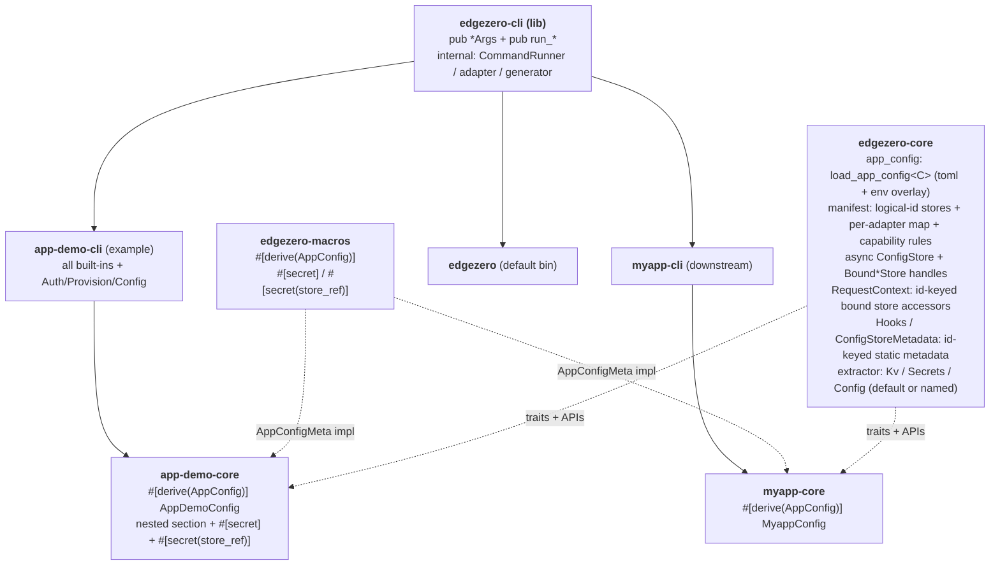

# EdgeZero CLI Extensions — Full Design

**Date:** 2026-05-19
**Status:** Approved design (single-spec form), pending implementation plan
**Branch:** `docs/extensible-cli-library-spec`
**Baseline assumption:** PR #253 (`feat/spin-store-support`) is merged —
the Spin adapter has `SpinKvStore` / `SpinConfigStore` / `SpinSecretStore`
and is a first-class store-capable adapter.

This single spec covers the full effort:

- a **hard-cutoff manifest schema rewrite** introducing a logical-store /
  per-adapter-mapping model for KV / secrets / config,
- the matching runtime rewrite — `ConfigStore` becomes async, the
  Cloudflare config backend moves from `[vars]` to KV, bound store
  handles are introduced, `Kv` / `Secrets` / `Config` extractors gain
  named-store support, and `Hooks` / `ConfigStoreMetadata` / the `app!`
  macro become id-keyed,
- turning `edgezero-cli` into an extensible library,
- a per-service typed app-config file with `#[derive(AppConfig)]`,
  `#[secret]` / `#[secret(store_ref)]` annotations, and environment
  variable override resolution,
- four new commands (`auth`, `provision`, `config validate`, `config push`),
- generator extensions to scaffold the new pieces,
- and an `app-demo` overhaul that exercises every new capability across
  all four adapters (axum, cloudflare, fastly, spin) end-to-end.

There is **no backward compatibility** with the pre-rewrite manifest
schema or runtime store API. The legacy store fields (`name`, legacy
`adapters` overrides, `[stores.config.defaults]`) become hard
validation errors immediately. Every in-tree project is migrated as
part of the work; external projects do a one-time migration following
the published guide. No compatibility shims, no dual-schema parsing.

The work ships as **one pull request with eight commits** — one commit
per sub-project, in the §16 order. The design decisions live here
together.

---

## 1. Goal

Let downstream projects (e.g. a future `myapp` from `edgezero new
myapp`) build their own CLI binary that:

- Reuses any subset of edgezero's built-in commands (`build`, `deploy`,
  `dev`, `new`, `serve`; after this effort also `auth`, `provision`,
  `config validate`, `config push`).
- Adds their own subcommands.
- Owns the binary name, `about` text, and top-level help.

Alongside the extensibility substrate, ship:

- A **multi-store manifest model**: the app declares logical stores it
  uses (`[stores.kv] ids = ["foo", "bar"]`); each adapter maps every
  logical id to a platform-specific `name`, with room for
  adapter-specific tuning. Stores are addressed in code by logical id.
  Per-adapter, per-kind **capability rules** (§6.6) constrain what is
  valid — some adapters support multiple named stores of a kind, others
  only a single flat one.
- A **typed per-service app-config file** (`myapp.toml`) with a
  Rust-defined schema, validated by `config validate`, uploaded by
  `config push`. `#[secret]` / `#[secret(store_ref)]` fields are
  skipped during push.
- **Environment-variable override resolution** for app config (§6.10).
- **Async `ConfigStore`** and the **Cloudflare config backend on KV**
  so `config push` reaches the runtime without redeploying.
- **Bound store handles** so callers don't pass store names around.
- **Refactored `Kv` / `Secrets` / `Config` extractors** resolving the
  default store or a named one (§6.8).
- Platform credential and resource management (`auth`, `provision`)
  shelling out to each platform's native CLI, wrapped in a mockable
  `CommandRunner` so CI stays hermetic.
- A generator that scaffolds a new project complete with `<name>-cli`,
  `<name>.toml`, `<name>-core/src/config.rs`, and an `edgezero.toml`
  using the new schema.
- An `app-demo` overhaul exercising all of the above across all four
  adapters end-to-end.

The default `edgezero` binary keeps its existing subcommands' names and
flags; new subcommands are added.

## 2. Non-goals

- No runtime command registry; no PATH-based external subcommand
  discovery.
- No edgezero-managed credentials. `auth` delegates to `wrangler` /
  `fastly` / `spin`.
- No direct REST API calls; everything goes through the platform's
  native CLI.
- No environment-sectioned app-config (`[config.production]` etc.).
  Single `[config]` table per file. (Env-var *override* is in scope;
  per-environment *files* are not.)
- No live-platform CI smoke tests. Mock `CommandRunner` only.
- **No backward compatibility** with the old manifest schema or runtime
  store API. A pre-rewrite `edgezero.toml` is a hard load error.
- No dynamic Spin variable provider integration (Vault, Fermyon Cloud
  variable provider). `config push --adapter spin` writes static Spin
  variables; live cloud variable push is a future enhancement.

## 3. Architecture overview



Key contracts:

- **Substrate**: each built-in command is a `(pub *Args, pub run_*)`
  pair. Non-subcommand `*Args` derive `Default`; subcommand-wrapping
  `AuthArgs` does not (§6.11).
- **Multi-store manifest model**: §6.6, rewritten outright. Per-adapter
  per-kind capability rules drive validation.
- **Async `ConfigStore`**: `ConfigStore::get` is `async fn`
  (`#[async_trait(?Send)]`, WASM-safe). Cascades through **all four**
  adapter config-store impls.
- **Bound store handles**: only `RequestContext` yields them (binding
  needs per-request adapter state).
- **Static store metadata**: `Hooks` / `ConfigStoreMetadata` are
  compile-time, id-keyed store *metadata* (emitted by `app!`). Adapters
  consume them at request setup to build runtime registries.
- **Cloudflare config on KV**; **Spin config / secrets on flat Spin
  variables** (§6.7).
- **Extractors**: `Kv` / `Secrets` / `Config` resolve default or named.
- **Typed app-config + secrets**: §6.8. **Env-var override**: §6.10.
- **Shell-out isolation**: private `CommandRunner` + `CommandSpec`.

## 4. End-state public API surface

```rust
// crates/edgezero-cli/src/lib.rs  (feature = "cli")

pub use args::{
    AuthArgs, AuthSub, BuildArgs, ConfigPushArgs, ConfigValidateArgs,
    DeployArgs, NewArgs, ProvisionArgs, ServeArgs,
};

pub fn init_cli_logger();

pub fn run_build(args: &BuildArgs) -> Result<(), String>;
pub fn run_deploy(args: &DeployArgs) -> Result<(), String>;
pub fn run_new(args: &NewArgs) -> Result<(), String>;
pub fn run_serve(args: &ServeArgs) -> Result<(), String>;
#[cfg(feature = "edgezero-adapter-axum")]
pub fn run_dev() -> !;

pub fn run_auth(args: &AuthArgs) -> Result<(), String>;
pub fn run_provision(args: &ProvisionArgs) -> Result<(), String>;

pub fn run_config_validate(args: &ConfigValidateArgs) -> Result<(), String>;
pub fn run_config_validate_typed<C>(args: &ConfigValidateArgs) -> Result<(), String>
where
    C: serde::de::DeserializeOwned + validator::Validate
       + ::edgezero_core::app_config::AppConfigMeta;

pub fn run_config_push(args: &ConfigPushArgs) -> Result<(), String>;
pub fn run_config_push_typed<C>(args: &ConfigPushArgs) -> Result<(), String>
where
    C: serde::de::DeserializeOwned + validator::Validate + serde::Serialize
       + ::edgezero_core::app_config::AppConfigMeta;
```

From `edgezero-core`:

```rust
// app_config module
pub trait AppConfigMeta { const SECRET_FIELDS: &'static [SecretField]; }
pub struct SecretField { pub name: &'static str, pub kind: SecretKind }
pub enum SecretKind { KeyInDefault, StoreRef }

pub fn load_app_config<C>(path: &std::path::Path, app_name: &str)
    -> Result<C, AppConfigError>
where C: serde::de::DeserializeOwned + validator::Validate + AppConfigMeta;
pub fn load_app_config_raw(path: &std::path::Path, app_name: &str)
    -> Result<toml::Value, AppConfigError>;

// async config store trait
#[async_trait(?Send)]
pub trait ConfigStore {
    async fn get(&self, key: &str) -> Result<Option<String>, ConfigStoreError>;
}

// Bound store handles — wrap provider handle + resolved platform name.
pub struct BoundKvStore { /* ... */ }
pub struct BoundConfigStore { /* ... */ }
pub struct BoundSecretStore { /* ... */ }
impl BoundConfigStore { pub async fn get(&self, key: &str) -> Result<Option<String>, ConfigStoreError>; }
impl BoundKvStore     { /* async CRUD */ }
impl BoundSecretStore {
    pub async fn get(&self, key: &str) -> Result<Option<bytes::Bytes>, SecretError>;
    pub async fn require_str(&self, key: &str) -> Result<String, SecretError>;
}

// RequestContext store API — returns BOUND, per-request handles.
impl RequestContext {
    pub fn kv_store(&self, id: &str) -> Option<BoundKvStore>;
    pub fn kv_store_default(&self) -> Option<BoundKvStore>;
    pub fn config_store(&self, id: &str) -> Option<BoundConfigStore>;
    pub fn config_store_default(&self) -> Option<BoundConfigStore>;
    pub fn secret_store(&self, id: &str) -> Option<BoundSecretStore>;
    pub fn secret_store_default(&self) -> Option<BoundSecretStore>;
}

// Hooks / ConfigStoreMetadata: static, compile-time, id-keyed store
// metadata (no bound handles).
```

From `edgezero-macros`:

```rust
#[proc_macro_derive(AppConfig, attributes(secret))]
pub fn derive_app_config(input: TokenStream) -> TokenStream { /* ... */ }
```

## 5. End-state file layout

```
crates/edgezero-cli/
  Cargo.toml
  src/
    lib.rs / main.rs / args.rs / adapter.rs / scaffold.rs / dev_server.rs
    generator.rs              # extended: scaffolds <name>-cli + <name>.toml + <name>-core/src/config.rs
    runner.rs                 # NEW: CommandSpec + CommandRunner + Real/Mock
    auth.rs / provision.rs / config.rs   # NEW command impls
    templates/{core,root,cli,app}/       # cli/ + app/ new; root edgezero.toml.hbs rewritten

crates/edgezero-core/src/
  manifest.rs                 # store schema rewritten outright; capability rules
  context.rs                  # store accessors id-keyed, return Bound*Store
  app_config.rs               # NEW: AppConfigMeta + SecretField/Kind + loaders w/ env overlay
  config_store.rs             # ConfigStore trait becomes async
  key_value_store.rs / secret_store.rs   # bound-handle wrappers; secret keeps bytes::Bytes
  extractor.rs                # Kv / Secrets / Config refactored to default-or-named
  hooks.rs / app.rs           # id-keyed static store metadata

crates/edgezero-macros/src/
  lib.rs                      # ADD #[proc_macro_derive(AppConfig, attributes(secret))]
  app_config.rs               # NEW derive impl
  app.rs                      # app! macro emits id-keyed ConfigStoreMetadata

# All FOUR adapters' store impls touched in sub-project #2:
crates/edgezero-adapter-{axum,cloudflare,fastly,spin}/src/{config_store,key_value_store,secret_store}.rs
# Cloudflare config_store: [vars] -> KV. Spin already has Spin* stores (PR #253);
# they are wired into the multi-store registry + async ConfigStore here.

examples/app-demo/
  Cargo.toml                  # adds crates/app-demo-cli
  app-demo.toml               # NEW typed config: nested section + #[secret] + #[secret(store_ref)]
  edgezero.toml               # rewritten to the new schema; all four adapters declare stores
  crates/
    app-demo-core/src/config.rs    # NEW AppDemoConfig
    app-demo-core/src/handlers.rs  # handlers read config + named kv across adapters
    app-demo-cli/             # NEW
    app-demo-adapter-*/       # store-setup rewrites (all four)

docs/guide/{cli-walkthrough,manifest-store-migration}.md   # NEW
docs/.vitepress/config.mts    # UPDATED sidebar (note: .mts, not .ts)
```

## 6. Cross-cutting designs

### 6.1 `CommandSpec` + `CommandRunner` (sub-project #5)

```rust
// crates/edgezero-cli/src/runner.rs (private)
pub(crate) struct CommandSpec<'a> {
    pub program: &'a str, pub args: &'a [&'a str],
    pub cwd: Option<&'a std::path::Path>, pub stdin: Option<&'a [u8]>,
    pub env: &'a [(&'a str, &'a str)],
}
pub(crate) trait CommandRunner: Send + Sync {
    fn run(&self, spec: &CommandSpec<'_>) -> std::io::Result<CommandOutput>;
}
pub(crate) struct CommandOutput { pub status: i32, pub stdout: String, pub stderr: String }
pub(crate) struct RealCommandRunner;
#[cfg(test)] pub(crate) struct MockCommandRunner { /* recorded expectations */ }
```

### 6.2 Error model

All public `run_*` return `Result<(), String>`. Binaries log and exit.

### 6.3 Feature gates

- `cli` (default) gates clap + public API.
- `edgezero-adapter-{axum,fastly,cloudflare,spin}` (all default) gate
  each adapter's dispatch path.

### 6.4 Config key model and platform encoding

App config can be nested (`service: ServiceConfig { timeout_ms }`).
`config push` **flattens nested structs into hierarchical keys** — it
does not store JSON blobs for nested structs. The canonical,
handler-facing key form is **dotted**: `service.timeout_ms`.

Genuine compound *values* (arrays, maps — not nested structs) are
JSON-encoded into a single string value; the key stays flat.

Each platform's config store has different key constraints, so the key
form is translated per adapter:

| Adapter    | Stored key form for `service.timeout_ms` |
|------------|-------------------------------------------|
| axum       | `service.timeout_ms` (local JSON file; dots fine) |
| cloudflare | `service.timeout_ms` (KV key; arbitrary strings) |
| fastly     | `service.timeout_ms` (config-store key; dots fine) |
| spin       | `service__timeout_ms` (Spin variable; see §6.7 — dots and uppercase are invalid Spin variable names) |

The translation is an **adapter-internal detail**. Handlers always use
the canonical dotted form: `ctx.config_store_default()?.get("service.timeout_ms")`.
The Spin config-store impl translates `.` → `__` on the way in/out;
the others pass through. `config push` writes the platform-native form
for the target adapter.

### 6.5 Typed vs raw config serialization

**Validate (both flavours):** TOML syntax OK; `[config]` table present;
structure parses. Typed additionally: deserialises into `C`; runs
`C::validate()`; for each `SecretField`, value is a non-empty string,
and `StoreRef` values appear in `[stores.secrets].ids`. Validate does
not require `Serialize` and performs no `to_value` check.

**Push (both flavours):** all validate checks run first as a strict
pre-flight. Then each leaf field is serialised to a string: `String`
as-is; `bool`/numbers via `to_string()`; arrays/maps via
`serde_json::to_string`; `Option::None` / `Value::Null` skipped;
nested structs flattened into dotted keys (§6.4). `SECRET_FIELDS`
skipped (typed only). Typed additionally: asserts
`serde_json::to_value(&c)` is `Value::Object` (else error before any
runner call); honors `#[serde(rename)]`, `#[serde(skip_serializing*)]`;
supports `#[serde(flatten)]` on non-secret fields. Raw: `toml::Value`
tree from `[config]`, same rules, no `Validate`, no secret skipping.

**Unknown fields:** serde ignores them unless `C` has
`#[serde(deny_unknown_fields)]`. The generator template emits it.

### 6.6 Multi-store manifest schema + capability rules

The `[stores]` and `[adapters.*]` schema is **rewritten outright**.
There is no legacy shape. Legacy fields (`[stores.<kind>] name`, legacy
`[stores.<kind>.adapters.*]` overrides, `[stores.config.defaults]`)
are removed; a manifest still using them is a **hard load error**
pointing at `docs/guide/manifest-store-migration.md`.

**App-level declaration:**

```toml
[stores.kv]
ids     = ["sessions", "cache"]
default = "sessions"      # REQUIRED when ids.len() > 1

[stores.config]
ids     = ["app_config"]  # default optional: single id

[stores.secrets]
ids     = ["default"]
```

**Per-adapter mapping + tuning:**

```toml
[adapters.cloudflare.stores.kv.sessions]
name = "SESSIONS_KV"

[adapters.fastly.stores.kv.sessions]
name      = "sessions_kv"
max_value = "1MB"          # adapter-specific tuning, free-form

[adapters.spin.stores.kv.sessions]
name = "sessions"          # Spin KV store label

[adapters.cloudflare.stores.config.app_config]
name = "APP_CONFIG_KV"

[adapters.spin.stores.config.app_config]
# name is accepted but vestigial for Spin config (flat variables, §6.7)
```

**Field reference:**

| Field | Where | Role |
|---|---|---|
| `[stores.<kind>].ids` | top level | logical ids (`Vec<String>`, non-empty) |
| `[stores.<kind>].default` | top level | resolved default; **required when `ids.len() > 1`**, optional (resolves to `ids[0]`) when exactly one id; must be in `ids` |
| `[adapters.<X>.stores.<kind>.<id>].name` | per-adapter | platform name (see capability rules for whether required) |
| other fields in that block | per-adapter | free-form `BTreeMap<String, toml::Value>` tuning |

**Adapter × kind capability matrix.** A single flat
`STORES_SUPPORTED_ADAPTERS` list is too coarse. Each (adapter, kind)
pair has a capability:

| Adapter    | KV               | Config                  | Secrets                 |
|------------|------------------|-------------------------|-------------------------|
| axum       | Multi (local)    | Multi (local files)     | Single (env vars)       |
| cloudflare | Multi (KV ns)    | Multi (KV ns)           | Single (worker secrets) |
| fastly     | Multi (KV store) | Multi (config store)    | Multi (secret store)    |
| spin       | Multi (KV label) | Single (flat variables) | Single (flat variables) |

- **Multi**: the adapter supports multiple named stores of that kind.
  A per-id `name` mapping is **required** for every id.
- **Single**: the adapter has exactly one flat store of that kind. The
  per-id `name` is accepted but vestigial.

**Validation rules (in `ManifestLoader`):**

- `[stores.<kind>].ids` non-empty when present.
- `default` present iff `ids.len() > 1`; when present, must be in `ids`.
- **Capability check:** for each declared kind, compute the minimum
  capability across the adapters declared in `[adapters.*]`. If any
  declared adapter is `Single` for that kind, `[stores.<kind>].ids`
  **must have exactly one id** — you cannot declare two config stores
  in a project that also targets Spin, because Spin config is a single
  flat namespace. The error names the offending adapter and kind.
- For each (adapter, kind) that is `Multi`, every id must have a
  `[adapters.<X>.stores.<kind>.<id>]` block with a `name`. For
  `Single` (adapter, kind) pairs, the block is optional.
- `name` under `[adapters.cloudflare.stores.*]` must be a JavaScript
  identifier; `name` under `[adapters.spin.stores.kv.*]` must be a
  valid Spin KV label. Invalid names are errors.

**Runtime resolution:** each adapter builds a
`StoreRegistry<H> { by_id: BTreeMap<String, H>, default_id: String }`
at request setup. For `Single` (adapter, kind) pairs the registry has
one entry mapped to the adapter's single flat store.

### 6.7 Spin store semantics

PR #253 makes Spin store-capable, but Spin's model differs from
Cloudflare/Fastly and the spec must encode that explicitly.

**KV — label-backed, multi-store.** `SpinKvStore` is backed by
`spin_sdk::key_value`. Each logical KV id maps to a Spin KV store
**label** via `[adapters.spin.stores.kv.<id>].name`. Multiple labels
are fine. Constraints: no TTL; **listing is capped** (`SpinKvStore`
has a `max_list_keys` cap and returns `KvError::Validation` rather
than silently truncating when the cap is exceeded). The runtime
adapter opens each configured label and registers it by logical id.

**Config — flat Spin variables, single-store.** `SpinConfigStore` is
backed by `spin_sdk::variables`. Spin has **one** flat variable
namespace per component — there is no notion of multiple named config
stores. Therefore `[stores.config].ids` must have exactly one id for
any project targeting Spin (enforced by the §6.6 capability check).
`[adapters.spin.stores.config.<id>].name` is accepted but vestigial.
**Spin variable names must match `[a-z][a-z0-9_]*`** — lowercase, no
dots, no uppercase. The config-store impl translates the canonical
dotted key (`service.timeout_ms`) to a Spin variable
(`service__timeout_ms`); a dotted or uppercase key reaching the real
Spin backend yields `InvalidName`.

**Secrets — flat Spin variables, single-store, shared namespace.**
`SpinSecretStore` is also backed by `spin_sdk::variables` — the **same
flat namespace** as Spin config. `store_name` passed to
`get_bytes` is ignored (the adapter logs a debug line when it is
non-empty). `[stores.secrets].ids` must have exactly one id for a
Spin project. Because config and secret variables share one
namespace, their effective key spaces must not collide; this is
guaranteed within a single `AppConfig` struct (config fields and
`#[secret]` fields are distinct sibling fields → distinct variable
names).

**Implication for app config targeting Spin.** If the project's
adapter set includes `spin`, `config validate` additionally checks
that every flattened config key, after `.`→`__` translation, matches
`[a-z][a-z0-9_]*` — i.e. config field names must be lowercase
snake_case. This is consistent with idiomatic serde field naming.

### 6.8 Secret annotations via `#[derive(AppConfig)]`

```rust
#[derive(Debug, Deserialize, Serialize, Validate, AppConfig)]
#[serde(deny_unknown_fields)]
pub struct AppDemoConfig {
    pub greeting: String,
    pub feature_new_checkout: bool,
    pub service: ServiceConfig,          // nested section (env-overridable, §6.10)

    #[secret]                            // key inside the resolved default secret store
    pub api_token: String,

    #[secret(store_ref)]                 // logical store id in [stores.secrets].ids
    pub vault: String,
}

#[derive(Debug, Deserialize, Serialize, Validate)]
#[serde(deny_unknown_fields)]
pub struct ServiceConfig {
    #[validate(range(min = 100, max = 60000))]
    pub timeout_ms: u32,
}
```

The derive emits `impl AppConfigMeta` with a `SECRET_FIELDS` array.

**Constraints (compile errors):** `#[secret]` / `#[secret(store_ref)]`
only on scalar string fields; error if combined with
`#[serde(flatten)]` / `#[serde(rename)]` / `#[serde(skip*)]`;
`#[secret(x)]` with `x` outside `{store_ref}` is an error;
`SECRET_FIELDS` uses the Rust field name verbatim.

**Validate:** `KeyInDefault` — value non-empty + `[stores.secrets]`
declared. `StoreRef` — value appears in `[stores.secrets].ids`.
**Push:** both kinds skipped.

**Runtime usage:**

```rust
// #[secret] (KeyInDefault):
let token = ctx.secret_store_default()?.require_str(&cfg.api_token).await?;
// #[secret(store_ref)] (StoreRef):
let token = ctx.secret_store(&cfg.vault)?.require_str("active").await?;
```

### 6.9 Extractor design

`Kv` / `Secrets` / `Config` extractors yield a per-request registry
handle; the handler picks the store by id at the call site (no
const-generic `&'static str`, unsupported on stable Rust 1.95):

```rust
pub struct Kv(KvRegistryHandle);
impl Kv {
    pub fn default(&self) -> Option<BoundKvStore>;
    pub fn named(&self, id: &str) -> Option<BoundKvStore>;
}
// Secrets / Config identical in shape.
```

The only in-tree consumers of the old single-store extractors are the
`app-demo` handlers, updated in sub-project #2.

### 6.10 App-config environment-variable resolution

`load_app_config` / `load_app_config_raw` resolve in two layers:
(1) the `[config]` table from `<name>.toml`; (2) env-var overrides.

**Env vars override existing keys only.** An env var overrides a value
only if that key already exists in the parsed `[config]` tree (the
loader infers the type from the existing TOML value and parses the env
string accordingly — there is no pre-deserialization reflection over
`C`). To make a key env-overridable it must appear in `<name>.toml`.

**Env var naming.** `<APP_NAME>__<SECTION>__…__<KEY>`. `<APP_NAME>` is
`[app].name` uppercased with `-`→`_`. `__` separates every nesting
level; a single `_` is literal.

**Deterministic, ambiguity-rejecting matching.** Each config key is
transformed to its env-segment form (uppercase, `_` left as-is) and
compared exactly. Two sibling keys mapping to the same segment is an
`AppConfigError`.

**Type coercion.** The env string is parsed against the existing TOML
value's type; parse failure → `AppConfigError`.

**Scope.** `config validate` and `config push` both see env-resolved
values; `--no-env` disables the overlay. The axum dev server resolves
via the same path.

Note the deliberate consistency: the env separator (`__`) is the same
as the Spin config-key separator (§6.4/§6.7).

### 6.11 `Default` on `*Args`

Non-subcommand `*Args` derive `Default` (external construction despite
`#[non_exhaustive]`). Subcommand-wrapping `AuthArgs` does not (a
defaulted required subcommand could leak into a real auth path);
external tests construct it via `clap::Parser::try_parse_from`.

---

## 7. Sub-project 1 — Extensible `edgezero-cli` library + generator + `app-demo-cli` skeleton

**Goal:** establish the substrate.

**Source changes:** promote `Command` variant fields into
`#[derive(clap::Args)]` structs (`#[non_exhaustive]`, `Default` per
§6.11); add `lib.rs` with `run_*` handlers; shrink `main.rs`; move
existing tests to `lib.rs`; extend the generator to scaffold
`crates/<name>-cli`; add the handwritten `examples/app-demo/crates/
app-demo-cli` parallel.

**Tests:** existing tests pass post-relocation; `tests/lib_consumer.rs`;
`app-demo-cli/tests/help.rs`; generator structure test.

**Ship gate:** existing `edgezero` commands keep the same flags;
`app-demo-cli --help` shows the five built-ins; `edgezero new
throwaway-app && cargo check --workspace` succeeds.

## 8. Sub-project 2 — Manifest + runtime rewrite (atomic, all four adapters)

**Goal:** the big atomic sub-project. Manifest schema and runtime store
API are coupled; with a hard cutoff they ship together as one commit
(commit 2 of the eight-commit PR).

**Scope:**

- **Manifest:** rewrite `ManifestStores` / `ManifestAdapter` to the
  §6.6 schema outright. Legacy fields are removed; using them is a hard
  load error. Validation includes the §6.6 capability matrix.
- **`ConfigStore` async:** `get` becomes `async`
  (`#[async_trait(?Send)]`).
- **Bound handles:** `BoundKvStore` / `BoundConfigStore` /
  `BoundSecretStore`; `RequestContext` accessors id-keyed, with
  `_default()` helpers.
- **Static metadata:** `Hooks` / `ConfigStoreMetadata` rewritten to
  id-keyed metadata; `app!` macro emits them from the new schema.
- **Adapter store rewrites — ALL FOUR adapters:**
  - **axum:** in-memory KV registry; config from
    `.edgezero/local-config-<id>.json` (§15); secrets from env vars.
  - **cloudflare:** KV registry; **config rewritten `[vars]` → KV**
    (§6.x) with async reads; secrets from worker secrets.
  - **fastly:** KV / config / secret store registries.
  - **spin:** wire `SpinKvStore` (label registry, `max_list_keys`
    respected), `SpinConfigStore` (single flat-variable store, `.`→`__`
    key translation), `SpinSecretStore` (single flat-variable store,
    `store_name` ignored) into the multi-store registry; stop relying
    on hardcoded default labels — labels come from
    `[adapters.spin.stores.kv.*].name`.
- **Extractors:** `Kv` / `Secrets` refactored to `default()` /
  `named()`; `Config` extractor added.
- **`[stores.config.defaults]` removed** (hard error). Replaced by the
  axum config-store file flow (§15). The axum dev-server seeding at
  [dev_server.rs:349](crates/edgezero-adapter-axum/src/dev_server.rs#L349)
  is removed.
- **Migrate in-tree:** `examples/app-demo/edgezero.toml` rewritten to
  the new schema with all four adapters declaring stores
  (≥2 KV ids `sessions`+`cache`; exactly one config id and one
  secrets id, as the Spin capability rule requires); `app-demo`
  handlers updated to id-keyed accessors.
- **`docs/guide/manifest-store-migration.md`** published.

**Tests:** manifest round-trip + validation (non-empty ids; default
required when `ids.len() > 1`; capability check — declaring two config
ids with spin present → error; per-adapter completeness for `Multi`
pairs; Cloudflare JS-identifier + Spin KV-label checks; pre-rewrite
manifest → hard error with migration message); id-keyed contract-test
factories across all four adapters; cross-adapter named-KV test;
Cloudflare config-from-KV async round-trip; Spin config `.`→`__`
translation test; `Kv`/`Secrets`/`Config` extractor tests; `app!`
macro metadata registry test.

**Ship gate:** multi-store handlers work on axum, cloudflare, fastly,
and spin; async config reads work; all four CI gates green (including
the wasm32 spin gate).

## 9. Sub-project 3 — App-config schema, derive macro, env-overlay loader

**Goal:** the `<name>.toml` format, `#[derive(AppConfig)]`, and the
generic loader with env-var overlay (§6.10).

**Source changes:** `edgezero-core::app_config`; `edgezero-macros`
`AppConfig` derive + `#[proc_macro_derive]` export; generator
templates for `<name>.toml` (with a nested `[config.service]` section)
and `<name>-core/src/config.rs` (with `#[serde(deny_unknown_fields)]`);
`examples/app-demo/app-demo.toml` + `app-demo-core/src/config.rs` with
a nested section, one `#[secret]`, one `#[secret(store_ref)]`.

**Tests:** `load_app_config` (valid, missing file, bad TOML, validator
failure, missing `[config]`); env-overlay tests (top-level, nested
`__`, type coercion, parse failure, ambiguous key → error, `--no-env`);
round-trip for `AppDemoConfig`; macro tests for all §6.8 compile-error
constraints.

**Ship gate:** `AppDemoConfig::SECRET_FIELDS` matches; `load_app_config`
succeeds; `APP_DEMO__SERVICE__TIMEOUT_MS` overrides the nested value
in a test.

## 10. Sub-project 4 — `config validate` command

```rust
#[derive(clap::Args, Default, Debug)]
#[non_exhaustive]
pub struct ConfigValidateArgs {
    #[arg(long, default_value = "edgezero.toml")] pub manifest: PathBuf,
    #[arg(long)] pub app_config: Option<PathBuf>,
    #[arg(long)] pub strict: bool,
    #[arg(long)] pub no_env: bool,
}
```

Bound: `DeserializeOwned + Validate + AppConfigMeta` (no `Serialize`).

App-config validation: TOML syntax; `[config]` present; deserialises
into `C`; types; `validator` rules; unknown fields rejected when `C`
opts in; `#[secret]` non-empty; `#[secret(store_ref)]` in
`[stores.secrets].ids`. **When `spin` is in the adapter set:** every
flattened config key, `.`→`__` translated, must match `[a-z][a-z0-9_]*`
(§6.7). Manifest: `ManifestLoader` checks; under `--strict`,
capability-aware completeness and well-formed handler paths.

**Tests:** dedicated fixtures per failure mode incl. the Spin
key-syntax check; env-overlay on/off.

**Ship gate:** `app-demo-cli config validate --strict` exits 0;
corrupted fixtures fail with expected messages.

## 11. Sub-project 5 — `auth` command (+ `CommandRunner`)

```rust
#[derive(clap::Args, Debug)]      // NO Default — §6.11
#[non_exhaustive]
pub struct AuthArgs { #[command(subcommand)] pub sub: AuthSub }

#[derive(clap::Subcommand, Debug)]
pub enum AuthSub {
    Login  { #[arg(long)] adapter: String },
    Logout { #[arg(long)] adapter: String },
    Status { #[arg(long)] adapter: String },
}
```

UX: `auth login --adapter cloudflare`. Per-adapter: axum no-ops;
cloudflare `wrangler login/logout/whoami`; fastly `fastly profile
create/delete/list`; spin `spin cloud login/logout/info`. All via
`CommandRunner` (the `runner` module lands here).

**Tests:** mock-runner matrix; ENOENT + non-zero-exit cases.

## 12. Sub-project 6 — `provision` command

```rust
#[derive(clap::Args, Default, Debug)]
#[non_exhaustive]
pub struct ProvisionArgs {
    #[arg(long, default_value = "edgezero.toml")] pub manifest: PathBuf,
    #[arg(long)] pub adapter: String,
    #[arg(long)] pub dry_run: bool,
}
```

Iterate every id in `[stores.<kind>].ids`. Per-adapter behaviour:

**axum** — no remote resources. `provision --adapter axum` is an
explicit no-op: it prints, for each store, "axum store `<id>` is local
(KV in-memory; config in `.edgezero/local-config-<id>.json`; secrets
from env vars) — nothing to provision." Exit 0.

**cloudflare** — for KV and config ids: `wrangler kv namespace create
<name>`; parse the namespace id from stdout; patch `wrangler.toml`
`[[kv_namespaces]] binding = "<name>"`, `id = "<extracted>"`. Secrets:
no-op (worker secrets are runtime-managed via `wrangler secret put`).

**fastly** — for each id: `fastly <kind>-store create --name=<name>`;
ensure `fastly.toml` contains `[setup.<kind>_stores.<name>]` and
`[local_server.<kind>_stores.<name>]` table entries (keyed by the
resource-link name = our `name`). Store IDs are not persisted; `config
push` resolves them on demand (§13).

**spin** — no remote `create` step (Spin KV stores and variables are
provisioned by the Spin runtime / Fermyon at deploy). `provision
--adapter spin` performs `spin.toml` writeback:
- KV: ensure each label appears in the component's
  `key_value_stores` list (`[component.<component>.key_value_stores]`).
- Config + secrets: ensure each Spin variable is declared in the
  top-level `[variables]` table and bound in
  `[component.<component>.variables]`. (The component name comes from
  the Spin adapter's `[adapters.spin.adapter]` manifest reference.)
No `CommandRunner` calls for Spin — it is pure manifest editing.

`--dry-run` prints the would-be `CommandSpec`s and would-be manifest
edits without performing them.

**Tests:** per-(adapter, kind) mock-runner for cloudflare/fastly with
scripted stdout; golden ID-extraction parsers; temp-fixture writeback
verified for `wrangler.toml`, `fastly.toml`, and `spin.toml`; axum
no-op output asserted; `--dry-run` performs nothing.

## 13. Sub-project 7 — `config push` command

```rust
#[derive(clap::Args, Default, Debug)]
#[non_exhaustive]
pub struct ConfigPushArgs {
    #[arg(long, default_value = "edgezero.toml")] pub manifest: PathBuf,
    #[arg(long)] pub adapter: String,
    #[arg(long)] pub store: Option<String>,         // logical config id; default resolved
    #[arg(long)] pub app_config: Option<PathBuf>,
    #[arg(long)] pub no_env: bool,
    #[arg(long)] pub dry_run: bool,
}
```

Bound: `DeserializeOwned + Validate + Serialize + AppConfigMeta`.

**Behaviour:** strict pre-flight validation; load app-config (env
overlay unless `--no-env`); flatten + serialise per §6.4/§6.5 (skip
`SECRET_FIELDS`); resolve target id (`--store` or resolved default).
Push is **split by adapter** — there is no single "resource-ID" model:

| Adapter    | Push behaviour |
|------------|----------------|
| axum       | Write resolved values to `.edgezero/local-config-<id>.json` (the file the axum config store reads, §15). No runner call. |
| cloudflare | Read the namespace id from `wrangler.toml` (error "did you run `provision`?" if absent); `wrangler kv bulk put <tempfile.json> --namespace-id=<id>`. Keys in dotted form. |
| fastly     | Resolve the store id on demand: `fastly config-store list --json`, match by `<name>`; per key `fastly config-store-entry create --store-id=<id> --key=<k> --value=<v>` (`--stdin` for large values). Keys in dotted form. |
| spin       | Write each value as a Spin variable into `spin.toml`'s `[variables]` table (static default values), keys in `.`→`__` lowercase form (§6.7). No remote call — live Fermyon Cloud variable push is out of scope (§2). |

**Tests:** typed + raw; per-adapter mock-runner / fixture with golden
payloads; `#[secret]` / `#[secret(store_ref)]` absent from payload;
missing native-manifest id (cloudflare) → clear error; Spin key
`.`→`__` translation asserted; `--store` selection; `--dry-run`
performs nothing; env-overlay on vs `--no-env`. **Explicit "validate
passes, push serialization fails" cases:** non-object typed config,
unsupported compound shape, `skip_serializing_if`, `Option::None`,
`#[serde(flatten)]` on a non-secret field.

**Ship gate:** `app-demo-cli config push --adapter cloudflare
--dry-run` and `--adapter spin --dry-run` each show the expected
output; secret fields absent; Spin keys `__`-encoded.

## 14. (reserved — sub-project numbering uses the `#` column in §16)

## 15. Sub-project 8 — `app-demo` integration polish (all four adapters)

**Goal:** `app-demo` demonstrates the **full** feature set in CI across
all four adapters.

- **Extensible CLI:** `app-demo-cli` with all five built-ins plus
  `Auth`, `Provision`, `Config` (`Validate` / `Push`); the `Config`
  arm wired to the **typed** functions with `AppDemoConfig`.
- **Multi-store manifest + runtime:** `edgezero.toml` declares 2 KV ids
  (`sessions`, `cache`), one config id, one secrets id, with per-adapter
  mappings for **all four** adapters (Spin KV labels included). The
  Spin capability rule is satisfied (one config id, one secrets id).
- **Multi-store runtime:** handlers read both `sessions` and `cache`
  via the `Kv` extractor's `named()`.
- **Async config:** a handler does
  `ctx.config_store_default()?.get("greeting").await?`.
- **Nested config + Spin key encoding:** `AppDemoConfig.service.
  timeout_ms` is read at runtime; the Spin path proves `.`→`__`
  translation.
- **Env-var override:** an integration test sets
  `APP_DEMO__SERVICE__TIMEOUT_MS` and asserts the override.
- **Secrets:** one `#[secret]` (`api_token`) and one
  `#[secret(store_ref)]` (`vault`); a handler reads each.
- **`config validate` / `config push`:** CI runs `config validate
  --strict` (exit 0) then `config push --adapter axum` and reads the
  value back through a running axum dev server on `/config/greeting`.
  `config push --adapter spin --dry-run` is asserted to produce
  `__`-encoded keys.
- **`auth` / `provision`:** exercised against `MockCommandRunner` (and,
  for spin/axum provision, against temp-fixture manifests) in tests.

**Axum config store backing.** The axum config store is backed by
`.edgezero/local-config-<id>.json` (gitignored). `config push
--adapter axum` writes it from `<name>.toml` (env overlay applied);
the axum config store reads the same file; `edgezero dev` regenerates
it at startup. If absent, the axum config store is empty.

**Docs:** `docs/guide/cli-walkthrough.md` (full `myapp` loop, env
override, all four adapters); `docs/.vitepress/config.mts` sidebar
updated.

**Ship gate:** CI runs the full loop on axum end-to-end; manifest /
runtime behaviour for cloudflare, fastly, and spin is covered by
contract + mock tests.

---

## 16. Implementation order and milestones

The whole effort is **a single pull request containing eight commits**,
one per sub-project, applied in this order:

| Commit | § | Title | Risk |
|--------|---|-------|------|
| 1 | §7  | Extensible lib + scaffold | M |
| 2 | §8  | Manifest + runtime rewrite (atomic, all four adapters) | H |
| 3 | §9  | App-config schema + derive macro + env-overlay loader | M |
| 4 | §10 | `config validate` | L |
| 5 | §11 | `auth` + `CommandRunner` | M |
| 6 | §12 | `provision` | H |
| 7 | §13 | `config push` | M |
| 8 | §15 | `app-demo` polish (all four adapters) | M |

**CI and bisectability.** CI gates the PR as a whole on its head
commit; all four gates (`fmt`, `clippy -D warnings`, `cargo test`,
feature `cargo check`) plus the wasm32 spin gate must pass there. Each
of the eight commits should nonetheless compile and pass tests on its
own so the history stays bisectable — commit boundaries are chosen so
that each is a self-contained, buildable increment. Commit 2 is the one
unavoidably large commit (the atomic manifest+runtime rewrite); the
other seven are individually small.

**Review note.** Because this is one PR, the reviewer sees all eight
commits together. The PR description should list the eight commits and
point at this spec. Reviewing commit-by-commit is recommended.

**Highest-risk:** commit 2 — atomic manifest+runtime rewrite touching the
schema, `ConfigStore` (async), **all four** adapters' store impls, the
Cloudflare `[vars]`→KV swap, Spin store wiring, `Hooks` /
`ConfigStoreMetadata` / `app!`, and the extractors, in one commit.
Large by necessity under the hard-cutoff decision. Mitigated by
per-adapter contract tests and `app-demo` as the in-tree canary.
Commit 6 (`provision`) — shell-out + multi-file native-manifest
writeback across four adapters (`wrangler.toml`, `fastly.toml`,
`spin.toml`).

## 17. Risks and trade-offs

- **Hard manifest cutoff:** a pre-rewrite `edgezero.toml` fails to
  load with a migration-guide error. All in-tree projects migrated in
  commit 2; external projects migrate once.
- **Large atomic commit (commit 2):** unavoidable without a
  compatibility layer, which the hard-cutoff decision rejects. It is
  one commit, not one PR — the PR carries all eight.
- **Async `ConfigStore` cascade:** `get` becomes async across the
  trait and **all four** adapter impls, handlers, and the `Config`
  extractor. `#[async_trait(?Send)]` keeps WASM compatibility.
- **Cloudflare `[vars]`→KV swap:** deployed workers migrate once.
- **Spin model asymmetry:** Spin config/secrets are a single flat
  variable namespace; multi-config/multi-secret projects cannot target
  Spin. The capability matrix (§6.6) enforces this at validate time
  with a clear error. Spin config keys are `__`-encoded lowercase.
- **Spin config is build-time:** `config push --adapter spin` writes
  static `spin.toml` variables; changing them needs a redeploy. Live
  Spin variable providers are out of scope (§2).
- **Env overlay surprising `config push`:** `--no-env` is the escape
  hatch.
- **Shell-out + ID-writeback fragility:** current platform syntax
  pinned; golden parser tests; `--dry-run` available.
- **Extractor breaking change:** `Kv(handle)` → `kv.default()`; only
  in-tree consumer is `app-demo`.
- **API stability:** non-subcommand `*Args` are `#[non_exhaustive]` +
  `Default`; `AuthArgs` without `Default`.

## 18. What this spec does not cover

- Anthropic credentials, edge DNS / TLS, observability / metrics.
- Per-environment config *files* (env-var override is in scope).
- Restructuring `app-demo-core` handlers beyond what §15 requires.
- `edgezero-core` changes beyond `app_config`, the rewritten
  `manifest` / `RequestContext` / `Hooks` / `ConfigStore` (async) /
  extractor / `ConfigStoreMetadata` / `app!` surface, and the
  Cloudflare adapter config backend.
- A migration *tool*; migration is manual via the published guide.
- Dynamic Spin variable providers (Fermyon Cloud variable push, Vault).

When all eight sub-projects ship, `edgezero new myapp` produces a
workspace with `myapp-cli`, a typed `MyappConfig`
(`#[derive(AppConfig)]`, `#[serde(deny_unknown_fields)]`, optional
`#[secret]` / `#[secret(store_ref)]`), a `myapp.toml`, and an
`edgezero.toml` using the new logical-store schema with capability-
correct store declarations. The developer authenticates, provisions,
validates, pushes config (with optional env overrides), and deploys.
At runtime the service reads config (async) and secrets by logical id
across all four adapters. `app-demo` demonstrates every capability in
CI.
