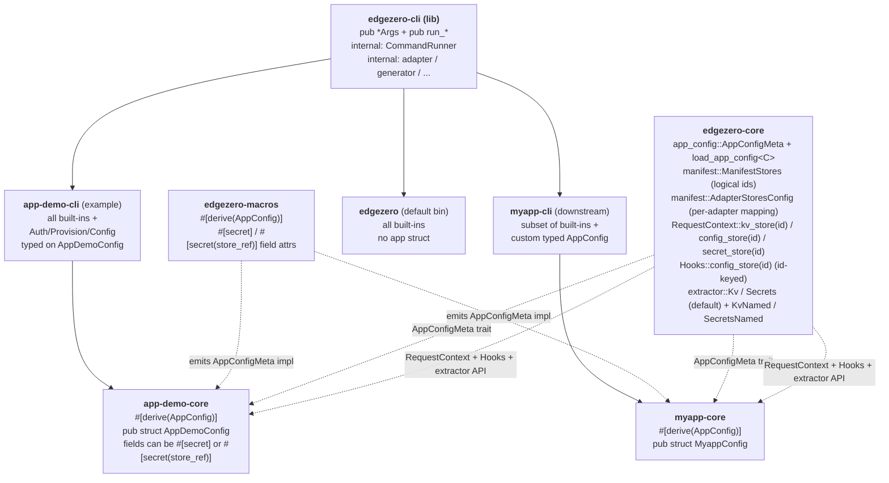

# EdgeZero CLI Extensions — Full Design

**Date:** 2026-05-19
**Status:** Approved design (single-spec form), pending implementation plan
**Branch:** `docs/extensible-cli-library-spec`

This single spec covers the full effort:

- a manifest schema rewrite that introduces a logical-store /
  per-adapter-mapping model for KV / secrets / config,
- a runtime API rewrite that supports multiple stores per kind (including
  rewriting the Cloudflare config store backend from `[vars]` to KV so
  `config push` actually reaches the runtime, and updating `Hooks`,
  `ConfigStoreMetadata`, the `app!` macro, and the `Kv` / `Secrets`
  extractors),
- turning `edgezero-cli` into an extensible library,
- a per-service typed app-config file with `#[derive(AppConfig)]` and
  `#[secret]` / `#[secret(store_ref)]` annotations,
- four new commands (`auth`, `provision`, `config validate`, `config push`),
- generator extensions to scaffold the new pieces,
- and an `app-demo` overhaul that exercises everything end-to-end.

The work is organised into nine sub-projects so it can ship in nine
incremental PRs, but the design decisions live here together so reviewers
see the full picture in one place.

---

## 1. Goal

Let downstream projects (e.g. a future `myapp` created by `edgezero new
myapp`) build their own CLI binary that:

- Reuses any subset of edgezero's built-in commands (today: `build`,
  `deploy`, `dev`, `new`, `serve`; after this effort: also `auth`,
  `provision`, `config validate`, `config push`).
- Adds their own subcommands.
- Owns the binary name, `about` text, and top-level help.

Alongside the extensibility substrate, ship:

- A **multi-store manifest model**: the app declares logical stores it
  uses (`[stores.kv] ids = ["foo", "bar"]`) and each adapter declares the
  platform-specific `name` for each logical id, with room for
  adapter-specific tuning. Stores are addressed in code by logical id
  (`ctx.kv_store("foo")`).
- A **typed per-service app-config file** (e.g. `myapp.toml`) whose
  schema is defined by the downstream app as a Rust struct, validated at
  lint time by `config validate`, and uploaded to the platform config
  store by `config push`. Fields annotated `#[secret]` are skipped during
  push (the value is a key in the default secret store). Fields annotated
  `#[secret(store_ref)]` are skipped during push **and** cross-checked
  against `[stores.secrets].ids` (the value is a logical store id).
- **Cloudflare config-store rewrite** to read from a KV namespace
  instead of a `[vars]` JSON blob. Required so `config push` reaches the
  runtime without redeploying the worker.
- Platform credential and resource management (`auth`, `provision`) that
  shells out to each platform's official CLI tool, with all shell-out
  calls wrapped in a mockable `CommandRunner` trait so CI stays hermetic.
- A generator that scaffolds a new project complete with its own
  `<name>-cli` crate, a stub `<name>.toml` app-config file (with
  `#[serde(deny_unknown_fields)]` on the generated config struct), and
  an `edgezero.toml` using the new logical-id store model.
- An `app-demo` overhaul demonstrating the finished system end-to-end.

The default `edgezero` binary remains backwards-compatible in spirit:
existing subcommands keep the same name and flag shape. The manifest
schema rewrite is a **breaking change** to the on-disk format. The
in-tree `examples/app-demo/edgezero.toml` is migrated as part of the
work; a published migration guide covers external users.

## 2. Non-goals

- No runtime command registry (`inventory` / `linkme`-style); no
  PATH-based external subcommand discovery.
- No edgezero-managed credentials. `auth` delegates entirely to
  `wrangler` / `fastly` / `spin`; we store nothing.
- No direct REST API calls to platforms. All platform interactions go
  through the platform's official CLI tool.
- No environment-sectioned app-config (`[config.production]`,
  `[config.staging]`). Single `[config]` table per file; multi-environment
  workflows are deferred until a real need surfaces.
- No live-platform CI smoke tests. All tests run against a mock
  `CommandRunner`.
- No on-disk migration helper for older `edgezero.toml` files using the
  pre-rewrite store schema. The in-tree `examples/app-demo/edgezero.toml`
  is the only file we migrate; external users follow the migration
  guide.
- No Spin-side implementation of `provision` or `config push` in this
  effort. Spin's stores schema lands via a separate in-flight PR;
  `[adapters.spin]` in `edgezero.toml` simply omits the `stores`
  section until then. The CLI's Spin path is added as a small follow-up
  once that PR ships.

## 3. Architecture overview



Key contracts:

- **Substrate**: each built-in command is a `(pub *Args, pub run_*)` pair
  in `edgezero-cli`. Downstream `Subcommand` enums opt in by listing the
  variants they want. Opt-out is omission. Every `*Args` derives `Default`
  so external tests and wrappers can construct via `Default + field
  mutation` despite `#[non_exhaustive]`.
- **Multi-store manifest model**: app declares logical store ids in
  `[stores.<kind>]`; each adapter maps every logical id to a
  platform-specific `name` in `[adapters.<X>.stores.<kind>.<id>]`,
  optionally with adapter-specific tuning fields. Provisioned platform
  resource IDs live in each platform's native manifest (`wrangler.toml`,
  `fastly.toml`). See §6.6.
- **Multi-store runtime API**: `ctx.<kind>_store(logical_id) ->
  Option<Handle>` and `ctx.<kind>_store_default()`. `Hooks` gains the
  same id-keyed shape. The `Kv` / `Secrets` extractors continue to work
  for default-store access; new `KvNamed<const ID: &str>` /
  `SecretsNamed<const ID: &str>` extractors give type-safe named access.
  See §6.8.
- **Cloudflare config runtime moves to KV**: `CloudflareConfigStore`
  reads from a KV namespace (one namespace per logical config id),
  matching the rest of the multi-store model and allowing `config push`
  to update config without redeploying the worker.
- **Typed app-config + secrets**: downstream defines a struct with
  `#[derive(Deserialize, Validate, AppConfig)]`. Two annotations
  declare secret-backed fields:
  - `#[secret]` — value is a **key inside the default secret store**.
    Validate checks: non-empty, `[stores.secrets]` exists.
  - `#[secret(store_ref)]` — value is a **logical store id** in
    `[stores.secrets].ids`. Validate cross-checks the id exists.
  Push skips both. See §6.7.
- **Shell-out isolation**: every subprocess call goes through a private
  `CommandRunner` trait taking a `CommandSpec` (program, args, cwd,
  stdin, env). Tests use `MockCommandRunner`; CI never touches a real
  platform.
- **Generator**: `edgezero new <name>` produces a workspace with
  `crates/<name>-core` (using `#[derive(AppConfig)]` + `#[serde(
  deny_unknown_fields)]`), `crates/<name>-cli`, per-adapter crates,
  `<name>.toml`, and `edgezero.toml` using the new schema.

## 4. End-state public API surface

After all nine sub-projects ship:

```rust
// crates/edgezero-cli/src/lib.rs  (feature = "cli")

pub use args::{
    AuthArgs, AuthSub, BuildArgs, ConfigPushArgs, ConfigValidateArgs,
    DeployArgs, NewArgs, ProvisionArgs, ServeArgs,
};

pub fn init_cli_logger();

pub fn run_build(args: &BuildArgs) -> Result<(), String>;
pub fn run_deploy(args: &DeployArgs) -> Result<(), String>;
pub fn run_new(args: &NewArgs) -> Result<(), String>;
pub fn run_serve(args: &ServeArgs) -> Result<(), String>;
#[cfg(feature = "edgezero-adapter-axum")]
pub fn run_dev() -> !;

pub fn run_auth(args: &AuthArgs) -> Result<(), String>;
pub fn run_provision(args: &ProvisionArgs) -> Result<(), String>;

// Validate bound: DeserializeOwned + Validate + AppConfigMeta (no Serialize).
pub fn run_config_validate(args: &ConfigValidateArgs) -> Result<(), String>;
pub fn run_config_validate_typed<C>(args: &ConfigValidateArgs) -> Result<(), String>
where
    C: serde::de::DeserializeOwned + validator::Validate
       + ::edgezero_core::app_config::AppConfigMeta;

// Push bound: add Serialize (needed for the serde_json::to_value object check
// and for the actual serialization).
pub fn run_config_push(args: &ConfigPushArgs) -> Result<(), String>;
pub fn run_config_push_typed<C>(args: &ConfigPushArgs) -> Result<(), String>
where
    C: serde::de::DeserializeOwned + validator::Validate + serde::Serialize
       + ::edgezero_core::app_config::AppConfigMeta;
```

From `edgezero-core`:

```rust
// app_config module (new in sub-project #4)
pub trait AppConfigMeta {
    /// Per-field secret metadata. Empty array when no fields are #[secret].
    const SECRET_FIELDS: &'static [SecretField];
}

pub struct SecretField {
    pub name: &'static str,        // Rust field name; also the toml key
    pub kind: SecretKind,
}

pub enum SecretKind {
    /// Value is a key inside the default secret store.
    KeyInDefault,
    /// Value is a logical store id in [stores.secrets].ids.
    StoreRef,
}

pub fn load_app_config<C>(path: &std::path::Path) -> Result<C, AppConfigError>
where C: serde::de::DeserializeOwned + validator::Validate + AppConfigMeta;
pub fn load_app_config_raw(path: &std::path::Path)
    -> Result<std::collections::BTreeMap<String, toml::Value>, AppConfigError>;

// RequestContext store API (rewritten in sub-project #3)
impl RequestContext {
    pub fn kv_store(&self, id: &str) -> Option<KeyValueStoreHandle>;
    pub fn kv_store_default(&self) -> Option<KeyValueStoreHandle>;
    pub fn config_store(&self, id: &str) -> Option<ConfigStoreHandle>;
    pub fn config_store_default(&self) -> Option<ConfigStoreHandle>;
    pub fn secret_store(&self, id: &str) -> Option<SecretHandle>;
    pub fn secret_store_default(&self) -> Option<SecretHandle>;
}

// Hooks trait (rewritten in sub-project #3): id-keyed accessors mirroring
// RequestContext. Existing default-only call sites stay backwards-compatible
// via the `_default()` helpers.

// Extractors (extended in sub-project #3):
pub struct Kv(/* default kv store handle */);
pub struct Secrets(/* default secret store handle */);
pub struct KvNamed<const ID: &'static str>(/* named kv store handle */);
pub struct SecretsNamed<const ID: &'static str>(/* named secret store handle */);
```

From `edgezero-macros` (it IS the proc-macro crate; no `_impl` split):

```rust
// crates/edgezero-macros/src/lib.rs
#[proc_macro_derive(AppConfig, attributes(secret))]
pub fn derive_app_config(input: TokenStream) -> TokenStream { /* ... */ }
```

Internal modules in `edgezero-cli` (`adapter`, `generator`, `scaffold`,
`dev_server`, `runner`, `provision`, `auth`, `config`) stay private.

## 5. End-state file layout

```
crates/edgezero-cli/
  Cargo.toml                  # lib + bin
  src/
    lib.rs                    # public API; declares private modules
    main.rs                   # thin wrapper for the default edgezero bin
    args.rs                   # all pub *Args structs (#[non_exhaustive] + #[derive(Default)])
    adapter.rs                # (unchanged, private)
    generator.rs              # extended: also scaffolds <name>-cli + <name>.toml + <name>-core/src/config.rs
    scaffold.rs               # (unchanged-ish, private)
    dev_server.rs             # (unchanged, private; feature-gated)
    runner.rs                 # NEW: CommandSpec + CommandRunner trait + Real/Mock impls
    auth.rs                   # NEW
    provision.rs              # NEW
    config.rs                 # NEW
    templates/
      core/                   # src/config.rs.hbs added in #4 with deny_unknown_fields
      root/                   # edgezero.toml.hbs rewritten for new schema
      cli/                    # NEW
        Cargo.toml.hbs
        src/main.rs.hbs
      app/                    # NEW: <name>.toml.hbs stub app-config
  tests/
    lib_consumer.rs           # NEW

crates/edgezero-core/src/
  manifest.rs                 # REWRITTEN store schema (logical ids + per-adapter name map)
  context.rs                  # REWRITTEN store accessors (id-keyed; *_default helpers)
  app_config.rs               # NEW: AppConfigMeta trait + SecretField + SecretKind + loaders
  extractor.rs                # EXTENDED: KvNamed / SecretsNamed; existing Kv / Secrets keep working as default-store
  hooks.rs                    # REWRITTEN: id-keyed Hooks accessors
  app.rs                      # REWRITTEN ConfigStoreMetadata to a registry shape
  config_store.rs             # (unchanged trait; contract macro takes id-keyed factory)
  key_value_store.rs          # (unchanged trait)
  secret_store.rs             # (unchanged trait)

crates/edgezero-macros/
  Cargo.toml
  src/
    lib.rs                    # ADD: #[proc_macro_derive(AppConfig, attributes(secret))]
    app_config.rs             # NEW: derive impl (only public via lib.rs re-export of proc_macro)
    app.rs                    # UPDATED: app! macro emits id-keyed ConfigStoreMetadata from new manifest schema

# Adapter store impls rewritten for the multi-store model (sub-project #3):
crates/edgezero-adapter-axum/src/{config_store,key_value_store,secret_store}.rs
crates/edgezero-adapter-cloudflare/src/{config_store,key_value_store,secret_store}.rs
crates/edgezero-adapter-fastly/src/{config_store,key_value_store,secret_store}.rs

# Cloudflare config store specifically: rewritten to read from a KV namespace
# (one namespace per logical config id), not from a [vars] JSON binding.

examples/app-demo/
  Cargo.toml                  # adds crates/app-demo-cli to members
  app-demo.toml               # NEW: typed app config with #[secret] and #[secret(store_ref)] examples
  edgezero.toml               # REWRITTEN to new logical-id store schema; spin adapter omits stores section
  crates/
    app-demo-core/
      src/config.rs           # NEW: AppDemoConfig with #[derive(AppConfig)]
      src/handlers.rs         # one handler reads from config store via _default(); another reads named kv
    app-demo-cli/             # NEW
      Cargo.toml
      src/main.rs
      tests/help.rs
    app-demo-adapter-*/       # store setup rewrites for multi-store

docs/guide/
  cli-walkthrough.md          # NEW
  manifest-store-migration.md # NEW
.vitepress/config.ts          # UPDATED sidebar
```

## 6. Cross-cutting designs

### 6.1 `CommandSpec` + `CommandRunner` (introduced in sub-project #6)

```rust
// crates/edgezero-cli/src/runner.rs (private)
pub(crate) struct CommandSpec<'a> {
    pub program: &'a str,
    pub args:    &'a [&'a str],
    pub cwd:     Option<&'a std::path::Path>,
    pub stdin:   Option<&'a [u8]>,
    pub env:     &'a [(&'a str, &'a str)],
}

pub(crate) trait CommandRunner: Send + Sync {
    fn run(&self, spec: &CommandSpec<'_>) -> std::io::Result<CommandOutput>;
}

pub(crate) struct CommandOutput { pub status: i32, pub stdout: String, pub stderr: String }

pub(crate) struct RealCommandRunner;       // std::process::Command
#[cfg(test)]
pub(crate) struct MockCommandRunner { /* recorded expectations */ }
```

Public command functions use a private `*_with` inner so tests inject
the mock without exposing the trait.

### 6.2 Error model

All public `run_*` return `Result<(), String>`. Matches the existing
pattern. Error formatting is the function's responsibility; binaries
log and exit.

### 6.3 Feature gates (consumer-facing)

```toml
[dependencies]
edgezero-cli = { version = "...", default-features = false, features = ["cli"] }
# Plus the adapters wanted:
# - edgezero-adapter-axum
# - edgezero-adapter-cloudflare
# - edgezero-adapter-fastly
# - edgezero-adapter-spin
```

- `cli` (default) — gates clap + public API. Required.
- `edgezero-adapter-{axum,fastly,cloudflare,spin}` (all four default) —
  each gates that adapter's dispatch path. Disabling removes the adapter
  from the `--adapter` matrix and produces "adapter not compiled in".

### 6.4 Typed vs raw config serialization

The two `config validate` / `config push` flavours share serialization
rules but differ in schema awareness.

**Validate (both flavours):**

- TOML syntax OK; top-level `[config]` table present; structure parses.
- Typed flavour additionally:
  - Deserialises into `C`.
  - Runs `C::validate()`.
  - For each `SecretField` in `C::SECRET_FIELDS`: value is a non-empty
    string. If `SecretKind::StoreRef`, the value must appear in
    `[stores.secrets].ids`.
- Validate does **not** require `Serialize`. It performs no
  `serde_json::to_value` check — that's push's responsibility.

**Push (both flavours):**

- All validate checks run first as pre-flight (always strict). If
  validate fails, push aborts before any runner call.
- Each field is serialised to a string for storage:
  - `String` → as-is.
  - `bool`, integer, float → `to_string()`.
  - Compound types → `serde_json::to_string`.
  - `Option::None` / `Value::Null` → field skipped entirely.
- Fields in `C::SECRET_FIELDS` are skipped (typed flavour only).
- Typed flavour additionally:
  - Asserts `serde_json::to_value(&c)` is `Value::Object`. Otherwise
    errors out before the runner is touched.
  - Honors `#[serde(rename = "k")]` (renamed name is the storage key)
    and `#[serde(skip_serializing, skip_serializing_if = ...)]`.
  - `#[serde(flatten)]` on **non-secret** fields is supported (flattened
    keys land at the top level after the serialize step). `#[secret]` /
    `#[secret(store_ref)]` on flattened fields is a compile error
    (see §6.7).
- Raw flavour:
  - `BTreeMap<String, toml::Value>` from `[config]`.
  - Same scalar/compound rules.
  - No `Validate`, no secret-field skipping (no `AppConfigMeta`).

**Unknown field handling:** serde's default is to silently ignore
unknown fields. The generator template emits `#[serde(
deny_unknown_fields)]` on the generated config struct so new projects
reject unknown fields by default. Existing structs without the
attribute follow serde's default behaviour; `config validate` therefore
makes no general guarantee about unknown-field rejection.

### 6.5 Test strategy summary

- Existing CLI tests move alongside their handlers.
- Per-sub-project tests for each new surface.
- Every platform-touching test uses `MockCommandRunner`.
- External-consumer integration test `tests/lib_consumer.rs`.
- `examples/app-demo/crates/app-demo-cli/tests/help.rs`.
- Manifest contract tests cover multi-store schemas, default
  resolution, unknown-id rejection, Spin-skip behaviour for stores.

### 6.6 Multi-store manifest schema

**App-level (logical) declaration in `edgezero.toml`:**

```toml
[stores.kv]
ids     = ["foo", "bar"]
default = "foo"          # optional when ids has exactly one entry

[stores.config]
ids     = ["app_config"]
default = "app_config"

[stores.secrets]
ids     = ["default"]
default = "default"
```

**Per-adapter mapping + optional tuning in `edgezero.toml`:**

```toml
[adapters.cloudflare.stores.kv.foo]
name = "FOO_CLOUDFLARE"               # platform-specific name

[adapters.cloudflare.stores.kv.bar]
name = "BAR_CLOUDFLARE"

[adapters.fastly.stores.kv.foo]
name      = "FOO_FASTLY"
max_value = "1MB"                      # adapter-specific tuning, free-form

[adapters.cloudflare.stores.config.app_config]
name = "APP_CONFIG_KV"                 # KV namespace name (Cloudflare config = KV; see §6.9)

[adapters.cloudflare.stores.secrets.default]
name = "EDGEZERO_SECRETS"

# spin omits the stores section entirely (until its in-flight stores PR lands):
[adapters.spin.adapter]
crate    = "crates/app-demo-adapter-spin"
manifest = "crates/app-demo-adapter-spin/spin.toml"
# no [adapters.spin.stores.*] blocks; validator skips completeness for spin.
```

**Field reference:**

| Field | Where | Role |
|---|---|---|
| `[stores.<kind>].ids` | top level | logical ids (`Vec<String>`). Non-empty. |
| `[stores.<kind>].default` | top level | the id used when none specified. Optional if `ids.len() == 1`. Must be in `ids`. |
| `[adapters.<X>.stores.<kind>.<id>].name` | per-adapter | platform-specific name. Required when adapter has a stores section. |
| any other field in that block | per-adapter | adapter-specific tuning. `BTreeMap<String, toml::Value>` extras; opaque to core. |

**Provisioned platform resource IDs do not live in `edgezero.toml`.**
They go into each platform's native manifest:

- `wrangler.toml` for Cloudflare:
  ```toml
  [[kv_namespaces]]
  binding = "FOO_CLOUDFLARE"   # wrangler's term for what we call `name` in edgezero.toml
  id      = "abc123def456"
  ```
- `fastly.toml` for Fastly.

`provision` writes IDs into the native manifest. `config push` parses
the native manifest to find the ID it needs (e.g. `wrangler kv bulk put
--namespace-id=...`).

**Validation rules (enforced by `ManifestLoader`):**

- `[stores.<kind>].ids` is non-empty.
- `[stores.<kind>].default` is in `ids`, or absent (then defaults to
  `ids[0]`).
- **Adapter store completeness:** for every adapter declared in
  `[adapters.*]` **that has an `[adapters.<X>.stores]` section**, every
  id in every `[stores.<kind>].ids` must have a corresponding
  `[adapters.<X>.stores.<kind>.<id>]` block with a `name` field.
  Adapters without a `stores` section are skipped (this is how Spin
  participates in the manifest before its stores PR lands).
- `name` strings used under `[adapters.cloudflare.stores.*]` must be
  JavaScript identifier syntax (Wrangler binding constraint). Invalid
  names are **errors**, not warnings — the platform would otherwise
  fail to deploy.

**Runtime resolution at adapter init:**

```rust
struct StoreRegistry<H> {
    by_id: BTreeMap<String, H>,
    default_id: String,
}
```

`ctx.kv_store("foo")` returns `Some(registry.by_id["foo"])` or `None`
if unknown. `ctx.kv_store_default()` returns the default-id handle.

### 6.7 Secret annotations via `#[derive(AppConfig)]`

**Two forms:**

```rust
use serde::{Deserialize, Serialize};
use validator::Validate;
use edgezero_macros::AppConfig;

#[derive(Debug, Deserialize, Serialize, Validate, AppConfig)]
#[serde(deny_unknown_fields)]
pub struct AppDemoConfig {
    pub greeting: String,
    pub timeout_ms: u32,
    pub feature_new_checkout: bool,

    /// Key inside the default secret store. Read via
    /// `ctx.secret_store_default()?.get(&config.api_token).await`.
    #[secret]
    pub api_token: String,

    /// Logical secret-store id in [stores.secrets].ids. Read via
    /// `ctx.secret_store(&config.vault).await`.
    #[secret(store_ref)]
    pub vault: String,
}
```

**Toml shape (no new syntax):**

```toml
[config]
greeting = "hello from app-demo"
timeout_ms = 1500
feature_new_checkout = false
api_token = "MY_API_TOKEN"      # a key in the default secret store
vault     = "credentials"        # a logical id in [stores.secrets].ids
```

**What the derive emits:**

```rust
impl ::edgezero_core::app_config::AppConfigMeta for AppDemoConfig {
    const SECRET_FIELDS: &'static [::edgezero_core::app_config::SecretField] = &[
        ::edgezero_core::app_config::SecretField {
            name: "api_token",
            kind: ::edgezero_core::app_config::SecretKind::KeyInDefault,
        },
        ::edgezero_core::app_config::SecretField {
            name: "vault",
            kind: ::edgezero_core::app_config::SecretKind::StoreRef,
        },
    ];
}
```

**Constraints (compile errors from the derive):**

- `#[secret]` / `#[secret(store_ref)]` only on **scalar** fields
  (must deserialize from a TOML string).
- Compile error if combined with `#[serde(flatten)]`,
  `#[serde(rename = ...)]`, `#[serde(rename_all = ...)]` on the
  containing struct in a way that changes the field's serialized
  name, or `#[serde(skip_serializing)]` / `#[serde(skip)]`.
- No other `#[secret(...)]` variants. `#[secret(foo)]` with `foo`
  outside `{store_ref}` is a compile error.
- `SECRET_FIELDS` uses the Rust field name verbatim. Renamed serde
  keys are not supported; if you need to rename, don't make the field
  secret (use a non-secret field that holds the lookup key).

This explicit list keeps the macro implementation small and avoids the
"partial serde parser drift" risk.

**CLI behaviour:**

- `config validate --typed`: for each `SecretField`:
  - Both kinds: value is a non-empty string.
  - `KeyInDefault`: assert `[stores.secrets]` is declared (the app has
    *a* default secret store available).
  - `StoreRef`: assert the value appears in `[stores.secrets].ids`.
- `config push --typed`: skips both kinds. Secret material is never
  written to the config store.

**Runtime usage in service code:**

```rust
// #[secret] (KeyInDefault):
let token = ctx.secret_store_default()?.get(&config.api_token).await?;

// #[secret(store_ref)] (StoreRef):
let vault = ctx.secret_store(&config.vault)?;
let token = vault.get("active").await?;
```

### 6.8 Extractor design

Existing handler-facing extractors (`Kv`, `Secrets` from
[crates/edgezero-core/src/extractor.rs](crates/edgezero-core/src/extractor.rs))
stay backwards-compatible after the runtime API rewrite:

- `Kv` resolves via `ctx.kv_store_default()` (was `kv_handle`).
- `Secrets` resolves via `ctx.secret_store_default()`.

For named (non-default) stores, two new extractors with const-generic
ids:

```rust
pub struct KvNamed<const ID: &'static str>(KeyValueStoreHandle);
pub struct SecretsNamed<const ID: &'static str>(SecretHandle);

// Usage:
#[action]
async fn handler(KvNamed(sessions): KvNamed<"sessions">) -> ... { ... }
```

`FromRequest` impl looks up the id in the registry and fails the
extraction if missing.

This preserves all existing handler signatures (they all use the
default store today) while adding type-safe named access. No
deprecation path needed for the default-store extractors.

### 6.9 Cloudflare config store rewrite (`[vars]` → KV)

Currently `CloudflareConfigStore`
([config_store.rs:1-12](crates/edgezero-adapter-cloudflare/src/config_store.rs#L1-L12))
reads a single `[vars]` JSON-string binding. Changing config values
requires editing `wrangler.toml` and redeploying the worker.

That's incompatible with the `config push` flow this spec describes,
which is designed to update config values without rebuild/redeploy.

**Rewrite in sub-project #3:** `CloudflareConfigStore` reads from a KV
namespace, one per logical config id. The on-disk shape after this
ships:

- `edgezero.toml`:
  ```toml
  [stores.config]
  ids = ["app_config"]
  default = "app_config"

  [adapters.cloudflare.stores.config.app_config]
  name = "APP_CONFIG_KV"
  ```
- `wrangler.toml` (written by `provision`):
  ```toml
  [[kv_namespaces]]
  binding = "APP_CONFIG_KV"
  id      = "abc123def456"
  ```
- Runtime: `await env.APP_CONFIG_KV.get("greeting")` (translated by the
  adapter from the user-facing `ctx.config_store_default()?.get(...)`).

`config push --adapter cloudflare` writes via
`wrangler kv bulk put <tempfile.json> --namespace-id=<from wrangler.toml>`.
No redeploy needed; values are live on the next request after KV
propagation.

The `[vars]` model is removed entirely. Any existing
`[vars]` JSON-blob config in deployed workers gets migrated as a
one-time operation per workspace (documented in the migration guide).

This means **the multi-store rewrite is incomplete without this Cloudflare
adapter rewrite** — they ship together in sub-project #3.

---

## 7. Sub-project 1 — Extensible `edgezero-cli` library + generator + `app-demo-cli` skeleton

**Goal:** establish the substrate. After this ships, downstream
projects can build their own CLI against the lib using only the
existing five built-ins. Default `edgezero` is backwards-compatible.

**Source changes:**

- `crates/edgezero-cli/src/args.rs` — promote each `Command` variant's
  inline fields into a `#[derive(clap::Args, Default)]` struct, also
  marked `#[non_exhaustive]`. `NewArgs` already exists.
- `crates/edgezero-cli/src/lib.rs` (new) — declares the private
  modules, moves handlers (renamed `handle_*` → `run_*`).
- `crates/edgezero-cli/src/main.rs` — shrinks to ~20 lines.
- Existing CLI tests move to `lib.rs`.
- **Generator update**: `edgezero new <name>` produces
  `crates/<name>-cli/{Cargo.toml, src/main.rs}` using all five
  built-ins via the lib substrate. Root `Cargo.toml.hbs` updated.
  **No app-config file yet, no derive yet, no new manifest schema yet.**
- `examples/app-demo/crates/app-demo-cli` (new crate, handwritten
  parallel to the generator output).

**External-construction note:** every public `*Args` derives `Default`
so external tests (including `tests/lib_consumer.rs`) construct via
`Default + field mutation` despite `#[non_exhaustive]`.

**Tests:**

- All existing CLI tests pass after relocation.
- New `crates/edgezero-cli/tests/lib_consumer.rs`: constructs
  `BuildArgs::default(); args.adapter = "fastly".into(); ...` and calls
  `run_build(&args)`.
- New `examples/app-demo/crates/app-demo-cli/tests/help.rs`.
- Generator test: `generate_new("test-app", ...)` produces correct
  files.

**Ship gate:** `edgezero --help` unchanged; `app-demo-cli --help` shows
the five built-ins; `edgezero new throwaway-app && cd throwaway-app &&
cargo check --workspace` succeeds.

## 8. Sub-project 2 — Manifest schema additions (purely additive)

**Goal:** add the new logical-store + per-adapter-mapping schema to
`ManifestStores` and `ManifestAdapter` **alongside** the existing
single-store fields. Nothing is removed yet; no runtime code changes.

This sub-project intentionally avoids any runtime adapter changes —
those land in sub-project #3 — and it does **not** drop
`[stores.config.defaults]` (still wired into axum's local-dev config
seeding via [dev_server.rs:349](crates/edgezero-adapter-axum/src/dev_server.rs#L349)).
Removing `defaults` happens in sub-project #9 when `<name>.toml`
arrives as a runtime-accessible replacement.

**Source changes:**

- `crates/edgezero-core/src/manifest.rs`:
  - Add new `ManifestStoresKind { ids: Vec<String>, default: Option<String> }`
    fields under `[stores.kv]`, `[stores.secrets]`, `[stores.config]`.
    Old single-store fields (`name`, `enabled`, etc.) remain present
    and continue to deserialise.
  - Add `ManifestAdapter.stores: Option<AdapterStoresConfig>` — kind →
    id → `AdapterStoreMapping { name: String, extras: BTreeMap<String,
    toml::Value> }`.
  - Validator rules from §6.6 (enforced when the new fields are
    present; old-shape manifests pass unchanged).
  - **Adapter store completeness skips adapters without
    `[adapters.<X>.stores]`** — this is how Spin participates without
    a stores impl.
- `crates/edgezero-core/src/manifest.rs` tests: cover the new schema,
  default resolution, missing-mapping errors, Spin-skip behaviour,
  Cloudflare JS-identifier validation as **errors**.
- `examples/app-demo/edgezero.toml` keeps its current shape; no
  migration yet. (The migration happens in sub-project #3 alongside
  the runtime API rewrite.)

**No runtime, CLI, macro, or adapter changes in this sub-project.** It
only adds parseable schema and validation.

**Tests:**

- Round-trip deserialization for the new schema.
- Default-resolution: omitted with one id; omitted with multiple ids →
  error; explicit not-in-ids → error.
- Per-adapter completeness: missing mapping for declared id on
  adapter-with-stores → error; adapter without stores section → ok.
- Cloudflare `name` JS-syntax validation → error on invalid.
- Old-shape manifests parse unchanged.

**Ship gate:** existing app-demo runtime keeps working unchanged
(verified by the existing test suite); manifest tests prove the new
schema is parseable and validated.

## 9. Sub-project 3 — Runtime API + adapter store registry + macro/Hooks/extractor + Cloudflare KV rewrite

**Goal:** the big runtime sub-project. After this, multi-store works
end-to-end at runtime on axum and Cloudflare. Includes:

- `RequestContext` store accessors rewritten id-keyed (§4).
- `Hooks` trait gains id-keyed accessors.
- `ConfigStoreMetadata` becomes a registry shape (one entry per id).
- `app!` macro emits id-keyed metadata from the new manifest schema.
- `Kv` / `Secrets` extractors become default-store accessors; new
  `KvNamed` / `SecretsNamed` const-generic extractors added (§6.8).
- Every adapter's store setup walks `[adapters.<self>.stores.*]` and
  builds a `StoreRegistry<H>`.
- **Cloudflare config store rewritten from `[vars]` to KV** (§6.9).
  This is the cornerstone of `config push` working end-to-end.
- `examples/app-demo/edgezero.toml` migrated to the new schema. Spin
  adapter omits the `stores` section.
- `examples/app-demo` handlers updated to call id-keyed accessors
  (`config_store_default()`, `kv_store("sessions")`, etc.).

**Compatibility:** the old single-store manifest fields removed from
`ManifestStores` and `ManifestAdapter`; in-tree consumers updated in
lockstep. External users follow the migration guide
(`docs/guide/manifest-store-migration.md`) shipped in this PR.

**Tests:**

- Contract-test macros gain id-keyed factory variants.
- Cross-adapter test in `examples/app-demo`: a handler reading from a
  named KV id works on every adapter with the mapping declared.
- Cloudflare config-from-KV round-trip test using the existing
  wasm-bindgen-test harness.
- `Kv` / `Secrets` extractors still work in default-store handler
  signatures.
- `KvNamed<"sessions">` extractor compiles and works in a handler.
- `app!` macro test: generated `ConfigStoreMetadata` registry matches
  the manifest's `[stores.config].ids`.

**Ship gate:** multi-store handlers in `app-demo` work on axum and
Cloudflare (the latter via mock or wasm-bindgen-test); existing
handlers' default-store reads keep working; `config push` flow is
runtime-ready (push command itself lands in sub-project #8).

## 10. Sub-project 4 — App-config schema, derive macro, generic loader

**Goal:** define the file format for per-service app config, the
`#[derive(AppConfig)]` macro that produces secret-field metadata, and
the generic loader the CLI uses.

**Source changes:**

- `crates/edgezero-core/src/app_config.rs` (new): `AppConfigMeta` trait
  with `SECRET_FIELDS: &[SecretField]`, `SecretField` + `SecretKind`
  enum, `load_app_config<C: ... + AppConfigMeta>(path)`,
  `load_app_config_raw(path) -> BTreeMap<String, toml::Value>`.
- `crates/edgezero-macros/src/app_config.rs` (new): the `AppConfig`
  derive. Implementation lives in the existing `edgezero-macros`
  proc-macro crate (no new crate split). Parses input, scans for
  `#[secret]` (KeyInDefault) and `#[secret(store_ref)]` (StoreRef),
  enforces §6.7 constraints (compile errors on unsupported
  combinations), emits `AppConfigMeta` impl with `SECRET_FIELDS`.
- `crates/edgezero-macros/src/lib.rs`: add the
  `#[proc_macro_derive(AppConfig, attributes(secret))]` export.
- `crates/edgezero-cli/src/templates/app/<name>.toml.hbs` (new): stub
  app-config (greeting only).
- `crates/edgezero-cli/src/templates/core/src/config.rs.hbs` (new):
  `<NameUpperCamel>Config` with `#[derive(Deserialize, Serialize,
  Validate, AppConfig)]` **and** `#[serde(deny_unknown_fields)]`.
- `examples/app-demo/app-demo.toml` (new) — typed values including one
  `#[secret]` (`api_token`) and one `#[secret(store_ref)]` example
  (`vault`).
- `examples/app-demo/crates/app-demo-core/src/config.rs` (new).
- Generator extension: emit `<name>.toml` and
  `<name>-core/src/config.rs`.

**Tests:**

- `load_app_config` unit tests.
- Round-trip for `AppDemoConfig` against `app-demo.toml`.
- Macro tests in `crates/edgezero-macros/tests/app_config_derive.rs`:
  - Empty `SECRET_FIELDS` when no annotation.
  - Single `KeyInDefault` entry from `#[secret]`.
  - Single `StoreRef` entry from `#[secret(store_ref)]`.
  - Both kinds in one struct.
  - Compile error on `#[secret]` + `#[serde(flatten)]`.
  - Compile error on `#[secret]` + `#[serde(rename = ...)]`.
  - Compile error on `#[secret(unknown)]`.
  - Compile error on `#[secret]` on a non-scalar field
    (e.g. `#[secret] pub api: Vec<String>`).

**Ship gate:** `AppDemoConfig::SECRET_FIELDS` matches the expected two
entries; `load_app_config::<AppDemoConfig>` succeeds against the
example.

## 11. Sub-project 5 — `config validate` command

**Goal:** lint the project's TOML files locally with zero platform
calls. Validate the app config in its own right, not just as a source
of cross-references for the manifest.

**Public API additions:**

```rust
pub use args::ConfigValidateArgs;
pub fn run_config_validate(args: &ConfigValidateArgs) -> Result<(), String>;
pub fn run_config_validate_typed<C>(args: &ConfigValidateArgs) -> Result<(), String>
where C: DeserializeOwned + Validate + AppConfigMeta;        // no Serialize
```

```rust
#[derive(clap::Args, Default, Debug)]
#[non_exhaustive]
pub struct ConfigValidateArgs {
    #[arg(long, default_value = "edgezero.toml")]
    pub manifest: PathBuf,
    #[arg(long)]
    pub app_config: Option<PathBuf>,
    #[arg(long)]
    pub strict: bool,
}
```

**App-config validation (concrete checks):**

| Check                              | Raw flavour | Typed flavour |
|------------------------------------|-------------|---------------|
| TOML syntax                        | yes         | yes           |
| `[config]` table exists            | yes         | yes           |
| Deserialises into `C`              | n/a         | yes           |
| Required fields present, types match `C` | n/a   | yes (via serde) |
| Unknown fields rejected            | n/a         | only if `C` is `#[serde(deny_unknown_fields)]` (generator template sets this) |
| `C::validate()` business rules     | n/a         | yes           |
| `#[secret]` field values non-empty | n/a         | yes (via `--strict`) |
| `#[secret(store_ref)]` value in `[stores.secrets].ids` | n/a | yes (via `--strict`) |

**Manifest validation (both flavours):**

- TOML syntax + `ManifestLoader` schema checks.
- If `--strict`:
  - Adapter-store completeness per §6.6 (Spin-skip honored).
  - Handler paths in `[[triggers.http]]` well-formed.

**Output:** human-readable diagnostics with file/line where possible;
exit 0 on success, 1 on failure.

**Tests:** dedicated fixtures for every distinct failure mode.

**Ship gate:** `app-demo-cli config validate --strict` exits 0 against
the example; corrupted fixtures fail with expected messages.

## 12. Sub-project 6 — `auth` command (+ `CommandRunner` infrastructure)

**Goal:** delegate per-adapter authentication to the native tool.
Introduces the `runner` module reused by later sub-projects.

**Public API additions:**

```rust
pub use args::{AuthArgs, AuthSub};
pub fn run_auth(args: &AuthArgs) -> Result<(), String>;
```

```rust
#[derive(clap::Args, Default, Debug)]
#[non_exhaustive]
pub struct AuthArgs { #[command(subcommand)] pub sub: AuthSub }

#[derive(clap::Subcommand, Debug)]
pub enum AuthSub {
    Login  { #[arg(long)] adapter: String },
    Logout { #[arg(long)] adapter: String },
    Status { #[arg(long)] adapter: String },
}
```

UX: `auth login --adapter cloudflare`. `Default` impl on `AuthArgs`
constructs a placeholder sub for trait completeness.

**Per-adapter behaviour:**

| Adapter    | Login                   | Logout                  | Status                |
|------------|-------------------------|-------------------------|-----------------------|
| axum       | no-op                   | no-op                   | always "ok"           |
| cloudflare | `wrangler login`        | `wrangler logout`       | `wrangler whoami`     |
| fastly     | `fastly profile create` | `fastly profile delete` | `fastly profile list` |
| spin       | `spin cloud login`      | `spin cloud logout`     | `spin cloud info`     |

All via `CommandRunner`.

**Tests:** mock-runner expectations across the full matrix; error
cases (ENOENT, non-zero exit).

**Ship gate:** mock-runner verification across the full matrix.

## 13. Sub-project 7 — `provision` command

**Goal:** create platform resources for every logical id, writing
resulting IDs to the per-adapter native manifest.

**Public API additions:**

```rust
pub use args::ProvisionArgs;
pub fn run_provision(args: &ProvisionArgs) -> Result<(), String>;
```

```rust
#[derive(clap::Args, Default, Debug)]
#[non_exhaustive]
pub struct ProvisionArgs {
    #[arg(long, default_value = "edgezero.toml")]
    pub manifest: PathBuf,
    #[arg(long)]
    pub adapter: String,
    #[arg(long)]
    pub dry_run: bool,
}
```

**Behaviour:** iterate every id in `[stores.<kind>].ids` for kind ∈
{kv, secrets, config}. For each, look up
`[adapters.<X>.stores.<kind>.<id>].name` and shell out:

| Adapter    | KV per id                                  | Secrets per id                              | Config per id                                                   |
|------------|--------------------------------------------|---------------------------------------------|-----------------------------------------------------------------|
| axum       | no-op (local; env-backed)                  | no-op                                       | no-op                                                            |
| cloudflare | `wrangler kv namespace create <name>`      | (no-op; secrets are runtime-managed)        | `wrangler kv namespace create <name>` (config is a KV namespace) |
| fastly     | `fastly kv-store create --name=<name>`     | `fastly secret-store create --name=<name>`  | `fastly config-store create --name=<name>`                       |
| spin       | error: "not yet supported" (no stores section in manifest, so this id wouldn't appear) | same | same |

`--dry-run` prints would-be `CommandSpec`s without invocation.

**Writeback to per-adapter native manifest:**

- **Cloudflare:** patch `wrangler.toml`:
  ```toml
  [[kv_namespaces]]
  binding = "<name from edgezero.toml>"
  id      = "<extracted-id>"
  ```
  (Wrangler's `binding` is the same string as our
  `[adapters.cloudflare.stores.<kind>.<id>].name`.)
- **Fastly:** patch `fastly.toml` with store IDs.

`edgezero.toml` is not modified.

**Tests:** per-(adapter, kind) `MockCommandRunner` with scripted
stdout; golden parser tests for ID extraction; temp-fixture writeback
verified; `--dry-run` invokes nothing.

**Ship gate:** `app-demo-cli provision --adapter cloudflare --dry-run`
prints the expected create invocations for every id; non-dry-run
against the mock writes IDs to fixture `wrangler.toml`.

## 14. Sub-project 8 — `config push` command

**Goal:** upload `<name>.toml`'s `[config]` values to the live config
store, skipping `#[secret]` / `#[secret(store_ref)]` fields. Targets
the default config store unless `--store` selects another.

**Public API additions:**

```rust
pub use args::ConfigPushArgs;
pub fn run_config_push(args: &ConfigPushArgs) -> Result<(), String>;
pub fn run_config_push_typed<C>(args: &ConfigPushArgs) -> Result<(), String>
where C: DeserializeOwned + Validate + Serialize + AppConfigMeta;   // adds Serialize
```

```rust
#[derive(clap::Args, Default, Debug)]
#[non_exhaustive]
pub struct ConfigPushArgs {
    #[arg(long, default_value = "edgezero.toml")]
    pub manifest: PathBuf,
    #[arg(long)]
    pub adapter: String,
    /// Logical id of the config store to push to.
    /// Defaults to `[stores.config].default`.
    #[arg(long)]
    pub store: Option<String>,
    #[arg(long)]
    pub app_config: Option<PathBuf>,
    #[arg(long)]
    pub dry_run: bool,
}
```

**Behaviour:**

1. **Strict pre-flight validation.** Run the same checks as `config
   validate --strict`. Abort before any runner call if it fails.
2. Load app-config (raw or typed) per §6.4.
3. Serialise per §6.4 (skipping `SECRET_FIELDS` in typed mode).
4. Resolve target id: `args.store.unwrap_or(stores.config.default_id)`.
5. Look up `[adapters.<X>.stores.config.<id>].name`.
6. For platforms needing a resource ID, parse the adapter's native
   manifest. Error with "did you run `provision` first?" if absent.
7. Shell out:

| Adapter    | Push                                                                                              |
|------------|---------------------------------------------------------------------------------------------------|
| axum       | Write to `.edgezero/local-config-<id>.env` (gitignored). No runner call.                          |
| cloudflare | `wrangler kv bulk put <tempfile.json> --namespace-id=<id>` (Wrangler 3.60+ syntax)                |
| fastly     | Per key: `fastly config-store-entry create --store-id=<id> --key=<k> --value=<v>` (`--stdin` for large values) |
| spin       | error: "not yet supported"                                                                         |

**Tests:** typed + raw paths; per-adapter `MockCommandRunner` with
golden payloads; `#[secret]` and `#[secret(store_ref)]` fields absent
from pushed payload; missing native-manifest ID → clear error;
`--store` works; `--dry-run` invokes nothing.

**Ship gate:** `app-demo-cli config push --adapter cloudflare
--dry-run` shows expected invocation; secret fields absent; namespace
ID from fixture `wrangler.toml`.

## 15. Sub-project 9 — `app-demo` integration polish + drop `[stores.config.defaults]`

**Goal:** prove the full system works end-to-end and remove the
deprecated `[stores.config.defaults]` schema.

**Source changes (all in `examples/app-demo/` plus the deprecation):**

- `crates/app-demo-cli/src/main.rs`: extend `Cmd` enum with
  `Auth(AuthArgs)`, `Provision(ProvisionArgs)`,
  `Config(ConfigCmd)`. Dispatch `Config::Validate` /
  `Config::Push` to the **typed** variants with `AppDemoConfig`.
- `crates/app-demo-core/src/handlers.rs`: extend at least one handler
  to read via `ctx.config_store_default()?.get("greeting")?` so the
  push-then-read flow is exercised end-to-end against axum.

**`[stores.config.defaults]` removal:**

- Drop the `defaults` field from `ManifestConfigStoreConfig` in
  `edgezero-core::manifest`.
- Drop the corresponding axum dev-server seeding code in
  `dev_server.rs` (around line 349).
- Replace its behaviour: the **axum dev server seeds the local config
  store from `<name>.toml`**. The same file `config push` reads from
  is now also the local-dev seed source. The allowlist behaviour
  (only env-overridable keys) becomes "every key declared in
  `<name>.toml [config]`" — the typed struct's field names form the
  allowlist.
- Update `examples/app-demo/edgezero.toml` to remove `[stores.config.
  defaults]`. Values move to `app-demo.toml [config]`.

**Documentation:**

- `docs/guide/cli-walkthrough.md` finalised: full `myapp` loop.
- `docs/guide/manifest-store-migration.md` was introduced in #3; now
  the navigation links resolve to a complete document.
- `.vitepress/config.ts` sidebar updated.

**Tests:**

- `app-demo-cli config validate --strict` exits 0.
- `app-demo-cli config push --adapter axum` writes the local file; a
  running axum dev server reads `greeting` via
  `config_store_default()` and returns it on `/config/greeting`.
- `--help` smoke test asserts all subcommands.

**Ship gate:** end-to-end demo of the full loop in CI on axum.

---

## 16. Implementation order and milestones

Each sub-project ships as one PR. Order is §7–§15. All four CI gates
green; no skipping (`-D warnings` stays).

| # | Title                                                                                                  | Risk |
|---|--------------------------------------------------------------------------------------------------------|------|
| 1 | Extensible lib + scaffold                                                                              | M    |
| 2 | Manifest schema additions (purely additive)                                                            | L    |
| 3 | RequestContext + Hooks + extractor + Cloudflare KV rewrite + app! macro + adapter store registries    | H    |
| 4 | App-config schema + derive macro                                                                       | M    |
| 5 | `config validate`                                                                                      | L    |
| 6 | `auth` + `CommandRunner`                                                                               | M    |
| 7 | `provision`                                                                                            | H    |
| 8 | `config push`                                                                                          | M    |
| 9 | `app-demo` polish + drop `[stores.config.defaults]`                                                    | M    |

**Highest-risk sub-projects:**

- **#3 (runtime rewrite):** every store-touching path in core,
  adapters, the macro, and the extractor system changes. Cloudflare
  config-store backend swap is the biggest single change. Mitigations:
  every adapter has contract tests; the existing default-store
  handler signatures keep working; in-tree app-demo is the canary.
- **#7 (provision):** shell-out + multi-file manifest writeback.
  Golden parser tests + `--dry-run` available.

## 17. Risks and trade-offs

- **Manifest breaking change (#3):** every external user editing
  `edgezero.toml` needs to update store sections when sub-project #3
  ships. The `manifest-store-migration.md` guide ships in that PR;
  the validator emits a clear error pointing at the guide on the old
  shape.
- **Cloudflare runtime config swap (#3):** workers deployed against
  the old `[vars]` JSON-blob config need a one-time migration to the
  new KV-backed config. Documented in the migration guide.
- **`[stores.config.defaults]` removal (#9):** in-tree app-demo seeded
  local-dev values from this field. #9 replaces it with reading from
  `<name>.toml`; external projects relying on `defaults` follow the
  same migration.
- **API stability:** every public `*Args` is `#[non_exhaustive]` +
  `Default` so adding fields stays non-breaking and external
  construction works via `Default + field mutation`.
- **Shell-out fragility:** platform CLI surfaces change. We pin
  current syntax, surface clear errors on missing/failing tools, and
  rely on `.tool-versions`.
- **ID writeback brittleness:** stdout parsing is version-sensitive.
  Per-tool golden tests; `--dry-run` available.
- **Generator drift:** generator output structure tested for shape;
  sub-projects #1 and #4 add tests.
- **Macro / serde-attribute scope (#4):** `#[secret]` constrained to
  non-flattened, non-renamed scalar fields with compile-error
  enforcement. Avoids drift from partial serde-attribute parsing.
- **Multi-environment app-config:** out of scope. Follow-up spec.
- **Spin support gap:** until the in-flight Spin stores PR lands,
  Spin omits `[adapters.spin.stores]` and is skipped by the
  completeness validator. `provision` / `config push` error for
  `--adapter spin`.
- **Test relocation in #1:** ~10 tests move; mechanical diff.

## 18. What this spec does not cover

- Anthropic credentials, edge-network DNS / TLS, observability /
  metrics.
- Per-environment config.
- Restructuring `app-demo-core` handlers beyond the one demonstrating
  push-then-read and the multi-store KV demo handler in #3.
- Changes to `edgezero-core` beyond `app_config`, the rewritten
  `manifest` store schema, the rewritten `RequestContext` /
  `Hooks` / `app!` macro / `ConfigStoreMetadata` / extractor surface,
  and the Cloudflare adapter config-store backend.
- Migration tool for the old manifest schema. Manual via the
  published guide.
- Spin-side store provisioning and config push: deferred until the
  Spin stores PR lands.

When all nine sub-projects ship:

- `edgezero new myapp` produces a workspace with `myapp-cli`, a
  typed `MyappConfig` (using `#[derive(AppConfig)]` + optional
  `#[secret]` / `#[secret(store_ref)]` fields, and
  `#[serde(deny_unknown_fields)]`), a `myapp.toml`, and an
  `edgezero.toml` using the new logical-store schema.
- App code addresses stores by logical id:
  `ctx.kv_store("sessions")`, `ctx.config_store_default()`,
  `ctx.secret_store("default")`, plus handler-level `Kv` / `Secrets` /
  `KvNamed<"sessions">` extractors.
- The Cloudflare config store reads from a KV namespace, so
  `config push` updates values without a redeploy.
- The developer logs into their platforms (`myapp-cli auth login
  --adapter X`), provisions stores (`myapp-cli provision --adapter X`),
  validates and pushes their app config (`myapp-cli config validate
  --strict && myapp-cli config push --adapter X`), and deploys
  (`myapp-cli deploy --adapter X`).
- At runtime, the deployed service reads its config from the platform
  config store via `ctx.config_store_default()` / `ctx.config_store(id)`,
  and reads secret-annotated fields from the secret store (key in
  default store for `#[secret]`, logical store id for
  `#[secret(store_ref)]`).
- The default `edgezero` binary remains backwards-compatible.
