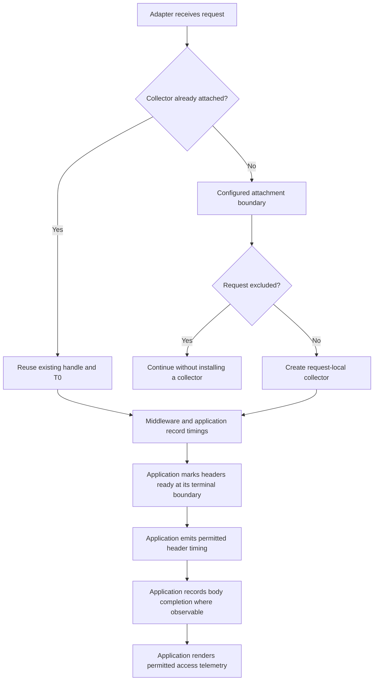
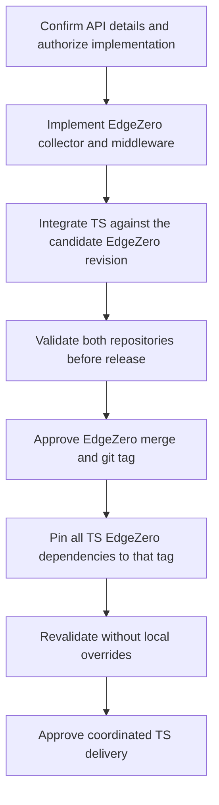

# Shared request timing collector and middleware

Date: 2026-09-28
Status: Design and API checkpoint approved on 2026-09-28. EdgeZero implemented, locally verified and independently reviewed; draft-PR publication authorized. TS migration and joint validation pending.
Scope: `edgezero-core` and coordinated Trusted Server adoption, shipped together.
Plan: [Implementation plan](../plans/2026-09-28-request-timing.md).

Implementation of both repositories and later draft-PR publication are authorized.
Independent EdgeZero reviews cleared; a focused commit, normal push and draft PR targeting main are authorized. TS remains unchanged during this publication stage.
Merge, release/tag, and final delivery still require separate approval.

## Why this change

Trusted Server PR [#1121](https://github.com/IABTechLab/trusted-server/pull/1121)
adds request-timing middleware in both its Cloudflare and Spin adapters. The two
implementations are identical. Aram's
[blocking review comment](https://github.com/IABTechLab/trusted-server/pull/1121#discussion_r4090027047)
asks for the generic collector and middleware to live in EdgeZero, while keeping
auction-specific state in Trusted Server. He also accepts an interim move of the
duplicated middleware into `trusted-server-core`.

This is a cross-repository API change, not just moving a struct. EdgeZero cannot
depend on Trusted Server, and replacing the collector must not reset the clock
used by auction diagnostics or change telemetry and header output.

Initial investigation used EdgeZero `567964158e4f8bd0d52321b9801de44966422e1b`,
locally tagged `v0.0.8`. Before creating the implementation worktree, local `main`
was fast-forwarded to fetched `origin/main` at
`98930917d96cb665c7255f36ca8bbd61fc7539e1`. The intervening changes leave the timing
integration points in core middleware, router, context, and Cargo dependencies
unchanged. The middleware guide changed and must be edited against this new base.

The Trusted Server reference is `f951955f537b89392dcb863fca7a01a5f6fa4846`; it pins
six EdgeZero workspace dependencies to `v0.0.7`. This remains the unchanged TS baseline. EdgeZero tasks 1–3 are implemented and
locally verified against the base above; see the plan for evidence and remaining gates.

## Approved decisions

1. Applications use typed phase enums. EdgeZero stores bounded indexed slots;
   Trusted Server's typed facade owns the enum-to-slot mapping. No string registry
   or new public phase trait is needed for the first release.
2. A small application-defined payload shares the collector's clock and mutex.
   Narrow synchronous update and snapshot operations preserve compound facts.
3. Install one concrete EdgeZero handle type in request extensions. Trusted Server
   adds domain methods through a facade over that same handle, not a second clock.
4. Keep `Server-Timing` rendering and exposure policy in Trusted Server for the
   first release. A generic renderer is out of scope.
5. Ship EdgeZero and Trusted Server adoption as one coordinated delivery. Do not
   perform a temporary Trusted Server-only middleware move.

## Goals

- Provide one portable per-request clock and a reusable collector in EdgeZero.
- Attach a fresh collector through shared middleware only when one is absent.
- Preserve existing application marks, compound updates, and consistent snapshots.
- Keep collection independent from exposing timings in headers, logs, or bodies.
- Let Trusted Server remove its duplicate middleware without changing its public
  diagnostic payloads or access-log schema.

## Non-goals

- Moving auction concepts, UUIDs, EC storage names, or Trusted Server privacy
  policy into EdgeZero.
- Moving the other duplicated Trusted Server middlewares in this change.
- Automatically instrumenting every adapter, route, or streamed body.
- Changing router dispatch, error rendering, macros, manifests, or extractors.
- Adding tracing export, dynamic metric registration, retries, or a public clock
  injection framework.
- Changing the browser's SSAT classification or comparing browser and server clocks.

## Ownership

| Concern | Owner after migration |
| --- | --- |
| Portable monotonic origin and cloneable request handle | EdgeZero |
| Bounded phase durations, saturating accumulation, drop-time spans | EdgeZero |
| Headers-ready and request-elapsed marks, response byte count | EdgeZero |
| Nonblocking collection and consistent snapshot mechanics | EdgeZero |
| Insert-if-absent middleware and configurable exclusion mechanism | EdgeZero |
| Eight-phase enum and mapping to generic storage | Trusted Server |
| Auction wait placement, UUID, dispatch/resolve/commit semantics | Trusted Server |
| `ts-*` header names, ordering, and existing serialization | Trusted Server |
| Header enablement, cache privacy checks, browser activation gates | Trusted Server |
| Where each adapter starts and finishes measurement | Application/adapter integration |

The reviewer also identifies `server_timing_value` as movable. The approved scope
keeps Trusted Server's renderer in place for the first extraction: its names and
header-bearing phase list are application policy. A generic renderer would add
validation and ordering contracts that are unnecessary for this migration.
Explain this narrower scope in the review response; do not claim that the whole
of the reviewer's suggested extraction moved upstream.

## Clock and lifecycle contract

T0 is the instant the request collector is created at its configured application
or adapter boundary. It is not browser `navigationStart`, socket acceptance, or
an assumed uniform platform ingress timestamp. Existing adapters start after
different amounts of prologue work. The migration preserves those boundaries.

Every clone, phase span, generic lifecycle mark, and application milestone must
refer to that same origin. Wrapping an existing handle must not allocate another
clock or an independent copy of its mutable state.



The diagram describes ownership, not a new automatic finalization pipeline.
Header rendering occurs at headers-ready; later body marks can appear only in
later snapshots such as access telemetry.

### Middleware behavior

The shared middleware is opt-in and attachment-only:

1. Preserve a collector of the configured concrete type if already present.
2. Otherwise evaluate the application's exclusion policy.
3. For an eligible request, create and insert a fresh collector.
4. Pass the context to `next.run` and preserve its result unchanged.

Default configuration excludes no paths. Trusted Server's Cloudflare and Spin
registrations configure an exact `/health` path exclusion for every method,
including requests with query strings on that path. Exclusion prevents
installation, not removal of a preinstalled collector. Duplicate middleware
installation must neither reset T0 nor erase recorded facts.

Preserve the existing adapter differences: Axum also excludes `/health` for every
method, while Fastly short-circuits only `GET /health` before collector creation.
Non-GET Fastly health requests continue through normal timing setup. Normalizing
that policy across adapters would be a separate behavior change.

Keep the exclusion API small. A static path list is sufficient for the current
Cloudflare/Spin consumers; a general predicate is an alternative only if a
concrete need emerges. Fastly keeps its existing method-aware entry-point check.
Neither collector nor application payload belongs in `RouterBuilder::with_state`:
that state is shared across requests and can overwrite same-type extensions.

Register the middleware before consumers that need timing. Trusted Server's
client-IP sanitization must remain first; extraction must not change that order.

### Boundaries the middleware cannot cover

EdgeZero matches a route before running middleware. Unmatched 404/405 requests
bypass it. `RouterService::oneshot` also renders dispatch errors outside the
middleware chain. Returning a response does not mean a streaming body has been
consumed or sent.

Consequently:

- Axum retains its outer terminal timing service and error-response coverage.
  For non-excluded requests, the proposed migration must retrieve the configured
  concrete handle if present, creating and inserting one only when absent. Both
  the handler and terminal renderer use that handle. This deliberately strengthens
  the current wrapper, which unconditionally replaces a preinstalled collector;
  it is not a claim about current behavior. The health bypass remains unchanged.
- Fastly retains its early collector creation, app-build span, header emission,
  streaming duration, and successfully written-byte accounting.
- Cloudflare and Spin adopt the shared attachment middleware without gaining
  `Server-Timing` emission incidentally.
- No middleware return or guard drop automatically stamps request completion.

A cancelled phase span can record work up to its drop. That is not evidence that
the request, response body, or auction completed. Panic-abort environments do not
guarantee destructor execution.

## Collector shape

The ownership and state arrangement below are approved. Exact Rust signatures and
the payload failure contract need the API checkpoint in the implementation plan.

Use a cloneable handle backed by one `Arc` and one mutex. The shared state holds
an immutable origin, generic lifecycle fields, a bounded phase array, and an
application-defined payload. A candidate name is
`RequestTimings<const N: usize, D = ()>`.

The payload lets Trusted Server keep auction definitions in its own crate while
sharing synchronization with the generic fields. For example, recording auction
wait currently updates both a phase total and its placement under one lock.
Snapshots read these together. Splitting them across two locks would change that
contract even if both collectors shared T0.

Generic operations should cover:

- Construction, elapsed time from T0, and cheap handle cloning.
- Saturating phase accumulation and a span that records elapsed time on drop.
- First-successful-write headers-ready and request-elapsed marks.
- Last-write response byte count.
- A consistent read of generic fields and application payload.
- A short synchronous update of a phase and application facts under the same lock.

Construction with `D::default()` is sufficient for middleware installation. Core
operations need not require every payload to implement `Default` or `Clone`.
Manual handle cloning must not accidentally impose `D: Clone`. Installed handles
must satisfy request-extension `Clone + Send + Sync + 'static` requirements;
middleware futures remain `?Send`.

Trusted Server can keep its existing domain methods behind a facade over the
concrete EdgeZero handle. Middleware and consumers must use the same extension
type. A facade that reads the generic handle is acceptable; a wrapper type that
expects an independently installed extension is not. The first API implementation
slice must include a compiled usage fixture of this boundary before adapter
migration begins.

### Phase representation alternatives

| Option | Benefits | Costs |
| --- | --- | --- |
| Application enum implementing an EdgeZero phase trait | Typed generic calls and application-owned names | Must define count, unique mapping, and invalid mappings |
| Fixed indexed slots, with an application enum facade | Preserves bounded storage and current TS mapping with a small API | Raw indices need bounds handling |
| String-keyed phases | Convenient arbitrary labels | Requires allocation, cardinality limits, duplicate and overflow policy |

Selected: fixed indexed slots inside EdgeZero, with typed phase enums at
application call sites. `N` is chosen at compile time, not from a request. Invalid
indices must be rejected without panicking or mutating state, and the caller must
be able to distinguish them from a successful write. Do not silently alias them
to another phase. The exact result type remains an API review decision.

### Synchronization and failure behavior

Preserve nonblocking `try_lock` behavior. A contended update drops the whole
sample; a contended read reports unavailable. Trusted Server maps unavailable
reads to its existing all-None snapshot or omitted header. Do not retry, block,
or substitute zero for missing facts.

Any application update callback must be synchronous, short, and non-reentrant.
It cannot retain a guard across an await or call a lock-taking collector method
from inside itself. One lock makes successful compound updates and snapshots
consistent; it does not provide rollback if a callback panics partway through.

The existing TS collector recovers poisoned locks because its state is simple
counters and optional facts. Arbitrary application payloads do not necessarily
have that property. Before accepting a public payload-update API, explicitly
choose its panic/poison contract. A candidate is documented best-effort recovery
with callbacks required to leave valid state even on unwind. An alternative is a
narrower mutation interface. Do not promise unconditional infallibility for
arbitrary user code, and do not change TS poison recovery without a deliberate
compatibility decision.

## Trusted Server compatibility requirements

These are migration acceptance criteria, not application features to add to EdgeZero.

| Existing behavior | Required outcome |
| --- | --- |
| Repeated phase durations | Saturating addition; missing differs from recorded zero |
| Headers-ready, completion, auction milestones and UUID | First successful write wins |
| Response bytes and auction placement | Last successful write wins |
| Auction wait | Accumulate duration and update placement in one operation |
| Snapshot durations | Whole milliseconds, truncated and saturated to `u32::MAX` |
| Header durations | One decimal place; existing names, order and omission rules |
| Header emission | Mark headers-ready even when emission is disabled; append rather than overwrite |
| Cache policy | Retain existing private/no-store predicate; never change cacheability |
| Browser timing payload | Preserve field names, activation gates and omitted-value behavior |
| Access telemetry | Preserve field names, nullability, UUID join key and placement encoding |

Auction UUID and dispatch marking remain independent. An attempted auction may
have an ID without a dispatch mark; an abandoned auction may have dispatch but no
resolution. Missing samples can also result from contention. Do not reinterpret
missing timing as proof that no auction occurred.

The page-bids path already omits diagnostics when the adapter collector is
missing. The initial-document path lacks the equivalent guard. Aram identified
that as a nonblocking
[follow-up](https://github.com/IABTechLab/trusted-server/pull/1121#discussion_r4090027050),
not a currently reachable production failure. Track it separately with an
initial-document missing-collector regression test; no browser classification
change is required by that finding.

## Delivery sequence



1. Resolve the implementation checkpoints below and review the linked plan before
   starting code changes.
2. Implement in small tested steps, starting with
   `crates/edgezero-core/src/request_timing.rs`, its declaration in `src/lib.rs`,
   and shared middleware in `src/middleware.rs`. Colocate tests. Add usage docs in
   `docs/guide/middleware.md`. Router changes are not expected.
3. Prepare Trusted Server adoption against the candidate EdgeZero revision using
   temporary exact git-revision pins after the reviewed EdgeZero draft PR is
   pushed. Pin all six TS dependencies to that same commit and verify one core
   package identity, without developer-specific paths. Replace collector mechanics
   and the Cloudflare/Spin middleware copies; preserve the TS domain facade and
   Fastly/Axum boundaries.
   Validate both repositories before considering the upstream release ready.
4. With separate publication approval, merge and tag EdgeZero through its normal
   git-tag process. Do not assume a tag number or promise crates.io publication;
   the inspected workspace has `publish = false`.
5. Update all six EdgeZero pins in TS `Cargo.toml` and review regenerated
   `Cargo.lock`, including changes since `v0.0.7` unrelated to timing. Remove local
   overrides and revalidate against the released tag before TS delivery.

Ship together means coordinated readiness and dependent releases, not simultaneous
Git operations across repositories. EdgeZero's tag must exist before the final TS
pin can resolve. Temporary exact pushed git-revision pins support joint PR
validation only; replace them with the approved release tag before final TS
delivery. Neither side is considered complete without verified TS adoption.
No intermediate TS-only middleware move, unrelated lock-helper cleanup, or other
adapter middleware extraction is included.

## Verification plan

### Collector contracts

Use deterministic durations and private test-only origin control where needed;
no public clock trait is required just for testing. Cover:

- Clone sharing, independent requests, and preservation of a pre-aged T0.
- Absent versus recorded-zero phases, accumulation, saturation and invalid slots.
- First-write marks, last-write byte counts, and explicit lifecycle completion.
- Compound phase/payload updates and consistent snapshots.
- Contention dropping a whole operation and poison behavior under the chosen contract.
- Span drop and cancellation without fabricated request completion.

### Middleware and consumer contracts

Exercise the real router interface with `futures::executor::block_on`. Verify
insert-if-absent, repeated installation, exact health exclusion, preinstalled
handles on excluded paths, ordering, short circuits, and unchanged errors.
Pin the documented unmatched-route boundary rather than implying blanket coverage.
Test GET and non-GET `/health`, with and without query strings, against each
adapter's preserved method policy. For Axum, attach a pre-aged collector in an
upstream service and prove that its origin and recorded phases survive both
handler access and private-response header rendering. This regression should
fail against the current unconditional replacement before that wrapper changes.

Before replacing TS mechanics, establish its existing output fixtures. Retain
private-header append/enable/cache tests, Axum terminal error coverage, Fastly
streaming byte counts, and both document and page-bids diagnostic gates. Prove
that a pre-aged collector yields nonzero pre-dispatch time without changing the
origin during extraction. Verify all four adapters still deliver the same handle
to their core consumers.

### Commands for implementation

EdgeZero:

```sh
cargo test -p edgezero-core
cargo test --workspace --all-targets
cargo fmt --all -- --check
cargo clippy --workspace --all-targets --all-features -- -D warnings
cargo check --workspace --all-targets --features "fastly cloudflare spin"
cargo check -p edgezero-adapter-spin --target wasm32-wasip2 --features spin
```

Also run the repository's adapter WASM CI matrix, including Fastly
`wasm32-wasip1` and Cloudflare `wasm32-unknown-unknown`, plus existing generated-app
and demo checks relevant to a public core API change. Compile checks do not prove
runtime clock behavior; distinguish native execution, WASM compilation, and any
platform clock smoke tests in the implementation report.

Trusted Server uses its target-matched `cargo test-fastly`, `cargo test-axum`,
`cargo test-cloudflare`, `cargo test-spin`, and `./scripts/test-cli.sh` commands.
Run `cargo fmt --all -- --check` and applicable adapter clippy aliases, including
WASM variants. Retain cross-adapter integration coverage and run JS/browser
regressions for auction diagnostics. Do not use bare workspace-wide Cargo tests
across its incompatible targets.

For the internal spec/plan, inspect links, Markdown structure, and the final diff.
`docs/superpowers/**` is excluded from both the published site and the normal docs
Prettier check, so a passing site check would not validate this document.

## Approved API checkpoint

The supervisor approved these exact contracts before production edits:

- `RequestTimings<const N: usize, D = ()>` holds one `Arc<Mutex<Inner<N,D>>>`.
  `with_data(D)` needs neither `Default` nor `Clone`; `new`/`Default` need
  `D: Default`. Manual handle cloning never needs `D: Clone`. Extension and
  middleware payloads need `D: Send + 'static`, not `D: Sync`.
- `TimingError::{InvalidSlot, Unavailable}` distinguishes invalid slots from
  contention. `record`, lifecycle marks and `set_resp_bytes` return
  `Result<(), TimingError>`; `elapsed` returns `Result<Duration, TimingError>`.
  Repeated first-write marks return `Ok(())` without replacing the value.
- `update_data(FnOnce(&mut D, Duration) -> R)` and
  `record_with(slot, duration, FnOnce(&mut D, Duration) -> R)` return
  `Result<R, TimingError>`. Duration is elapsed from the immutable origin.
  `record_with` validates its slot before acquiring the lock or invoking the
  callback, then accumulates the phase and invokes the callback under one lock.
- `snapshot(FnOnce(TimingSnapshot<'_, N, D>) -> R)` projects copied generic
  fields/current elapsed and borrowed `&D` under that same lock. Neither the
  borrowed payload nor the guard can escape; payload cloning is not required.
- Contention invokes no callback and changes no state. Callbacks are synchronous,
  short and non-reentrant. Panics propagate, may leave phase/payload partially
  changed, and poison the mutex. Poison recovery is best-effort, **not rollback**
  or payload validation; callbacks must preserve payload validity on unwind.
- `span(slot)` returns `Result<PhaseSpan<N,D>, TimingError>` after bounds
  validation. Drop attempts a best-effort record, discarding contention; it never
  marks request completion.
- `RequestTimingMiddleware<N,D>` defaults to no exclusions and offers
  `with_excluded_paths(&'static [&'static str])`. The TS facade reads exactly
  `RequestTimings<8, TsPayload>` from extensions rather than installing itself.

## Implementation checkpoints

The five design decisions above are settled. These details remain to be pinned
before the corresponding implementation step, not reopened as scope choices:

1. Specify update/read result types, invalid-slot handling, callback panic and
   poison behavior, and reentrancy restrictions. Recovering a poisoned mutex must
   not be described as rollback or validation of arbitrary payload state.
2. Compile a typed-phase, concrete-extension, domain-facade example against the
   first API slice. Prove shared T0 and atomic phase/payload snapshots before
   migrating adapters.
3. Record exact EdgeZero and TS revisions for joint validation. Choose a release
   tag only through the normal approved publication process.

If the API checkpoint requires a different state model or broadens the agreed
scope, return for a decision rather than implementing a silent redesign.

## Source references

EdgeZero files are relative to this repository at the revision named above:

- `crates/edgezero-core/src/middleware.rs`: `Middleware`, `Next`, `RequestLogger`.
- `crates/edgezero-core/src/router.rs`: route matching, state injection, and
  error-to-response conversion.
- `crates/edgezero-core/src/context.rs`: public request-extension access.
- `crates/edgezero-core/Cargo.toml`: existing `web-time` dependency.
- `.github/workflows/test.yml` and `.github/workflows/format.yml`: target matrices.

Trusted Server sources at the reviewed revision:

- [Collector and application rendering](https://github.com/IABTechLab/trusted-server/blob/f951955f537b89392dcb863fca7a01a5f6fa4846/crates/trusted-server-core/src/request_timing.rs).
- [Axum terminal timing service](https://github.com/IABTechLab/trusted-server/blob/f951955f537b89392dcb863fca7a01a5f6fa4846/crates/trusted-server-adapter-axum/src/timing.rs).
- [Fastly request and delivery boundaries](https://github.com/IABTechLab/trusted-server/blob/f951955f537b89392dcb863fca7a01a5f6fa4846/crates/trusted-server-adapter-fastly/src/main.rs).
- [Publisher diagnostics](https://github.com/IABTechLab/trusted-server/blob/f951955f537b89392dcb863fca7a01a5f6fa4846/crates/trusted-server-core/src/publisher.rs).
