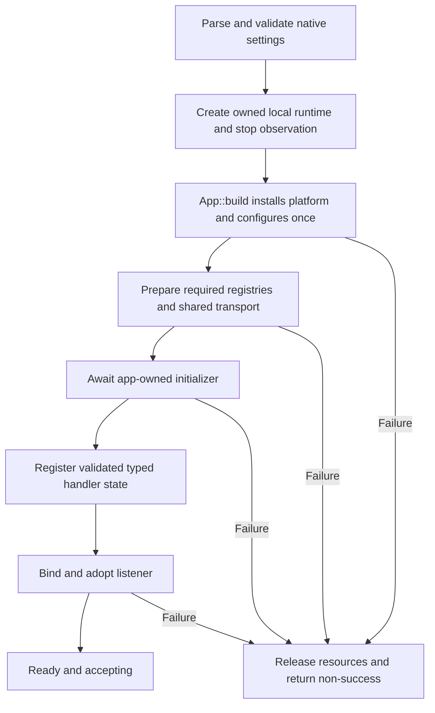
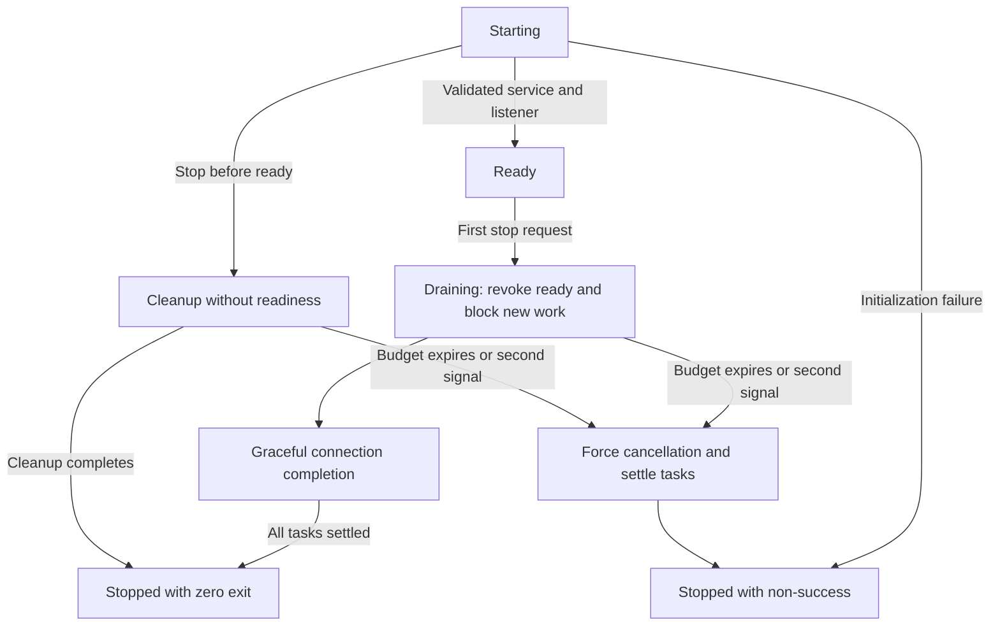

# Axum startup, storage, and bounded shutdown

Date: 2026-10-05
Status: initial implementation for review. The worktree implements the combined lifecycle and production-startup APIs below. Deployment guidance and the remaining acceptance checks are still open.

Issues: [#392 lifecycle](https://github.com/stackpop/edgezero/issues/392) and [#396 configuration/storage](https://github.com/stackpop/edgezero/issues/396), under [Epic #391](https://github.com/stackpop/edgezero/issues/391).

Base: [PR #275](https://github.com/stackpop/edgezero/pull/275), inspected at `5527b58e2a7cb6307d5c7a8926cd5dfc6f4f8b4a`.

Worktree: `/home/pav/worktrees/issue-392-396-production-hosting-spec`.

## Goal

A production Axum application validates its runtime settings and initializes required stores before accepting traffic. Applications with additional configuration/bootstrap requirements validate them through the initializer variant before readiness. Its handlers can reuse startup-loaded state. On shutdown, readiness is revoked, new work stops, and dispatched work gets one finite drain budget.

Preserve the existing permissive development entrypoint and local defaults. Strict production startup is an explicit API choice over the same runtime owner, service, and connection implementation. Do not infer production policy from release builds, containers, or the presence of path settings.

Keep #275's fallible app assembly, owned HTTP/1 connections, local non-Send execution, and response-egress semantics. This work extends that runner rather than introducing another HTTP server or portable lifecycle framework.

## Scope and ownership

| Owner       | Responsibility                                                                                                                                                                                                                   |
| ----------- | -------------------------------------------------------------------------------------------------------------------------------------------------------------------------------------------------------------------------------- |
| #392        | Native runtime ownership, signals/caller shutdown, lifecycle observation, dispatch gating, tracked draining, exit outcomes, and portable probe helpers                                                                           |
| #396        | Explicit strict production settings/store preparation, development compatibility, app-owned initializer, shared typed-config loading, startup-only typed state, persistence/permissions/backup evidence, and production adoption |
| Application | Required schemas, config keys, extra secrets, signing/bootstrap policy, registered handler state, probe paths, and optional ongoing dependency checks                                                                            |
| #395        | Residual outbound transport/wire acceptance; coordinate fallible transport startup here without building another client                                                                                                          |
| #398/#399   | Container packaging and native architecture validation; consume this runtime contract for later integration checks                                                                                                               |
| #397/#400   | Wider diagnostics/trusted-proxy work and deployment recipes, respectively                                                                                                                                                        |

No live reload, filesystem watcher, online backup service, new backup CLI, distributed storage, automatic migrations, retry framework, tracing vendor, health configuration section, management listener, or public EdgeZero application image is included. No blanket Send bounds are added to portable futures or bodies.

Trusted Server supplies concrete consumer requirements, but this spec does not implement its migration or certify its application image.

## Current implementation and evidence

All findings below are source inspection at the base above, not executed proof. Paths are repository-relative unless noted.

| Area                | Current behavior and source                                                                                                                                                                                                      |
| ------------------- | -------------------------------------------------------------------------------------------------------------------------------------------------------------------------------------------------------------------------------- |
| App assembly        | `crates/edgezero-core/src/app.rs`, `App::build` and `Hooks::configure`: install platform metadata and configure once. Configure receives no prepared native stores.                                                              |
| Standard entrypoint | `crates/edgezero-adapter-axum/src/dev_server.rs`, `run_app`: build app, resolve settings, bind, initialize stores, then serve. Generated main calls its no-argument form.                                                        |
| Local serving       | The same file, `serve_local`: current-thread runtime/LocalSet, detached local connection tasks, Ctrl-C or internal oneshot exit. No SIGTERM or tracked graceful-drain phase.                                                     |
| Connections         | `crates/edgezero-adapter-axum/src/connection.rs`, `serve_http1`: owned Hyper HTTP/1 keep-alive and response deadline enforcement. Extend this owner for draining.                                                                |
| Config files        | `crates/edgezero-adapter-axum/src/config_store.rs`, `from_path` and `local_path`: flat string-map snapshots, missing-file empty stores, ancestor/cwd discovery. The runner drops malformed bindings with warnings.               |
| KV identity         | `dev_server.rs`, `kv_store_path` and `build_kv_registry`: name-derived slug/hash basenames under `.edgezero`. Required declared KV failures are already fatal. Each id currently attempts its own open.                          |
| Documented aliases  | `docs/guide/kv.md:122`: ids with the same resolved platform name share a file. Per-id opens must be reconciled with this documented behavior.                                                                                    |
| Typed config        | `crates/edgezero-core/src/extractor.rs`, `AppConfig<C>` and `extract_from_handle`: bounded reads, envelope/integrity checks, secret resolution, schema validation, and redaction. This algorithm currently takes RequestContext. |
| Handler state       | `crates/edgezero-core/src/router.rs`, `RouterBuilder::with_state`: typed state copied into requests, same-type last-write-wins. `App` currently has no post-build state setter.                                                  |
| Outbound startup    | `crates/edgezero-adapter-axum/src/service.rs`, `AxumServiceState::from_app`: `try_transport().ok()` hides initialization failure; admitted requests subsequently fail.                                                           |
| Completion          | `response.rs` and `crates/edgezero-core/src/response_egress.rs`: HostHandoff is not client receipt. Pre-egress cancellation can abandon callbacks while releasing captured resources.                                            |
| Existing proof gap  | `key_value_store.rs`, `data_persists_across_reopens`, tests reopen in one process, not subprocess restart, competing-writer rejection, or backup/restore. Existing server tests do not prove signal-driven draining.             |

Trusted Server at `666953a0de0dbec514b0f0bd5a8b03074f13e62b` was also inspected. Its Fastly adapter loads settings into Arc<AppState> and captures that state in handlers, but its current entrypoint builds the app for each request. Native startup should retain loaded state for the native run, not assume Fastly cross-request retention.

## Agreed runtime settings

Use the existing `EDGEZERO__ADAPTER__*` convention. The table defines strict production options, not replacement defaults for the development runner.

| Setting                  | Contract                                                                                                                                                        |
| ------------------------ | --------------------------------------------------------------------------------------------------------------------------------------------------------------- |
| `HOST`                   | Omitted defaults to `127.0.0.1`. Supplied invalid values fail, rather than warn/fallback. Preserve current IP-literal support.                                  |
| `PORT`                   | Omitted defaults to `8787`. Supplied malformed/out-of-range/zero values fail. Containers supply explicit binding values.                                        |
| `CONFIG_DIR`             | Explicit absolute, existing directory when local config stores are declared in production.                                                                      |
| `DATA_DIR`               | Explicit absolute, existing writable directory when embedded KV stores are declared in production.                                                              |
| `SHUTDOWN_GRACE_SECONDS` | Omitted defaults to 10. Supplied values are positive integer seconds; invalid, zero, overflow, or unusable timer values fail startup. No silent clamp/fallback. |

Directory values are not required for undeclared store kinds. Validate supplied recognized settings instead of using invalid input as omission. Preserve native defaults for genuinely omitted optional settings. Do not add a global scanner for unrelated provider variables.

The production standalone entrypoint reads environment settings once into native options. Embedding accepts explicit options and does not silently merge ambient hosting settings. An embedding caller can deliberately use the environment-loading constructor. Store-name/key overrides belong to that selected configuration snapshot too; this does not remove the environment-backed secret backend.

Strictness includes recognized supplied native settings that previously fell back, such as logging level or declared-store name/key overrides. Keep shared EnvConfig fallback semantics unchanged for other adapters; perform strict native validation before using normalized values. Preserve `Hooks::owns_logging` and avoid installing a competing logger.

There is no new CLI flag or runtime configuration file for these settings. Preserve development bind warnings/fallbacks, local config discovery, missing-file empty stores, malformed-binding warnings/omission, and cwd-relative KV defaults. Declared KV initialization failure remains fatal. Explicit production options never use those fallbacks. The new shutdown duration has no legacy permissive behavior to preserve; a supplied invalid duration fails in either entrypoint.

The Axum CLI's existing development serve path keeps its permissive behavior. A wrapper launching a production entrypoint must pass supplied hosting settings through without replacing invalid input with defaults. Keep existing development wrapper normalization out of that production path; do not add a second CLI configuration policy.

## Startup and initialization

Proposed production ordering for the agreed invariant. Development uses the same lifecycle owner with its existing store/default policy and no additional initializer requirement:



No acceptance or Ready transition can precede successful initialization. Binding after validation avoids a misleading open port during production standalone startup. An existing embedding path with a prebound listener can preserve that listener, but still cannot accept or become Ready early.

Register standalone signals early enough to observe stop during initialization. Embedding supplies its stop source without installing process-wide handlers. A stop before Ready cancels cooperative initialization, releases prepared resources, and never enters Ready. Completed intentional stop exits zero. Initialization failure remains non-success. Cleanup uses the same shutdown budget; expiry or a second signal is forced stop.

Run startup and connection serving on the same owned current-thread runtime/LocalSet. The initializer and its future need not be Send. Do not capture them in the existing spawn_blocking bridge. This design is a blocking native runner; it does not add another public async hosting framework.

A supplied production initializer runs exactly once, after `App::build`/`Hooks::configure` and strict store preparation, before App is shared with connections. It receives mutable App and borrowed access to the same registry handles/bindings that requests will receive. It cannot turn failed declarations into absent bindings or replace prepared registries. Borrowed registry access does not make the underlying KV backend read-only; any app-owned bootstrap writes remain application policy.

The application explicitly selects every required typed blob/schema and additional required secret or startup invariant. Store metadata contains ids/defaults, not schemas or required-key lists. A successful callback is evidence that the app's selected checks passed, not proof that the framework discovered every application requirement.

Apps without application-specific startup requirements can use a production convenience entrypoint without an initializer argument. It still validates framework settings, declared stores, transport, and fallible app assembly before Ready. An explicit initializer variant adds app-selected blob/schema, secret, and bootstrap checks. A convenience entrypoint must not claim those application-specific checks occurred.

Preserve the existing no-argument development entrypoint. Newly generated no-store apps remain runnable without a source migration or explicit no-op callback; a generated config Rust type alone does not declare a mandatory stored blob. Ready means the selected entrypoint's startup contract completed, not that the framework discovered every application requirement. Production applications with additional requirements must select the initializer variant.

### Proposed native API shape

These sketches describe the boundary, not compiled APIs or final Rust lifetime ergonomics. Public names are proposed. Declarations are API outline notation, not implementation code.

```text
pub struct AxumRunOptions {
    // Validated bind, roots, shutdown duration and selected store overrides.
}

impl AxumRunOptions {
    pub fn from_env() -> anyhow::Result<Self>;
    // Explicit construction validates supplied native settings as well.
}

pub struct PreparedStores {
    // Private registry fields, None only for an undeclared/unattached kind.
}

impl PreparedStores {
    pub fn config(&self) -> Option<&ConfigRegistry>;
    pub fn kv(&self) -> Option<&KvRegistry>;
    pub fn secrets(&self) -> Option<&SecretRegistry>;
}

pub type LocalStartupFuture<'a> =
    Pin<Box<dyn Future<Output = Result<(), EdgeError>> + 'a>>;

// Existing development convenience API and permissive local defaults.
pub fn run_app<A: Hooks>() -> anyhow::Result<()>;

// Production convenience: strict environment options and SIGINT/Unix SIGTERM.
// Completes framework startup checks without claiming app-specific validation.
pub fn run_production_app<A: Hooks>() -> anyhow::Result<()>;

// Production standalone with additional app-owned initialization.
pub fn run_production_app_with_initializer<A, Initialize>(
    initialize: Initialize,
) -> anyhow::Result<()>
where
    A: Hooks,
    Initialize: for<'a> FnOnce(&'a mut App, &'a PreparedStores)
        -> LocalStartupFuture<'a>;

// Production embedding convenience: explicit options and caller-owned stop.
// Neither embedding variant installs global signal handlers.
pub fn run_app_with_options<A, Stop>(
    options: AxumRunOptions,
    stop: Stop,
) -> anyhow::Result<()>
where
    A: Hooks,
    Stop: Future<Output = ()>;

// Production embedding with additional app-owned initialization.
pub fn run_app_with_options_and_initializer<A, Initialize, Stop>(
    options: AxumRunOptions,
    stop: Stop,
    initialize: Initialize,
) -> anyhow::Result<()>
where
    A: Hooks,
    Stop: Future<Output = ()>,
    Initialize: for<'a> FnOnce(&'a mut App, &'a PreparedStores)
        -> LocalStartupFuture<'a>;
```

Caller-owned stop can use an existing oneshot/watch/notification future. No new portable shutdown-token framework is needed. The native owner handles stop idempotently; repeat caller requests do not shorten the budget. The standalone signal source separately observes the second signal for forced teardown.

These entrypoints are thin policy/initializer selections over one native runtime owner, not separate servers. Convenience variants supply an internal successful initializer; callers need not write a no-op. Retain the existing module location and existing development signatures unless an accepted prerequisite changes them.

Router-only AxumDevServer callers retain their configuration and handle-attachment conveniences over that same owner; do not require an unrelated initializer migration. Normalize bare handles into the existing registry representation before any selected initialization. Tests may keep a private prebound-listener entrypoint through that same owner.

## Shared typed-config loading and state retention

Expose a context-free entrypoint to the existing typed loader, proposed as:

```text
AppConfig<C>::from_binding(
    binding: &ConfigStoreBinding,
    key: Option<&str>,
    secrets: Option<&SecretRegistry>,
    limits: ConfigExtractionLimits,
    clock: MonotonicClock,
) -> Result<C, EdgeError>;
```

This is signature notation, not literal Rust syntax. Implement it as an async inherent method with the existing `C: DeserializeOwned + AppConfigMeta + Validate + Send + 'static` bounds. A missing explicit key uses the binding's resolved default key. The app chooses default or named bindings; do not apply one guessed type to all declared stores.

Factor only the RequestContext dependencies out of `extract_from_handle` and secret traversal. Request extraction and startup then share one parser, budget, envelope/version/hash checks, secret walk, optional-secret behavior, validation, and redacted error mapping. No fake request, route dispatch, second parser, operator TOML loader, or implicit cache is involved.

Existing extraction limits apply per selected blob and its referenced secrets. They are not a deadline for the entire initializer or arbitrary signing/bootstrap work. They also do not bound the initial allocation of the outer local-file map. Do not add a separate startup-timeout setting or new numerical file-size policy in this slice. Operator-supplied files are trusted deployment inputs, and the supervisor owns the ultimate startup/stop bound.

Add an explicit post-build method, proposed as:

```text
App::insert_state<T>(&mut self, value: T)
where
    T: Clone + Send + Sync + 'static;
```

It uses the existing router state-extension mechanism. Same-type insertion replaces earlier state, including builder-registered state, for this App. Typical usage registers Arc<AppState> and handlers extract State<Arc<AppState>>.

A router shared with another App must not be mutated globally. Use copy-on-write/forked router internals for state insertion; clone existing handler/middleware references and retain route metadata and matching behavior. Do not rebuild the app/routes, require Arc uniqueness, introduce a second state overlay with competing precedence, or use a global/deferred cell. Prove shared-router isolation in a test.

State insertion is a startup operation and must finish before ingress admission or serving begins. Existing resolved-dispatch/admission tokens retain the prior router owner; copy-on-write insertion invalidates those tokens for the modified App. Do not promise that outstanding tokens survive insertion or introduce a new route-owner identity model. Document this boundary and test that a pre-insertion token is rejected while requests admitted after insertion dispatch normally. This API is not live state replacement.

A non-Send initializer does not relax the existing Clone/Send/Sync bounds on registered handler state. Applications own state contents and any intentional interior mutability. Retention is explicit; ordinary AppConfig request extraction does not become a cache automatically.

## Store and filesystem contract

The requirements below define strict production preparation. Development retains its current local config discovery, empty/malformed binding policy, and cwd-relative data paths. File identities, alias handling, ownership limitations, snapshots, and safe recovery guidance apply in both paths.

### Config

- Read `<CONFIG_DIR>/local-config-<logical-id>.json`, retaining the existing flat string-to-string format and logical-id identity.
- Every declared file must exist, be readable, and parse successfully. No empty fallback or dropped binding.
- Permit symlinks used by projected ConfigMap/Secret mounts. The opened target must be a readable regular file. Operator-supplied roots are trusted; no generic filesystem sandbox or source-tree containment restriction is added.
- A valid outer map is not proof of a valid typed blob or required secrets. Those checks belong to the initializer.
- Config stores remain startup snapshots. Updates require process restart; no watcher/reload path.

### KV

- Read/create `<DATA_DIR>/kv-<slug>-<hash>.redb`, preserving the existing basename derived from the resolved platform NAME. Config filenames still use logical ids.
- The root must already exist and be writable. The runner may create a new database file inside it, but must not fabricate a missing mount/root directory.
- Resolve aliases before opening: two logical ids with the same resolved NAME share one database handle and keyspace in this process. Different names select different files. Do not change file identity or silently move existing data.
- The same key through either alias refers to the same value. Alias ids are not isolated namespaces. Shared handles do not change operation guarantees or make the documented read-modify-write helper atomic.
- redb remains one owning process per database. A second process fails rather than silently sharing. Shared volumes do not establish multi-writer or multi-replica safety.
- Keep runner-owned handles alive until connection tasks settle, then relinquish them on completed startup failure, orderly stop, or cooperative forced cleanup. A database lock is released only when the last handle owner drops it. Embedding callers may retain an attached handle, and initializers may clone one outside the App; those owners must release their handles before reopening or backing up the database. The runner does not revoke caller-owned handles.

### Permissions, updates, and recovery

Operators provision roots, ownership, and permissions for the runtime UID, including the Docker recipe's numeric UID. Config may be read-only; data must support real database writes. No startup chown, chmod 777, automatic lock repair, database deletion, or corruption recovery is added.

Externally supplied secret updates use process restart. The existing environment-backed secret backend remains unchanged; this is not a new secret reload/rotation system.

Initial backup support is a documented stopped-writer procedure: stop the writer, release every database handle including caller-owned clones, copy the closed database, restore into a prepared directory with correct permissions, reopen, and read stored values back. Returning from an embedded runner alone does not prove the database is closed. Online copying of an active database is not a supported backup claim. Remove ordinary recovery advice that recommends deleting production databases for lock errors or capacity maintenance; do not invent a maintenance subsystem.

The storage guide must include these operational limits and procedures:

- TTL expiry is lazy. Reads and paginated listing clean up encountered expired entries; unvisited expired entries can remain. An application-owned maintenance pass can traverse the existing paginated listing API through the owning process, following cursors to exhaustion even when a page is empty. There is no automatic sweeper or new maintenance CLI.
- Deletes and expiry cleanup do not automatically shrink the database file. Monitor database size and available mount capacity, provision headroom for writes and backups, and do not treat TTL as a disk quota. This slice does not expose or certify compaction; unsupported file shrinking must be stated explicitly.
- For lock conflicts, identify and stop the other owning process or release retained embedding handles before retrying. Do not remove the database or bypass its lock. Prevent overlapping writers during restart/rollout.
- For capacity exhaustion, stop the writer if needed, preserve the database, and restore usable capacity by enlarging the mount or removing unrelated disposable files. Reopen and verify stored values once capacity is available; backup/restore copying alone is not a compaction procedure.
- For suspected corruption, stop all owners, preserve the damaged file for investigation, and restore a known-good stopped-writer backup into a prepared directory. Verify stored values before resuming traffic. Automated repair and untested salvage procedures remain unsupported.

## Lifecycle, shutdown, and results

One native owner controls Starting, Ready, Draining, and Stopped. Acceptance and phase observation derive from that owner, not separately maintained booleans or response reports. A run never returns to Ready after draining begins.



Standalone SIGINT and Unix SIGTERM feed the same first-stop transition. Registration failure is a startup error. A second termination signal of either kind requests immediate forced teardown. Embedding has no implicit global handlers.

On first stop:

1. Revoke readiness and stop accepting new connections.
2. Gate new request dispatch on existing keep-alive connections too. Define existing work at the service-dispatch boundary, not merely an accepted socket or queued pipelined bytes.
3. Ask owned Hyper connections to stop keep-alive/new work and finish dispatched requests. Close idle connections promptly.
4. Keep polling tracked local tasks and request/response work until completion or the single process drain deadline.
5. On expiry or second signal, cancel remaining work and settle its task ownership before returning.

Use native monotonic runtime time for the process budget. Do not depend on an application's injected request clock for supervisor termination. Earlier accepted request/response deadlines still win. Long-lived/SSE responses share the shutdown budget; this does not impose a new ordinary stream-lifetime or handler deadline.

Collect connection task results instead of detaching them. Preserve ordinary connection-scoped failure/disconnect behavior. Terminal listener/runtime/runner failures revoke readiness and return non-success; do not add a general restart/retry policy here.

Completed graceful drain or completed intentional stop during startup exits zero. Startup failure, runner failure, grace exhaustion, and signal-requested forced teardown report non-success. Retain enough internal outcome distinction for focused tests and safe diagnostics, without introducing a detailed numeric exit-code taxonomy.

The budget is cooperative. Synchronous startup code, blocking handlers, callbacks, destructors, or a stalled runtime can prevent timer/cancellation progress. The process supervisor supplies the final hard-kill boundary. Deployment examples must set a longer supervisor interval, such as 30 seconds for a 20-second drain, rather than rely on Docker's default timeout.

Preserve #275 completion semantics. HostHandoff does not prove client receipt. Dropping unfinished egress uses its existing terminal outcome. Pre-egress cancellation may release captured resources without a completion callback/report. Do not promise a terminal report for every accepted request, SIGKILL, or process abort; connection ownership determines drain completion.

## App-owned probe routes

Add a small portable `edgezero_core::probe` module with:

- A Starting/Ready/Draining/Stopped observation enum.
- A cloneable read-only live reader, following the existing MonotonicClock Arc/callback pattern.
- Ordinary `#[action]` handlers for readiness and liveness.

The native runner publishes its reader through existing request extensions. Core contains no lifecycle writer, shutdown token, listener, task, timer, Axum/Tokio dependency, new action capability, or portable async Hooks method. Other adapters initially publish no native lifecycle observation.

Handlers read the current phase when executed, not a copied admission-time snapshot.

| Observed phase        | Readiness                    | Liveness                     |
| --------------------- | ---------------------------- | ---------------------------- |
| Starting              | 503                          | 200                          |
| Ready                 | 200                          | 200                          |
| Draining              | 503                          | 200                          |
| Stopped               | 503                          | 503                          |
| Missing/unknown state | 503, probe state unavailable | 503, probe state unavailable |

Use short non-sensitive text, plain-text content type, and Cache-Control: no-store. Missing state must not invent healthy behavior or lifecycle support on a provider. Apps can retain an independent portable health handler when that is their desired policy. Ready reflects the selected runner's contract: development readiness is not strict production validation, and production convenience readiness does not imply application-specific initialization. Native readiness does not periodically revalidate dependencies. Applications can add ongoing checks; the framework does not poll upstreams or trigger automatic outage restarts.

Applications bind helpers through ordinary Rust or manifest routes. No automatic paths, reserved namespace, health flag, health config section, path environment variable, management listener, or admission exemption. Existing middleware/auth remains application-owned. Do not replace framework-owned probe/store metadata through app state or middleware; the native dispatch gate must use its private owner rather than an overrideable request extension.

There is no reachable-probe guarantee before startup acceptance or after listener withdrawal. The response table describes a helper that executes. During drain, a previously dispatched probe can observe Draining; a newly attempted request may receive refusal/reset/EOF instead of 503. No successful readiness response means not ready. Supervisor liveness policy must account for intentional listener shutdown.

Trusted Server already owns `/health`. Its Axum handler returns 200 on a successfully built router, while startup fallback returns errors even for `/health`. Fastly answers `/health` before app construction, so that route is liveness rather than readiness. Keep those downstream routes application-owned. Generated EdgeZero root/introspection paths are editable trigger rows, not reserved paths; the old automatic `/__edgezero/routes` mechanism was removed.

## Failure diagnostics

Startup failures identify the stage, recognized setting/logical store id, and safe failure category. Never print config content, resolved secrets, raw invalid settings, parser input fragments, or callback/provider source strings. A malformed config must not leak through a serde error wrapped in an ordinary log or anyhow termination chain.

Return safe classified errors at the standard runner boundary. Do not retain an unredacted source chain where ordinary main termination/debug formatting will print it. Broader permitted internal diagnostics belong to #397; this spec does not add a logging framework or debug disclosure switch.

Use the existing public HTTP error contract for request failures. Probe bodies contain no app configuration or infrastructure details. Preserve custom application logger ownership. These guarantees apply to framework-owned error conversion/logging; arbitrary app logging and panic payloads remain application responsibilities.

## Compatibility and entrypoint migration

Preserve #396's permissive development requirement and the existing no-argument `run_app` signature. This review decision supersedes the earlier interview's strict-everywhere and mandatory-initializer policies. No GitHub issue amendment is needed.

Inventory Axum main templates, app-demo's native entrypoint, CLI demo runner, AxumDevServer/test embedding callers, and downstream consumers. Do not migrate development callers merely to make them pass a no-op initializer. Add production adoption examples that select the strict convenience entrypoint or, for application-required checks, its initializer variant. Both use the existing server implementation. Document their different readiness guarantees and any prerequisite-driven source migration.

Generated no-store apps retain their runnable development entrypoint. Show the explicit production entrypoint choice and how required stored config adds typed loading and state registration. Container recipes under #398 must select that production contract rather than certify a permissive development binary from a passing HTTP probe. Do not add schema inference, a new app! keyword, optional-store policy machinery, or a native dependency in the shared app crate.

The native CLI's serve/push/provision recipes retain local preparation and path conventions. Production adoption documentation supplies explicit absolute roots; development does not acquire a mandatory-root requirement. `config push` retains its current project-local output convention. No automatic production push/deployment mechanism is added.

Post-build state registration remains portable and preserves router state semantics. The context-free config helper preserves all existing request-extraction outcomes on native/WASM targets. Coordinate #379's retained-provider-app work where APIs overlap, without making it a required native hosting dependency or assuming retained provider apps imply process readiness.

## Originally proposed PR split

The original plan below separated the issue boundaries. This worktree delivers the shared runtime and startup/storage changes together in one PR stacked on #275, not old main. The issue ownership and acceptance boundaries still apply.

1. **#392 lifecycle PR, first on #275.** Establish the single local runtime owner, explicit initialization barrier, caller/signal stop handling, tracked connections, dispatch gating, drain/result behavior, and core probe observation/helpers. Its initialization barrier can accept a local future without knowing application schemas. Do not claim strict config/value certification before #396 integrates.
2. **#396 startup/storage PR, stacked on #392.** Supply explicit strict production preparation and optional app initialization to that barrier; implement root/settings validation, alias handle reuse, shared typed loader, startup-only post-build state, production adoption examples, development compatibility, and persistence/permissions/backup checks.
3. **Integrated acceptance on the second PR.** Exercise failed initialization, phase transitions, signals, pending handlers/streams, durable restart, mounted permissions, and probe wiring against the combined series. Close overlapping issue acceptance only with that evidence.

These are behavioral review boundaries, not permission for two independent agents to rewrite the same runner concurrently. Preserve existing development signatures and keep any prerequisite-required caller changes at a coherent boundary. Add production entrypoints and real required-config initialization under #396 without forcing a development migration. Do not leave a broken intermediate commit or invent a compatibility server.

#393/#394/#395/#397 then add only residual work/evidence against the accepted foundation. #398/#399 can prepare packaging independently; final container production checks consume the integrated result. #400 documents proven behavior.

## Likely affected files

- `crates/edgezero-adapter-axum/src/dev_server.rs`, `connection.rs`, `service.rs`, `config_store.rs`, and `key_value_store.rs`, with colocated tests.
- `crates/edgezero-adapter-axum/src/cli.rs` and its native main template where needed to preserve development behavior and document explicit production adoption. Strict launch wrappers must not normalize invalid production inputs.
- `crates/edgezero-core/src/app.rs`, `router.rs`, and `extractor.rs` for state registration and shared typed loading; new `probe.rs` plus exports in `lib.rs`.
- CLI demo runner, root README/core-config templates where preparation guidance is stale, generated-project tests, and app-demo's Axum main.
- Axum/config/KV guides and small native/portable fixtures needed for the acceptance checks. Do not pull Trusted Server sources or operator configs into framework fixtures.

Keep this list bounded. No general generator/dependency resolver, provider lifecycle, portable body, or distributed store rewrite is implied.

## Acceptance and planned validation

The table below is the full acceptance plan, not a claim that every item is complete. The initial implementation has passed workspace tests, strict workspace Clippy, formatting, the Fastly/Cloudflare/Spin feature check, and the Spin WASM compilation check. The Axum all-features suite also passed all 13 subprocess hosting tests, including signals, finite drain, forced cancellation, startup failures, embedding, persistence, aliasing, stopped-writer backup/restore, and read-only config permissions.

Before choosing implementation changes, re-audit the accepted #275 integration revision and record its exact commit, existing contracts/tests reused, checks already covered, and residual implementation/evidence needed for each issue. Repeat the inventory if prerequisite contracts change. The draft-head source inspection above is not this acceptance gate or executed production proof.

| Owner | Focused evidence required                                                                                                                                                                                                                                                                                                                                                                                                                              |
| ----- | ------------------------------------------------------------------------------------------------------------------------------------------------------------------------------------------------------------------------------------------------------------------------------------------------------------------------------------------------------------------------------------------------------------------------------------------------------ |
| Both  | Accepted-#275 revision and covered/residual inventory are recorded; add only residual changes and missing acceptance evidence.                                                                                                                                                                                                                                                                                                                         |
| #392  | Subprocess SIGINT and Unix SIGTERM each cause graceful stop; second signal forces non-success. Embedding stop installs no global handlers.                                                                                                                                                                                                                                                                                                             |
| #392  | In a running subprocess, dispatch a delayed finite response before sending process-wide SIGTERM; observe readiness withdrawal, full response completion, and zero exit. Repeat SIGTERM with a never-ending handler and open-ended stream to prove forced non-zero exit within the configured cooperative budget. Reuse these scenarios for final-image integration; separate signal and unit drain tests do not replace them.                          |
| Both  | Production subprocess failures cover an occupied bind port, explicit initializer failure, invalid recognized settings, missing roots/declared config files, unreadable/non-regular/malformed config, and unusable/locked KV data. Each exits non-zero without Ready or request acceptance and identifies a safe stage/setting or logical id/category; sentinel values and unredacted source chains never appear in ordinary stdout/stderr diagnostics. |
| #392  | Never Ready during startup/failure; startup stop never accepts; Ready only after successful barrier and listener setup; drain revokes it immediately.                                                                                                                                                                                                                                                                                                  |
| #392  | Delayed dispatched work finishes; idle keep-alive closes; new keep-alive/pipelined work does not dispatch after drain.                                                                                                                                                                                                                                                                                                                                 |
| #392  | Never-ending handler/stream and zero-read peer reach controlled forced teardown within the configured cooperative budget. No detached work remains when the runner returns.                                                                                                                                                                                                                                                                            |
| #392  | One budget is not restarted by repeat programmatic stop. Existing earlier response deadlines/outcomes remain intact.                                                                                                                                                                                                                                                                                                                                   |
| #392  | Probe helpers cover every phase and missing state through ordinary router dispatch, preserve app route ownership, and observe a live transition rather than a stale snapshot. New drain probes need not reach HTTP.                                                                                                                                                                                                                                    |
| #396  | Production entrypoints reject invalid supplied host/port/logging/known overrides/duration without normalization into defaults. Omitted bind/duration values use documented defaults. Production launch wrappers preserve this behavior.                                                                                                                                                                                                                |
| #396  | Existing development entrypoints remain runnable without new root settings or initializer arguments. Preserve missing-config empty stores, malformed-binding warning/omission, local path discovery/cwd defaults, existing bind fallbacks, and fatal declared KV failures. Diagnostics remain redacted. Selecting production explicitly enforces strict checks regardless of cwd or build profile.                                                     |
| #396  | A standalone release subprocess using the production entrypoint starts from unrelated cwd with only explicit roots; missing roots, unreadable/non-regular/malformed config, and unusable/locked data fail before acceptance.                                                                                                                                                                                                                           |
| #396  | Valid flat map containing malformed/missing required typed blob, integrity failure, invalid required fields, or missing referenced secret fails the initializer before Ready. Sentinel values never appear in ordinary logs/returned diagnostics.                                                                                                                                                                                                      |
| #396  | A supplied initializer runs once with exactly the bindings attached to requests. Production convenience entrypoints require no callback but still enforce framework checks and never claim app-specific validation. Native production option construction does not silently merge environment settings.                                                                                                                                                |
| #396  | Shared typed loader and request extraction agree on default KEY overrides, named stores/secrets, optional secrets, redaction, byte/structure/deadline limits, and existing error categories.                                                                                                                                                                                                                                                           |
| #396  | Startup-registered Arc state reaches multiple requests; last same-type insertion wins; another App sharing the original router retains its own state. Pre-insertion resolved/admission tokens are rejected for the changed App, while tokens created after insertion dispatch normally.                                                                                                                                                                |
| #396  | Distinct names stay distinct; same-name aliases share one handle/keyspace; fresh database in prepared root works; second process cannot own the same file.                                                                                                                                                                                                                                                                                             |
| #396  | Value survives actual process stop/restart; stopped-writer backup restores readable values; runtime UID works with read-only config and writable data; startup never changes root ownership or deletes locked files. An embedding owner retaining a handle keeps the file locked after runner return; dropping the last owner permits reopening.                                                                                                       |
| #396  | Storage guidance covers lazy expiry, paginated cleanup, non-shrinking files, capacity monitoring/headroom, safe lock/capacity/corruption recovery, and unsupported compaction/repair. Backup instructions require all handle owners to release the database.                                                                                                                                                                                           |
| #396  | Config snapshot stays unchanged after file update until restart. Document restart-based secret deployment updates without unsafe process-environment mutation tests.                                                                                                                                                                                                                                                                                   |
| Both  | Non-Send local initializer fixture compiles/runs; same shared probe/typed-state handlers compile for supported WASM targets without native dependencies.                                                                                                                                                                                                                                                                                               |

Tests use disposable data, bounded waits, explicit cleanup, and no platform credentials. Ordinary unit/compile tests do not require Docker or external services. Signal/filesystem subprocess tests use local fixtures. UID/container evidence can reuse #398's opt-in runner after integration with its template PR; unavailable Docker/architecture evidence remains a reported gap.

At implementation checkpoints, use the repository's required checks:

```sh
cargo test -p edgezero-core --all-targets
cargo test -p edgezero-adapter-axum --all-targets --all-features
cargo test -p edgezero-cli --all-targets
cargo test --workspace --all-targets
cargo fmt --all -- --check
cargo clippy --workspace --all-targets --all-features -- -D warnings
cargo check --workspace --all-targets --features "fastly cloudflare spin"
cargo check -p edgezero-adapter-spin --target wasm32-wasip2 --features spin
cargo test -p edgezero-cli --test generated_project_builds -- --ignored
```

Also run docs lint/format/build and the existing example/provider gates relevant to changed callers. Installed-target or container gaps must be disclosed, not presented as passes. Existing Fastly/Cloudflare/Spin gates must stay green. Container UID, standalone release, unreadable/unusable mount, retained-handle lock, and production-guide acceptance remain open. The accepted-prerequisite re-audit must also be repeated after #275 merges.

## Risks and review checks

- Compile the proposed higher-ranked initializer signature with borrowed inputs and Rc-capturing non-Send futures before committing to its ergonomics. No runtime ownership workaround may add blanket Send bounds.
- Verify copy-on-write router state insertion against the locked matchit/http types and existing Clone/Send/Sync state bounds. No uniqueness assumption or cross-App mutation is acceptable.
- Production strictness is opt-in. Preserve existing development signatures, fallbacks, and data filenames. Make production adoption and readiness guarantees explicit; do not silently certify a development binary or force unrelated callers to migrate.
- App-owned initialization/state can execute arbitrary code. Cooperative cancellation does not bound blocking code/destructors or prevent unsafe app overrides of request metadata. The supervisor and trusted app-composition contract remain explicit.
- Existing typed limits do not prove startup-file or whole-process memory bounds. This spec adds no concurrency/handler-deadline policy and does not relabel BestEffort/Unsupported guarantees from #275.
- A successfully sampled readiness response does not promise the server remains ready through transmission or prove client receipt.

Read-only audits and alternative proposals were used for lifecycle, configuration, native startup API, and probe portability. Their useful findings are incorporated above. Rejected alternatives were a second server, inferred environment modes, native dependencies in shared probe handlers, a portable async startup hook, synthetic request validation, implicit settings caches, per-id path machinery, and immediate-stop-only hosting. This review preserves permissive development and makes strict production an explicit entrypoint choice, superseding the earlier strict-everywhere and mandatory-no-op proposals.

## Review boundary

The interview's policy decisions and subsequent review revisions are recorded here. The initial source and test implementation covers development compatibility, optional application initialization, startup-only state insertion, explicit embedding options, restart-based config updates, and the native lifecycle owner. API and behavioral review remain necessary before merge.

The implementation is based on #275 at `5527b58e2a7cb6307d5c7a8926cd5dfc6f4f8b4a`. Its branch has since advanced to `dfd439c613af4f6ed295e71c032881b15bf7247c`, including overlapping Axum preflight and logging changes. Integration with that newer prerequisite and its accepted-revision re-audit remain open. This work does not certify a deployment or published container image, and it does not complete all acceptance criteria for #392 or #396.
