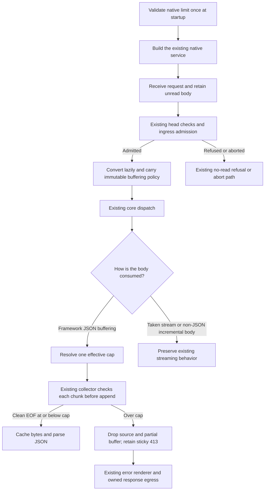

# Axum configurable buffered JSON request-body limits

Date: 2026-10-06
Status: provisional implementation present on the user-approved current hosting base. Native wire, workspace, and WASM checks have passed; execution evidence is recorded in the implementation plan. Accepted #275 integration and re-audit are deferred until the later rebase.

Issue: [#393](https://github.com/stackpop/edgezero/issues/393), under [Epic #391](https://github.com/stackpop/edgezero/issues/391).

Prerequisite: [PR #275](https://github.com/stackpop/edgezero/pull/275). Its accepted ingress/body contracts remain authoritative.

Stacked base: `issue-392-396-production-hosting-spec` at `3ab22096fd117f7506cf437b5ba128e0789e059c`. This includes the initial #392/#396 implementation and the #275 integration revision recorded in its [startup/lifecycle spec](2026-10-05-axum-production-startup-lifecycle-design.md). It is not the latest or accepted #275 head.

Worktree: `/home/pav/worktrees/issue-393-buffered-body-limit-spec`.

The ceiling, default, zero/disable behavior, buffered-read coverage, native configuration interface, and Axum-scoped error behavior below are agreed. All five policy questions are resolved. On 2026-10-06, the user approved the body-owned metadata carrier, making public `Body` non-exhaustive, and the bounded shared-body consumer migration. Final plan review then completed without verified findings. The user explicitly authorized implementation on the current hosting base without waiting for #275 acceptance or integration, with a later rebase. The [implementation plan](../plans/2026-10-06-axum-buffered-json-body-limit.md) records the work and remaining integration checks.

## Goal and invariant

The standard Axum service uses a configurable **2 MiB default, exactly 2,097,152 bytes**, for framework-managed buffered JSON request bodies. Collection checks actual incoming bytes before retaining them. Exactly-at-limit valid JSON succeeds; a body one byte over the effective limit produces HTTP 413 through the real service path.

Keep request conversion lazy, retain admission-before-read ordering, and reuse the existing bounded collector, body cache, poison state, and response lifecycle. A rejected or interrupted drain stops consuming its source and releases read-owned resources. This does not promise client receipt of the error response or cancellation of arbitrary handler work.

The default aligns with [Axum's buffering-extractor default](https://docs.rs/axum/0.8.9/axum/extract/struct.DefaultBodyLimit.html). The issue records the exact value from [axum-core request extensions](https://docs.rs/axum-core/0.5.6/src/axum_core/ext_traits/request.rs.html). It is not derived from provider quotas or workload measurements.

## Agreed decisions

- The native setting is a hard ceiling for framework-managed JSON buffering, not merely an extractor default. Explicit application caps may be tighter but cannot exceed it.
- The default is 2 MiB, exactly 2,097,152 bytes, based on Axum's established buffering-extractor default rather than application workload measurements.
- Use the same default in development and production. A valid explicit configuration replaces it.
- Require a positive value. Reject zero and expose no unlimited/disable sentinel.
- JSON helpers/extractors enforce the ceiling regardless of Content-Type. Generic framework buffered reads also enforce it for ingress `application/json` and `application/*+json` bodies.
- Untouched bodies consumed as streams gain no new total-size restriction, including JSON streams. This setting does not change other adapters' existing defaults or introduce new content-type rejection rules.
- Add no concurrency or timeout defaults in this issue. Existing admitted deadlines remain unchanged.
- Configure standalone hosting with `EDGEZERO__ADAPTER__JSON_BODY_LIMIT_BYTES`; use `with_json_body_limit_bytes` on `AxumRunOptions` and `AxumDevServer` for explicit configuration.
- Read the standalone environment setting once at startup. Explicit embedding options never silently merge ambient settings. Invalid supplied values fail startup in development and production.
- Add no manifest section or CLI flag for this setting.

- Keep new HTTP 413 behavior scoped to Axum-managed buffered JSON reads. Malformed JSON remains 400; other adapters retain their existing overflow behavior. Add the minimal typed error and body-owned core policy carrier required by the reconstruction contract, with only the approved shared-body compatibility edits. No cross-provider overflow-status migration or error-message matching is included.
- Make public `Body` `#[non_exhaustive]` while retaining its existing plain variants and adding an opaque metadata carrier. Expose an exhaustive buffered-or-streamed `BodyContent` view through `Body::into_content` for transport code. Core remains responsible for mapping every `Body` variant to that view.

These decisions were confirmed during spec discussion on 2026-10-06. Final internal API details must follow the reviewed prerequisite baseline.

## Scope and ownership

| Owner                            | Responsibility                                                                                                                                                          |
| -------------------------------- | ----------------------------------------------------------------------------------------------------------------------------------------------------------------------- |
| Axum adapter                     | Native option parsing/validation, selecting the per-run JSON buffering policy, attaching it before dispatch, standard service-path acceptance, and native documentation |
| Portable core                   | Body-owned buffering policy, non-exhaustive `Body`, exhaustive `BodyContent`, and typed oversized-request error integration with the existing collector/cache and error renderer |
| Shared transport consumers       | Compatibility with the approved content view only; no Axum policy enforcement in other providers, outbound transport, fallback discard, or response egress |
| Application                      | Tighter explicit extractor limits, routes/middleware, admission decisions, handler allocations, and any deliberate manual buffering after taking a stream               |
| #275                             | Admission, body ownership, absolute read deadlines, sticky poison, response completion, and platform capability distinctions                                            |
| #392/#396                        | Runtime ownership, startup validation/readiness, stop handling, and explicit production versus permissive development entrypoints                                       |
| #394                             | Streaming transport and backpressure                                                                                                                                    |

This issue adds no concurrency ceiling, queue, stream-size limit, stream-lifetime limit, body idle timeout, total upload deadline, handler deadline, overload framework, or general cancellation policy. Existing admitted read deadlines remain intact; this work neither removes them nor chooses new values.

Do not add Tokio dependencies or blanket Send bounds to core. Do not rebuild the retired eager prebuffer, introduce another HTTP server, or add a second independent collector.

## Baseline audit

The following historical audit is source inspection at the stacked base, not executed proof. Implementation proceeded on that base by explicit user direction. Repeat this audit against the accepted prerequisite/integration revision after rebasing; the execution record below is not accepted-baseline evidence.

| Area                                                                          | Existing behavior                                                                                                                                    | Residual work for #393                                                                             |
| ----------------------------------------------------------------------------- | ---------------------------------------------------------------------------------------------------------------------------------------------------- | -------------------------------------------------------------------------------------------------- |
| `crates/edgezero-adapter-axum/src/request.rs:34-47`                           | `into_core_request_parts` creates a lazy stream and optionally wraps reads in the admitted deadline. No content-type-based eager collection remains. | Preserve this path; attach policy without polling the body.                                        |
| `crates/edgezero-adapter-axum/src/service.rs`, `dispatch_request`             | Head validation and `begin_ingress` precede conversion; `dispatch_admitted` retains the owned response lifecycle.                                    | Carry the selected buffering policy into the admitted request; prove 413 at this service boundary. |
| `crates/edgezero-core/src/context.rs:21-24`                                   | Portable JSON extractor default is 8 MiB; form default is 1 MiB.                                                                                     | Supply the Axum default/override without silently changing other adapters.                         |
| `context.rs`, `body_bytes`, `drain_body`                                      | One collector, checked pre-append accounting, cache, sticky drain errors, and cancellation guard already exist.                                      | Resolve the effective cap here if a shared hook is needed; do not duplicate collection.            |
| `context.rs`, `StoredError`                                                   | Captures/reconstructs each error variant so later accessors preserve the original drain failure.                                                     | Preserve a typed 413 failure through capture, retries, and request reassembly.                     |
| `context.rs`, `json_within`, and `extractor.rs`, `Json`/`ValidatedJsonWithin` | JSON helpers delegate to bounded collection; size overflow currently returns `BadRequest`, HTTP 400.                                                 | Distinguish adapter-managed body overflow from malformed JSON and other failures.                  |
| `crates/edgezero-core/src/body.rs`, `into_bytes_bounded`                      | Low-level standalone bounded collection also exists, with 400 overflow.                                                                              | Do not rewrite all low-level body semantics to close this adapter issue.                           |
| `crates/edgezero-adapter-axum/src/run_options.rs`                             | `AxumRunOptions` validates explicit production options and selected environment settings. Explicit construction does not merge ambient settings.     | Add the chosen native limit setting using that boundary.                                           |
| `crates/edgezero-adapter-axum/src/dev_server.rs`                              | Development, production, embedding, and router-only callers share the owned runner/service.                                                          | Thread one validated policy through the same owner; preserve signatures where possible.            |

Existing tests cover bounded context reads, sticky overflow, source failure, cancellation, cached rechecks, and deadline precedence. Their presence is reusable design evidence, not proof that the proposed Axum setting or 413 behavior exists.

The old `to_bytes(axum_body, usize::MAX)` path on audited main is superseded. Changing its argument or adding `DefaultBodyLimit` around it is not the proposed fix. Axum's default extractor limit does not automatically protect direct body reads, and a global transport body-size wrapper would also constrain streams this issue explicitly excludes.

## Agreed configuration contract

Agreed public names:

```text
EDGEZERO__ADAPTER__JSON_BODY_LIMIT_BYTES=2097152

AxumRunOptions::with_json_body_limit_bytes(limit)
AxumDevServer::with_json_body_limit_bytes(limit)
```

These APIs are implemented provisionally. The router-only builder retains its existing ergonomics without adding a required field to every `AxumDevServerConfig` literal.

Configuration behavior:

- Omission selects 2,097,152 bytes in every standard Axum hosting path. The safeguard is not conditional on production mode, release builds, or container detection.
- A supplied environment value is decimal integer bytes, not a human-readable suffix such as `2MiB`.
- Validate once at native option construction, before readiness or body consumption. Reject malformed, signed, fractional, overflowing, non-Unicode, and unrepresentable supplied values with safe setting/category diagnostics. Never silently fall back or clamp.
- Reject zero and expose no disable/unlimited mode, as agreed during review.
- Do not reserve the existing unlimited sentinel as a supported way to disable protection. Exact upper representability checks should follow the collector's accounting types rather than invent a workload-based maximum.
- Explicit embedding options do not read ambient hosting environment. The caller can deliberately select `from_env`.
- The existing development environment entrypoint reads this new setting too. Supplied invalid values fail rather than becoming defaults. Existing permissive bind/store behavior remains unchanged.
- Capture the value once per run. Requests do not reread environment variables or change policy when the environment changes.
- No new manifest section, CLI flag, configuration file, per-route registry, or hot reload is proposed. Explicit extractor limits remain the route-level mechanism for tighter limits.

The override must work both below and above 2 MiB. In particular, configuring a limit above the portable 8 MiB default must not leave ordinary Axum `Json<T>` silently capped at 8 MiB. Raising the host ceiling still does not raise an application's explicit stricter cap.

## Agreed policy semantics

### One adapter ceiling, application caps may be tighter

Treat the configured value as the maximum for framework-managed JSON buffering in that native run. Use it as the default for ordinary JSON extractors as well.

```text
ordinary Json or ValidatedJson:
    effective_limit = Axum configured limit

explicit JSON helper or ValidatedJsonWithin with requested cap:
    effective_limit = min(requested cap, Axum configured limit)

portable request without the Axum policy:
    preserve existing portable default and explicit-cap behavior
```

This avoids ambiguous precedence. To allow a larger JSON body on an Axum route, raise the native ceiling and select the desired explicit route cap. Merely asking a helper for a larger cap cannot bypass the native buffering safeguard.

The 8 MiB portable constant is not globally changed. The ordinary JSON extractor must distinguish its fallback default from an explicitly requested cap, rather than always taking `min(8 MiB, configured limit)`. This requires a small core hook unless the accepted prerequisite already provides one.

### Which reads are JSON buffering?

Agreed coverage has two entry conditions:

1. A framework JSON helper/extractor collects a body, regardless of Content-Type. This prevents a missing or inaccurate media-type header from bypassing the JSON helper's buffering policy.
2. A generic framework buffered helper collects a body whose ingress Content-Type is `application/json` or `application/*+json`.

Generic entrypoints include `body_bytes`, `form_within`, `Form`, `ValidatedForm`, and `ValidatedFormWithin`. On JSON ingress, their effective cap is `min(caller cap, native ceiling)` and size overflow returns typed 413. They do not substitute the native JSON default for their caller cap. Ordinary Form retains its existing 1 MiB cap, which the native ceiling may tighten but never raise. On non-JSON ingress, these generic entrypoints retain their existing caps and overflow behavior, including HTTP 400.

Parse media type without its parameters and compare ASCII case-insensitively. Include `application/problem+json` and vendor `+json` subtypes. Do not classify unrelated media types or malformed header strings as JSON. Reuse an existing classifier if available; add only a small classifier if the retired path removed it.

This classification is for buffering policy, not a new 415/content-negotiation policy. Preserve existing JSON parsing/content-type acceptance behavior.

Capture the ingress JSON classification and validated policy before middleware, so later header or public extension mutation cannot loosen the selected native ceiling. Keep framework-owned state private once `RequestContext` is constructed. No global mutable policy or caller-controlled environment lookup is needed inside core.

A JSON Content-Type alone must not trigger collection. `take_body`/`into_request` on an untouched body preserve lazy streaming, including JSON proxy-forwarding. Such streams receive no new total-size restriction. If application code manually buffers a taken stream, those allocations remain application-owned and outside this safeguard.

The agreed coverage separates bounded buffering from total streamed bytes. Wrapping the whole JSON stream with a total-byte limiter would not preserve that distinction.

### Policy ownership across request reconstruction

Successful `RequestContext::into_request` followed by `RequestContext::new` or routed context construction must preserve the original native ceiling, ordinary JSON default, and captured ingress JSON classification. This applies to both untouched initial bodies and successfully cached bodies. Request reconstruction is not an opt-out from framework-managed buffering policy.

At the inspected baseline, `into_request` emits only request parts and body; it does not transfer private context fields. The implementation plan must identify how framework-owned policy follows body ownership into the reconstructed request and back into a context. Private context fields alone cannot cover this transfer, and a caller-clearable public extension cannot be its sole authority. Header changes, extension clearing/replacement through request or context parts, and router app-state injection must not discard or replace the original policy. Do not recapture ingress classification from mutated headers.

Initial-body reconstruction must remain lazy. Cached-body reconstruction must reuse the existing bytes and apply the preserved policy before returning or parsing them. Taken streams and application-owned manual buffering remain outside the total-size cap. This requirement adds no grant/completion transfer or cancellation framework; preserve #275's existing lifecycle contracts.

The approved implementation carries immutable policy with body ownership in an opaque, nonrecursive payload. Preserve initial versus cached provenance privately so managed cached reconstruction restores an intact cache and stricter rechecks remain stateless. Keep bare unmanaged request reconstruction unchanged. Reattachment cannot replace the original ceiling/classification or cached provenance.

Make `Body` non-exhaustive at the same time as the carrier addition. `BodyContent` is deliberately exhaustive with only `Once(Bytes)` and `Stream(BodyStream)`. `Body::into_content` consumes a body, discards ingress policy/provenance, and exposes its logical content without polling or copying bytes. It is the explicit raw-content handoff used by transports and application-owned operations, not the context reconstruction path. Context construction/reassembly must use the private policy-preserving transfer instead.

Retain logical buffered/streamed behavior in existing accessors. Normalize policy away at outbound constructors/setters and response preparation, including raw response builders. Do not implement adapter-specific wildcard fallbacks on raw `Body`; migrate transports to the exhaustive content view. Core's internal mapping must remain exhaustive so a future `Body` variant cannot silently bypass normalization.

Re-verify the approved carrier and consumer scope against the accepted prerequisite after the deferred rebase. This bounded shared-body refactor is approved; a Request alias/builder migration, broader lifecycle transfer, or changes beyond the reviewed consumer set still require re-review.

## Request flow



The diagram omits the opt-in 404/405 fallback drain for clarity. Its application-selected byte cap and exact `on_exceeded` response remain unchanged; it does not become a JSON extraction path. Ordinary 404/405 handling, refusals, and aborts continue without polling bodies.

### Pseudocode

Names below describe behavior, not an additional collector or final Rust API:

```text
resolve_buffer_policy(read_kind, ingress_media_type, requested_cap):
    if no Axum buffering policy is attached:
        return existing portable policy

    if read_kind is JSON or ingress_media_type is JSON:
        return cap(min(requested_cap, native_cap)), typed_413_on_overflow

    return existing portable policy

ordinary_json_extractor(context):
    requested_cap = context.native_json_default_or(portable_8_MiB_default)
    bytes = await context.existing_buffered_read(JSON, requested_cap)
    return parse_json(bytes)  # malformed JSON keeps existing 400 behavior

existing_buffered_read(read_kind, requested_cap):
    policy = resolve_buffer_policy(read_kind, captured_media_type, requested_cap)

    if body is cached:
        check cached length against effective cap
        return shared cached bytes or the appropriate size error

    if body is poisoned:
        return the stored failure without polling source

    move the source into the existing guarded drain
    mark body Draining

    repeat:
        check existing admitted deadline
        chunk_or_eof = await source.next()
        check existing admitted deadline again  # expiry wins ties

        if EOF:
            mark body Cached
            return accumulated bytes

        propagate source error using existing error semantics

        if checked_add(buffer.length, chunk.length) overflows or exceeds effective cap:
            drop source and partial buffer
            mark body Poisoned with typed oversized-request failure
            return that failure

        append chunk

    on caller cancellation:
        existing drop guard poisons the interrupted drain
        source and partial buffer are dropped
```

Implementation should retain the existing ownership/drop structure rather than manually scattering cleanup across branches. No Content-Length-only enforcement, preallocation based on an untrusted length, second byte counter over the same collection, or duplicate buffer is required.

Content-Length can support an optional early rejection only if it reuses the same effective policy and lifecycle. This draft does not require that optimization. Actual byte accounting is mandatory even without a declared length.

## Errors, cache, and cleanup

A body exceeding this adapter-managed buffering policy is a typed oversized-request failure with HTTP 413. Use a fixed, non-sensitive public message such as `request body too large`. Do not inspect error strings to decide whether a generic 400 or 500 should become 413.

The error model at the inspected stacked base has no request-body-too-large variant. A minimal candidate is `EdgeError::PayloadTooLarge` with the existing semantic-constructor, status/kind, response-rendering, and StoredError conventions. Final naming and fields follow the accepted baseline; a broader request-limit taxonomy is not required.

Distinguish these cases:

| Result                                          | Contract                                                           |
| ----------------------------------------------- | ------------------------------------------------------------------ |
| Exactly at effective byte cap, valid JSON       | Size check passes and JSON extraction can succeed                  |
| First chunk that would exceed effective cap     | Do not append that chunk; stop consumption and return typed 413    |
| Malformed JSON within cap                       | Preserve current JSON parse error, HTTP 400                        |
| Source read error                               | Preserve existing source-error classification, not 413             |
| Existing admitted read deadline expires         | Preserve HTTP 408 and expiry precedence                            |
| Caller drops the drain future                   | Preserve existing cancellation poison, not a successful empty body |
| Application admission refusal/fallback overflow | Preserve the application's selected response                       |

A first-drain overflow remains sticky through every later accessor, including a larger-cap retry, `take_body`, and `into_request`. StoredError must preserve the new typed variant and 413. The source is never polled again.

A stricter recheck of already-cached bytes remains a stateless size check. It does not poison an intact cache. A successful initial JSON-policy collection cannot cache more logical body bytes than the native ceiling. If bytes were already cached by an unrelated non-JSON read or supplied by a low-level caller, the JSON-policy accessor still checks their length before returning or parsing them. That later check cannot undo an earlier allocation outside this policy.

Release body-source ownership and partial buffered bytes on overflow, source failure, deadline expiry, and cancellation. Verify drop counts/poll counts rather than inferring cleanup from a returned error. Dropping the current chunk does not undo host allocations that occurred before the chunk reached EdgeZero.

Keep request grants and response completions in #275's established lifecycle. A generated error response retains its admitted completion and response policy. Do not release response-owned resources prematurely or promise a completion report when cancellation happens before an egress attempt begins. HostHandoff is not proof of client receipt.

Custom application error renderers retain the framework-mandated 413 status through the existing centralized status policy. Arbitrary application code deliberately swallowing a failure and returning another response is outside the framework's status guarantee.

## Memory and transport limits of the guarantee

The cap bounds the logical body bytes retained by the framework collector/cache. It does not establish an exact allocation ceiling or process-wide memory budget.

The current chunk can already exist when rejected. Vec growth capacity, final-buffer conversion, host/Hyper buffers, framing/trailers, allocator overhead, parsed JSON, deserialization allocations, middleware/handler allocations, and concurrent requests remain outside this value. No claim is made that rejecting a request frees all process memory or that the peer has stopped transmitting.

The service must stop polling a rejected body; this does not require a new drain-to-EOF policy to salvage keep-alive. Preserve existing connection/body-drop behavior and test the usable error response through that real path. Do not make a new connection-reuse guarantee without evidence.

Raw header accounting and parser-boundary framing remain Unsupported where the prerequisite says so. Existing Native/BestEffort read/egress distinctions remain unchanged. This safeguard does not certify raw parser memory, response backpressure, or end-client delivery.

## Compatibility and affected surfaces

The 2 MiB native default is a deliberate behavior change. Existing Axum applications accepting larger JSON need a documented override. Other providers retain their existing portable defaults and capability behavior. Non-JSON streams remain incremental without a new size or time policy.

Adding the carrier and `#[non_exhaustive]` to public `Body` is an approved source-breaking change for downstream exhaustive matches. Document both changes in the same migration. Recommend existing accessors for ordinary callers and `Body::into_content`/`BodyContent` for transport branching. External raw-Body matches need a wildcard; `BodyContent` matches do not. Update all four adapters' shared-body consumers without changing their policies or request type identity.

Preserve the no-argument development entrypoint, explicit production/embedding selection, startup initializer, logging ownership, and shutdown lifecycle inherited from the parent worktree. The new validated option is threaded through the same service construction, not a parallel production-only runner.

Implemented areas to re-audit at accepted-baseline integration:

- `run_options.rs`, `dev_server.rs`, `service.rs`, and request conversion in the Axum adapter.
- Core `body.rs` and `lib.rs` for the approved non-exhaustive `Body`, opaque carrier, exhaustive `BodyContent`, and re-export; `context.rs`, `extractor.rs`, and `error.rs` for policy enforcement and typed 413.
- Core `outbound.rs`, `response.rs`, and `response_egress_framing.rs`, plus each adapter's `outbound.rs`/`response.rs`, for policy removal and logical-content compatibility. Preserve existing upload modes, batch eligibility, framing, and stream EOF checks.
- Exhaustive core/adaptor error matches and StoredError round-trips affected by the new variant.
- Axum colocated tests, `tests/contract.rs`, and existing `tests/production_hosting.rs` fixtures.
- Native hosting and extractor guidance, unreleased changelog, and the inbound-body spec sections that currently specify 8 MiB/400. Amend them narrowly to describe the native override without rewriting historical designs wholesale.
- Generated/native entrypoints, CLI launch environment forwarding, app-demo, and router-only constructors for consistent default/override behavior. Do not force a generator migration unless the selected API actually requires one.

The public low-level converter has no hosting options. It attaches the finite native default without reading environment; an explicit low-level override may be added only if an existing supported consumer needs it. Low-level converter-only tests do not replace standard service acceptance.

## Acceptance and planned evidence

The table defines required evidence. The implementation plan's execution record identifies passed checks on the provisional base and remaining gaps. Reuse those results only while their source fingerprint matches; repeat affected acceptance after integration.

| Surface                   | Required evidence                                                                                                                                                                                                               |
| ------------------------- | ------------------------------------------------------------------------------------------------------------------------------------------------------------------------------------------------------------------------------- |
| Prerequisite audit        | Record accepted #275 and parent integration commits, existing checks reused, and remaining implementation/evidence. No superseded eager collection is restored.                                                                 |
| Default                   | Through the standard service, valid JSON of exactly 2,097,152 bytes succeeds; one byte more receives 413. Handler invocation counters distinguish extraction rejection from handler work.                                       |
| Media types               | Repeat boundary cases for `application/json`, a vendor `application/*+json`, parameters, and mixed ASCII case. Include the agreed missing/wrong Content-Type JSON-helper behavior.                                              |
| Framing                   | Exercise both valid Content-Length and chunked HTTP/1 requests without Content-Length through owned native connections. Use multiple data chunks; direct Body fixtures alone do not prove chunked wire behavior.                |
| Configuration override    | Smaller and larger configured caps change the service boundaries. Include an override above 8 MiB with an ordinary Json extractor so the portable fallback cannot silently win.                                                 |
| Explicit caps             | Test a stricter application cap and the agreed behavior of a cap above the native ceiling. Verify every relevant JSON/helper entrypoint uses the same effective policy.                                                         |
| Generic buffered reads    | Exercise `body_bytes`, `form_within`, and the Form-family extractors on JSON/+json ingress independently of JSON extractors. Test caller caps below/above the native ceiling, cached rechecks, and typed 413. Ordinary Form retains its 1 MiB cap; non-JSON generic overflow remains 400. |
| Captured policy           | After ingress classification, mutate headers and clear/replace public extensions/parts before a generic buffered read. The original JSON/+json classification and ceiling still apply. Router app-state injection cannot replace the selected policy. |
| Request reconstruction    | Test successful initial-body and cached-body `into_request` round trips into fresh/routed contexts, with header and extension mutation. Preserve a smaller ceiling and an ordinary JSON default above 8 MiB; generic JSON-media reads retain 413. Initial bodies stay unread during reconstruction; cached bytes are reused. |
| Validation                | Omission default, malformed/signed/fractional/overflow/non-Unicode input, agreed zero semantics, explicit options without ambient merge, and safe diagnostics. Standard startup fails before Ready for invalid supplied values. |
| Lazy ordering             | Observable first body poll happens only after admission and conversion. Refusal, abort, and ordinary 404/405 retain no-read behavior.                                                                                           |
| Overflow cleanup          | First over-cap chunk is not appended, no subsequent source polls occur, source/read-owned drop counters settle once, and the real response status is 413 rather than 400/500.                                                   |
| Read failure/interruption | Scripted source error and cancellation release ownership and preserve existing sticky failure. Deadline tie behavior remains 408; no retry consumes a failed source.                                                            |
| Cache and poison          | Repeated successful reads do not reread the source; stricter cached checks remain non-poisoning; first-drain oversized errors reproduce typed 413 through later accessors/reassembly.                                           |
| Error lifecycle           | Custom error rendering cannot change mandatory 413; response completion follows the existing egress path exactly once when an attempt terminates. Abandonment retains the existing no-report distinctions.                      |
| Streams                   | Non-JSON incremental bodies larger than the native JSON cap still work under existing policy. An untouched JSON body taken as a stream remains incremental and gains no new total-size cap.                                     |
| Hosting integration       | Development, explicit production, embedding, and router-only entrypoints share the default/selected value without changing prior startup/shutdown contracts.                                                                    |
| Portability               | Other adapters keep existing defaults, overflow categories, and WASM compatibility while migrating shared-body consumers to the exhaustive content view and supporting the shared typed error. |
| Public body API           | External compile-fail/pass fixtures demonstrate non-exhaustive raw `Body` matching and exhaustive `BodyContent` matching. Include every current raw variant in the failure fixture so it tests the attribute, not just an omitted carrier case. Verify raw-content handoff is unmanaged, lazy, and byte-copy-free. |

Use exact-byte valid JSON fixtures, such as a JSON string whose delimiters count toward the cap. Raw fixtures are appropriate here because exact byte boundaries are the subject of the test. Bound waits and clean up local fixtures. Ordinary tests need no provider credentials or external services; local sockets/subprocess fixtures exercise native wire behavior.

At implementation checkpoints, run the repository-required gates and affected focused suites:

```sh
cargo test -p edgezero-core --all-targets
cargo test -p edgezero-core --doc
cargo test -p edgezero-adapter-axum --all-targets --all-features
cargo test --workspace --all-targets
cargo fmt --all -- --check
cargo clippy --workspace --all-targets --all-features -- -D warnings
cargo check --workspace --all-targets --features "fastly cloudflare spin"
cargo check -p edgezero-adapter-spin --target wasm32-wasip2 --features spin
```

Add affected CLI/generated-project checks only where entrypoint changes require them. Run docs formatting/lint/build for changed documentation at the stable integration checkpoint. Report unavailable targets or runtime evidence as gaps, not passes.

## Resolved review questions

### 1. Native ceiling and default, resolved

Agreed: one configurable host ceiling, defaulting to 2,097,152 bytes. Explicit application caps may be tighter. A route cannot exceed the ceiling merely by using `ValidatedJsonWithin` or `json_within` with a larger number. Raising the native option is the explicit permission to retain more JSON bytes.

Apply the default in both development and production. Preserve other adapters' existing defaults. The basis is Axum's existing buffering-extractor default, not a claim that 2 MiB suits every application.

### 2. Buffered-read coverage, resolved

Agreed: JSON helpers/extractors enforce the ceiling regardless of Content-Type. Generic framework buffered reads also enforce it when the ingress media type is `application/json` or `application/*+json`.

Untouched bodies taken as streams remain outside this total-size cap, even with a JSON media type. No new content-type rejection rules are introduced. Omitting or changing the header cannot bypass the ceiling during JSON helper/extractor collection.

### 3. Zero and disabling protection, resolved

Agreed: reject zero for the hosting option and expose no unlimited/disable setting or sentinel. Existing explicit low-level helper caps retain their current zero behavior; this decision concerns the native hosting option.

### 4. Native configuration interface, resolved

Agreed: `EDGEZERO__ADAPTER__JSON_BODY_LIMIT_BYTES`, `AxumRunOptions::with_json_body_limit_bytes`, and `AxumDevServer::with_json_body_limit_bytes`.

Read once in standalone hosting. Invalid supplied values fail startup in development and production. Explicit embedding options do not silently merge ambient environment settings. Add no manifest section or CLI flag.

### 5. Axum-scoped error behavior, resolved

Agreed: this work focuses on Axum buffering policy. Add the minimal shared typed 413 error and the approved body-owned policy carrier/consumer compatibility refactor. Preserve portable 8 MiB defaults and existing non-Axum overflow behavior. Malformed JSON remains HTTP 400.

Never translate arbitrary BadRequest errors by message matching. A broader cross-provider overflow-status migration is outside this issue.

## Review gate

All five policy questions and the bounded non-exhaustive Body/carrier compatibility scope are approved. Final pre-implementation review completed, and the user separately authorized work on the current base while deferring #275 integration. Independent implementation verification found no runtime defects; its documentation correction and focused proof gaps have been addressed. Keep the exhaustive transport view and unchanged provider policy contracts explicit. Re-audit and repeat affected acceptance against the eventual accepted prerequisite baseline.

This spec does not close #393, certify the inherited hosting changes, or claim the latest #275 has been integrated. The provisional runtime results do not establish accepted-baseline integration or unexecuted provider runtime behavior.
