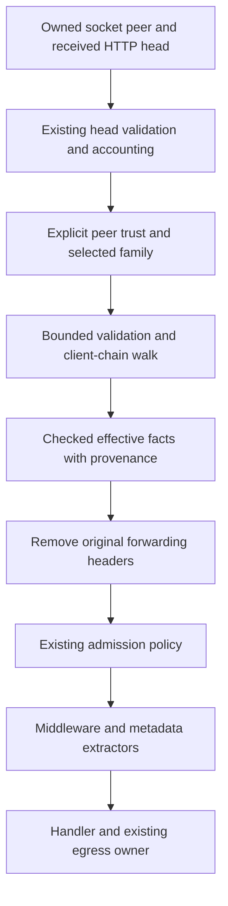

# Axum safe diagnostics and trusted incoming proxies

Date: 2026-10-06
Status: finalized design. The policy decisions below are approved, including the seven-item closing batch. Exact API signatures, configuration spellings, and integration hooks require a separate implementation-plan review. No runtime implementation or acceptance proof has been performed.

Issue: [#397](https://github.com/stackpop/edgezero/issues/397), under [Epic #391](https://github.com/stackpop/edgezero/issues/391).

Primary prerequisite: [PR #275](https://github.com/stackpop/edgezero/pull/275). Related timing work: [PR #389](https://github.com/stackpop/edgezero/pull/389). Coordinate portable client metadata with [#92](https://github.com/stackpop/edgezero/issues/92) and observability with [#118](https://github.com/stackpop/edgezero/issues/118) through [#122](https://github.com/stackpop/edgezero/issues/122).

Branch: `issue-397-diagnostics-proxy-trust-spec`, created from `issue-394-395-http-acceptance-spec` at `3ab22096fd117f7506cf437b5ba128e0789e059c`.

Worktree: `/home/pav/worktrees/issue-397-diagnostics-proxy-trust-spec`.

The branch inherits the committed #392/#396 hosting implementation and its #275 base, `5527b58e2a7cb6307d5c7a8926cd5dfc6f4f8b4a`. The #394/#395 spec and plan were untracked when this worktree was created. They remain in their original worktree and were not copied here. Rebase onto the completed preceding work later, with approval, and refresh the affected audit and evidence. This specification does not approve the incremental-upload mechanism or bypass its experiment and implementation gates.

## Goal and scope

Give operators correlated evidence of native request outcomes and process shutdown. Keep framework-generated public errors and ordinary diagnostics free of source strings, secrets, bodies, and raw request targets. Make effective client, host, and scheme metadata depend on an explicit incoming-proxy trust policy.

Keep runtime implementation in the Axum adapter. Permit only small, reviewed portable hooks needed to reuse #275's completion or expose normalized metadata to existing extractors. Fastly, Cloudflare, and Spin keep their existing behavior.

| Owner                | Responsibility                                                                                                                                            |
| -------------------- | --------------------------------------------------------------------------------------------------------------------------------------------------------- |
| #397                 | Native diagnostic records, proxy-trust configuration, safe metadata integration, custom logger ownership, and operator documentation                      |
| #275                 | Public error categories, ingress disposition, monotonic clock, response-owned completion, framing, and post-commit failure behavior                       |
| #392/#396            | Startup barrier, private drain gate, process lifecycle, prepared stores/transport, configuration loading, and shutdown budget                             |
| #393                 | JSON buffering limit and typed HTTP 413; #397 observes its rejection without selecting a new limit                                                        |
| #394/#395            | Streaming, outbound HTTP semantics, deadlines, pool reuse, and transport cleanup; #397 consumes their safe failure categories                             |
| #389                 | Optional request timing collector; integration requires compatible clock origins and terminal boundaries                                                  |
| #398/#399/#400       | Packaging, deployment, and later final-image acceptance using the evidence defined here                                                                   |
| Application/operator | Authentication, destination and host authorization, logging/exporter setup, privacy policy for additional fields, and correct proxy/network configuration |

Exclude a replacement observability framework, tracing vendor, metrics server, default public diagnostics endpoint, distributed tracing propagation, rate limiter, incoming TLS implementation, PROXY protocol, new response finalizer, and portable `Send` migration. Preserve the established admission, stream deadline, and shutdown contracts.

## Approved policy decisions

| Area                 | Decision                                                                                                                                                                                      |
| -------------------- | --------------------------------------------------------------------------------------------------------------------------------------------------------------------------------------------- |
| Proxy topology       | Support single proxies and proxy chains, including Nginx, Cloudflare, AWS load balancers, and combinations. No provider guessing.                                                             |
| Trust                | Explicit deployment address/network configuration. Default to no trust in development and production.                                                                                         |
| Header family        | Configure one family, Forwarded or X-Forwarded-*. Ignore the other; do not combine conflicting assertions.                                                                                    |
| Malformed metadata   | Ignore the whole selected forwarding assertion and continue using direct connection details. Do not reject an otherwise valid request for malformed optional forwarding metadata.             |
| Missing metadata     | Fall back individually for absent fields. Do not repair them using the unselected header family.                                                                                              |
| Application view     | Remove original forwarding headers after checking them; expose checked effective metadata separately.                                                                                         |
| Host and scheme      | The final trusted ingress proxy supplies checked public host/HTTPS assertions, replacing client-supplied values. Do not infer them from the client-address chain.                             |
| Configuration errors | Invalid supplied settings fail startup. Reject trust-every-address policies. No automatic trust for private networks or localhost.                                                            |
| Request logs         | Generated request identity, method, route pattern, selected status, duration, egress-accounted bytes, and outcome. No default addresses, raw URLs/queries, headers, bodies, or source errors. |
| Logging ownership    | Safe request records enabled by default with an opt-out; preserve application logger initialization and existing observers.                                                                   |
| Record levels        | INFO for ordinary records; WARN for noteworthy request failures; ERROR for startup/runtime faults. Include bounded failure categories rather than raw error text.                             |
| Request identity     | Generate within EdgeZero and expose to application code. Do not adopt visitor-supplied IDs or automatically add response headers.                                                             |
| Shutdown visibility  | Log lifecycle transitions and shutdown outcomes. Expose native active-request and connection snapshots, with idle connections counted separately. No default public endpoint.                 |
| Timing               | Reuse the existing monotonic clock and completion owner. Keep #389 optional unless compatibility is proved; do not delay this issue for it.                                                   |

These are design decisions, not claims about current runtime behavior. The acceptance checks below must prove them before #397 closes.

## Baseline and residual gaps

Source audit on 2026-10-06 used the branch base above. #275 was open at inspected head `950cb81d406d0dc269baf94314547329a4c1cef0`. #389 was open at `ab444946fcacb1d44c020c6079abb6ba29231402`; its source was inspected in the matching clean timing worktree. These are source facts, not acceptance results.

| Area           | Current source                                                                                                                                                                                                                                                   | Consequence for this issue                                                                                                                                              |
| -------------- | ---------------------------------------------------------------------------------------------------------------------------------------------------------------------------------------------------------------------------------------------------------------- | ----------------------------------------------------------------------------------------------------------------------------------------------------------------------- |
| Public errors  | Core `src/error.rs`, `wire_message`, hides Internal, BadGateway, GatewayTimeout, and upstream-size details. Other application-facing categories can still carry chosen messages. Axum `src/response.rs` has fixed fallback bodies and category-only body errors. | Reuse the accepted renderer. Audit residual framework call sites; do not add another sanitizer or promise to redact arbitrary application responses.                    |
| Native service | Axum `src/service.rs`, `dispatch_request`, uses a private readiness/drain gate, then normalized head validation, `begin_ingress`, conversion, and admitted dispatch.                                                                                             | Normalize metadata before consumers. Include early returns and no-response aborts in diagnostics without changing their dispositions.                                   |
| Forwarded host | Core `src/extractor.rs`, `ForwardedHost::from_request`, prefers raw X-Forwarded-Host over Host without checking peer trust.                                                                                                                                      | A production trust filter cannot live only in a new client-IP extractor. Existing host consumers must see the normalized result.                                        |
| Socket peer    | Axum `src/context.rs`, `AxumRequestContext::remote_addr`, records the direct socket peer from ConnectInfo.                                                                                                                                                       | Preserve this meaning; expose asserted client information separately.                                                                                                   |
| Completion     | Core `src/response_egress.rs`, `ResponseEgressCompletion::join` and `ResponseEgressAttempt`, compose callbacks and report one terminal outcome.                                                                                                                  | Attach native diagnostics to the existing owner and preserve application callback/observer behavior.                                                                    |
| Report fields  | `ResponseEgressReport` has route, request start, outcome, body kind, bytes, and fallback disposition, but no request ID, method, or selected status. Its `elapsed` is measured from `egress_started_at`, not request start.                                      | A global observer alone cannot produce the required record. Native total duration must not be mislabeled egress elapsed. Review the smallest metadata/composition hook. |
| Lifecycle      | Axum `src/dev_server.rs`, `run_owned`, owns Starting/Ready/Draining/Stopped and connection tasks; connection egress tracks live response deadlines.                                                                                                              | Observe existing state and owners. A connection count is not an active-request count.                                                                                   |
| Logging        | `init_logging` uses simple_logger only when `Hooks::owns_logging()` is false. Native startup already emits readiness and safe failure categories.                                                                                                                | Add records through the facade, not another logger/subscriber.                                                                                                          |
| Timing         | #389's `RequestTimings` starts its own web_time instant at construction and has explicit best-effort completion marks.                                                                                                                                           | It is not automatically compatible with #275's injected clock/origin and cannot become another completion owner.                                                        |

Re-audit the accepted #275 revision, current hosting stack, and any accepted #389 integration before planning implementation. Inventory existing error-leakage and lifecycle tests first; add only missing real-path evidence.

## Incoming-proxy trust boundary

### Match the transport peer

Trust only an explicit IP/CIDR allowlist matched against the peer supplied by the owning socket service. Header text, `Forwarded by=`, request URI, and caller-supplied extensions cannot establish that identity. A missing or nonmatching transport peer means no forwarding trust.

Never infer trust from private, loopback, container-network, or same-host addresses. Match IPv4-mapped IPv6 peers consistently with their IPv4 equivalents. The implementation plan must specify normalization of equivalent configuration entries and prove those matches.

A trusted proxy can assert selected metadata; it does not authenticate the end user or authorize a Host value. Operators must protect the proxy-to-application network. Appending proxies must record the actual immediate predecessor. A gateway replacing the chain must supply a verified assertion. Neither can make untouched client-supplied host/scheme values trustworthy merely by forwarding them.

[RFC 7239 sections 7.1 and 8.1](https://www.rfc-editor.org/rfc/rfc7239.txt) describe repeated/list-valued fields and warn that a trusted last proxy does not make earlier client-supplied entries trustworthy. A bare allowlist plus "take the first address" is insufficient.

### Select and validate one header family

Each deployment selects exactly one family:

- `forwarded`: an ordered RFC 7239 list, including repeated field lines, with correct quoting/escaping, IPv4 or quoted IPv6 node syntax, and no duplicate parameters within an element.
- `x-forwarded`: an ordered X-Forwarded-For address chain plus singleton X-Forwarded-Host and X-Forwarded-Proto assertions written by the final trusted ingress proxy.

Do not automatically prefer one family, combine them, or use the unselected family when selected fields are missing or malformed. Remove both raw families from the ordinary managed application view regardless of which one was accepted.

Respect repeated-field order and existing received-head limits. The implementation plan must give a finite parsing/allocation bound derived from those limits and the selected parser, including any stricter chain bound. Do not allocate an unbounded vector of forwarding elements or accept a queue/item-count argument as a byte bound.

Malformed syntax, ambiguous duplicate fields, invalid recognized values, or exceeding the forwarding-parser bound invalidates the whole selected assertion. Continue the otherwise valid request with direct client/host/scheme metadata. No partially accepted host or HTTPS assertion survives that malformed result. Existing HTTP head/framing violations still use their established rejection/abort path.

Absent fields fall back individually to direct facts. Syntactically valid unknown/obfuscated client nodes do not become IP addresses and do not permit traversal past that node. Record only a bounded ignored/unresolved reason, never the raw invalid value.

### Walk the client-address chain backward

Start from the direct socket peer. Consume asserted predecessor addresses from right to left only while the current hop is explicitly trusted. The first untrusted address is the effective client boundary. Ignore all assertions farther left as claims about the visitor.

For `Visitor → Cloudflare → AWS load balancer → EdgeZero`, trust the relevant load-balancer and Cloudflare networks to walk through both. If Cloudflare is not configured as trusted, its address is the effective boundary, not an invented original visitor address. A gateway may instead verify its upstream chain and provide one sanitized assertion.

Never use universal leftmost selection or a fixed hop count. Missing predecessor information, an unknown/obfuscated node, or exhaustion while every represented address is still trusted cannot establish another original visitor. Stop and use direct client fallback, marked as unresolved. Do not skip the gap. A malformed address invalidates the whole selected assertion under the rule above.

Conceptual pseudocode, not implementation:

```text
client_boundary(peer, ordered_predecessors, trusted_networks):
    if peer is absent or peer is not trusted:
        return direct_client(peer)
    current = peer.ip
    for predecessor in ordered_predecessors from right to left:
        if predecessor has no usable numeric IP:
            return direct_client(peer, reason = unresolved_chain)
        current = predecessor.ip
        if current is not trusted:
            return asserted_client(current)
    return direct_client(peer, reason = unresolved_chain)
```

Parse/validate the selected assertion before this walk. This pseudocode does not authorize skipping malformed input or borrowing another header family. A boundary address is not proof of the original visitor when another untrusted proxy stands in front of it.

### Public host and HTTPS assertions

The final trusted ingress proxy is responsible for supplying verified public host and scheme information. For Forwarded, use host/proto only from its final, rightmost element. For X-Forwarded-*, use only its singleton host/proto fields. Do not zip independent lists or search earlier hops for convenient values.

The operator must configure that proxy to overwrite those assertions and, when needed, verify the public values received through upstream proxies. CIDR matching alone cannot prove that proxy configuration. Document this deployment obligation for each supported example topology.

Only accept http/https as effective schemes. Validate host as an authority without userinfo, path, query, or fragment, and validate any numeric port. Missing host/proto fields use direct authority/transport scheme. Invalid values invalidate the whole selected assertion.

For example, a visitor may use HTTPS while the load balancer connects to EdgeZero over HTTP. EdgeZero may expose HTTPS only through the checked final-proxy assertion. It must not infer HTTPS from a client-controlled absolute URI or from the visitor-address chain.

### Checked metadata and application compatibility

Preserve direct facts and per-field provenance separately from effective values:

```text
DirectPeer      = known socket address | unavailable
EffectiveClient = direct IP | trusted-proxy asserted boundary IP | unavailable
EffectiveHost   = validated direct authority | trusted-proxy asserted authority | unavailable
EffectiveScheme = known transport scheme | trusted-proxy asserted http/https
FieldSource     = direct | trusted_forwarded | trusted_x_forwarded | unavailable
ForwardingResult = absent | accepted | partial | untrusted_peer | malformed | unresolved_chain
```

This is a conceptual model, not a public type layout. Coordinate naming and portable access with #92. Preserve `AxumRequestContext::remote_addr` as the direct peer. The direct authority comes from the validated request head; the current direct transport scheme is HTTP. Host metadata remains separate from application host authorization.

Validate/account for the received head before removing forwarding fields so stripping cannot bypass head-size limits. Normalize before admission policy, middleware, handlers, or host/scheme/client metadata consumers. Carry the checked ingress facts in a bounded metadata value.

Make `ForwardedHost` use that checked value on the managed native path, including accepted Forwarded host assertions. Retain its existing fallback behavior for other adapters. Do not rewrite Host or the request URI merely to change an extractor result.

Remove original Forwarded and X-Forwarded-* headers after checking, including accepted trusted-peer assertions. Applications that inspect or forward those raw fields on the managed native path must migrate to checked metadata. Do not preserve unsafe values under another name or automatically propagate them outbound. Raw access or outbound assertion generation would require a separate explicit decision.

Checked metadata describes ingress, not later application mutations. Framework policy cannot stop hostile application code synthesizing headers or bypassing the managed host; the guarantee applies to the supported ingress boundary and normal metadata accessors.



Head-validation failure still uses the existing detached error/abort path. Rendering that error safely does not require forwarded metadata.

### Configuration and bypass rules

Configure trusted literal addresses/network ranges and the selected family through standalone environment settings or explicit hosting APIs. Load standalone environment once. Explicit embedding uses its supplied policy and does not silently merge environment values. Provide the same no-trust default in development and production. No manifest section or CLI flag is required.

The following spellings are implementation candidates, not approved public API names:

| Setting                                       | Required behavior                                                                                                              |
| --------------------------------------------- | ------------------------------------------------------------------------------------------------------------------------------ |
| `EDGEZERO__ADAPTER__TRUSTED_PROXY_CIDRS`      | Literal IP/CIDR list. Unset or an explicitly empty list means no trust. No DNS lookups or provider/private/all tokens.         |
| `EDGEZERO__ADAPTER__FORWARDING_HEADER_FAMILY` | Explicit `forwarded` or `x-forwarded` when trust is nonempty. A valid family with an empty trust list does not enable trust.   |
| Explicit hosting API                          | Validated policy installed in production, development, and embedded managed hosting. Final signatures are part of plan review. |

Validate supplied settings before Ready. Invalid entries, unknown modes, a nonempty trust list without a selected family, and trust-every-address policies fail startup with safe configuration categories, not input values or silent fallback. Reject `/0` entries and equivalent allowlists covering an entire address family. No dangerous trust-all override is included.

Low-level `into_core_request` bypasses production admission and the owning socket boundary today. Document that bypass. It cannot claim production proxy trust merely because a request carries ConnectInfo or an environment variable exists. This issue does not require a new policy-aware low-level converter; supported trust guarantees belong to managed hosting. Any additional converter API requires plan review.

## Native request diagnostics

### Identity, clock, and sole completion owner

Create a bounded framework-owned identity at the native parsed-request service boundary before admission can return early. It must distinguish requests across concurrently running hosting instances and within each instance. The concrete generated representation, sequence-overflow behavior, and public accessor are implementation-plan details.

Expose the generated identity to application code through checked request metadata. Retain a private authoritative copy for framework records so overwriting a public extension cannot change correlation. Never adopt an incoming X-Request-ID as that identity. Do not automatically add a response header or propagate tracing headers; applications may expose an ID deliberately.

Use the same #275 monotonic clock and request-start snapshot used by native ingress. Define total request duration from that start to the authoritative terminal observation. The audited `ResponseEgressReport::elapsed` measures egress only and must retain its existing meaning. It is not total request duration.

The implementation plan must select a narrow way to obtain the terminal snapshot or equivalent total duration at the existing transition, before potentially slow application callbacks or logger output. Sampling after callbacks would mismeasure request duration. Do not add another clock origin, deadline, timer task, or terminal owner to obtain the timestamp.

For each response attempt, emit one native terminal record from #275's existing completion boundary. Compose with application completion using `ResponseEgressCompletion::join` or its accepted equivalent. Preserve application invocation counts, ordering, and panic isolation; do not replace the application observer or admission policy with telemetry.

No-response admission Abort, the private draining gate, and cancellation before an egress attempt need safe ingress/abandonment records and resource release. They must not receive a fabricated ResponseEgressReport, HTTP status, or successful completion callback. Unbegun envelope abandonment retains #275's no-report distinction. Process abort and SIGKILL provide no callback or log-flush guarantee.

Capture identity and method privately; carry route, typed rejection category, and selected status through the existing owner. A global observer alone lacks these facts in the audited baseline. A pre-conversion application status is not authoritative when framing failure selects a fallback. Do not infer rejection from status alone; an application can deliberately return 413 or 503.

### Fields, levels, and opt-out

Enable safe request records by default through the existing log facade. Provide an explicit request-record opt-out for applications that already produce their own records. `Hooks::owns_logging()` controls logger initialization, not whether framework facade events exist. Never install a competing logger/subscriber or overwrite custom observers.

| Field                      | Default rule                                                                                                     |
| -------------------------- | ---------------------------------------------------------------------------------------------------------------- |
| Event and request identity | Fixed event name and generated bounded identity                                                                  |
| Method                     | Known method or bounded other category; no arbitrary token dump                                                  |
| Route                      | Registered route template, never raw path or parameters; fixed unmatched/unknown value when unresolved           |
| Status                     | Final selected response status, absent for no-response paths; not proof of receipt                               |
| Duration                   | Total monotonic request duration at the existing terminal boundary; not egress-only elapsed or log-emission time |
| Outcome                    | Existing bounded egress outcome or separately named ingress disposition                                          |
| Rejection/failure category | Typed bounded reason from its owning boundary; never source-message matching                                     |
| Response accounting        | Egress-accounted bytes, existing body kind, and fallback disposition; never claim delivered TCP bytes            |
| Forwarding result          | Bounded accepted/ignored/unresolved reason, without raw values or client address                                 |

For example, record `GET /orders/{id} status=200 duration=42ms outcome=completed`, not `/orders/123?token=secret` or the visitor's address. This illustrates content, not an approved serialization format.

Use INFO for ordinary completions and lifecycle transitions; WARN for noteworthy request rejections/failures, including upstream/stream failure and ignored malformed forwarding assertions; ERROR for startup/runtime faults. Choose request severity from the typed disposition/outcome, not HTTP status alone. An application-selected status does not automatically become a framework fault. Record a malformed-forwarding reason with the request outcome rather than duplicating terminal records.

Omit client/peer IPs, hostnames, raw paths, queries, headers, cookies, authorization values, secret/config values, bodies, arbitrary application timing data, origin URLs, and provider error strings. Trusted proxy metadata is not permission to log it. Debug level is not permission to dump secrets. Registered route templates are application-owned diagnostic names and must not contain secrets.

Applications may deliberately add fields through their own observer/logger and privacy policy. Do not grow a generic field-selection/redaction framework. Document application metrics integration using existing observers plus safe native hooks for bounded route/status/outcome counters and durations. IDs, addresses, bodies, and secret values are never default metric labels. Install no exporter, metrics server, or public endpoint.

The request-record opt-out suppresses default native per-request records, including no-response/abandonment records. It does not disable application observers, lifecycle events, resource accounting, or snapshot access.

### Selected status and failures after headers

A selected 200 response can terminate with SourceError, DeadlineExceeded, ClientDisconnected, or TransportError. Keep both the selected status and the failing terminal outcome. Never call it successful merely because the handler returned 200.

For precommit framing/policy failure, report the selected fixed 500/504 fallback status, original cause, body kind, and completed/aborted disposition. Never replace a committed response with a second error body to improve diagnostics.

Distinguish selected status from proven wire commitment. The body-poll boundary does not prove a headers-sent timestamp or end-client receipt. Acceptance fixtures must observe the actual wire separately. The plan must identify where final status becomes authoritative without another finalizer.

### Public errors and residual leakage

Reuse #275's category-only internal/upstream renderer and fixed native egress fallback bodies. Audit conversion, route/dispatch errors, upstream failures, body-source errors, framing fallback, and startup/shutdown errors for residual exposure. Log typed categories, not Display/Debug of error sources or requests. Safe reason labels such as `invalid_forwarding` are permitted; raw source strings are not.

The accepted renderer intentionally preserves some application-controlled messages in validation and related categories. Do not claim every EdgeError message is redacted. Framework call sites must use safe fixed messages where they create those categories. Custom renderers and application-generated responses remain application policy and can override the safe defaults.

No source detail is permitted in ordinary framework request records. Any separately requested internal detail requires a named field and explicit privacy approval. Regex masking after formatting a raw error is not a substitute for bounded categories.

## Active work and shutdown visibility

Observe the existing Starting/Ready/Draining/Stopped owner and private admission gate. Emit transition/failure events at their actual boundaries, including startup failure before Ready, graceful completion, grace exhaustion, and forced stop. Use fixed reasons and configured durations, not supplied environment values or source errors.

Expose a read-only native snapshot of active managed requests and connections, with shutdown summaries through the facade. Reuse compatible #118 work rather than creating another registry. Expose no public diagnostics endpoint by default.

Define the counts precisely:

- Active requests count managed parsed requests in admission, body read, handler execution, and response egress until the managed lifetime guard is released by terminal completion or pre-attempt abandonment.
- Active connections count the runner's owned connection tasks. Idle keep-alive connections count here but not as active requests.
- Application-spawned work, arbitrary detached tasks, kernel buffers, and external services are outside these counts.

Use a request-scoped accounting guard moved with the existing completion owner. Drop releases accounting on cancellation or abandonment before an attempt; terminal completion releases it on response paths. The guard must not manufacture another egress terminal state. Preserve application resource release and release accounting even if a diagnostic callback panics. Document snapshot consistency under concurrency; do not imply a cross-counter transactional snapshot without providing one.

Diagnostics add no async producer, retry loop, unbounded queue, or flush wait beyond the existing shutdown budget. A user-supplied synchronous logger can block; the runtime cannot promise bounded logger delivery. Document that limitation, and retain existing process-abort/no-flush distinctions.

## Optional #389 timing integration

#389 currently starts a collector clock at construction, not native ingress, and uses best-effort explicit marks. Do not merge unrelated origins, restart deadlines, finalize at middleware return, or substitute that collector for #275's request/completion owner.

Before native integration, prove a compatible accepted clock/origin and marks from the existing terminal boundary. Otherwise retain optional application phase timing and obtain native duration through the same #275 clock/transition. #397 can close without adopting the collector. Never copy arbitrary collector data into default logs, response headers, or labels.

## Acceptance evidence

Exercise the supported production/managed native host over real HTTP/1 sockets with local fixtures and a captured test log sink. Parser/converter tests alone do not prove the trust boundary. Reuse hosting, service, and contract fixtures; do not add a second server.

| Case                               | Required observation                                                                                                                                                                                                       |
| ---------------------------------- | -------------------------------------------------------------------------------------------------------------------------------------------------------------------------------------------------------------------------- |
| Default no trust                   | Spoofed Forwarded/X-Forwarded-* cannot change effective client/host/scheme, including ForwardedHost. Original forwarding headers are absent from the managed application view.                                             |
| Explicit trusted peer              | Matching peers supply accepted selected-family metadata. Nonmatching peers get direct fallback. Preserve the direct socket address.                                                                                        |
| Peer unavailable                   | Headers/extensions cannot grant trust when managed transport peer information is absent. Document low-level bypass separately.                                                                                             |
| Family selection                   | Conflicting families, missing selected fields, and an apparently valid unselected family follow configured selection with no borrowing.                                                                                    |
| Parsing                            | Repeated field order, lists, quoting/escaping, IPv6, duplicates, unknown/obfuscated nodes, invalid ports/schemes/authorities, and parser limits follow deterministic policy.                                               |
| Spoofed prefix                     | Local single-/multi-proxy fixtures cannot select attacker-added prefixes beyond the first untrusted hop. Cover partial trust, gaps, all-trusted exhaustion, and a gateway replacing the chain.                             |
| Malformed whole-set fallback       | A trusted proxy supplies a bad client address plus otherwise valid host/HTTPS assertions. The request continues, but all selected forwarding metadata falls back to direct facts, with a safe reason and no raw value.     |
| Missing/unknown values             | Absent fields fall back individually. Unknown nodes or missing predecessor links cannot enable traversal past the gap. No fallback address is labeled as a verified original visitor.                                      |
| Host/HTTPS provenance              | Final-proxy assertions survive a controlled HTTPS-at-ingress/HTTP-at-EdgeZero deployment. Client-supplied values and earlier-hop host/proto assertions cannot override them.                                               |
| Configuration                      | Empty/default trust, CIDR edges, mapped IPv6 equivalence, invalid entries/modes, missing family, `/0`, and equivalent trust-all policies are exercised. Invalid configuration fails before Ready.                          |
| Consumer order and compatibility   | Admission, middleware, handlers, and ForwardedHost agree on checked facts. Received-head accounting does not shrink after stripping. Raw-header applications have documented migration.                                    |
| Safe errors and records            | Sentinel secrets in conversion, internal/dispatch, upstream, and source failures appear in neither default client errors nor ordinary logs. Also test query/path parameters, headers, secret/config values, and payloads.  |
| Ordinary correlation and levels    | One generated ID correlates safe method/route/status/duration/bytes/outcome. Log `/orders/{id}`, not its supplied ID. Typed outcomes select levels; deliberate application statuses are not invented framework faults.     |
| Identity ownership                 | Concurrent hosting/request identities do not collide within the specified scope. Incoming IDs/public-extension mutation cannot change the framework ID. Application access works; no automatic response ID header appears. |
| Rejection and Abort                | #393 413, admitted refusal, head failure, no-response Abort, and draining refusal expose bounded reasons without invented status/completion.                                                                               |
| Failure after headers              | Client observes head and prefix, then source/deadline/disconnect failure. One terminal record retains selected status plus failure outcome; no second response.                                                            |
| Fallback and abandonment           | Precommit failure reports fallback status/cause. Unbegun envelope/drop/cancellation preserves report/no-report distinctions and releases work.                                                                             |
| Application logging                | App-owned logger gets facade records without competing initialization. Custom admission, completion, and observer hooks retain counts/order and unwind panic isolation.                                                    |
| Request-record opt-out             | Default per-request records stop; application observers, lifecycle events, accounting, and snapshots still operate.                                                                                                        |
| Active work and shutdown           | Hold body/handler/stream work and idle keep-alive connections. Snapshots distinguish requests/connections. Graceful drain and forced stop release managed work and report outcomes without added budget.                   |
| Total duration                     | Inject separate pre-egress and egress delays. Record total native duration on the established clock, not egress-only elapsed or callback/logger delay.                                                                     |
| Optional timing and other adapters | Optional timing cannot replace the native clock/completion owner. Small shared hooks preserve nonnative behavior and add no native dependencies or Send requirements to portable code.                                     |

Test record cardinality under concurrent requests, refusal, cancellation, and fallback. Document any log-sink drops; claim no durable delivery guarantee.

Current evidence for the two highest-risk assumptions remains Source/Path only and unproven:

1. Every managed metadata consumer uses the peer-gated checked view. The next proof is a production socket request with spoofed forwarding fields observed by admission, middleware, and ForwardedHost, including a local proxy chain.
2. Native diagnostics preserve the sole terminal owner and application hooks. The next proof is a delayed response failing after its head, with native and application sinks asserting exact counts, final status, total duration, and cleanup.

Record command, exact tested revision and uncommitted inputs, environment, result, elapsed time, and captured evidence. Refresh affected proofs after prerequisite integration or rebase. Markdown formatting is not runtime evidence.

## Implementation-plan gate

Policy discussion is complete. Before production code:

1. Rebase onto the approved completed stack and re-audit accepted #275 error/framing/completion behavior. Record existing versus missing coverage, including egress elapsed versus total duration.
2. Present the smallest native implementation and compatibility footprint. Specify parser/config normalization and finite bounds; finalize environment spellings, hosting/accessor signatures, ID representation, and snapshot consistency.
3. Identify narrow shared hooks for checked extractor metadata and completion attachment/status/terminal timing. Preserve observer order, abandonment distinctions, and existing report semantics. Do not implement a second finalizer.
4. Keep #389 optional unless compatible evidence exists. Its acceptance must not introduce another clock origin or block native diagnostics unnecessarily.
5. Write and obtain approval of a separate implementation plan with the acceptance fixtures above and the repository's required test, formatting, lint, and feature/WASM checks.

No implementation plan, prototype, runtime changes, commits, or issue-closing evidence is authorized by finalizing this specification. Earlier specifications and the #394 upload proof gate remain unchanged.
