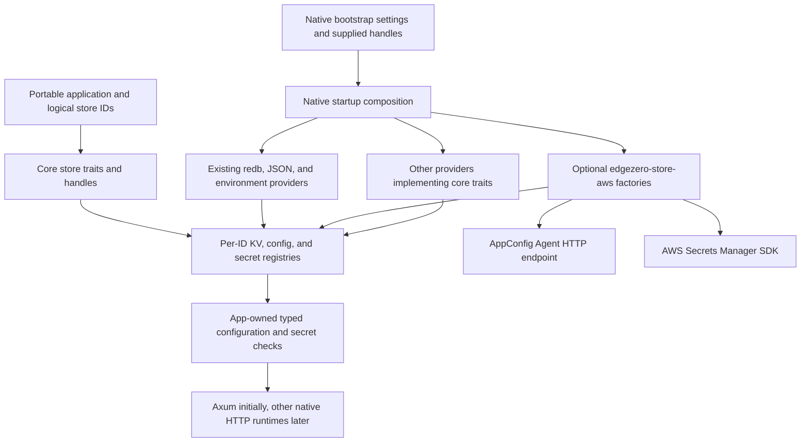
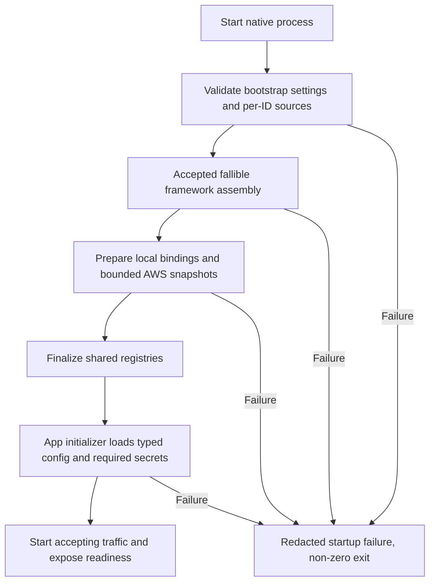

# Native store providers independent of HTTP adapters

- Status: Implementation and draft publication via `gh stack` authorized, including rebasing onto open prerequisites. Real AWS service acceptance is declined and excluded.
- Date: 2026-10-07
- Owning issue: [EdgeZero #410](https://github.com/stackpop/edgezero/issues/410).
- Audited main: `683202c66948146ec360f490126f1d60f920288b`.
- Initial host: Axum. The provider implementations must not depend on Axum.

## 1. Outcome and invariants

A native application chooses its HTTP runtime and its KV, configuration, and secret providers independently. It can also choose different providers for different logical IDs of the same store kind.

For example, Axum can serve an application with redb application state, AppConfig configuration, and environment secrets. Another deployment of the same application can use local configuration and Secrets Manager. A future DynamoDB KV provider replaces a KV binding, not the HTTP runtime or configuration provider.

The application continues to use `KvStore`, `ConfigStore`, `SecretStore`, their handles, and the existing per-ID registries. AWS resource names, credential discovery, protocols, and service errors belong behind that boundary.

Required invariants:

- Provider selection never changes the meaning of a logical store ID or its default.
- Selecting an AWS binding never silently falls back to local files or environment secrets.
- Raw configuration, serialized `BlobEnvelope` values, and nested secret references retain their meanings.
- AWS and native runtime dependencies stay outside portable core and provider-WASM dependency graphs.
- Preparing a provider does not claim application hot reload, safe signing-key rotation, or distributed KV guarantees.
- Provider failure and an absent lookup key remain distinguishable.

## 2. Audited baseline and integration prerequisites

These are current main behaviors, not proposed contracts.

| Area                | Current behavior                                                                                                                                                | Source                                                                                        |
| ------------------- | --------------------------------------------------------------------------------------------------------------------------------------------------------------- | --------------------------------------------------------------------------------------------- |
| Store declarations  | Only logical IDs and defaults are portable. Provider fields in `[stores]` and per-adapter store tuning are rejected.                                            | `crates/edgezero-core/src/manifest.rs:350-372`, `:469-505`                                    |
| Macro metadata      | `StoreMetadata` carries IDs/default only. No provider initialization is generated.                                                                              | `crates/edgezero-core/src/app.rs:77-102`; `crates/edgezero-macros/src/app.rs:91-124`          |
| Config              | Read-only async key lookup returning `Option<String>`.                                                                                                          | `crates/edgezero-core/src/config_store.rs:206-214`                                            |
| Secrets             | Read-only named-store/key lookup returning bytes.                                                                                                               | `crates/edgezero-core/src/secret_store.rs`, `SecretStore`                                     |
| KV                  | Mutable bytes, TTL, existence, deletion, and prefix pagination.                                                                                                 | `crates/edgezero-core/src/key_value_store.rs:880`                                             |
| Composition         | Registries already bind a provider handle per ID. Config adds a default key; secrets add a bound namespace.                                                     | `crates/edgezero-core/src/store_registry.rs:35-84`, `:115-230`                                |
| Native injection    | Service and dev-server builders accept existing registries. Generated `run_app` hard-wires redb, local JSON, and environment secrets.                           | `crates/edgezero-adapter-axum/src/service.rs:49-123`; `src/dev_server.rs:142-192`, `:333-509` |
| Typed configuration | Request extraction reads and verifies an envelope, resolves nested secret references, then deserializes and validates. It is not automatically a startup check. | `crates/edgezero-core/src/extractor.rs:748-813`, `:970-1195`                                  |

Two open PRs supply the prerequisite contracts. After the initial audit, the user explicitly authorized implementation and rebasing onto them. The worktree now uses #275 at `d1a81579afb96f200e7fe8fd294600f0b446b080` with #406 rebased onto it as combined base `1499062`. Neither source PR is accepted on main. References below to accepted prerequisite contracts mean the exact selected and tested stack for this implementation, not a claim about main or GitHub approval.

Initially inspected heads:

- [PR #275](https://github.com/stackpop/edgezero/pull/275), inspected at `d1a81579afb96f200e7fe8fd294600f0b446b080`, introduces fallible `App::build::<A>(platform)`, shared `ConfigValue`, and required `ConfigStore::get_bounded` and `SecretStore::get_bytes_bounded` methods with a clock, absolute deadline, and separate backend/value allowances. Do not implement against main's old `String`-only contract or invent a parallel bounded-read API.
- [PR #406](https://github.com/stackpop/edgezero/pull/406), inspected at `3ab22096fd117f7506cf437b5ba128e0789e059c`, implements #392/#396 production startup and an app initializer over `PreparedStores`. At that head, `PreparedStores` exposes read access, not provider override construction. `AxumRunOptions::validate_stores` requires config/data roots for every declared config/KV kind. `build_production_stores` constructs local providers directly.

Re-audit and test the exact selected stack before runtime integration. Open status is not a blocker under the user's subsequent instruction. In particular, remote configuration must not require `CONFIG_DIR`, and an injected remote KV must not require `DATA_DIR`. Mixed deployments require roots only for bindings still using local defaults. Reuse the accepted production initializer, readiness, shutdown, and configuration extraction contracts.

Coordinate raw-value semantics with [#324](https://github.com/stackpop/edgezero/issues/324). Do not copy Fastly's current envelope-only raw lookup behavior into a new provider.

## 3. Proposed decisions

| Decision                   | Proposal                                                                                                                                |
| -------------------------- | --------------------------------------------------------------------------------------------------------------------------------------- |
| Application API            | Keep the existing store traits, handles, and registries. No unified `Store` trait.                                                      |
| Provider unit              | A binding for one store kind and logical ID. Same-kind local and AWS bindings can coexist.                                              |
| AWS packaging              | One optional native `edgezero-store-aws` crate, independent of any HTTP adapter.                                                        |
| General extension          | Application-supplied per-ID handles at native startup. No dynamic plugin registry or provider discovery.                                |
| Bootstrap                  | An explicitly located native bindings file, or programmatic bindings. Do not bake AWS references into portable declarations.            |
| Initial config provider    | AppConfig Agent, free-form whole-document reads. No direct AppConfig Data API implementation initially.                                 |
| Initial secret provider    | Secrets Manager through the AWS SDK for Rust. Whole-value reads with current or pinned version selection.                               |
| Config and secret adoption | Load all explicitly mapped AWS values at startup and publish immutable process snapshots. Restart to adopt updates.                     |
| DynamoDB config            | Evaluated and deferred. AppConfig plus Secrets Manager is the initial #410 service set.                                                 |
| DynamoDB KV                | A separately approved provider implementing the ordinary KV contract. The composition boundary supports it; #410 does not implement it. |
| Publication/provisioning   | Runtime readers only. Existing operator tooling owns AWS resource creation and publication.                                             |

The user's implementation instruction authorizes these choices. Direct polling, live secrets, or DynamoDB configuration would change the approved protocol and scope.

## 4. Architecture and ownership



### Core

Own store contracts, opaque handles, logical metadata, registries, envelope validation, and typed extraction. Do not add AWS enums, credentials, resource references, remote scheduling, or native executor requirements.

Traits retain `#[async_trait(?Send)]`. Store implementations remain `Send + Sync`; changing the future bound to `Send` would break the portable contract.

AWS snapshot implementations must implement both ordinary and bounded reads under the accepted #275 contracts. Bounded reads reject an already-expired deadline, apply independent backend/value allowances, report the snapshot payload bytes exposed to the caller, and recheck deadline precedence before returning. A successful missing lookup reports zero payload bytes. No bounded method may delegate to an unbounded cloud operation; cloud access happens only during preparation.

### AWS provider crate

Expose typed settings and async preparation methods producing config/secret handles through an explicit shared `AwsPreparation` session. The standard runner owns one session for all its built-in AWS bindings; programmatic callers explicitly create and reuse a session. It owns aggregate budgets, successful-target deduplication, and client reuse. Do not hide independent per-binding sessions behind convenience constructors. Preparation methods own AWS access, strict resource mapping, sanitized error classification, and immutable snapshot construction. They do not serve HTTP requests, discover application secret names, create another runtime, or initialize global logging.

Suggested independent features are `appconfig-agent` and `secrets-manager`, with no default features. Use target-specific native dependencies. AWS SDK and any Tokio timer dependency belong in this native provider crate, never core or the WASM adapters. Reuse the existing native runtime; do not add another Tokio dependency to an adapter.

The AWS crate must not depend on Axum, the CLI adapter registry, or downstream application crates. Future provider crates can implement the same contracts without depending on it.

### Native composition

Extend the accepted production store-preparation step with per-kind, per-ID override inputs using existing `KvHandle`, `ConfigStoreBinding`, and `BoundSecretStore` types. Permit async setup inside the native runtime before registries are finalized. The application initializer consumes the completed registries; it is too late to select providers there.

For each declared ID, choose exactly one source:

1. An application-supplied binding.
2. An explicit bindings-file entry.
3. The existing local default for that kind.

Reject duplicate supplied/file bindings for the same ID rather than silently choosing precedence. Reject undeclared IDs. Build each registry once and retain its declared default. Validate local root requirements after determining which bindings need those roots. Complete source validation before opening runner-owned providers or polling supplied deferred futures. Constructing a deferred future must be side-effect-free, with provider work inside its async body. This ordering guarantee cannot undo caller-side work or prevent a supplied ready handle from already being open.

The standard Axum runner can dispatch the small set of built-in binding tags to constructors. A custom provider needs only a supplied handle, not a new tag in a global registry. Share these handles between startup checks and requests.

Keep existing redb/file/env implementations in their current crate initially. Extracting all local providers into new crates would add unrelated migration work. A later native runtime can adopt or move them separately.

## 5. Bootstrap and binding shape

Keep `edgezero.toml` portable:

```toml
[stores.kv]
ids = ["state"]

[stores.config]
ids = ["app", "routing"]
default = "app"

[stores.secrets]
ids = ["signing", "notifications"]
default = "signing"
```

The proposed native input is an absolute `EDGEZERO__STORE_BINDINGS_FILE` path, or an explicit options method. Read it once during startup. With no input, preserve existing development defaults and the accepted production defaults. A missing explicitly selected file is an error, not an empty binding set.

Proposed file, with fictional resources:

```toml
version = 1

[config.app]
provider = "aws-appconfig-agent"
default_key = "settings"
endpoint = "http://127.0.0.1:2772"
# Optional local agent authorization, read from the bootstrap environment.
access_token_env = "APPCONFIG_AGENT_TOKEN"

[config.app.documents.settings]
application = "example-app"
environment = "production"
profile = "application-envelope"

[config.routing]
provider = "aws-appconfig-agent"
default_key = "allowlist"
endpoint = "http://127.0.0.1:2772"

[config.routing.documents.allowlist]
application = "example-app"
environment = "production"
profile = "routing-allowlist"

[secrets.signing]
provider = "aws-secrets-manager"
region = "us-east-1"

[secrets.signing.entries.active_key]
secret_id = "arn:aws:secretsmanager:us-east-1:111122223333:secret:example-signing-AbCdEf"
version_stage = "AWSCURRENT"
```

`state` remains redb and `notifications` remains environment-backed. Replacing either is an independent operation. The schema may later add a `dynamodb` KV tag, but v1 must reject it as unsupported rather than accepting a nonfunctional placeholder.

Validation rules:

- Require schema version 1. Reject unknown kinds, fields, provider tags, duplicate tables, empty mappings, and undeclared IDs. IDs and lookup keys are case-sensitive.
- Parse provider settings into tagged types. Reject irrelevant provider fields instead of retaining an unvalidated option bag.
- Require the config `default_key` to name a document mapping. Multiple lookup keys require explicit entries.
- Require an explicit Secrets Manager region and complete ARN for each secret. Validate ARN service, region, and resource shape. Cross-account reads are allowed only with explicit full ARNs and operator-managed permissions.
- Allow one version selector per secret: omitted/current stage, an explicit stage, or a pinned version ID. Reject simultaneous `version_id` and `version_stage`. Although AWS can accept a matching pair, v1 does not need that extra state.
- Existing `EDGEZERO__STORES__<KIND>__<ID>__NAME` and `__KEY` behavior remains unchanged for implicit local bindings. Reject those supplied overrides for an explicitly bound ID. Do not repurpose a platform name as an AWS ARN.
- Explicit options and supplied handles do not silently merge ambient environment settings. The env-loading entry point is the only path that reads the file locator from the environment.
- The file contains resource references and environment variable names, never credential or secret values. No remote configuration can supply its own bootstrap credentials, endpoint, region, or binding file.

Keep parsing native-side. The native bindings module owns the versioned top-level file, store kinds/IDs, source collisions, provider-tag dispatch, local defaults, scalar-overlay conflicts, and root requirements. The AWS crate owns strict AWS settings types and resource-shape validation. It must not require changes to `StoreDeclaration`, `StoreMetadata`, or macro-generated resource metadata. Programmatic callers use typed constructors and existing handles without a bindings file.

The env-loading entry point captures the file locator and scalar overlays once. Explicit options use only supplied bootstrap settings. Both use the same source validator. Offline CLI validation does not treat its own ambient environment as the future process's deployment configuration; conflicts with actual deployment overlays are always checked again at startup.

## 6. AppConfig configuration

### Access path

Use AWS AppConfig Agent initially. AWS recommends it for local caching, polling interval handling, and configuration token management. EdgeZero uses its local HTTP GET endpoint; it does not implement session tokens or a polling loop.

The operator owns the agent process/container, its AWS role and region, its pinned version, and its network policy. EdgeZero neither launches nor supervises it. The binding identifies application, environment, and profile; the agent's AWS bootstrap is separate from the application binding.

V1 permits only an HTTP endpoint with a literal loopback IP address. Reject URL userinfo, query strings, fragments, unexpected base paths, redirects, and non-loopback destinations. Construct path segments with proper escaping. Disable ambient HTTP proxies for this client. A token, when configured, comes from the named bootstrap environment variable and never enters diagnostics. Separate-pod or remote-agent access requires a later explicit transport/security design.

When token authentication is configured, the operator sets Agent `ACCESS_TOKEN` to the same value as the provider's named bootstrap environment variable. The provider sends `Authorization: Bearer <token>` on its GET request. When unset, it sends no authorization header. A configured but absent/empty token variable fails startup. Never put the token in a URL or emit request-header diagnostics.

Container deployments must share an appropriate network namespace. Configure the agent to bind loopback explicitly; AWS documents different binding defaults for ECS/EKS and EC2/on-premises. Require token authentication when untrusted processes share that namespace. This does not isolate the endpoint from a compromised application process.

### Key mapping

Each configured EdgeZero key maps to the entire deployed free-form document in one profile. The key selects a document, never a field inside it. Multiple independent values require explicit profile mappings:

- `get("settings")` returns the profile's exact UTF-8 document bytes as `ConfigValue`.
- A profile containing a serialized `BlobEnvelope` returns that serialization unchanged. Core extraction validates it.
- A profile containing a raw string returns the raw string, including whitespace or an empty payload. Do not parse or flatten arbitrary JSON, unquote it, reserialize it, or resolve secret references inside the provider.
- Unknown lookup keys return `Ok(None)`. An unavailable explicitly mapped profile fails startup.
- Invalid UTF-8, response/protocol errors, and oversized documents are errors.

Request identity content encoding and disable transparent HTTP decompression. V1 rejects responses with a non-identity `Content-Encoding`; compressed responses require a later explicit wire/decoded-limit contract. Bound streamed body bytes before retaining them. The retained UTF-8 body is the original profile text, not compressed transport bytes.

V1 implements neither key/value document projection nor feature-flag evaluation. They need explicit contracts if later required.

### Snapshot and freshness

Fetch each distinct mapped profile once during startup, validate its bytes/limits, and retain an immutable snapshot. The agent can continue polling, but EdgeZero does not reread it after startup. There is no hot reload or app-state mutation.

The snapshot is coherent per document, not an atomic revision across profiles, secret resources, or providers. Applications needing a coordinated release must use a single configuration envelope with explicit pinned secret versions or their own release validation.

An agent can successfully return cached data while AWS is unavailable or access has changed. Therefore startup proves that the configured agent supplied an acceptable document, not that AWS was reachable at that instant or that the document is the latest deployment. Do not call this a freshness guarantee.

Disable agent disk backup/preload for the initial documented setup. Even without disk backup, its in-memory cache can be stale. This proposal explicitly accepts that upstream agent policy; EdgeZero never adds another stale fallback after a failed fetch. If #410 consumers require a maximum config age or fail-on-revocation startup, this access-path choice needs revision before approval.

Direct Data API polling is deferred. Choosing it later requires single-owner session tokens, one-use tokens, server polling intervals, unchanged empty-response handling, session recovery, ambiguous failure handling, and separate tests. Those requirements are not implemented by this spec's agent reader.

## 7. Secrets Manager

Bind the exact logical namespace and key to an explicit secret ARN/version selector. The resulting `BoundSecretStore` must preserve namespace isolation; a wrong store or unmapped key returns `Ok(None)` and never probes arbitrary AWS names.

At startup, retrieve every explicitly mapped entry. All such entries are required to exist. This keeps a finite, reviewable access set and avoids per-request cloud calls. If an application does not need a secret in this deployment, omit its entry. Required app references to an omitted entry fail in the app-owned startup check.

Return complete values:

- `SecretString` becomes its exact UTF-8 bytes.
- The Rust SDK's `SecretBinary` blob is already decoded bytes. Do not base64-decode it again.
- Reject malformed responses with neither or both value fields. Preserve valid empty values where the service/client permits them; app validation decides whether empty is acceptable.
- Do not extract JSON fields. A JSON secret is one complete byte value.
- Typed string secret references still require UTF-8. Direct byte consumers retain binary fidelity.

Omitted version selection means `AWSCURRENT` at startup. A pinned version ID remains pinned. Restart reads the selector again and constructs a new process snapshot; moving a staging label does not alter the running snapshot.

There is no TTL cache, negative cache, or serve-stale-on-refresh path. Snapshot memory contains only configured successful values and remains bounded until shutdown. Deleting a secret or revoking AWS access does not erase an already loaded secret from a running process. Operators must stop/restart that process when immediate removal is required. This policy needs explicit approval for rotation-sensitive consumers.

A failed subsequent restart does not reuse a prior process snapshot. Do not persist secret snapshots to disk. Avoid unnecessary byte/string copies and exclude values from `Debug`, logs, traces, and errors. Standard `Bytes`/`Arc` ownership does not promise memory zeroization; any future such guarantee requires a separate API review.

## 8. Startup, budgets, and failures



Reuse #392/#396 rather than introducing another readiness or mandatory-secret API. The application owns schema validation, required secret references, signing initialization, and publication of typed handler state. Framework assembly keeps its accepted order; provider preparation precedes the app initializer and listener acceptance.

At the inspected #275 head, `AppConfig::from_binding` provides context-free typed loading with the shared envelope/secret algorithm. Use its accepted form in the production initializer, then retain validated typed state using #406's startup state insertion. Request extraction remains available and can repeat parsing against immutable snapshots; snapshot providers alone do not cache typed application objects.

### Proposed v1 defaults

All limits are validated finite, nonzero settings. Reuse accepted core snapshot/extraction limits where they apply; provider transfer and bootstrap limits are additional checks, not replacements.

| Limit                                        | Default                                                               |
| -------------------------------------------- | --------------------------------------------------------------------- |
| Bindings file bytes                          | 256 KiB                                                               |
| Explicit bindings                            | 128 total IDs                                                         |
| Remote mapped values                         | 1,024 config document and secret entry mappings per shared session    |
| AppConfig document bytes                     | 1 MiB                                                                 |
| Secret payload bytes                         | 64 KiB                                                                |
| Combined retained AWS snapshot payload bytes | 8 MiB unique retained payload per shared preparation session          |
| Aggregate AWS preparation budget             | 30 seconds per session, including credential/client setup and fetches |
| Individual service operation budget          | At most 5 seconds, also bounded by remaining aggregate budget         |
| Connect / attempt budgets                    | At most 1 second / 2 seconds, clipped to remaining operation budget   |
| Concurrent remote preparation                | One operation at a time initially                                     |

The 8 MiB limit is an approved provisional, configurable default, not an AWS service limit or a number justified by workload measurements. An aggregate cap prevents many individually valid documents and secrets from accumulating an unexpectedly large snapshot. Applications with reviewed larger inputs may explicitly raise it. Revisit the default using representative deployment payload sizes and headroom, rather than presenting it as a validated requirement.

The standard runner's one shared session accounts for all built-in AWS bindings it prepares, across config/secrets and logical IDs. Programmatic callers use the same accounting by reusing an explicit session. Opaque supplied handles, local providers, and separately created sessions are outside that session's quota. Independent sessions can together exceed 8 MiB; no process-wide cap or global accounting is promised. Callers own the budget for those additional resources.

Count metadata, mapping entries, retained payload, and transient staging separately. Count every mapping before deduplication, but count a shared immutable payload allocation only once against retained bytes. Bound agent body reads before accumulating the whole document. Reject duplicates before constructing snapshots. Deduplicate identical profile or ARN/version requests only when their complete normalized target and authorization/client policy match; do not accidentally merge namespaces. Check aggregate residency before retaining each payload. A quota breach fails preparation and the runner drops all staged state before readiness; it does not evict values or fall back to local sources.

The SDK may materialize secret responses and allocate before EdgeZero checks payload size. Metadata, transient buffers, credential providers, TLS, SDK parsing, allocator overhead, local-provider payloads, typed application state, and the external agent are not covered by the retained-payload cap. Do not describe these limits as a certified RSS bound. Preserve #275's conservative allocation/deadline capability classification.

### Retry ownership

Reuse one session-owned Secrets Manager client per region/client policy during preparation, not one client per key or request. Configure supported temporary-credential discovery and pin SDK versions and behavior defaults. Production uses workload roles; local developers use a named authenticated profile or supported developer chain. Never require static keys in the bindings file or image.

The SDK owns Secrets Manager retries, capped at three total attempts within the operation and aggregate budgets. EdgeZero adds no outer retry loop. Retry transient transport/service/throttling failures only; do not repeatedly retry validation, access denial, or decryption failures. Test the pinned SDK's actual classifications.

The agent HTTP reader makes one bounded request per distinct profile. Agent AWS polling/retry policy is upstream. A failed preparation exits; an operator/supervisor owns any restart backoff. No retry across partially published snapshots is possible because publication occurs only after success.

Use the accepted application monotonic clock for caller deadlines. Configure provider timers and SDK operation budgets, but do not claim forcible cancellation of credential-process discovery, blocking provider work, or all socket activity. Timeout observation is not proof that every underlying operation stopped. Retain best-effort wording until runtime evidence proves a stronger guarantee.

### Error boundary

Classify failures before dropping provider response/source details. Use a native sanitized preparation error with store kind, baked logical ID, and a fixed category. Suggested categories include invalid binding, missing resource/version, credential failure, access denied, decryption failure, throttled, deadline, transport unavailable, malformed value, and size limit. Keep these distinctions where the access path exposes them; the Agent may expose only an upstream-unavailable response, not AWS's original cause.

Do not extend core errors merely to publish AWS service codes. Snapshot reads use the accepted portable errors for invalid keys, deadlines, and bounds. A missing local lookup is `Ok(None)`; a failed mapped AWS fetch is a startup error, never a successful miss. Agent HTTP authorization denial and missing resource responses remain failures even if detailed cloud causes are unavailable.

Log only fixed categories and validated application logical IDs. Drop SDK/HTTP error chains before startup formatting. Never log credential sources, ARNs, endpoint tokens, response bodies, raw bootstrap values, config contents, or secrets. Keep service request IDs only if a separately reviewed safe diagnostic policy allows them.

## 9. Why DynamoDB is separate

DynamoDB is a good candidate for both config and ordinary KV, but those are separate implementations and permissions.

For configuration it fits `get(key)` directly. A later config provider must specify table/key/value attributes, namespace encoding, string versus binary handling, version selection, consistency, and missing-item behavior. A DynamoDB item is limited to 400 KiB including attribute names and values, which can exclude complete application envelopes. AppConfig better matches the initial managed configuration deployment requirement; supporting both now would multiply acceptance work without a confirmed second requirement.

A later DynamoDB KV adapter can implement `KvStore` and return a `KvHandle` to the same native override path. Its owning spec must settle:

- Table and namespace/key schema, collision-free encoding, and per-binding isolation.
- Byte fidelity, item overhead, and backend value limits. Core's current maximum is not a promise that every provider accepts that size.
- TTL visibility and expiration during reads and listing, rather than assuming background deletion is immediate.
- Prefix pagination, ordering, cursors, consistency, and behavior under concurrent updates.
- Operation budgets, retry policy, permissions, and disposable AWS acceptance.

Passing ordinary KV contracts would not certify CAS, atomic multi-key operations, strongly consistent prefix snapshots, EC identity-graph behavior, or safe distributed rate limiting. Do not advertise those capabilities without their owning contract and tests.

Parameter Store remains a documented alternative, not an initial implementation. Valkey, PostgreSQL, S3, and non-AWS provider implementations are also separate tasks. Secrets stored as ordinary KV bytes do not acquire Secrets Manager's lifecycle.

## 10. Generated applications, CLI, and permissions

Offer the standard native runner independent opt-in `aws-appconfig-agent` and `aws-secrets-manager` features forwarding to the corresponding `edgezero-store-aws` service features. An optional `aws-stores` alias may enable both, but must not be the only path. Config-only builds need no Secrets Manager SDK; secret-only builds need no Agent HTTP client. The CLI and generated Axum Cargo target must make those dependency choices explicit. A bindings file does not add dependencies to an existing binary. A selected provider that was not compiled in fails safely at startup.

Make forwarding `[adapters.axum.build].features` an explicit build deliverable. Main's Axum `run_cargo` forwards explicit extra args, while its blueprint has no provider features. Declared native build features and explicit Cargo `--features` additions form the requested feature names, not the resolved provider capabilities. Determine provider availability from Cargo's resolved feature graph for the selected native package and target, including dependency declarations, defaults, `--no-default-features`, `--all-features`, and alias/dependency feature expansion. Build and offline validation must use the same target-selection and feature-resolution inputs. Map generated target features to adapter service features. Add generated-native compile tests for config-only, secret-only, both, and disabled providers. Keep default-generated native and WASM targets AWS-free.

Put the bindings-file parser and per-ID source validation in a native bindings module in `edgezero-adapter-axum`, available to its `axum` and `cli` features. Share TOML/settings dependencies through a native-bindings feature, rather than enabling `cli` from the runtime or `axum` from CLI-only validation. Main currently enables the TOML dependency only under `cli`.

The AWS crate owns strict deserialization/validation of its settings types; those types must be available without linking the service SDK or HTTP client. This allows the existing CLI dependency on the Axum adapter to reuse the parser without another crate or portable-core changes.

Propose `config validate --adapter axum --store-bindings /absolute/native-stores.toml`, with optional `--target-features` additions and target controls equivalent to Cargo's `--all-features` and `--no-default-features`, for offline structural validation against declared IDs, explicitly supplied source conflicts, and limit settings. Target-provider compatibility uses Cargo-resolved features under the same inputs as native build, not a union of feature names or the running CLI binary's compiled services. If target build information is incomplete or its feature graph cannot be resolved offline, explicitly report structural validation only, without a provider-availability verdict. Runtime validation remains authoritative for a prebuilt binary. Test both directions of a CLI/target feature mismatch, default-enabled providers, suppression through `--no-default-features`, `--all-features`, the `aws-stores` alias when offered, and dependency feature propagation. Compare each verdict with the corresponding compiled native target. Never resolve AWS credentials, probe resources, or fetch configuration/secret values during this check.

No new config publishing, secret mutation, or AWS provisioning behavior is included. Existing `config push --adapter axum` remains a local-file writer and does not update AppConfig. Document that it does not affect an explicitly AWS-bound ID. If the command is given an explicit native bindings file selecting that ID, reject unsupported remote publication rather than report a successful AWS update. Secret-management commands remain under #284.

Read permissions are independent of operator writes:

- Agent role needs AppConfig Data `StartConfigurationSession` and `GetLatestConfiguration` for reviewed configuration resources.
- Application role needs Secrets Manager `GetSecretValue` for explicit ARNs and `kms:Decrypt` when the selected customer-managed key requires it.
- Runtime roles do not need resource creation, config deployment, secret mutation, staging-label mutation, or rotation-Lambda management.
- Config-only applications need no Secrets Manager client or application AWS credentials. The agent owns its role. Secret-only applications need no agent.

Document native-only support, exact setup, restart adoption, upstream agent staleness, secret snapshot retention, least privilege, costs, and cleanup. Downstream apps own binding adoption and app-specific requirements; no Trusted Server or Axon schema belongs in these crates.

## 11. Delivery sequence and proof

The user's subsequent instruction to go ahead authorizes execution of the staged implementation plan. Stage proof gates remain; AWS acceptance still requires separate explicit authorization.

1. Re-audit and integrate accepted #275/#406 contracts. Record existing coverage and add only missing native composition behavior. Test injected fake providers, mixed bindings, defaults, duplicate rejection, and remote-only startup without local roots.
2. Add typed bootstrap parsing and the optional native AWS crate skeleton. Test strict parsing, source conflicts, feature-disabled selection, namespace mappings, and budget validation without network access.
3. Add AppConfig Agent whole-document snapshot preparation. Use a deterministic local HTTP fixture for exact paths, bearer authorization and token redaction, redirects/proxy rejection, content-encoding rejection, raw UTF-8, envelope preservation, empty values, invalid UTF-8, response errors, truncation, deadlines, size limits, and snapshot immutability. Test bounded snapshot reads independently of startup transfer limits.
4. Add Secrets Manager snapshot preparation. Put a narrow test seam at the service-call boundary, not a public provider factory hierarchy. Test string/binary fidelity, no double base64 decoding, namespace isolation, selectors, deduplication, missing resource/version, expired credentials, denied/decryption/throttling/transport errors, and partial-startup cleanup. Test bounded snapshot reads for expired deadlines, separate backend/value allowances, hit byte accounting, zero-byte missing results, and deadline precedence before return. Test startup fetch limits separately; bounded lookup does not bound SDK response allocation during construction.
5. Wire generated native feature enablement and offline validation. Test AWS config plus env secrets, local config plus AWS secrets, both AWS providers plus redb, and same-kind local/custom/AWS bindings. Prove a downstream fake KV can use the generic injection path without importing AWS.
6. Exercise production startup through a generated native application. Required envelope validation and nested secret resolution must finish before readiness. Capture logs/public errors and assert fixture values, tokens, ARNs, and provider bodies never appear. Version changes affect a new process, not the running one.
7. Run an explicitly authorized disposable AWS acceptance using pinned Agent/SDK versions, least-privilege roles, finite cost/request limits, and named cleanup ownership. Record commit, environment, resources, result, and cleanup. Verify cold-agent retrieval, denied cold-agent access, documented warm-cache behavior, current/pinned secret versions, restart adoption, and denied secret access.

Default tests require neither AWS credentials nor network access. Provider fixtures prove EdgeZero behavior, not deployed IAM, credential discovery, or Agent behavior. Local HTTP fixtures are authorized loopback tests, not external-network tests.

Implementation gates include:

```sh
cargo test --workspace --all-targets
cargo fmt --all -- --check
cargo clippy --workspace --all-targets --all-features -- -D warnings
cargo check --workspace --all-targets --features "fastly cloudflare spin"
cargo check -p edgezero-adapter-spin --target wasm32-wasip2 --features spin
```

Also add enabled native-provider tests/builds, generated application compilation, and existing Fastly/Cloudflare/Spin WASM target checks with AWS absent from their reachable dependency graph. Deterministic provider tests use `futures::executor::block_on` where possible. Native SDK/HTTP fixture tests may use the provider crate's native runtime; they must not move that requirement into portable contract suites.

Stages 1 and 2 now have executed generic composition, strict bootstrap/settings, isolated-feature and native/WASM build proof in the maintained plan's execution records. Cloud providers and shared-session accounting remain unimplemented at this checkpoint. No deployed AWS behavior or forcible cancellation is proven. The user has explicitly declined real AWS acceptance; it is excluded from the currently authorized task.

## 12. Alternatives and review questions

Rejected for the initial design:

- AWS services inside Axum implementation modules. Smaller at first, but prevents independent provider use by another native runtime.
- Provider settings embedded in portable `[stores]` metadata. Mixes application declarations with deployment references and changes macros unnecessarily.
- A general plugin registry. Existing traits and handle injection already solve extension; no dynamic discovery is required.
- Environment-only nested resource mappings. Scalar NAME/KEY overrides are useful, but finite key-to-profile/ARN maps are easier to validate in a typed file.
- A JSON string-map inside each AppConfig profile. It could pack several lookup keys into one document, but adds projection and envelope-string wrapping. Whole-document bindings preserve raw bytes with fewer decoding rules, at the cost of more profiles for independently deployed keys.
- Direct AppConfig Data API polling. Removes a sidecar dependency but makes EdgeZero own the token protocol, polling, cache, and recovery. Agent plus startup snapshots is the smaller initial implementation.
- Live Secrets Manager reads with a TTL cache. Requires refresh ownership, stale-on-error policy, and rotation adoption semantics. Immutable startup snapshots are simpler and avoid per-request SDK work.

The approved implementation follows these policies:

- AppConfig Agent deployment and its lack of a provider-visible maximum-staleness guarantee.
- Startup-only secrets, including retention after remote deletion/revocation until process shutdown.
- Whole-document key mappings rather than JSON projection.
- AppConfig and Secrets Manager as the initial service set, with DynamoDB config/KV deferred to separately scoped work.
- The external bindings file, generic per-ID injection, remaining proposed bounds, and generated feature-enable path. The configurable 8 MiB shared-session quota and caller-owned preparation boundary were approved on 2026-10-07.

If the application requires live rotation or enforced config freshness, obtain approval to change these contracts. Do not add them implicitly during implementation. The user's implementation/rebase instruction supersedes the original remaining-design and accepted-only prerequisite gates; later approval authorizes draft publication via `gh stack`. Real AWS acceptance remains excluded.

### SDK diagnostic policy: approved first-version limitation

An isolated native spike resolves/builds the Secrets Manager-only candidate graph and verifies direct scoped suppression against fictional loopback data; it does not prove the complete credential-chain graph. A separate executed tracing/log probe finds that scoped `NoSubscriber` permanently disables unrelated application tracing-to-log fallback when no global tracing subscriber is installed. Additive `tracing/log-always` instead bypasses that suppression. This violates the logging-preservation/diagnostic contracts; do not silently install a global logger/subscriber or impose new caller requirements.

The user has explicitly approved continuing the first version with redacted/dropped EdgeZero-owned diagnostics and a dependency DEBUG/TRACE caveat disclosed before reviews. Do not scope NoSubscriber or alter application logging. Dependency diagnostic hardening is a review item, not an implementation blocker. Offline Stages 1-8 are implemented and verified; provider availability validation remains explicitly structural-only/unknown. Real AWS acceptance remains declined and is not requested. Evidence and exact boundaries are recorded in the maintained plan's section 20 and `/tmp/native-store-integration/sdk-diagnostics-execution.md`.

## References

- [Issue #410 and ownership boundaries](https://github.com/stackpop/edgezero/issues/410).
- [Production local stores #396](https://github.com/stackpop/edgezero/issues/396) and [startup/readiness #392](https://github.com/stackpop/edgezero/issues/392).
- [Reusable application lifecycle](2026-09-15-reusable-app-lifecycle-design.md). Retaining an app does not refresh its typed state.
- [AWS AppConfig Agent](https://docs.aws.amazon.com/appconfig/latest/userguide/appconfig-agent.html).
- [Agent container settings, network binding, and backups](https://docs.aws.amazon.com/appconfig/latest/userguide/appconfig-integration-containers-agent-configuring.html).
- [AppConfig Data polling protocol](https://docs.aws.amazon.com/appconfig/2019-10-09/APIReference/API_appconfigdata_GetLatestConfiguration.html).
- [Secrets Manager GetSecretValue](https://docs.aws.amazon.com/secretsmanager/latest/apireference/API_GetSecretValue.html).
- [AWS SDK credential providers](https://docs.aws.amazon.com/sdk-for-rust/latest/dg/credproviders.html), [timeouts](https://docs.aws.amazon.com/sdk-for-rust/latest/dg/timeouts.html), and [retry configuration](https://docs.aws.amazon.com/sdk-for-rust/latest/dg/retries.html).
- [DynamoDB constraints](https://docs.aws.amazon.com/amazondynamodb/latest/developerguide/Constraints.html).
